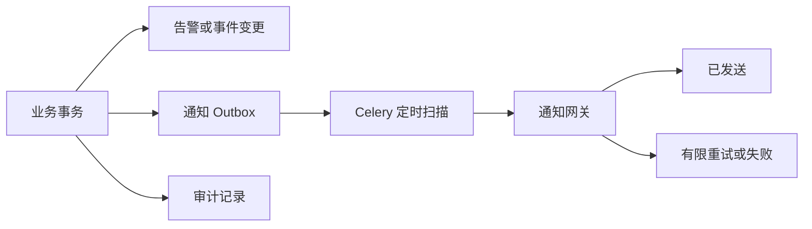

# ADR-0015：风险告警 SLA、值班指派与事务通知 Outbox

- 状态：已接受
- 日期：2026-08-03
- 决策范围：`risk_alerts`、通知网关、Celery Worker、管理端告警工作台

## 背景

`risk-alert-v1` 已能检测短时间窗独立失败激增，并提供 MFA 管理处置时间线，但缺少明确负责人、响应/解决时限和可重试通知。若直接在检测事务中调用外部邮件服务，数据库提交失败和通知成功之间会产生不一致；若通知携带原始 IP、安装标识或候选秘密，又会扩大敏感数据暴露面。

## 决策

### 版本化 SLA

首个规则版本为 `risk-alert-sla-v1`：

- 检测后 15 分钟内首次响应；
- 检测后 240 分钟内解决；
- 告警保存规则版本和两个绝对截止时间，后续调整规则不追溯改写历史告警；
- 解决后的 SLA 结果区分“按时完成”和“曾发生超时”。

### 显式值班指派

- 可指派对象仅限状态正常、角色为 moderator/admin 且已经启用 TOTP 的用户；
- 指派是独立、幂等、限流的管理操作；
- 每次负责人变化追加不可变事件，保存前后负责人标识和最小化说明；
- 未显式指派时，开始核查可把当前 MFA 操作者设为负责人；重新开启会清除原负责人并重置 SLA。

### 事务通知 Outbox

检测、指派、响应超时、解决超时、解决和重新开启通知先与业务事件写入同一数据库事务，再由 Worker 异步投递。

- `dedupe_key` 防止同一告警、通知类型、事件/SLA 周期和接收人重复入队；
- Worker 每 60 秒扫描 SLA 超时，每 15 秒投递待发送记录；
- 单条通知最多尝试 3 次，并使用有限指数退避；
- 管理详情展示接收人用户名、类型、状态、次数和错误码，不返回邮箱地址。

### 最小披露

通知载荷只包含投递 ID、通知类型、接收地址、告警 ID、严重级别和适用截止时间。Outbox 不复制接收地址，也不包含密码、候选秘密、原始 IP、安装哈希或关联键；接收地址在发送时从当前用户记录读取。

## 影响

### 正面

- 数据提交与通知入队具备一致性；
- 可按规则版本审计 SLA，支持负责人筛选和超时队列；
- 通知失败不会回滚告警处置，也不会无限重试；
- 管理端获得检测到解决的完整操作闭环。

### 代价与限制

- 当前值班名单来自具备 MFA 的活跃管理员/版主，不包含排班表、轮值时区和升级链；
- 当前日志通知网关是生产提供商占位实现，尚未接入邮件/短信/即时通信供应商；
- 单 Worker + Beat 适合当前部署基线，水平扩展时应拆分 Beat、增加投递租约和监控指标；
- SLA 参数仍是代码版本规则，动态配置和规则回放留待后续。

## 后续

- 引入值班排班、升级策略和团队通知渠道；
- 增加投递延迟、失败率、SLA 达标率和误报率指标；
- 对接生产通知提供商并增加提供商级幂等键；
- 增加规则动态配置、历史回放和跨候选异常分析。
