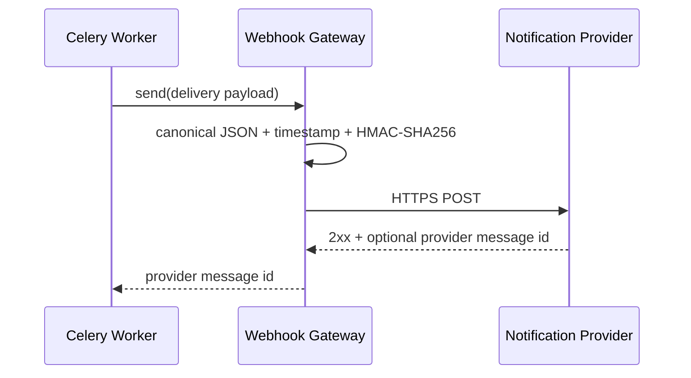

# ADR-0016：签名 Webhook 与通知死信重放

- 状态：已接受
- 日期：2026-08-03
- 决策范围：通知网关、风险告警 Outbox、管理 API、管理端风险工作台

## 背景

ADR-0015 建立了风险告警事务 Outbox、有限重试和失败终态，但日志网关只能用于本地或集成环境。生产接入还缺少明确的 HTTPS 交付协议、请求完整性校验、提供商回执、失败队列可观测性和受控重放入口。若直接删除失败记录或创建新通知，会破坏原始投递历史、去重语义和审计链。

## 决策

### 签名 HTTPS Webhook

新增 `webhook` 通知后端，统一承载账号动作令牌和风险告警通知。启用时必须配置 HTTPS URL、至少 32 字符的独立签名密钥和 1～30 秒超时。

- 协议版本固定为 `notification-webhook-v1`；
- 请求体使用稳定排序、紧凑 JSON 编码；
- 签名原文为 `timestamp + "." + request_body`，请求头携带时间戳和 `sha256=` 前缀的十六进制 HMAC；
- 只有 2xx 视为提供商接受；可选 `X-Provider-Message-Id` 保存为投递回执；
- 接收地址和账号动作令牌只存在于出站请求，不写入日志、Outbox 或管理响应。

### 投递元数据与失败终态

`risk_alert_notifications` 增加提供商、提供商消息 ID、失败时间、重放次数、最近重放时间和操作者。每次尝试先记录当前网关名称；成功清除错误和失败时间，第三次失败进入 `failed` 并记录 `failed_at`。

### 死信查询、指标与重放

管理接口仅允许 MFA 审核员/管理员访问：

- 查询投递状态、类型和提供商；
- 汇总待发送、已发送、失败、近 24 小时失败、最老待发送时长和提供商分组；
- 仅允许对 `failed` 记录执行人工重放。

重放要求 `Idempotency-Key`、限流和原因说明。操作在原记录上把状态重置为 `pending`、尝试次数归零并追加重放元数据；原失败信息进入最小披露审计，而不是删除原记录或绕过原 `dedupe_key`。

## 安全与隐私边界

- Webhook 签名密钥只能通过运行环境的密钥管理注入，不进入仓库、日志或 API；
- 管理列表不返回接收邮箱、Webhook URL、签名密钥或请求正文；
- 重放审计只保存告警/通知标识、类型、原提供商、原错误码、原尝试次数、重放次数和受控说明；
- 本协议证明请求来自持有共享密钥的一方，不替代提供商侧访问控制、网络限制、重放窗口检查和数据处理协议。

## 影响

### 正面

- 生产通知提供商可通过稳定、可验证的 HTTPS 边界接入；
- 提供商回执、失败时间和重放历史可追踪；
- 管理员可以定位死信并在通道恢复后安全、幂等地重放；
- 原始 Outbox 去重和不可变业务事件保持不变。

### 代价与限制

- 当前只有通用 Webhook，不包含厂商专用 SDK、模板管理或提供商级回调验签；
- 当前指标通过管理 API 读取，尚未导出到 Prometheus/OpenTelemetry；
- 重放仍由现有 Worker 异步执行，不提供同步送达保证；
- 单 Worker 扫描模型在水平扩展前仍需投递租约、独立 Beat 和更完整的队列监控。

## 后续

- 在 staging 验收真实提供商端点、凭据轮换、网络策略和回放保护；
- 导出投递延迟、失败率和积压指标并配置告警阈值；
- 增加提供商回调、模板版本和多渠道路由；
- 实现值班排班、升级链和团队通知策略。
