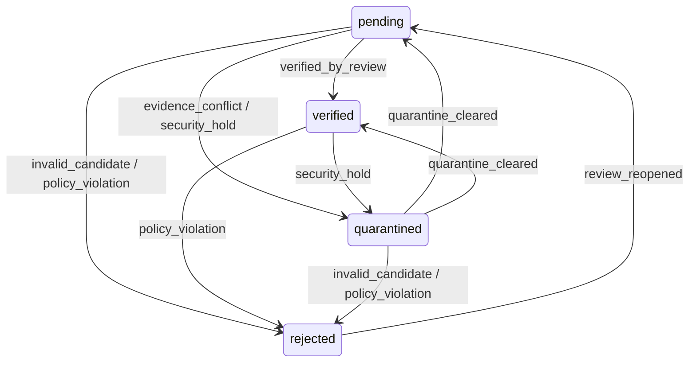

# M4 第 1 次开发迭代：候选人工审核闭环

- 日期：2026-08-02
- 分支：`codex/m4-candidate-moderation`
- 基线：`codex/m3-desktop-verification`
- 目标：完成“筛选候选 → 查看证据 → 填写原因 → 人工处置 → 幂等重试 → 审计追踪”的模块化垂直切片。

## 1. 模块拆分

| 模块 | 变更 |
|---|---|
| 数据模型 | 扩展 `record_state_events`，增加 `transition_source`、`actor_id`、`request_id` 和 `reason_note`；迁移版本为 `20260802_0007` |
| 后端 Moderation | 新增审核列表、审核详情和人工状态转换服务；规则版本为 `moderation-v1` |
| 安全边界 | 复用特权角色 + TOTP MFA 门禁、数据库持久化幂等、不可变状态事件和审计日志 |
| 共享契约 | 新增候选审核摘要、证据修订、状态事件、人工原因码和转换请求/响应类型 |
| Admin | 新增候选审核导航、筛选队列、最小披露详情、证据/状态时间线和受控处置入口 |
| 测试 | 新增 API 权限/幂等/审计/秘密保护测试和 Admin 请求契约测试 |

## 2. 人工状态规则

禁止同状态空操作。原因码必须与目标状态匹配；已拒绝候选仍不接受普通用户反馈，只能由人工审核重新开启。

## 3. 最小披露与审计

- 审核列表和详情不返回 `password`、`secret_ciphertext`、`secret_nonce`、`secret_key_version` 或 `secret_dedup_tag`。
- 证据详情不返回 IP 前缀和安装关联键，避免管理界面不必要暴露风控标识。
- 自由文本审核说明仅进入不可变状态时间线；审计详情只保留原因码、前后状态和状态事件 ID。
- 所有示例和测试数据均为合成数据。

## 4. 自动化结果

| 门禁 | 结果 |
|---|---|
| API Ruff | 通过 |
| API pytest | 43 通过、1 个真实 Redis 条件测试跳过 |
| API 覆盖率 | 89.66%，高于 80% 门禁 |
| Admin Vitest | 10 通过，其中候选审核服务 3 项 |
| Admin TypeScript/生产构建 | 通过 |
| SQLite Alembic 往返 | 通过，全量升级 → 回滚至 base → 再升级 |
| MySQL 8.4 Alembic 往返 | 通过，全量升级 → 回滚至 base → 再升级 |
| Docker Compose 空环境冒烟 | 通过，空环境构建、迁移、健康检查、合成注册/登录、Web/Admin 可用，耗时约 10.6 分钟 |
| GitHub PR/CI | 待创建与执行 |

## 5. 迁移兼容性修复

- MySQL 8.4 首次回滚验证发现 `actor_id` 外键仍依赖 `ix_record_state_events_actor_id`，不能先删除索引。
- `20260802_0007` 的降级顺序调整为先删除外键约束，再删除请求号、操作者和状态来源索引及字段。
- 修复后 SQLite 与 MySQL 8.4 全量升级、回滚、再升级均通过。

## 6. 尚未纳入本切片

- 举报/申诉模型和处理队列。
- 候选合并、删除、批量处置和危险操作二次确认。
- 用户封禁、信誉事件、积分补偿/重算。
- 失败激增告警、关联账号分析和并发后台任务。
- 独立审计查询 API、CSRF/XSS 专项与浏览器 E2E。
