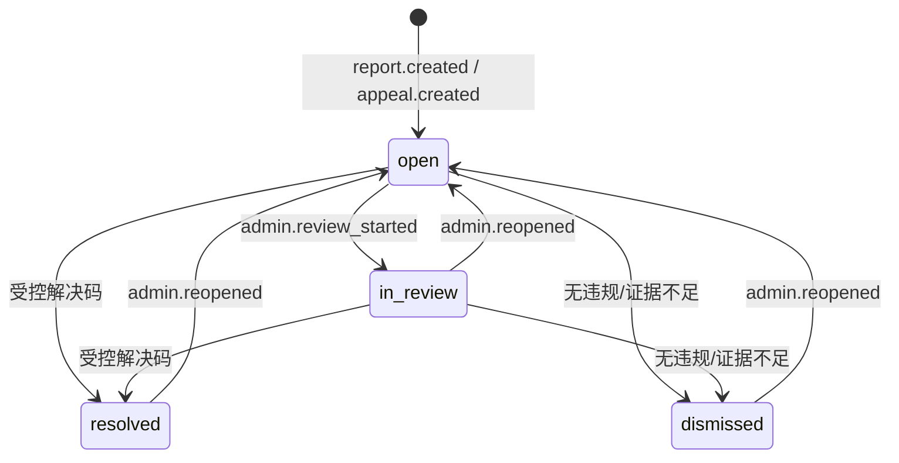

# M4 第 2 次开发迭代：举报与申诉案件闭环

- 日期：2026-08-02
- 分支：`codex/m4-reports-appeals`
- 里程碑：M4 社区信任与管理闭环
- 上一迭代：[M4 第 1 次开发迭代](./2026-08-02-m4-iteration-1.md)
- 架构决策：[ADR-0010](../adr/0010-unified-trust-case-workflow.md)

## 1. 迭代目标

在既有候选人工审核基础上，完成“用户提交举报/申诉 → 用户查看本人案件 → MFA 管理队列处理 → 不可变事件与审计”的垂直切片，同时保持案件结论与候选状态处置的独立审计边界。

本轮不实现账号申诉、自动分派、处理 SLA、站内/邮件通知、信誉事件、案件自动驱动候选状态和批量处置。

## 2. 已完成范围

### 2.1 数据模型与迁移

- 新增 `trust_cases`：统一存储 `report` 与 `appeal`，记录候选、提交者、可选关联案件、原因、说明、分派、处理结果和时间。
- 新增 `trust_case_events`：不可变记录案件创建、前后状态、动作、原因码、操作者、说明和 `request_id`。
- 新增 Alembic `20260802_0008`，包含候选、用户、自引用关联和事件外键以及队列查询索引。
- 已验证 SQLite 与 MySQL 8.4 全量升级、全量回滚、再次升级。

### 2.2 用户 API

- `POST /api/v1/trust/reports`：登录用户举报存在的候选；说明可选；每小时限流；持久化幂等。
- `POST /api/v1/trust/appeals`：仅候选贡献者可对 `rejected` 或 `quarantined` 候选申诉；说明必填；每日限流；持久化幂等。
- `GET /api/v1/trust/cases`：分页查看当前用户自己的举报和申诉，可按类型筛选。
- 用户无法通过该接口读取其他用户案件；关联案件不存在或候选不一致时拒绝创建。

### 2.3 管理 API

- `GET /api/v1/admin/trust-cases`：在 MFA 会话中按类型、状态、案件/候选 ID 或举报人用户名筛选。
- `GET /api/v1/admin/trust-cases/{case_id}`：查看案件详情和不可变事件时间线。
- `POST /api/v1/admin/trust-cases/{case_id}/transition`：按受控状态矩阵和结果码处理案件，接入限流、持久化幂等和审计。
- 审计详情不复制用户说明和管理员自由文本处理说明。

### 2.4 用户 Web

- 新增“举报申诉”用户中心页面，支持举报/申诉切换、原因选择、候选 ID、可选关联案件和说明。
- 查询结果中的每条候选提供“举报候选”快捷入口并自动带入候选 ID。
- “我的贡献”中仅对 `rejected` 或 `quarantined` 候选显示申诉入口并自动带入候选 ID。
- 页面展示本人案件类型、状态、原因、候选、创建时间和处理说明，并明确禁止提交密码、令牌、密钥或其他敏感信息。

### 2.5 Admin

- 新增“举报申诉”队列，可按类型、状态和关键词筛选。
- 支持案件详情、提交说明、处理结果和不可变事件时间线。
- 根据案件类型和当前状态提供受控动作：进入审核、解决、驳回、重新打开。
- 所有写操作使用稳定重试键；管理服务测试校验筛选、认证、路径编码、请求体和幂等头。

### 2.6 共享契约

共享包新增：

- 举报/申诉原因码和创建请求；
- 案件类型、状态、摘要、详情和列表；
- 案件事件；
- 管理状态转换请求和响应。

## 3. 状态与安全规则

- `report` 可用解决码：采取行动、无违规、证据不足。
- `appeal` 可用解决码：申诉成立、申诉驳回、证据不足。
- 状态与结果码不匹配返回校验错误。
- 结案不会自动修改候选状态；需要恢复或隔离候选时必须进入候选审核工作台执行独立转换。

## 4. 自动化与环境门禁

| 门禁 | 结果 |
|---|---|
| Ruff 与统一检查脚本 | 通过 |
| API | 46 通过，1 个真实 Redis 条件测试跳过 |
| API 覆盖率 | 84%，高于 80% 门槛 |
| Web | 9 项测试通过，类型检查与生产构建通过 |
| Admin | 13 项测试通过，类型检查与生产构建通过 |
| Windows Desktop | Release 构建 0 警告/0 错误，11 项测试通过 |
| SQLite Alembic | 全量升级、回滚、再升级通过 |
| MySQL 8.4 Alembic | 全量升级、回滚、再升级通过 |
| Docker Compose | 空数据卷构建；MySQL、Redis、API、Worker、Web、Admin 健康检查与合成注册/登录通过，约 11.4 分钟 |

## 5. 当前边界与下一轮建议

1. 增加案件处理结果通知、处理 SLA、管理员分派和逾期指标。
2. 设计显式应用服务，把“案件结论 + 候选人工状态转换”编排为可恢复但仍保留双事件的工作流。
3. 实现信誉事件、积分回滚补偿和余额重算。
4. 加入管理员对象级越权、CSRF/XSS、批量查询资源消耗与并发状态任务测试。
5. 为用户处置、审计查询、系统配置版本和基础仪表盘建立后续模块。
