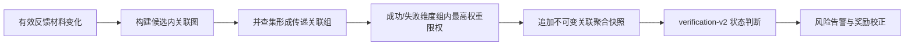

# M4 第 6 次开发迭代：关联证据与动态降权

- 日期：2026-08-03
- 分支：`codex/m4-correlation-controls`
- 基线分支：`codex/m4-risk-alerts`
- 目标：在候选范围内识别传递关联反馈，限制同一关联组对验证状态的重复影响，并提供 MFA 管理调查所需的聚合详情。

## 交付范围

### 规则与数据

- 新增 ADR-0014、`correlation-v1` 和 `verification-v2`。
- 新增 `EvidenceCorrelationAssessment` 模型及 Alembic `20260803_0012`。每次有效反馈材料变化在反馈、关联快照、状态变化、风险告警和奖励校正的同一事务内完成。
- 关联图只使用当前候选的有效反馈；共享安装标识哈希或 IP 网段建立边，并通过并查集支持传递关联。
- 每个关联组在成功/失败两个维度分别最多贡献最高单条反馈权重；快照保存原始/有效权重、组数量和降权数量，不保存原始关联值。

### 管理 API 与前端

- 候选管理详情增加当前关联快照、关联组列表和不可变快照历史。
- 关联组只展示脱敏账号/反馈标识和 `installation`/`ip_prefix` 信号类型；不展示 IP、安装哈希或内部关联键。
- 共享 API 契约新增 `CorrelationSnapshot`、`CorrelationGroup` 和 `CorrelationAssessment`。
- 本轮不新增自动处罚；管理员仍通过既有 MFA 候选状态工作流人工处置。

## 自动化验证

- `apps/api/tests/test_m4_candidate_correlation.py` 覆盖安装信号与 IP 信号的传递合并、结果维度动态限权、同事务快照持久化、管理详情聚合和原始关联值最小披露。
- API 全量 57 项通过、1 项真实 Redis 条件测试在普通单元环境跳过，覆盖率 90.99%；Ruff、TypeScript、共享契约 2 项、Web 10 项、Admin 16 项、Desktop 11 项、前端生产构建和 WPF Release 构建均通过。
- 显式启用真实 Redis 的安全门禁 8 项通过；SQLite 与 MySQL 8.4.11 全量迁移 `upgrade → downgrade → upgrade` 通过。
- `scripts/check.ps1` 统一门禁和 Docker Compose 空数据卷重建通过；MySQL/Redis/API/Worker/Web/Admin 健康检查及合成注册/登录成功，耗时约 3.2 分钟，环境已清理。

## Git 与托管 CI

- 提交：`d1edca7 feat: add M4 candidate correlation controls`。
- 创建堆叠 PR #21，基线为 `codex/m4-risk-alerts`。
- GitHub Actions push 运行 `30775811539` 与 PR 运行 `30775831810` 均成功；API、Frontend、Desktop 和 Container Images 作业全部通过，API 作业同时完成 SQLite/MySQL 迁移往返。

## 明确留待后续

- 跨候选/全局身份图谱、协同行为检测和大规模异步分析。
- 告警通知网关、值班分派、SLA、规则动态配置、回放和误报率指标。
- 基于关联证据的自动封禁、信誉扣减、申诉与可逆处罚。
- 浏览器与 Windows 实机 E2E、规模性能、生产监控、安全扫描和恢复演练。
