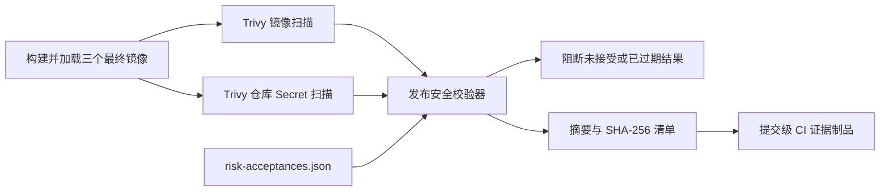

# 发布镜像、Secret 与风险接受门禁

## 1. 目标与范围

本门禁补充依赖审计和 SBOM 门禁，覆盖正式构建链中的以下对象：

- API 最终容器镜像。
- Web 最终 Nginx 容器镜像。
- Admin 最终 Nginx 容器镜像。
- Git 已提交仓库内容中的 Secret 特征。
- 高危和严重 Finding 的限期风险接受记录。

本门禁不等同于 DAST、人工渗透、生产秘密管理或目标环境验收。

## 2. CI 执行流程



CI 使用完整提交 SHA 固定 `aquasecurity/trivy-action`，并固定 Trivy 工具版本。扫描步骤先输出 JSON、返回成功，再由仓库内校验器统一应用风险接受政策；这样失败时仍可上传原始报告用于复核。

## 3. 报告与作用域

| 作用域 | 报告文件 | 阻断规则 |
|---|---|---|
| `image:api` | `trivy-api-image.json` | 未接受的 HIGH/CRITICAL 漏洞阻断 |
| `image:web` | `trivy-web-image.json` | 未接受的 HIGH/CRITICAL 漏洞阻断 |
| `image:admin` | `trivy-admin-image.json` | 未接受的 HIGH/CRITICAL 漏洞阻断 |
| `repo:secrets` | `trivy-repository-secrets.json` | HIGH/CRITICAL Secret Finding 阻断 |

成功时还生成：

- `release-security-summary.json`
- `RELEASE_SHA256SUMS`

## 4. 风险接受登记

唯一登记文件为 `security/risk-acceptances.json`。默认登记为空；不得为使 CI 变绿而添加无责任人或永久豁免。

合成示例：

```json
{
  "schema_version": 1,
  "acceptances": [
    {
      "id": "RA-2026-001",
      "scope": "image:api",
      "finding_id": "CVE-2099-0001",
      "severity": "HIGH",
      "owner": "security-owner@example.invalid",
      "approved_by": "release-approver@example.invalid",
      "reason": "Synthetic example awaiting an upstream rebuilt package.",
      "ticket": "SEC-EXAMPLE-001",
      "expires_on": "2026-08-31"
    }
  ]
}
```

校验规则：

1. ID 必须符合 `RA-YYYY-NNN`。
2. 作用域必须精确匹配一个已知扫描对象。
3. Finding ID 与严重级别必须精确匹配实际结果。
4. 负责人和批准人必须不同。
5. 工单、原因和到期日期不能为空。
6. 到期日必须晚于执行日；到期当天即阻断。
7. 重复 ID 或重复作用域/Finding 组合阻断。

## 5. 本地命令

只验证登记政策和有效期：

```powershell
pnpm security:release-policy
```

执行依赖/SAST/SBOM 与登记政策统一检查：

```powershell
pnpm security:audit
pwsh ./scripts/check.ps1 -SkipInstall -IncludeSecurity
```

完整镜像报告校验：

```powershell
python ./scripts/verify_release_security.py `
  --directory .local/security-release `
  --risk-acceptances security/risk-acceptances.json `
  --write-checksums
```

完整镜像扫描需要可运行的 Docker 引擎和 Trivy；若本机条件不满足，必须使用真实 CI 证据，不能用策略单测替代镜像实扫。

## 6. 首批证据

- 首次阻断运行：`31331415752`，发现旧基础镜像中的未接受高危/严重系统包漏洞，仓库 Secret 为 0。
- 整改提交：`07abd25`，更新 API、Node 构建层和 Nginx 运行层基础镜像。
- 通过运行：`31331945963`，八个作业全部成功。
- 最终报告：三个镜像高危/严重漏洞 0，仓库 Secret 0，风险接受 0。
- 远端证据已下载并通过仓库内校验器二次复核。

## 7. 剩余安全门禁

- DAST 与人工安全测试。
- 对象级越权、CSRF/XSS、重放、资源消耗和敏感日志专项测试。
- 正式秘密托管、轮换和紧急吊销。
- 发布制品签名、来源证明与长期证据仓库。
