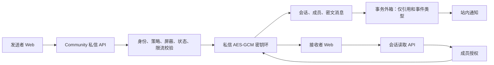
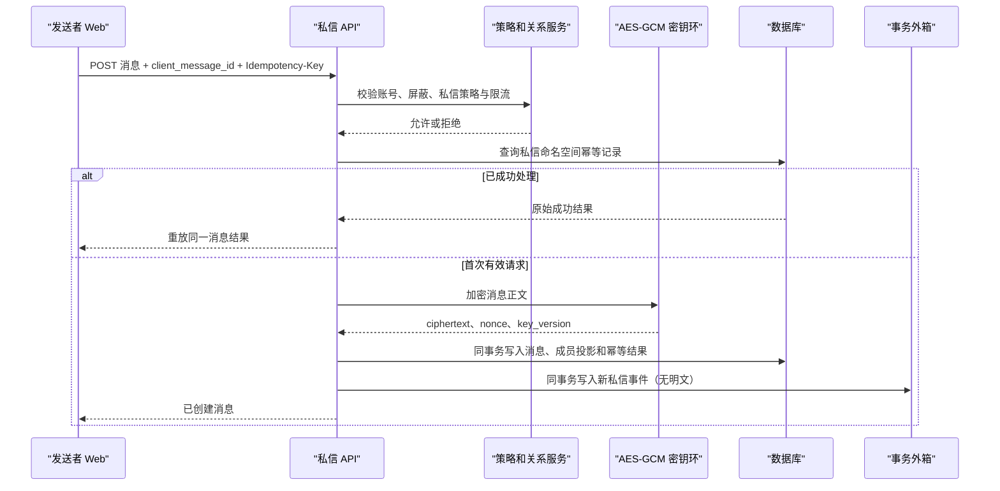

# WP5-I9 一对一异步私信设计

- **状态：**设计已确认，等待书面规格审阅
- **确认日期：**2026-08-16
- **迭代：**WP5-I9 / R5
- **范围基线：**`codex/wp5-i8-community-search` 的 `7a9bc79e930f13c0bca2fc22019f7192d2aa7c59`
- **上游计划：**[密码侦探社后续开发计划（2026-08-13）](../../../项目文档/密码侦探社后续开发计划-2026-08-13.md)

## 1. 目标与范围

本设计实现一对一、非实时的站内私信安全闭环。两个已认证且允许互相联系的用户可以创建或取得唯一会话、发送和读取消息、更新已读进度，并各自归档或静音会话。私信正文在服务端使用 AES-GCM 加密，数据库只保存密文、随机 nonce 和密钥版本。

本轮范围严格限定为异步收发：用户不需要持有 WebSocket、SSE 或其他实时连接，也能通过刷新会话列表或打开会话页完成发送、接收、已读、归档和静音。

### 1.1 本轮交付

- 一对一会话的创建、去重和成员授权。
- 加密消息的发送、稳定游标读取和已读进度。
- 归档、取消归档、静音和取消静音，且仅影响当前用户。
- 服务端私信策略、屏蔽关系、账号状态、限流和幂等控制。
- 站内“新私信”通知事件；事件与普通日志均不携带消息正文。
- Web 收件箱、会话历史、发送和失败重试体验。
- 迁移、API/服务测试、前端渲染测试、三浏览器端到端测试和部署验证证据。

### 1.2 明确不在本轮范围

- 群聊、群组私信或多成员会话。
- WebSocket/SSE 私信实时推送、断线补偿、重连和消息重放。
- 消息编辑、撤回、删除、附件、富文本或外部 IM 同步。
- 私信举报、管理员审核队列、风控处置工作台或管理员查看明文。
- 实际邮件投递。

实时聊天、断线补偿和私信治理属于 WP5-I10，不能因本轮实现而提前标记完成。

## 2. 业务规则与最小披露

### 2.1 发送授权

服务端在任何创建会话或发送消息的请求中，按以下顺序判定：

1. 发送者已认证且账号处于可用状态。
2. 接收者存在且账号可用。
3. 接收者不是发送者本人。
4. 双方不存在任一方向的屏蔽关系。
5. 接收者的私信隐私策略允许当前发送者联系。
6. 发送者满足私信的单位时间频率和正文大小限制。
7. 请求的幂等键、客户端消息 ID 和请求摘要没有冲突。

前端不拥有授权最终决定权，也不能通过直接调用 API 绕过以上规则。

### 2.2 最小披露

- 不是会话成员时，读取会话、消息、成员状态和已读信息均返回统一的无权访问结果，不披露会话是否存在。
- 屏蔽与隐私策略拒绝时，对发送者使用稳定的“当前无法向该用户发送私信”提示，不确定性披露对方的具体屏蔽或策略设置。
- 账号状态异常时，只在不会泄露他人敏感状态的前提下显示必要的当前用户可行动提示。
- 普通操作日志、审计字段、异常详情、事务外箱消息和通知摘要不得包含正文或私信密钥。
- I9 不提供管理员正文检索、解密、导出或常规浏览能力。

### 2.3 数据生命周期

- **数据导出：**经已认证用户发起并完成既有安全校验后，只导出自己参与的会话元数据和当前仍可访问的消息；服务端按需解密生成受保护导出载荷，普通业务表不持久化导出明文。
- **账号删除：**账号进入删除流程后立即不可发送或接收；关联私信按既定保留期进入清理队列，期满删除密文、成员状态和幂等关联记录。
- **治理披露：**I9 只保留必要的安全审计和生命周期元数据。举报、处分、管理员受控查看及其最小授权模型将在 I10 单独设计。

## 3. 架构与数据模型

### 3.1 持久化实体

| 实体 | 核心字段 | 约束与责任 |
| --- | --- | --- |
| `community_direct_conversations` | `id`、`participant_low_id`、`participant_high_id`、`created_at`、`updated_at` | 用户 ID 按稳定顺序规范化；`(participant_low_id, participant_high_id)` 唯一，确保一对用户只有一个会话；发送消息时更新 `updated_at`。 |
| `community_direct_conversation_members` | `conversation_id`、`user_id`、`last_read_sequence`、`archived_at`、`muted_until` | 每个会话固定两条成员记录；用户专属状态不影响另一成员。 |
| `community_direct_messages` | `id`、`conversation_id`、`sequence`、`sender_id`、`ciphertext`、`nonce`、`key_version`、`client_message_id`、`created_at` | 正文只以 AES-GCM 密文保存；会话内 `sequence` 单调递增并参与分页；`(sender_id, client_message_id)` 唯一。 |
| 私信幂等记录 | `actor_id`、`idempotency_key`、请求摘要、消息引用、响应状态、`expires_at` | 复用既有幂等存储能力时使用私信命名空间；相同键相同请求重放原结果，相同键不同请求返回冲突。 |

### 3.2 索引与游标

- 会话列表按 `updated_at DESC, id DESC` 排序，游标包含二者，避免同一时间戳引起重复或漏项。
- 消息历史按 `sequence DESC, id DESC` 查询，响应携带下一页 `before` 游标；Web 显示时将当前页恢复为时间正序。
- 已读状态只保存会话内的最大 `last_read_sequence`，更新只能前进不能回退。
- 发送消息、更新最后活动时间、未读投影和外箱事件必须在同一数据库事务中提交。

### 3.3 密钥环与加密

- 复用现有版本化密钥环的配置校验和密钥轮换模式，但使用私信专用配置项与用途标签，不与候选密码、TOTP 等敏感域共享业务语义。
- 新消息用当前版本密钥执行 AES-GCM；每条记录保存密文、随机 nonce 和密钥版本。
- 读取时按记录的 `key_version` 从密钥环选取密钥，只在已授权成员的请求路径中解密。
- 启动时必须验证当前私信密钥版本存在、密钥环格式正确、保留期内的历史版本可读取。
- 密钥轮换后只影响新写入消息；历史消息依旧使用自身记录的密钥版本读取。

## 4. API 设计

API 挂载在既有 `/api/v1/community` 命名空间，使用项目统一的认证、错误信封、请求关联 ID 和速率限制机制。

| 方法与路径 | 说明 | 输入 | 成功结果 |
| --- | --- | --- | --- |
| `POST /direct-conversations` | 创建或取得与目标用户的一对一会话 | `recipient_username` | 会话摘要、对方公开资料和 `created` 标识；服务端按公开用户名解析内部 ID。 |
| `GET /direct-conversations` | 查询当前用户的会话列表 | `cursor`、`limit`、可选归档筛选 | 稳定游标分页的会话摘要、未读数、归档/静音状态。 |
| `GET /direct-conversations/{conversation_id}/messages` | 查询会话历史 | `before`、`limit` | 当前成员可见的已解密消息和下一页游标。 |
| `POST /direct-conversations/{conversation_id}/messages` | 发送加密消息 | `Idempotency-Key`、`client_message_id`、`body` | 消息 ID、序号、发送时间、重放标识。 |
| `PATCH /direct-conversations/{conversation_id}/read-state` | 推进当前成员已读游标 | `last_read_sequence` | 当前已读序号和会话未读数。 |
| `PATCH /direct-conversations/{conversation_id}/member-state` | 更新当前成员的归档或静音状态 | `archived`、`muted_until` | 当前成员状态。 |

新增稳定业务错误码：

- `DIRECT_MESSAGE_SELF_FORBIDDEN`
- `DIRECT_MESSAGE_UNAVAILABLE`
- `DIRECT_MESSAGE_ACCOUNT_UNAVAILABLE`
- `DIRECT_MESSAGE_RATE_LIMITED`
- `DIRECT_MESSAGE_NOT_PARTICIPANT`
- `DIRECT_MESSAGE_IDEMPOTENCY_CONFLICT`

## 5. 核心请求流程

读取消息时，API 先验证当前用户是会话成员，再根据稳定游标查询密文记录，按各记录的密钥版本解密后返回。已读请求只推进当前用户的游标，不会改变对方的会话状态。

## 6. 通知与异步边界

- 发送成功后在同一事务中写入“新私信”外箱事件，事件只包含接收者、会话 ID、消息 ID、事件类型和必要时间信息。
- 后台消费者沿用站内通知的去重与偏好边界；接收者静音时不产生可见的即时提醒，但消息仍保持可读取。
- 发送端不等待通知投递完成；通知失败不能回滚已成功保存的私信。
- 本轮不依赖实时连接。接收者通过刷新、重新进入收件箱或会话页获得新消息；实时分发和断线补偿留给 I10。

## 7. Web 体验

### 7.1 路由和页面

- `/community/messages`：收件箱，分为活动会话和已归档会话，展示对方公开资料、最后活动时间、未读数、归档与静音状态。
- `/community/messages/:conversationId`：会话页，读取历史、发送消息、更新已读并设置当前用户的归档/静音状态。
- 公开资料页提供“发送私信”入口；入口不是授权依据，最终仍以服务端校验结果为准。

### 7.2 交互状态

- 初始加载、继续加载、空会话、无历史消息和网络错误都有独立状态。
- 发送进行中禁用重复提交；网络故障后保留本地草稿、客户端消息 ID 和幂等键，点击重试使用原值。
- 无权、会话不存在、账号不可用或当前无法发送时显示可理解提示；不泄露屏蔽或私密策略细节。
- 使用 Vue 3 `<script setup lang="ts">`、明确 TypeScript 接口、Shadcn-Vue 基础组件和 Tailwind 工具类；不新增自定义 CSS 或修改 `src/components/ui/` 自动生成组件。

## 8. 测试与验收

### 8.1 自动化测试

- **迁移：**升级、降级、重新升级；唯一会话约束、外键、索引和最终 Alembic head 检查。
- **加密：**消息表、数据库快照模拟结果和常规日志不含合成正文或密钥；授权成员可读取，非成员不可读取。
- **授权：**自发消息、双向屏蔽、私信策略拒绝、停用账号、限流、非成员读取和状态更新均由服务端拒绝。
- **一致性：**重复创建会话返回同一会话；并发或重试发送只产生一条消息；相同幂等键不同请求返回冲突。
- **游标与状态：**会话/消息分页稳定、已读游标只前进、归档/静音仅影响当前用户。
- **通知：**外箱事件和通知摘要不含正文；静音边界符合用户状态。
- **前端：**收件箱、会话页、发送中、失败重试、无权和不可用状态具备基础渲染测试。
- **E2E：**两个合成账号在 Chromium、Firefox、WebKit 完成“创建会话 → 发送 → 接收刷新 → 已读 → 归档 → 静音”。

### 8.2 交付出口

- 两个合成账号完成创建会话、发送、接收、已读、归档和静音。
- 不能给自己发送私信；屏蔽、策略禁止和停用账号均被服务端拒绝。
- 并发/重试不重复写入消息。
- 消息明文和密钥不出现在数据库快照、事务外箱、通知摘要或普通日志。
- `pnpm` 类型检查、Lint、构建、API 测试、迁移检查及项目统一门禁通过。
- 目标环境完成迁移并记录部署 revision、迁移版本、服务拓扑、API 冒烟和跨浏览器验证证据。

## 9. 实施前置条件与已知基线问题

I9 实施将在独立 worktree `C:\Users\39859\.codex\worktrees\wp5-i9-async-private-messaging` 中进行，不修改原根工作区的未关联内容。

在该 worktree 上执行 `pwsh ./scripts/check.ps1 -SkipInstall` 时，基线在 `packages/api-contract/src/index.test.ts` 的 TypeScript 检查失败：`isPrivilegedRole`、`THIRD_PARTY_API_V1_PATHS` 和 `THIRD_PARTY_API_V1_SCOPES` 被重复导入。该问题已确认存在于 I8 整合基线提交 `7a9bc79`，源于其两个父分支相同导入段的合并结果，不是 I9 设计或实现引入。

在开始 I9 功能编码前，应以独立、小范围基线修复移除重复导入，并重新通过统一门禁；该修复必须保持第三方 API 和社区搜索合同断言，不得通过删除功能断言规避错误。

## 10. 设计审阅结论

本设计满足上游计划要求的一对一会话、参与者、加密消息、已读、归档、静音、私信策略、屏蔽、账号状态、限流、稳定游标、幂等发送、数据生命周期和无实时依赖的异步闭环。它将实时与治理能力明确留在 I10，避免扩大本轮变更面。
