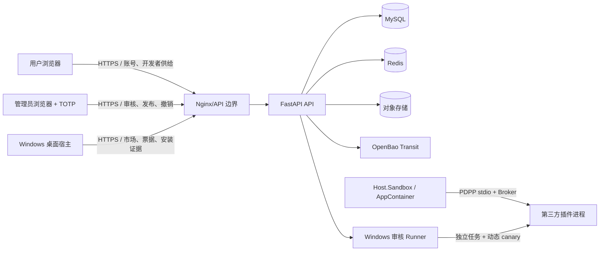

# 插件与三端系统威胁模型

- 基线日期：2026-09-02
- 范围：Windows 桌面宿主、Web 开发者端、Web/Admin 插件管理端、API、Worker、Windows 审核 Runner、插件市场、对象存储、OpenBao Transit 和桌面本地数据
- 方法：按资产、信任边界、数据流和 STRIDE 类别分析；风险等级为高/中/低
- 关联 ADR：[0020](../adr/0020-plugin-process-isolation-model.md)、[0021](../adr/0021-appcontainer-jobobject-boundary.md)、[0022](../adr/0022-parameterized-capability-model.md)、[0023](../adr/0023-plugin-signing-and-revocation.md)、[0024](../adr/0024-host-self-protection.md)

## 资产

1. 账号密码哈希、刷新令牌摘要、管理员 MFA 状态和浏览器会话。
2. 可逆加密的候选密码、去重标签、密钥版本和私信密钥环。
3. 插件 `.pdpkg` 制品、Manifest、SBOM、provenance、源代码和逐文件摘要。
4. 开发者 Ed25519 私钥、公钥指纹、平台 OpenBao Transit 签章密钥和撤销事实。
5. 用户授权、插件能力清单、约束、配额、安装实例密钥和权限同意记录。
6. 桌面插件私有数据、运行目录、更新队列、安装/升级/回退账本和本地日志。
7. 审核 Runner 的 mTLS 凭据、短期租约、动态 canary 结果、销毁证明和策略版本。
8. 管理员审核决定、发布通道、风险接受记录、审计日志和备份。

## 信任边界与数据流

边界规则：

- 插件进程不是可信组件，只能通过 PDPP 和 Broker 访问宿主资源。
- 桌面宿主不得把访问令牌、安装私钥、真实路径或连接串交给插件。
- Web 开发者端只能提交供给和查看状态；审核、平台签章和撤销属于 Admin/API。
- Admin 决策通过 MFA、RBAC、不可变审计和发布状态机约束；普通开发者不能调用管理接口。
- Runner 只处理隔离任务和脱敏证据，不能访问生产数据库、平台私钥或用户会话。

## 插件威胁与控制

| ID | 威胁 | 风险 | 控制 | 验证 |
|---|---|---|---|---|
| PT-01 | 恶意包路径穿越、重复条目或重解析点覆盖宿主文件 | 高 | 受限 ZIP、规范化路径、逐文件摘要、原子解包 | 包校验负向测试 |
| PT-02 | 压缩炸弹或超大响应耗尽 CPU、内存、磁盘或宿主解析器 | 高 | 包/展开量上限、Job Object、消息 ≤1MB、响应 Schema 和超时 | 资源耗尽与 2 MiB 响应测试 |
| PT-03 | 插件绕过 Broker 直接读取宿主文件或其他用户目录 | 高 | AppContainer、目录 ACL、file_ref opaque handle、显式拒绝目录 | 文件越权 canary、ACL 检查 |
| PT-04 | 插件向外部网络或本地监听器外传数据 | 高 | 按 AppContainer SID 的 WFP 出站阻断、默认不授予网络能力、动态网络 canary | WFP 规则验证、回环连接探针 |
| PT-05 | 插件写入注册表建立持久化或污染系统配置 | 高 | 按 SID 的注册表拒绝写入 ACL、`registry:write` 声明即拒绝 | 注册表写探针 |
| PT-06 | 宿主环境变量、API 令牌或签章凭据泄漏给插件 | 高 | 环境白名单/重定向、短期 scope token、秘密不进入插件进程 | 环境 canary、日志扫描 |
| PT-07 | 插件派生子进程、逃逸 Job Object 或隐藏持久化进程 | 高 | `ActiveProcessLimit`、KillOnClose、未处理异常终止、子进程 canary | spawn-child 探针与进程计数 |
| PT-08 | 插件未声明危险命令以规避动态审核 | 高 | 宿主强制注入五类 canary，不依赖 Manifest 命令列表 | 隐藏命令合成包测试 |
| PT-09 | 插件返回畸形 JSON-RPC、错误对象或恶意深度触发宿主崩溃 | 高 | JSON-RPC envelope、深度、字段和响应 Schema 双向校验 | 协议负向测试 |
| PT-10 | 开发者替换同版本制品、伪造 provenance 或重放签名 | 高 | 版本不可变、Ed25519 开发者签名、逐文件摘要、provenance 与构建证明 | finalize 与双构建测试 |
| PT-11 | 攻击者伪造平台审核签章或窃取平台私钥 | 高 | 生产 OpenBao Transit、API 不持有私钥、平台签章载荷、密钥轮换 | 配置门禁、签章验签、轮换演练 |
| PT-12 | 已撤销或过期插件在离线桌面继续运行 | 高 | 签名撤销列表、ETag/TTL、离线最大窗口、高风险停用 | 撤销缓存与离线窗口测试 |
| PT-13 | Canary 下载票据被跨账号、跨设备或重放使用 | 高 | 管理员令牌、注册安装实例、ECDSA 设备签名、短期一次性票据 | 票据绑定与重放测试 |
| PT-14 | Runner 租约、mTLS 或任务摘要被伪造，执行非授权制品 | 高 | Runner ID/证书指纹、短期租约、任务绑定 SHA-256、策略版本 | Runner 合同与失败关闭测试 |
| PT-15 | 审核日志、动态证据或错误信息泄漏秘密、路径或插件输出 | 高 | 字段白名单、参数指纹、脱敏摘要、最小披露和不可变审计 | 日志/证据扫描 |
| PT-16 | 普通开发者越权批准、发布、撤销或修改审核策略 | 高 | Admin MFA、角色依赖、服务端状态机、乐观并发和审计 | API 权限矩阵 |
| PT-17 | 宿主 UI 被恶意插件响应或本地注入攻破，进而取得用户会话 | 中 | P2 双进程、Host.Sandbox 低完整性、令牌仅留 Host.UI、自检哈希 | P2 完整性与 IPC 测试 |
| PT-18 | 官方插件或第三方依赖供应链被植入恶意代码 | 中 | SBOM、许可证/漏洞扫描、构建 provenance、双构建一致性、撤销 | CI 与构建证明 |
| PT-19 | WFP/注册表策略安装失败导致插件以宽松权限启动 | 高 | 策略安装器失败回滚、启动前 SID 规则验证、缺失即拒绝 | 管理员 Probe、缺失策略单测 |
| PT-20 | 插件私有数据在卸载或回退时被误删或被其他插件读取 | 中 | 私有数据目录按插件 ID 隔离，卸载保留，Broker key 配额 | 安装/卸载/回退测试 |

## 当前控制状态

- 已实现并验证：PDPP 独立进程、AppContainer、Job Object、环境净化、Broker file_ref、五类强制动态 canary、OpenBao Transit 生产配置门禁、按 SID 的 WFP/注册表隔离策略、双签名/撤销/票据绑定和敏感信息脱敏。
- 已完成但仍需目标环境证据：Windows Runner 独立 VM/mTLS/隔离网络、多 Runner 容量、真实 UAT/Production Canary、长期密钥轮换和外部 CI 构建证明。
- 未实现：`Host.UI`/`Host.Sandbox` 双进程、低完整性 IPC、Rust `Pdpp.Sandbox.Core` 全量迁移、Capability v2 四元组、响应 Schema 全面覆盖和声明式 `ui:panel`。

## 开发与发布门禁

- 高风险控制没有实现或没有测试证据时，不得进入生产。
- 插件包必须通过结构、签名、SBOM、provenance、静态/动态审核和平台发布状态机。
- 生产平台签章必须使用 OpenBao Transit；任何派生签章、缺失策略或验证失败都失败关闭。
- 任何日志、测试夹具或提交中发现真实秘密，应立即清除并轮换相关凭据。
- 新增跨边界数据流、能力、可逆秘密、管理员动作或发布通道时，必须更新关联 ADR 和本威胁模型。
