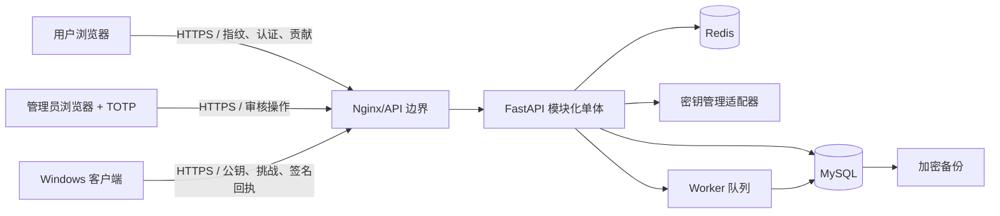

# 初始威胁模型

- 基线日期：2026-08-01
- 范围：MVP 的 Web、Admin、API、Worker、MySQL、Redis、Windows 客户端和备份
- 方法：以数据流和 STRIDE 类别组织，风险等级为高/中/低

## 资产

1. 账号密码哈希、刷新令牌摘要和会话状态。
2. 可逆加密的候选密码、去重标签与密钥版本。
3. 验证回执、状态事件、积分与信誉账本。
4. 管理员权限、审计日志、系统配置和备份。
5. 安装实例私钥与服务端一次性挑战。

## 信任边界与数据流

## 主要威胁与控制

| 威胁 | 风险 | 当前/计划控制 | 验证方式 |
|---|---|---|---|
| 凭据填充与登录爆破 | 高 | Argon2id、账号/IP 限流、渐进延迟、临时锁定 | 集成与安全测试 |
| 刷新令牌窃取和重放 | 高 | 仅存摘要、轮换、会话族、重用检测 | 认证集成测试 |
| 批量指纹枚举与密码揭示 | 高 | 仅完整指纹、匿名不揭示、账号配额、风险限流、审计 | E2E 与滥用测试 |
| 对象级越权 | 高 | 统一主体依赖、资源所有权检查、管理员 RBAC | 授权矩阵测试 |
| 候选密码数据库泄露 | 高 | 版本化 AEAD、加密/去重密钥分离、历史版本受控读取 | 加密单测、正向轮换与回滚演练 |
| 明文进入日志/追踪 | 高 | 字段白名单、敏感键脱敏、禁止请求体日志 | 日志扫描测试 |
| 桌面回执伪造/重放 | 高 | 安装公钥、一次性挑战、签名、时间窗口、风险权重 | 协议测试 |
| 恶意压缩包资源耗尽/路径穿越 | 高 | 大小/条目/时间限制、沙箱目录、不写出目标目录 | 合成恶意样本测试 |
| 关联账号刷票 | 高 | 账号/安装/IP 关联、证据去重和降权、异常隔离 | 风控规则测试 |
| 管理员滥权 | 高 | 独立入口、最小 RBAC、TOTP、二次确认、不可变审计 | 管理端 E2E 与审计抽查 |
| 依赖供应链污染 | 中 | 锁文件、依赖扫描、制品可追溯、最小镜像 | CI 扫描 |
| 备份或密钥泄露 | 高 | 备份加密、密钥分离、访问审计、恢复演练 | 恢复和权限审查 |

## 开发门禁

- 高风险控制没有实现或没有测试证据时，不得进入生产。
- 任何日志、测试夹具或提交中发现真实秘密，应立即清除并轮换相关凭据。
- 新增跨边界数据流、可逆秘密或管理员能力时必须更新本文件。
