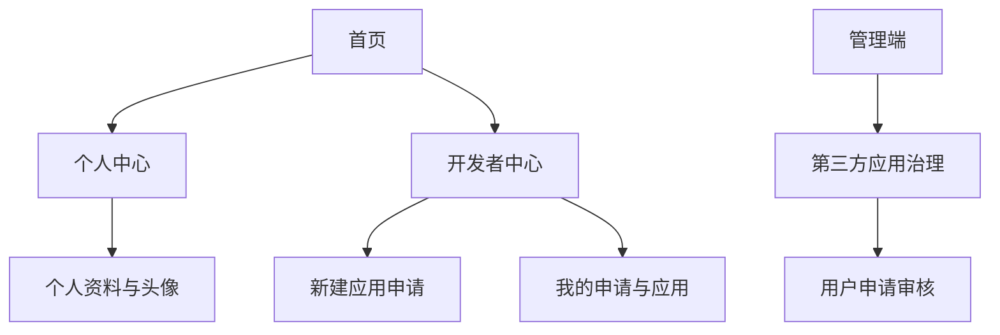
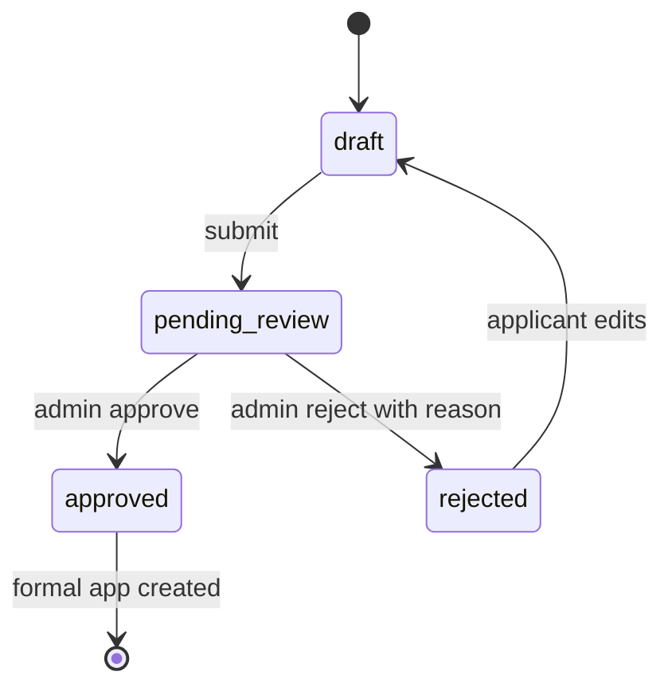

# Web 用户导航、头像与开发者自助申请设计

> 状态：已获方案确认，待按 TDD 实施。
>
> 范围：仅 Web 用户端增加面包屑；管理端不增加面包屑。头像支持本地上传、内置公共头像库和用户主动启用的 Gravatar。第三方桌面端应用采用用户自助申请、管理员审核通过后创建正式应用的闭环。

## 1. 目标与非目标

### 1.1 目标

1. 为 Web 用户端的个人中心与开发者中心提供统一、可访问的面包屑导航。
2. 让用户能够上传头像、选择内置公共头像，并在明确同意后使用 Gravatar。
3. 建立“草稿 → 提交审核 → 拒绝后修改重提 → 审核通过创建正式第三方应用”的开发者自助申请闭环。
4. 保持既有管理员手动创建、审核、暂停、恢复、撤销第三方应用能力兼容。
5. 全链路具备最小权限、审计、上传校验和 API/前端回归测试。

### 1.2 非目标

- 本轮不为 Admin 增加面包屑导航。
- 本轮不开放未经审核应用的 OAuth、Token、安装实例或第三方 API 能力。
- 本轮不把用户申请直接映射成正式 `third_party_apps` 记录。
- 本轮不由服务端主动向 Gravatar 发送原始邮箱或替用户默认启用 Gravatar。

## 2. Web 信息架构

### 2.1 面包屑规则

- 仅由 `apps/web` 的路由元数据驱动，不在 `apps/admin` 渲染。
- 首页不显示面包屑；一级以上页面显示“首页 / …”。
- 最末项是当前页文本，前序项是可访问链接。
- 路由标题从 `meta.breadcrumb` 或等效严格类型字段读取，禁止各页面散落硬编码路径判断。
- 首批覆盖个人资料、开发者中心、新建申请、我的申请与应用、已授权应用等登录态页面。

## 3. 头像设计

### 3.1 头像来源

| 类型 | 持久化字段 | 客户端显示 | 默认策略 |
|---|---|---|---|
| `upload` | 经服务端保存的资源路径 | 同源受控资源 URL | 用户主动上传 |
| `preset` | 内置头像 ID | 受版本控制的静态资源 URL | 默认合成头像 |
| `gravatar` | `gravatar_enabled=true`，不保存客户端原始邮箱 | 基于服务端安全投影生成的 HTTPS URL | 默认关闭，用户主动开启 |

### 3.2 上传限制与回退

- MIME 和文件内容同时校验，仅允许 PNG、JPEG、WebP。
- 限制文件大小、像素总量与宽高；服务端重新解码后保存安全格式。
- 文件名由服务端生成，禁止复用浏览器提交的原始文件名。
- 资源访问走现有静态资源安全目录和缓存策略，更新头像后刷新用户资料投影。
- Gravatar 请求失败、用户未启用或无可用邮箱时，回退至已选内置头像，再回退至用户名首字母。
- 对社区公开资料仅投影最终头像 URL，不暴露邮箱、头像来源开关或内部存储路径。

### 3.3 用户 API

| 方法 | 路径 | 用途 |
|---|---|---|
| `GET` | `/api/v1/me/profile` | 返回当前用户资料与安全头像投影 |
| `POST` | `/api/v1/me/profile/avatar/upload` | 上传并启用头像 |
| `PUT` | `/api/v1/me/profile/avatar/preset` | 选择内置头像 |
| `PUT` | `/api/v1/me/profile/avatar/gravatar` | 显式启用或关闭 Gravatar |

所有写操作均要求登录、限流并写入用户维度审计；上传接口使用受控 `multipart/form-data`。

## 4. 开发者自助申请

### 4.1 状态机

- `draft`：申请人可编辑、保存或删除；不进入管理员审核队列。
- `pending_review`：冻结申请核心字段；申请人仅能查看。
- `rejected`：管理员必须写明拒绝原因；申请人编辑后状态回到 `draft`，再次提交生成新的审核事件。
- `approved`：保留申请快照及审核历史，并在同一事务中创建/激活正式第三方应用。
- 正式应用继续沿用既有 `approved`、`suspended`、`revoked` 生命周期；申请人只能管理归属自己的正式应用信息，不能自行批准 Scope 或可信验证资格。

### 4.2 数据模型

新增：

- `third_party_application_requests`
  - 申请人用户 ID、申请字段快照、状态、重提次数、当前版本、最后审核意见、关联正式应用 ID、创建/更新时间。
- `third_party_application_review_events`
  - 申请 ID、审核操作人、动作（提交、拒绝、批准）、备注、批准 Scope 快照、可信验证决定、版本号、时间。

扩展：

- `third_party_apps` 增加 `application_request_id` 外键或等效可追溯关联。
- 正式应用的 `application_source` 使用既有 `developer_self_service`；管理员手动创建继续使用既有来源。

数据约束：

- 同一申请在 `pending_review` 状态不可重复提交。
- `approved` 申请只能关联一个正式应用。
- 拒绝动作必须携带非空、经长度限制的审核意见。
- 申请的 Scope、回调地址和 URL 校验复用既有第三方应用安全验证规则。

### 4.3 用户 API

| 方法 | 路径 | 说明 |
|---|---|---|
| `POST` | `/api/v1/me/third-party-applications` | 创建草稿 |
| `GET` | `/api/v1/me/third-party-applications` | 列出本人的申请与正式应用投影 |
| `GET` | `/api/v1/me/third-party-applications/{request_id}` | 查看申请详情与审核时间线 |
| `PATCH` | `/api/v1/me/third-party-applications/{request_id}` | 编辑草稿或被拒绝申请 |
| `POST` | `/api/v1/me/third-party-applications/{request_id}/submit` | 提交或重新提交审核 |

申请字段：应用名称、开发者/团队名称、说明、官网、隐私政策 URL、回调地址、申请 Scope、Windows 发行信息和用途说明。

### 4.4 管理员 API 与工作区

现有 `/api/v1/admin/third-party-apps` 继续服务管理员手动创建和正式应用治理；新增或扩展受管理员权限保护的申请审核端点：

| 方法 | 路径 | 说明 |
|---|---|---|
| `GET` | `/api/v1/admin/third-party-applications/requests` | 查询申请队列与状态 |
| `GET` | `/api/v1/admin/third-party-applications/requests/{request_id}` | 查看申请与审核记录 |
| `POST` | `/api/v1/admin/third-party-applications/requests/{request_id}/approve` | 批准并创建正式应用 |
| `POST` | `/api/v1/admin/third-party-applications/requests/{request_id}/reject` | 拒绝并写入原因 |

Admin 第三方应用治理页面增加“用户申请”区，但维持现有导航，不显示面包屑。

### 4.5 密钥与授权边界

- 申请阶段没有 `client_id`、管理密钥、OAuth 授权资格或第三方 API 调用资格。
- 批准时在事务内创建正式应用；管理密钥只在管理员批准结果中显示一次，数据库仅保存哈希。
- 批准 Scope 可小于或等于申请 Scope；可信验证资格只能由管理员明确授予。
- 暂停/撤销正式应用必须继续使其 Token、授权码和相关会话不可用。

## 5. Web 页面

| 页面 | 路径 | 核心能力 |
|---|---|---|
| 个人资料 | `/account/profile` | 头像上传、预设选择、Gravatar 开关、资料预览 |
| 开发者中心 | `/developer` | 状态概览、新建申请入口、我的申请入口 |
| 新建申请 | `/developer/applications/new` | 草稿保存、字段校验、提交审核 |
| 我的申请与应用 | `/developer/applications` | 申请状态、审核意见、修改重提、正式应用信息 |
| 申请详情 | `/developer/applications/:id` | 版本快照和审核时间线 |

页面全部使用现有 Shadcn-Vue 组件与 Tailwind 工具类；不在 `.vue` 文件写自定义 `<style>` 或 inline style。

## 6. 测试与验收

### 6.1 API

- 头像上传的类型、大小、图片内容、未登录和安全资源投影测试。
- 内置头像与 Gravatar 启用/关闭、回退投影测试。
- 申请草稿、提交、拒绝、编辑重提、审核通过创建正式应用、重复审批冲突测试。
- 归属隔离：用户不能读取或修改他人申请；申请阶段不能走 OAuth。
- 审计事件与一对一正式应用关联测试。

### 6.2 Web 与 Admin

- Web 面包屑路由运行态测试：目标页面显示、首页隐藏、Admin 未出现。
- 个人资料头像交互测试。
- 开发者新建/编辑/重提/列表与详情运行态测试。
- Admin 用户申请审核工作区运行态与拒绝意见必填测试。
- 现有管理员手动创建与正式应用治理回归测试。

### 6.3 发布门禁

1. 针对新增模块运行 pytest、Vitest、TypeScript、ESLint 和构建。
2. 运行 `pwsh ./scripts/check.ps1 -SkipInstall`。
3. 仅暂存本轮实现与 Markdown 文档，保留无关工作区修改。
4. 使用现有 Git Data API 同步工具验证远端等价工作树。
5. 部署 Staging，复验迁移、服务副本、受保护 API、Web 路由和公开头像安全投影。
