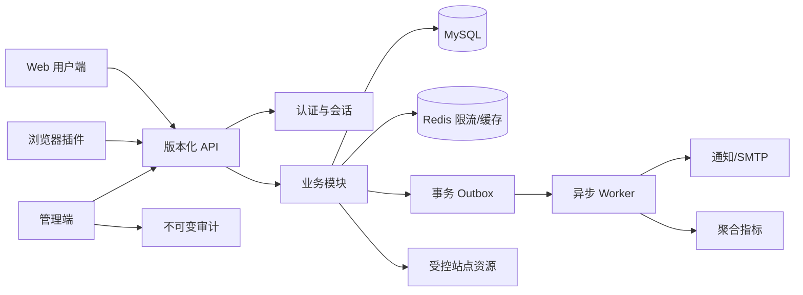

# 密码侦探社历史功能再规划书

**文档状态：** 规划参考，不自动改变当前开发基线  
**规划日期：** 2026-08-19  
**适用范围：** Web 用户端、管理端、后端 API、浏览器扩展、运营系统与基础设施  
**当前基线：** [密码侦探社项目规格说明书 v3.0](./密码侦探社项目规格说明书-v3.0.md)  
**历史来源：** [历史文档](./历史文档/README.md)  

> 本文根据用户指定的历史功能重新整理。本文只定义未来评估、拆分和验收方法，不代表立即开发，也不解除 v3.0 已设定的安全和合规限制。

## 1. 规划结论

本轮涉及的功能横跨七个领域：积分与兑换、授权恢复任务、开发者生态、用户辅助工具、数据可视化、站点运营配置和账号治理。它们的风险和依赖差异较大，不应作为一个版本整体上线。

当前处理原则如下：

1. **当前 v3.0 继续有效。** 积分商城、实物兑换、悬赏破解、公开 API 市场、浏览器插件、广告、明文反查、密码字典生成等仍属于暂不实施范围。
2. **先做低风险基础设施。** 站点法务信息、维护模式、会话设备数、邀请码、管理员治理、论坛图片上传和本地哈希计算器可以先完成设计评审，再拆成独立实施切片。
3. **高风险功能采用防御性定义。** 平台不提供针对未知目标的密码猜测、暴力破解编排、泄露凭据检索、撞库字典、彩虹表、Hashcat 导出或服务端密码枚举。
4. **明文反查不按“平台密码库反向搜索”实施。** 可评估的替代形态是用户浏览器本地计算指定文本的摘要；任何服务端明文索引都必须经过独立的隐私与滥用评审。
5. **悬赏不提供平台破解算力。** 可评估的形态是“授权文件恢复协作”：发布者声明授权，参与者在本地验证，平台只接收最小化证据和状态，不接收压缩包实体。
6. **先规划、后变更规格。** 只有在本规划通过产品、安全、合规和运营评审后，才可修改 v3.0 的范围表、API 合同和数据模型。

## 2. 功能范围矩阵

| 编号 | 功能 | 规划分类 | 当前结论 | 建议优先级 |
|---|---|---|---|---|
| F-01 | 积分商城 | 运营与兑换 | 可规划，依赖积分账本冻结/扣减/补偿 | P2 |
| F-02 | 实物兑换 | 运营与履约 | 可规划，必须单独完成隐私、库存和发货评审 | P3 |
| F-03 | 悬赏破解 | 授权恢复协作 | 仅允许本地验证协作，不提供平台破解能力 | P3，需独立批准 |
| F-04 | 众包破解任务 | 授权恢复协作 | 与 F-03 合并为授权恢复任务，不开放算力众包 | P3，需独立批准 |
| F-05 | 公开 API 市场 | 开发者生态 | 可规划，定位为受审计 API 产品目录，不直接开放任意数据销售 | P3 |
| F-06 | 浏览器插件 | 客户端扩展 | 可规划，仅本地计算和用户主动查询 | P3 |
| F-07 | 广告系统 | 商业化 | 可规划，默认关闭，禁止基于敏感内容和密码行为定向 | P4 |
| F-08 | 明文反查哈希 | 查询工具 | 仅规划本地文本摘要计算；服务端反向索引暂不批准 | P1/P3 分流 |
| F-09 | 密码字典生成 | 防御测试工具 | 只允许合成、短时、本地防御测试数据；不生成攻击字典 | P3，需独立批准 |
| F-10 | 通用密码生成器 | 防御工具 | 可规划为随机密码生成器，不根据个人信息推导 | P1 |
| F-11 | 搜索自动补全 | 查询体验 | 只补全算法、公开筛选项和公开板块，不补全明文或候选密码 | P1 |
| F-12 | 新手引导浮层 | 用户体验 | 可规划，必须可跳过、可关闭、可访问 | P1 |
| F-13 | 热门密码趋势图 | 运营统计 | 只显示匿名聚合区间，不显示密码值和单个样本 | P2 |
| F-14 | 算法分布图 | 运营统计 | 可规划，显示算法数量区间和时间趋势 | P1 |
| F-15 | 数据热度图 | 运营统计 | 只显示时间/板块/算法等非敏感维度，禁止地理定位个人 | P2 |
| F-16 | 通用哈希计算器 | 本地工具 | 可规划为本地文本/文件摘要计算器，不上传内容 | P1 |
| F-17 | ICP 备案号 | 站点信息 | 可规划为公开站点信息字段 | P0 |
| F-18 | 公安备案号 | 站点信息 | 可规划为公开站点信息字段 | P0 |
| F-19 | 版权信息 | 站点信息 | 可规划为公开页脚和关于页字段 | P0 |
| F-20 | 联系邮箱 | 站点信息 | 可规划为公开联系信息；管理通知邮箱另行保存 | P0 |
| F-21 | 维护模式 | 运维治理 | 可规划，必须保留健康检查和运维入口 | P0 |
| F-22 | 维护 IP 白名单 | 运维治理 | 可规划，按可信代理解析后的 CIDR 执行 | P0 |
| F-23 | 同时登录设备数限制 | 账号治理 | 可规划，默认不强制踢出当前设备 | P0 |
| F-24 | 注册邀请码 | 注册治理 | 可规划，默认关闭，邀请凭证只保存摘要 | P1 |
| F-25 | 管理员自助新增/编辑/删除 | 管理员治理 | 可规划，必须双人审批和最后管理员保护 | P1 |
| F-26 | 论坛图片上传配置 | 社区内容 | 可规划，复用受控资源管线，默认关闭 | P2 |

## 3. 统一安全与合规边界

### 3.1 允许的产品定位

平台仍定位为授权压缩包密码恢复和社区验证平台。所有新增功能必须服务于以下场景：

- 用户恢复本人创建、本人拥有或已获得明确授权处理的压缩包。
- 用户在本地计算文件或文本摘要，不上传原始文件内容。
- 用户在社区分享不含个人信息、商业秘密和敏感文件名的经验。
- 管理员对站点运营、内容治理和服务可用性进行可审计管理。

### 3.2 禁止的产品能力

新增功能不得提供以下能力：

- 查询、导入、交易或导出网站账号口令、撞库字典、泄露凭据或彩虹表。
- 针对不明目标的密码猜测、暴力破解编排、GPU 算力调度或批量候选尝试。
- 根据用户姓名、生日、邮箱、用户名或历史泄露数据生成攻击字典。
- 通过明文索引枚举平台收录的全部哈希、密码或候选秘密。
- 根据搜索词、候选密码、文件名、IP、设备标识或私信内容进行广告定向。
- 将个人资料、查询历史、密码揭示和授权声明用于公开排行榜或商业画像。

### 3.3 所有新功能的通用要求

| 要求 | 规则 |
|---|---|
| 默认状态 | 新增高风险开关默认关闭；未配置时按关闭处理。 |
| 权限 | 用户、可信贡献者、审核员、管理员和服务账号按最小权限拆分。 |
| 认证 | 高风险写操作使用当前密码再认证、条件 MFA、限流和幂等键。 |
| 审计 | 记录操作者、目标类型、目标 ID、动作、结果、原因码、请求 ID 和脱敏网络前缀。 |
| 数据最小化 | 不记录完整密码、令牌、密钥、原始文件、完整 IP 和硬件标识。 |
| 删除 | 账号删除、内容删除、撤回广告、取消订单和撤销邀请码必须可追溯。 |
| 灰度 | 新功能按角色、租户或内部测试账号灰度，不直接全量开放。 |
| 关闭 | 每个新模块必须有独立 kill switch，关闭后读写行为必须有明确响应。 |

## 4. 目标架构



### 4.1 配置分层

配置分为三层，避免把公开站点内容、运营开关和秘密混在一个对象中：

1. **公开站点配置**：站点名称、备案字段、版权、公开联系邮箱、页脚链接和公开维护提示。
2. **运营策略配置**：积分、商城、广告、邀请码、上传限制、设备数、统计窗口和功能开关。
3. **秘密配置**：SMTP 密码、广告供应商密钥、支付或物流凭证、签名密钥。秘密只通过现有秘密管理路径保存，不进入普通配置快照、响应和审计正文。

### 4.2 新增配置命名空间

后续实现建议采用独立命名空间，避免扩张现有系统配置结构：

```text
site_identity
maintenance_policy
session_policy
registration_policy
admin_account_policy
community_media_policy
reward_policy
marketplace_policy
advertising_policy
analytics_policy
tool_policy
```

每个命名空间必须有版本号、变更原因、更新者和生效时间。若继续采用当前直接保存模型，则必须保持“当前值 + 审计事件”语义，不得伪装为可回滚版本系统。

## 5. 积分商城与实物兑换

### 5.1 积分商城目标

积分商城用于消费已经结算的产品积分，不允许直接购买、转赠或兑换为现金。商品分为虚拟权益和实物权益，首期应先完成虚拟权益，再评估实物履约。

### 5.2 商品模型

建议新增以下实体：

| 实体 | 关键字段 | 说明 |
|---|---|---|
| `reward_catalog_items` | `id`、`name`、`description`、`kind`、`cost_points`、`stock`、`status`、`version` | 商品目录；名称和描述不得包含秘密或外部追踪代码。 |
| `reward_orders` | `id`、`user_id`、`item_id`、`quantity`、`cost_points`、`status`、`idempotency_key_hash` | 订单事实；保存下单时的价格快照。 |
| `reward_point_reservations` | `id`、`order_id`、`ledger_entry_id`、`amount`、`status` | 积分冻结和释放，防止重复扣减。 |
| `reward_fulfillments` | `id`、`order_id`、`kind`、`status`、`provider_ref_hash` | 虚拟发放或实物履约状态，不保存物流完整敏感信息。 |
| `reward_order_events` | `id`、`order_id`、`event_type`、`actor_id`、`reason_code` | 订单状态机和运营审计。 |

已有积分采用不可变事件账本。商城不得直接更新用户积分余额；下单先创建冻结事件，成功发放后创建消费事件，取消或失败创建补偿事件。

### 5.3 虚拟商品流程

1. 用户查看已上架商品和当前积分。
2. 服务端重新校验商品状态、库存、单用户限额、账号状态和积分余额。
3. 用户提交 `Idempotency-Key`，服务端冻结积分并创建待处理订单。
4. Worker 执行权益发放，成功后写入发放事实和消费事件。
5. 发放失败时不扣除最终积分；重试必须保持订单 ID 和稳定消息键。
6. 管理员只能通过受控补偿流程处理异常，不能直接修改余额。

### 5.4 实物兑换流程

实物兑换属于单独的 P3 范围，不能与商城第一期同时上线：

- 首期只支持管理员维护库存和人工履约，不接入自动支付或未知第三方物流。
- 用户下单时只收集履约必需信息；地址和电话单独加密，管理端默认脱敏显示。
- 物流单号只保存供应商返回的最小引用或摘要，不把完整物流轨迹写入普通审计。
- 订单取消、缺货、超时和退款必须有明确状态机和补偿事件。
- 物流供应商接入前必须完成供应商安全评估、数据处理协议和失败重试评审。

### 5.5 API 草案

```text
GET  /api/v1/rewards/catalog
GET  /api/v1/rewards/orders
POST /api/v1/rewards/orders
POST /api/v1/rewards/orders/{order_id}/cancel
GET  /api/v1/admin/rewards/catalog
POST /api/v1/admin/rewards/catalog
PATCH /api/v1/admin/rewards/catalog/{item_id}
GET  /api/v1/admin/rewards/orders
POST /api/v1/admin/rewards/orders/{order_id}/compensate
```

所有管理端写操作要求权限、限流、幂等、原因码、审计和必要的二次认证。

### 5.6 验收标准

- 同一幂等键重复下单只产生一个订单和一组积分事件。
- 并发库存扣减不会产生负库存或超卖。
- 订单失败、取消和补偿后账本可重建，余额不依赖人工修正。
- 用户和管理员响应不返回物流密钥、供应商凭证或完整履约隐私信息。
- 商城关闭后，历史订单仍可查询和履约，禁止新下单。

## 6. 悬赏破解与众包破解任务

### 6.1 功能改名与边界

原历史名称“悬赏破解”和“众包破解”容易把产品理解为开放式破解服务。后续若实施，统一命名为 **授权压缩包恢复任务**，不提供平台计算、密码猜测、GPU 调度、字典尝试或自动爆破。

任务发布者必须声明：

- 对目标压缩包拥有所有权或明确书面授权。
- 不包含账号口令、泄露凭据、个人信息、恶意样本或受限制内容。
- 仅提交完整文件指纹和最小化任务说明，不上传压缩包实体。

### 6.2 任务数据模型

| 实体 | 关键字段 | 规则 |
|---|---|---|
| `recovery_tasks` | `id`、`publisher_id`、`fingerprint_id`、`reward_points`、`status`、`expires_at` | 只允许完整指纹；悬赏积分先冻结。 |
| `recovery_task_offers` | `id`、`task_id`、`solver_id`、`status`、`accepted_at` | 参与者只能提交本地验证结果，不能上传压缩包。 |
| `recovery_evidence` | `id`、`task_id`、`offer_id`、`result`、`client_version`、`evidence_digest` | 只保存最小化、可校验的证据摘要。 |
| `recovery_disputes` | `id`、`task_id`、`opened_by`、`reason_code`、`status` | 处理发布者与参与者的争议。 |
| `recovery_events` | `id`、`task_id`、`event_type`、`actor_id`、`reason_code` | 记录状态流转。 |

### 6.3 状态机

```text
draft -> open -> claimed -> evidence_submitted
                         -> completed
open -> expired
open/claimed -> cancelled
completed -> disputed -> resolved
```

状态约束：

- 一个任务最多有一个有效完成者。
- 发布者确认成功后才结算积分；超时按规则自动关闭或退回。
- 参与者不得提交候选密码列表、批量尝试结果或可用于第三方目标的字典。
- 平台不验证压缩包内容，只验证客户端签名回执和任务状态一致性。
- 争议期内积分保持冻结，管理员不得直接改写历史事件。

### 6.4 用户流程

1. 发布者本地计算完整指纹，创建任务并确认授权声明。
2. 平台校验指纹格式、任务说明、悬赏额度、账号信誉和限额。
3. 参与者查看脱敏任务信息，确认自己有权协助后领取任务。
4. 参与者在本地使用自己合法持有的文件进行验证。
5. 客户端提交一次性挑战绑定的成功或失败回执，不提交压缩包和文件内容。
6. 发布者在本地复核并确认，平台按事件账本结算。

### 6.5 必须阻断的行为

- 任务描述出现账号、邮箱、网站登录、撞库、泄露库、批量口令等词时进入人工审核。
- 同一参与者短时领取大量任务、重复提交大量失败证据或跨账号关联异常时限流/冻结。
- 不开放“自动试密码”“提交密码字典”“调用平台 GPU”“下载全量候选”等按钮和接口。
- 任务内容和私有文件名不进入公开搜索、SEO、通知摘要或广告系统。

### 6.6 验收标准

- 未确认授权、未登录、积分不足、状态过期和重复领取均被服务端拒绝。
- 重放挑战或重复回执不会重复结算。
- API、日志、通知、搜索和审计均不出现完整候选密码或压缩包内容。
- 风控触发后任务可暂停、证据可隔离、积分可冻结，且所有决定可追溯。

## 7. 公开 API 市场

### 7.1 产品定位

公开 API 市场不等于开放全部数据库。建议定位为“受审核的 API 产品目录”：用户可以查看能力、版本、配额和价格，开发者通过 OAuth/Scope 使用受控接口。

第一期只评估：

- 完整指纹存在性查询。
- 脱敏哈希详情和评论读取。
- 公共统计和健康信息的聚合读取。

禁止销售：明文反查、完整候选密码、个人资料、私信、原始审计、原始查询日志和全量数据集。

### 7.2 市场模型

| 实体 | 关键字段 | 说明 |
|---|---|---|
| `api_products` | `id`、`slug`、`version`、`scope_set`、`status` | 产品目录和版本。 |
| `api_plans` | `id`、`product_id`、`quota`、`rate_limit`、`price`、`status` | 配额和计费规则。 |
| `api_subscriptions` | `id`、`user_id`、`plan_id`、`status`、`period_end` | 用户订阅关系。 |
| `api_usage_buckets` | `subscription_id`、`window_start`、`units` | 聚合调用量，不保存完整参数。 |
| `api_market_events` | `actor_id`、`product_id`、`event_type`、`reason_code` | 审核、启停和计费事件。 |

已有第三方应用、OAuth、Scope 和 Token family 能力应继续复用，不另造 API Key 明文存储体系。

### 7.3 API 契约要求

```text
GET  /api/v1/market/products
GET  /api/v1/market/products/{slug}
POST /api/v1/market/subscriptions
DELETE /api/v1/market/subscriptions/{subscription_id}
GET  /api/v1/market/usage
```

接口必须具备版本、独立限流、Scope、配额、审计、拒绝码、退避提示和服务条款版本绑定。调用统计只记录产品、结果区间、耗时区间和失败分类，不记录完整指纹、明文或候选秘密。

### 7.4 市场审核与计费

- 每个 API 产品由管理员创建草稿，经安全评审后发布。
- 变更 Scope、返回字段、价格或数据来源必须创建新版本，不修改已发布版本的语义。
- 计费一期只支持内部积分或预付额度，暂不接入真实支付。
- 退款、配额补偿和服务中断补偿均通过账本事件处理。
- 供应商或第三方应用被撤销时，相关订阅立即停止调用，但历史账单保持可审计。

## 8. 浏览器插件

### 8.1 目标能力

浏览器插件只做用户主动触发的本地工具：

- 选中文本后在本地计算摘要。
- 选择本地文件后计算指纹，不上传文件内容。
- 用户主动点击后打开网站查询完整指纹。
- 展示查询结果的脱敏摘要和登录状态。

### 8.2 不允许的能力

- 不监听网页所有文本，不扫描密码框，不读取 Cookie、Token、剪贴板历史或页面私密 DOM。
- 不自动向后台批量提交 URL、页面内容、明文或文件。
- 不自动轮询、不后台枚举、不调用明文反查、不生成攻击字典。
- 不使用远程代码执行；发布制品必须固定版本、可复现构建并提供 SHA-256。

### 8.3 插件架构

```text
manifest v3
  ├─ popup：本地计算与用户主动查询
  ├─ service worker：短时会话、请求路由、版本检查
  ├─ options：隐私、站点 Origin、是否保存本地历史
  └─ content script：默认不启用，仅在用户明确点击后读取选中文本
```

插件不保存完整密码和文件内容。站点 Origin 使用白名单，所有跨域请求只发送完整指纹和必要授权信息。

### 8.4 发布验收

- 权限最小化审查通过，默认无 host 权限或仅允许配置的官方域名。
- 浏览器安全扫描、依赖扫描、源码包和发布包摘要一致。
- 离线计算测试证明文件字节不会上传。
- 用户撤销授权后，插件无法继续调用受保护接口。

## 9. 广告系统

### 9.1 范围

广告一期仅允许站点管理端配置的静态、审核后广告位，不接入实时竞价和未知广告脚本。

广告实体建议包括：`ad_campaigns`、`ad_creatives`、`ad_placements`、`ad_delivery_events`、`ad_consents`。

### 9.2 定向与隐私

仅允许以下非敏感维度：

- 页面位置、语言、设备类型和时间段。
- 用户明确选择的产品分类。

禁止使用：密码、候选密码、哈希值、查询词、查询结果、私信、社区举报、IP 精确位置、设备指纹和账号安全事件。

### 9.3 广告审核

- 默认关闭；发布前审核落地页、脚本、跟踪参数、品牌和安全声明。
- 禁止伪装成查询结果、登录窗口、系统告警或下载按钮。
- 禁止展示破解服务、泄露凭据、撞库、字典、恶意软件和绕过授权内容。
- 每个广告可一键撤回，撤回后 CDN 和缓存最多在规定时间内失效。
- 只记录广告位、创意 ID、时间桶和聚合展示/点击数，不记录用户搜索内容。

## 10. 查询和密码辅助工具

### 10.1 明文反查哈希：分流方案

历史需求中的“明文反查哈希”有两种含义，必须拆开：

| 形态 | 结论 | 规划 |
|---|---|---|
| 本地文本摘要 | 低风险 | 纳入通用哈希计算器，浏览器本地完成。 |
| 服务端明文到平台哈希记录反查 | 高风险 | 当前不批准；需要独立隐私、滥用和数据泄露评审。 |

安全的本地版本流程：

1. 用户在浏览器中输入文本或选择本地文件。
2. 页面使用 Web Crypto 或受审计的本地库计算选定算法。
3. 结果只在当前页面展示，可由用户主动复制。
4. 默认不保存历史、不上传服务器、不进入日志和统计。

如果未来要求服务端反查，至少必须满足：

- 只允许用户查询自己提交的记录或明确授权的数据集。
- 不开放全库枚举、前缀查询、模糊查询、自动补全和批量接口。
- 结果默认只显示摘要 ID，不显示候选密码和第三方关联信息。
- 访问需要明确 Scope、二次确认、严格限流和不可变审计。

### 10.2 密码字典生成

不规划泄露密码字典、彩虹表或用于撞库的批量候选生成。可评估的安全替代功能为“防御性测试数据集生成器”：

- 只使用用户显式输入的合成规则，不读取个人资料、历史查询和外部泄露数据。
- 生成数量、长度和字符集有严格上限。
- 结果只在本地短时使用，不提供全量服务端下载、不写入公共数据库。
- UI 和文档明确标注“用于本地密码策略测试，不用于未授权访问”。
- 默认不开放给匿名用户，启用前需要安全评审和独立开关。

### 10.3 通用密码生成器

通用密码生成器可以作为防御工具实现，但不根据姓名、生日、用户名、历史密码或泄露模式生成候选：

- 使用浏览器密码学随机源。
- 支持长度、字符集、排除易混淆字符和生成数量限制。
- 默认只生成一条并立即显示，可复制但不持久化。
- 不发送到后端、不写日志、不用于候选密码提交。
- 生成结果离开页面后不保证可恢复；页面关闭即清理。

### 10.4 搜索自动补全

自动补全只允许补全安全的公开维度：

- 算法名称：MD5、SHA-1、SHA-256、SHA-512。
- 公开板块、筛选项和已公开的导航词。
- 用户自己的本地输入历史，默认只保存在浏览器。

禁止补全：

- 明文候选、密码片段、哈希前缀、文件名、用户隐私和未公开任务。
- 任意输入触发服务端逐字查询。

服务端补全如有必要，只返回固定白名单、低基数统计和缓存结果，使用 300～500 毫秒防抖、限流和最小长度门槛。

### 10.5 新手引导浮层

新手引导只介绍合法使用流程，不介绍破解技巧：

1. 本地计算压缩包指纹。
2. 查询已验证记录。
3. 确认授权后贡献本地验证结果。
4. 查看社区规则和安全边界。

交互要求：

- 支持跳过、稍后继续、永久关闭和重新打开。
- 不遮挡主要操作，不阻断键盘和屏幕阅读器。
- 不在未登录时要求填写隐私资料。
- 首次展示状态只保存在本地；若跨设备同步，服务器仅保存版本号和已完成时间。
- 埋点只记录步骤完成区间，不记录页面输入内容。

## 11. 统计与可视化

### 11.1 通用指标原则

统计系统只消费聚合事件，不读取候选密码明文。每个统计指标必须声明：数据来源、时间窗口、最小样本数、刷新周期、保留期和可见角色。

建议新增：

- `analytics_aggregate_buckets`：按天/小时的聚合指标。
- `analytics_privacy_suppressions`：因样本过少而隐藏的桶。
- `analytics_dashboard_configs`：管理员配置的公开维度和图表开关。

样本数低于阈值时返回“数据不足”，不返回精确数值。公开图表不得通过交叉筛选重新识别单个用户或单条记录。

### 11.2 热门密码趋势图

这是最高风险的统计项之一。可上线的形态不展示密码值，只展示：

- 密码长度区间。
- 字符类别组合区间。
- 候选状态分布。
- 周/月变化百分比区间。

禁止展示 Top 100 明文、明文片段、单个密码的查询次数或可下载明细。若产品必须展示样本，必须使用合成示例而非真实收录数据。

### 11.3 算法分布图

展示 MD5、SHA-1、SHA-256、SHA-512 的记录数量区间、验证率和时间趋势。要求：

- 只统计允许公开的总哈希池。
- 待验证、隔离、私有和删除记录不进入公开统计。
- 数量以区间或四舍五入值展示。
- 管理员可查看更细粒度的运营数据，但仍不得看到候选密码。

### 11.4 数据热度图

热度图不采用精确地理位置。建议使用：

- 时间热度：小时、星期、月份。
- 内容维度：社区板块、算法、数据来源类型。
- 系统维度：请求成功区间、响应时间区间、队列积压区间。

禁止使用 IP 映射城市、用户所在地、设备位置或单个文件热度。热度图默认管理员可见，公开版只显示粗粒度趋势。

### 11.5 验收标准

- 统计查询无法返回候选密码、明文、完整指纹、邮箱或 IP。
- 小样本隐藏、时间桶聚合和权限过滤有负向测试。
- 删除、隔离和私密内容会从后续统计中排除，并按数据保留策略修正历史聚合。
- 图表关闭后 API 不再返回对应数据，前端不以隐藏组件代替服务端权限。

## 12. 通用哈希计算器

### 12.1 功能范围

支持本地文本和本地文件计算：MD5、SHA-1、SHA-256、SHA-512。该工具用于文件完整性核对、授权压缩包指纹计算和防御性开发测试，不用于明文数据库反查。

### 12.2 Web 实现

- 使用 Web Crypto 或受审计的 WASM/本地库。
- 文件使用分块读取和进度显示，大文件不一次性加载到内存。
- 用户取消后释放流和临时对象。
- 默认不上传文件；网络面板和服务端日志应能证明无文件上传请求。
- 结果仅存在内存中，复制、下载和清除操作由用户主动触发。

### 12.3 桌面端复用

Windows WPF 端可以复用同一算法合同，但必须区分“文件指纹计算”和“压缩包本地验证”。桌面端不得把普通文本摘要当作密码验证回执。

### 12.4 API 边界

默认不新增服务端计算接口。若未来需要服务器计算，只允许无敏感内容的公开测试输入，设置长度上限和速率限制，并禁止记录输入原文。

### 12.5 验收标准

- 通过标准合成输入的四种算法向量测试。
- 大文件分块、取消、异常文件和重复选择测试通过。
- Web、桌面端和 API 合同不混淆摘要类型：文件指纹不是密码摘要。
- 任何输入、结果和文件名不进入普通访问日志。

## 13. 站点身份与法务信息

### 13.1 配置字段

| 字段 | 类型 | 展示位置 | 规则 |
|---|---|---|---|
| `site_name` | 字符串 | 标题、页脚、关于页 | 长度限制，禁止 HTML。 |
| `icp_record` | 字符串 | 页脚、关于页 | 可为空；只作为运营信息，不自动声明合规结论。 |
| `public_security_record` | 字符串 | 页脚、关于页 | 可为空；格式校验但不伪造备案状态。 |
| `copyright_text` | 字符串 | 页脚 | 支持年份和主体文本。 |
| `public_contact_email` | 邮箱 | 联系页、页脚 | 公开邮箱与 SMTP 发件凭据严格分离。 |
| `legal_notice_url` | 站内路径或 HTTPS | 页脚 | 只允许安全 URL。 |

字段保存时执行长度、控制字符、URL、邮箱和 XSS 校验；响应和审计只返回公开字段。站点名称和 Logo 等现有站点配置若继续使用直接保存模型，应与这些法务字段保持同一保存语义。

### 13.2 前端展示

- 页脚在桌面和移动端均可访问。
- 备案字段为空时不显示占位符。
- 联系邮箱提供复制和邮件客户端入口，但不暴露管理员个人邮箱。
- 公开页面 metadata 只使用站点名称、描述和合法 Origin。
- 任何“已备案”“合规”“官方授权”等措辞必须由运营人员确认，不由系统自动生成。

### 13.3 验收标准

- 未配置时站点仍可正常运行，空字段不产生多余分隔线。
- 管理员保存后刷新 Web、SEO 和页脚均使用同一投影。
- 非管理员不能读取 SMTP 密码、内部通知邮箱或秘密配置。
- HTML、脚本、换行注入和外部危险 URL 均被拒绝。

## 14. 维护模式与维护 IP 白名单

### 14.1 维护模式策略

维护模式配置：

```text
enabled: boolean
message: string
starts_at: datetime | null
ends_at: datetime | null
allow_health_checks: boolean
allow_admin_paths: boolean
```

启用后：

- 普通 Web 页面返回维护页面或 HTTP 503，并携带合理的 `Retry-After`。
- 写接口统一拒绝新业务提交，避免维护期间产生半完成数据。
- 健康、就绪、指标和内部迁移状态接口按运维合同保持可访问。
- 已有后台会话不自动绕过权限；是否允许管理员访问由白名单和高风险配置共同决定。
- API、Web、Admin 和 Worker 使用同一配置投影，避免前后台状态不一致。

### 14.2 IP 白名单

- 只接受可信反向代理清洗后的客户端网络前缀。
- 代理链不可信时，拒绝按请求头中的伪造 IP 放行。
- 支持 IPv4/IPv6 CIDR，保存前规范化和去重。
- 白名单为空时不能意外放行；维护模式下默认全站阻断管理入口。
- 修改白名单必须要求当前密码、条件 MFA、原因码和幂等键。
- 修改后保留当前管理员会话的短暂回退窗口，防止把所有管理员锁在系统外。
- 必须提供本地运维 CLI 或容器环境变量的受控紧急关闭路径，并记录结构化事件。

### 14.3 故障保护

维护模式配置读取失败时默认拒绝业务写入，但健康检查仍返回服务存活；配置解析失败不能把系统静默暴露为完全开放状态。

### 14.4 验收标准

- 维护开关生效时间、结束时间和时区处理正确。
- 未授权 IP、伪造代理头、匿名用户和过期会话均不能访问受保护后台。
- 健康检查、监控和关闭路径符合部署手册。
- 维护开启/关闭均产生审计事件，且不记录完整 IP。

## 15. 同时登录设备数限制

### 15.1 目标

控制同一账号的活跃会话数量，减少令牌泄露后的影响范围，同时保留用户主动查看和撤销设备的能力。该功能不替代密码、TOTP、令牌轮换和异常风控。

### 15.2 会话策略

新增配置：

```text
max_active_sessions: integer | null
overflow_policy: notify | revoke_oldest | deny_new
count_browser_sessions: boolean
count_desktop_installations: boolean
```

建议默认值为“不限制”，由部署方和用户安全策略决定。启用后：

- 新登录事务锁定账号会话集合，防止并发登录超限。
- `revoke_oldest` 只撤销最早且非当前会话，并向用户通知。
- `deny_new` 返回结构化错误，不静默踢出已有设备。
- 管理员和服务账号默认使用更严格的独立策略，不能被普通用户设置覆盖。
- 会话列表只显示设备类型、粗略时间和用户自定义标签，不显示硬件 ID、完整 IP 或 Token。

### 15.3 数据与接口

复用现有登录会话事实表，增加必要的策略投影和撤销原因，不保存原始 Token：

```text
GET  /api/v1/account/sessions
POST /api/v1/account/sessions/{session_id}/revoke
POST /api/v1/account/sessions/revoke-others
GET  /api/v1/admin/settings/session-policy
PUT  /api/v1/admin/settings/session-policy
```

### 15.4 验收标准

- 并发登录下不会超过限制，撤销操作幂等。
- 刷新 Token、退出全部会话和异常撤销会同步更新会话状态。
- 设备限制关闭时不改变已有登录语义。
- 用户无法撤销当前会话后继续使用已经失效的刷新 Token。

## 16. 注册邀请码

### 16.1 目标与默认值

邀请码用于受控开放注册，默认关闭。开放注册和邀请码模式必须互斥表达，不能出现界面显示关闭但服务端实际强制邀请码的状态漂移。

### 16.2 邀请码模型

| 实体 | 关键字段 | 规则 |
|---|---|---|
| `registration_invites` | `id`、`code_hash`、`created_by`、`max_uses`、`used_count`、`expires_at`、`status` | 只保存邀请码摘要，不保存可恢复明文。 |
| `registration_invite_uses` | `invite_id`、`user_id`、`used_at`、`request_id` | 每次使用独立记录，防并发重复消费。 |
| `registration_policy` | `mode`、`require_email_verified`、`default_role` | 全局注册策略。 |

### 16.3 生成和使用

- 管理员在后台生成一次性或限次数邀请码，明文只在创建响应中显示一次。
- 生成和撤销需要当前密码、条件 MFA、原因码和幂等键。
- 注册请求只提交邀请码，服务端使用恒定时间摘要比对。
- 账号创建和邀请码消费在同一事务中完成。
- 失败次数限流，不把“邀请码存在但已用完”与“邀请码不存在”暴露给匿名攻击者。
- 邀请码不得授予管理员、审核员或服务账号角色；默认只绑定普通用户注册。

### 16.4 验收标准

- 过期、撤销、达到次数和并发使用均安全失败。
- 注册审计只记录邀请码 ID 和结果，不记录明文邀请码。
- 邀请码关闭后旧码不可继续使用，历史使用记录可追溯。

## 17. 管理员自助新增、编辑、删除

### 17.1 范围

该功能只用于管理账号治理，不允许通过普通表单创建服务账号或绕过角色审批创建系统管理员。建议分为：

- 管理员查看和编辑非秘密资料。
- 管理员创建普通管理员候选账号。
- 双人审批后激活高权限角色。
- 停用、恢复、撤销会话和删除申请。

### 17.2 角色规则

| 操作 | 规则 |
|---|---|
| 新增普通管理员候选 | 由有权限管理员创建，初始为待激活。 |
| 提升为系统管理员 | 双人审批、当前密码、条件 MFA、原因码和幂等键。 |
| 编辑邮箱/姓名/备注 | 不改变权限时允许单人操作，但仍审计。 |
| 修改角色 | 使用角色变更申请，不直接覆盖角色字段。 |
| 停用管理员 | 需要二次认证；立即撤销目标会话。 |
| 删除管理员 | 采用软删除或停用，不物理删除审计主体。 |
| 删除最后管理员 | 永远拒绝，必须保留至少一个可恢复管理员。 |
| 创建服务账号 | 不通过该入口办理，使用独立受控运维流程。 |

### 17.3 页面和接口

```text
GET  /api/v1/admin/administrators
POST /api/v1/admin/administrators
PATCH /api/v1/admin/administrators/{admin_id}
POST /api/v1/admin/administrators/{admin_id}/disable
POST /api/v1/admin/administrators/{admin_id}/restore
POST /api/v1/admin/administrators/{admin_id}/revoke-sessions
```

响应不得返回密码、TOTP 密钥、再认证令牌、刷新令牌、秘密配置或完整邮箱。初始密码只用于服务端哈希写入；更推荐发起一次性激活链接并强制首次改密。

### 17.4 验收标准

- 最后管理员保护、目标不可操作自身删除、权限越权和双人审批负向测试通过。
- 停用后访问令牌、刷新令牌、活跃会话和高风险凭据均失效。
- 所有管理员变更都能在审计中形成前后状态摘要。

## 18. 论坛图片上传配置

### 18.1 范围

论坛图片上传用于社区主题和回复的受控图片附件，默认关闭。第一期只支持 PNG、JPEG、WebP，禁止 SVG、HTML、动图脚本和未知容器格式。

### 18.2 配置项

```text
enabled: boolean
max_file_size_bytes: integer
max_files_per_post: integer
max_pixels: integer
allowed_content_types: list
require_moderation: boolean
strip_metadata: boolean
```

### 18.3 资源管线

1. 用户请求上传凭证，服务端根据账号、邮箱验证、社区权限和限流策略决定是否允许。
2. 服务端流式接收并校验大小、文件头、真实媒体类型和像素尺寸。
3. 资源写入临时隔离区，执行病毒扫描、解码重编码和 EXIF 元数据清理。
4. 通过 SHA-256 内容寻址写入站点资源存储，生成不可变相对资源 URL。
5. 未提交到主题的临时资源按生命周期清理。
6. 主题删除、举报、作者停用或权限变化时，资源按引用关系下架或清理。

### 18.4 数据模型

建议使用：

| 实体 | 关键字段 | 规则 |
|---|---|---|
| `community_media_assets` | `id`、`owner_id`、`sha256`、`content_type`、`byte_size`、`width`、`height`、`status` | 不保存原始文件名中的路径。 |
| `community_media_refs` | `asset_id`、`post_id`、`reply_id`、`created_at` | 引用关系可重建。 |
| `community_media_events` | `asset_id`、`event_type`、`actor_id`、`reason_code` | 上传、审核、下架、删除审计。 |

### 18.5 API 草案

```text
POST   /api/v1/community/media/upload
DELETE /api/v1/community/media/{asset_id}
GET    /api/v1/community/media/{asset_id}
GET    /api/v1/admin/community/media
POST   /api/v1/admin/community/media/{asset_id}/quarantine
POST   /api/v1/admin/community/media/{asset_id}/restore
```

主题正文仍使用纯文本；图片只作为经过审核的附件引用，不允许用户提交 HTML 或脚本。管理端列表默认显示缩略图和摘要元数据，不在审计中保存图片二进制。

### 18.6 验收标准

- 伪造 MIME、双扩展名、超大文件、超大像素、恶意压缩包和 SVG 均被拒绝。
- 图片上传不会把本地路径、EXIF GPS、原始文件名或图片内容写入日志。
- 被举报或下架资源不再从公开 URL 返回。
- 未启用图片功能时，前后端均拒绝上传，不仅隐藏按钮。

## 19. API、审计和配置合同

### 19.1 错误码

所有模块使用稳定错误码，例如：

```text
feature.disabled
maintenance.active
maintenance.ip_not_allowed
session.limit_reached
registration.invite_invalid
registration.invite_exhausted
admin.last_account_protected
reward.insufficient_points
reward.stock_exhausted
recovery.authorization_required
recovery.task_expired
media.type_not_allowed
media.scan_rejected
```

错误响应不能通过差异化文本泄露邀请码存在性、用户是否拥有某候选密码或某条隐私数据是否存在。

### 19.2 幂等与并发

- 所有创建订单、任务、邀请码、管理员变更、配置保存和资源上传使用 `Idempotency-Key`。
- 数据库唯一约束和事务锁负责最终去重，不能只依赖前端禁用按钮。
- 状态机写操作使用版本号或 `If-Match`，并发冲突返回结构化 409。
- Worker 任务使用稳定消息键，重试不重复扣积分、发放权益或发送通知。

### 19.3 审计字段

```json
{
  "action": "synthetic.feature.update",
  "target_type": "synthetic_config",
  "target_id": "synthetic-id",
  "result": "success",
  "reason_code": "synthetic_reason",
  "request_id": "synthetic-request-id",
  "network_prefix": "192.0.2.0/24"
}
```

示例只使用合成数据。审计不得包含密码、令牌、密钥、完整邮箱、完整 IP、完整指纹、原始图片、物流地址和广告落地页中的个人追踪参数。

## 20. 分阶段实施计划

### Phase P0：站点和运维基础

范围：F-17～F-23。

交付：

- 公开站点法务信息配置和 Web 投影。
- 维护模式、可信代理 IP 白名单和紧急关闭路径。
- 同时登录设备数策略、会话撤销和用户设备列表。
- 配置 API、审计事件、权限矩阵和运维手册。

出口条件：安全评审通过、维护演练通过、管理员锁死场景可恢复、生产默认保持关闭或空值安全。

### Phase P1：低风险用户工具和注册治理

范围：F-10～F-12、F-16、F-24。

交付：

- 本地通用哈希计算器。
- 防御性随机密码生成器。
- 安全范围内的自动补全。
- 新手引导浮层。
- 注册邀请码。

出口条件：浏览器网络检查证明本地输入不上传；无密码和候选秘密日志；邀请并发、过期和撤销测试通过。

### Phase P2：统计、社区媒体和虚拟兑换

范围：F-01、F-13～F-15、F-26。

交付：

- 匿名聚合统计和小样本抑制。
- 论坛图片上传的资源管线。
- 虚拟积分商城和事件账本。

出口条件：统计不可反推单条记录；图片安全扫描和下架闭环通过；商城账本可重建。

### Phase P3：授权恢复和开发者生态

范围：F-03～F-06、F-09。

前置条件：

- 独立滥用评审和法律意见。
- 现有桌面端签名回执、OAuth、Scope、审计和风控能力验收。
- 任务、API 产品、插件、字典生成均有独立开关和撤回路径。

交付顺序：先受控 API 产品目录，再浏览器插件；授权恢复任务和防御性测试数据集最后评估。

出口条件：无法进行平台爆破、无法下载攻击字典、无法查询泄露凭据、无法绕过授权声明；红队滥用测试通过。

### Phase P4：商业化和实物履约

范围：F-02、F-07。

前置条件：

- 实物物流供应商和数据处理评审。
- 广告内容、隐私、用户同意和撤回机制评审。
- 计费、退款、库存、履约和广告撤回演练。

此阶段不应与核心查询、贡献和验证系统同一批次上线。

## 21. 测试和验收总表

### 21.1 自动化测试

- API 单元测试：校验模型、状态机、权限、限流、幂等和错误码。
- 数据库测试：MySQL 迁移、唯一约束、并发扣减、账本重建和回滚路径。
- Web/Admin 渲染测试：默认关闭、敏感字段隐藏、移动端布局和无障碍。
- 浏览器 E2E：本地计算无上传、维护模式、邀请码注册、设备撤销、图片上传和商城下单。
- Worker 测试：重试、死信、补偿、通知和稳定消息键。
- 安全负向测试：越权、重放、伪造代理 IP、MIME 绕过、路径穿越、XSS、CSRF、SQL 注入和速率绕过。

### 21.2 发布前人工验收

1. 使用合成账号、合成任务和合成商品完整走通主流程。
2. 在未配置秘密和未启用新功能的全新环境启动，确认不阻断现有 MVP。
3. 逐个关闭/开启功能开关，确认服务端和前端状态一致。
4. 执行管理员锁死、积分补偿、订单取消、任务争议、资源下架和维护恢复演练。
5. 检查数据库、应用日志、指标、邮件和审计中没有秘密和个人敏感字段。
6. 进行浏览器、插件包、WPF 客户端和 API 三端版本兼容验证。

### 21.3 性能目标

| 模块 | 目标 |
|---|---|
| 站点配置读取 | P95 不高于普通页面配置请求基线，缓存命中率可观测。 |
| 本地哈希计算 | 不阻塞主线程，取消后资源及时释放。 |
| 自动补全 | 仅对安全白名单候选查询，P95 低于 300 ms。 |
| 统计图表 | 聚合接口 P95 低于 800 ms，不执行候选秘密联表扫描。 |
| 商城下单 | 同一商品并发扣减不超卖，失败可在规定时间内补偿。 |
| 维护开关 | 配置发布后在所有 API/Web 实例于规定 TTL 内一致生效。 |

## 22. 迁移、回滚和运营

### 22.1 数据迁移

- 新表使用独立 Alembic 迁移，禁止复用历史废弃的商城、悬赏或爬虫表定义。
- 配置迁移先写安全默认值，再由管理员显式启用。
- 积分商城上线前执行积分账本完整性检查，不允许把历史余额直接转成可消费余额而没有来源事件。
- 图片上传开启前只允许新资源管线，不自动迁移旧外链图片。
- 统计历史先从新事件开始，避免对旧日志做不可逆敏感字段回填。

### 22.2 回滚

- 功能开关可以立即关闭新入口；关闭不删除已落库的账本、订单、审计和任务事实。
- 代码回滚前先停止 Worker 新任务，再处理已提交任务和未完成订单。
- 图片资源回滚时保留引用和下架状态，不直接删除可能仍被审计引用的对象。
- 管理员和维护策略回滚必须保留最后一次可用配置摘要，并提供运维 CLI 兜底。

### 22.3 运营指标

至少监控：

- 功能启用率、拒绝率、限流率、错误率和关闭次数。
- 邀请码生成/使用/失败、设备超限、管理员变更和维护切换。
- 商城下单、库存不足、补偿、履约失败和退款。
- 恢复任务授权拒绝、异常领取、证据失败和争议。
- 图片上传类型拒绝、扫描失败、下架和存储增长。
- API 调用配额、插件版本分布和广告撤回延迟。

所有指标使用聚合维度，不把原始输入作为 label。

## 23. 需求拆分与下一步

本规划完成后，建议按以下顺序形成实施计划：

1. 先确认是否接受 v3.0 安全边界和“授权恢复任务”改名。
2. 建立 P0 配置与权限矩阵，明确哪些设置由系统配置工作台保存。
3. 为 P0 编写 API 合同、数据模型、迁移和威胁模型文档。
4. 完成 P0 设计评审后，再实施 P1 本地工具和邀请码。
5. 商城、统计和图片上传分别建立独立需求追踪编号，不共享一个大事务。
6. API 市场、浏览器插件、恢复任务和防御性字典生成必须分别通过滥用评审。
7. 实物兑换和广告最后进行供应商、隐私、履约与撤回演练。

## 24. 明确不纳入本规划的内容

下列功能即使在历史文档中出现，也不因本规划而恢复：

- 公开泄露密码库、彩虹表、Hashcat 字典或批量口令下载。
- 未经授权的破解任务、平台暴力破解、GPU 众包和自动密码尝试。
- 通过明文、哈希前缀或模糊搜索枚举平台秘密数据。
- 读取浏览器密码、Cookie、页面私密内容或设备硬件标识。
- 以用户查询、密码、私信和安全事件为依据进行广告画像。
- 任何未经过产品、安全、合规和目标环境验收的生产开关。

