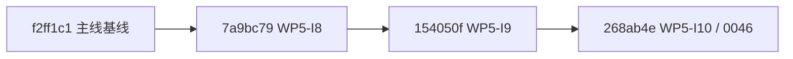
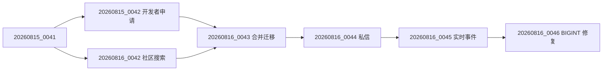

# WP5-I8 至 I10 主线集成实施计划

- 日期：2026-08-17
- 状态：远端 Git Data API 同步、Staging 部署与运行复验已完成；UAT/Production 未批准
- 执行分支：`codex/wp5-mainline-integration`
- 基线：`codex/m5-entry-gates` @ `f2ff1c19d14e93d5e0626f37906a4552ac914c38`
- 目标：`codex/wp5-i10-direct-message-realtime` @ `268ab4e9bdc3062c671dba47ebab64f559b3859f`

## 1. 目标与边界

将已完成并已分别验证的 WP5-I8（社区搜索）、WP5-I9（异步私信）和 WP5-I10（私信实时事件及搜索 Outbox 版本溢出修复）纳入当前主线。该工作只处理主线代码、文档和迁移基线的集成，不新增业务需求，也不将 Staging 验证表述为 UAT 或 Production 批准。

当前用户主工作区存在未提交的 `AGENTS.md`、`shadcn-ui.md` 与 `易语言桌面ui.e`；这些文件不属于本轮范围，必须保持原状。

## 2. 审计结论与采用方案

提交图为严格线性链：

因此采用 **快进集成**：在隔离工作树执行 `git merge --ff-only codex/wp5-i10-direct-message-realtime`。禁止挑拣提交、三路合并或改写历史。审计范围共 50 个既有提交、169 个文件变更；快进不会产生人工冲突。

## 3. 迁移策略

Alembic 迁移拓扑如下：

实施时必须从空 SQLite 数据库执行升级至 `20260816_0046`，并验证 Alembic 仅有一个 head。部署前必须备份目标数据库；部署后确认目标数据库 head 为 `20260816_0046`，并确认两张搜索表的 `document_version` 是 `BIGINT`。

## 4. 实施步骤

1. 在隔离工作树快进到 I10，并检查工作树干净、主工作区用户文件未被改动。
2. 复核锁文件、迁移图、API 契约和关键文档，补记本集成计划与文档变更记录。
3. 执行后端定向迁移/社区测试、完整 API 测试、SQLite 迁移往返测试；若环境缺少依赖，先按项目既有 `pnpm`/Python 环境恢复，再记录该前置问题，禁止伪造通过结果。
4. 在 `apps/web` 与 `apps/admin` 依次执行 `pnpm lint`、`pnpm typecheck`、`pnpm test`、`pnpm build`；执行既有统一门禁与关键 Playwright 旅程。
5. 仅暂存本轮集成文档，创建集成提交；将分支推送至 `origin`，复核远端 ref 与 Git tree。
6. 依照仓库既有 Staging 发布流程备份、迁移、滚动 API/Worker/Scheduler，并复验 HTTP、权限保护、SSE、搜索版本写入与运行拓扑。
7. 将本地、远端、Staging 及仍未完成的 UAT/Production 证据分别写入当前 Markdown 文档。

## 5. 验收标准

- 主线隔离工作树的 HEAD 包含 I10 的全部 50 个既有提交，且不存在额外的代码冲突解决提交。
- Alembic head 为 `20260816_0046`，`0043` 的双父迁移未丢失。
- 后端、Web、Admin 门禁和关键浏览器旅程均有本轮可复现输出；无法执行的项必须标明原因和环境边界。
- 推送远端后，远端提交/树与本地集成提交一致；Staging 部署具有备份、迁移和健康检查证据。
- 不把 Staging 结果提升为 UAT 或 Production 批准。

## 6. 2026-08-17 本地集成证据

- 前端统一门禁已通过：`pnpm lint`、`pnpm typecheck`、`pnpm test`（Web 78 项、Admin 87 项）及 `pnpm build`。构建仅输出既有的大型 JavaScript chunk 提示，未产生失败。
- 后端已通过 `ruff check src tests`、`pip check`、聚焦 I8/I9/I10 的 49 项测试，以及完整 API 测试 `300 passed, 1 skipped`；覆盖率为 `88.27%`，高于项目 80% 门槛。
- Alembic 只有 `20260816_0046 (head)`；独立 SQLite 数据库已完成 `upgrade head -> downgrade base -> upgrade head`，确认双父 `0043` 合并迁移及 `0044` 至 `0046` 链路可用。
- 关键浏览器矩阵使用 Chromium、Firefox、WebKit，每种引擎运行社区搜索、私信全旅程、私信实时事件和管理员搜索健康页四项用例，共 `12 passed`。本地无 Redis 时私信事件按设计降级为数据库轮询。
- 调试中发现 WebKit 的完整私信旅程实测 33.7 秒，超过 Playwright 默认 30 秒而导致非业务性超时；已将该用例的局部超时设为 45 秒，并以完整三引擎矩阵复验通过。该调整不改变运行时代码或产品行为。
- `scripts/check.ps1 -SkipInstall` 未作为通过项：该脚本固定使用工作树 `.venv/Scripts/python.exe`，而本机 Python 3.14 创建的是 MSYS `bin` 布局且原生依赖无法加载。以上子门禁均以项目根目录 Python 3.12 依赖环境运行，但通过 `PYTHONPATH` 强制加载本隔离工作树源码，避免误测用户主工作区。
## 7. 2026-08-17 远端与 Staging 状态

- 远端交付采用 GitHub Git Data API。空内容发布锚点的本地提交为 `26092ca577e844bd383401e66a5ad1243322f339`；API 创建的远端提交为 `9724f1e05eec0177191d089a688290bfa85a400f`，其 Git Tree `be8c69c6b3be88748e2ff892c21c785bd0ab0e8f` 与本地完全等价（`changed_paths=0`、`equivalent_tree=true`），引用为 `origin/codex/wp5-mainline-integration`。该操作为非强制快进更新。
- 已使用 Staging 的既有 Compose 文件集合发布源码归档（SHA-256：`6ea2f01c3b68cf64e4b2fa26af2903327d21ed494918c65ae11e7547a2a697ed`）。服务器激活目录记录的发布修订为 `9724f1e05eec`、源码 Tree 为 `be8c69c6b3be88748e2ff892c21c785bd0ab0e8f`；本地源提交为 `26092ca577e844bd383401e66a5ad1243322f339`。
- 发布前已分别保存两份目录备份；最终激活前的备份为 `/opt/password-detective-backups/20260817T025946Z-9724f1e05eec-retry/password-detective-staging.tar.gz`，同次目录回滚点为 `/opt/password-detective-staging-rollback-9724f1e05eec-retry-20260817T025946Z`。运行数据仍位于既有 Docker 卷，未被源码目录切换删除。
- 首次尝试发现 API HA 覆盖最终由服务器 `.env` 的 `STAGING_API_IMAGE` 决定，单改 override 不能改变有效 API 标签；已在不触碰存量容器的情况下完成正确标签的预构建，再以 `--scale api=2 --scale worker=3` 激活。最终运行的 API、Worker、Scheduler、Web、Admin 均使用 `9724f1e05eec` 标签；API 为 2 个实例、Worker 为 3 个实例。
- Staging MySQL 复核为 `20260816_0046 (head)`，`community_search_documents.document_version` 与 `community_search_outbox.document_version` 均为 `bigint NOT NULL`。新启动 API、Worker 与 Scheduler 的 12 分钟日志窗口内未检出 `traceback`、`unhandled`、`fatal` 或 `alembic-upgrade-failed`。
- 运行探针通过：API 就绪、Web、Web 反向代理 API、Admin 内部主页及两个公网前端入口均返回 200；未认证的私信 SSE 与管理员搜索健康接口均返回 401。该轮只证明未认证保护与服务可达性；未使用真实账号执行 Staging 认证态的私信发送/接收、SSE 事件传播或搜索写入业务旅程。
- 本轮结果为本地门禁、远端等价树同步和 Staging 运维/可达性证据；UAT 与 Production 均未批准，不能据此宣称用户验收完成。
