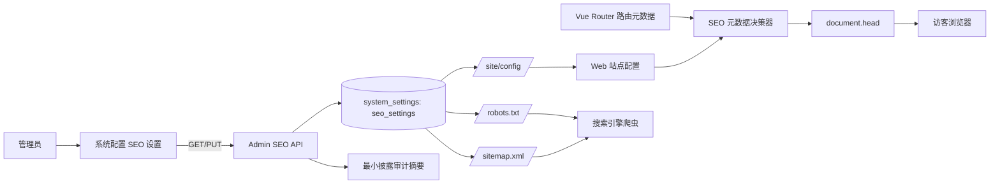

# SEO 设置功能实施计划

> **For agentic workers:** REQUIRED SUB-SKILL: Use `superpowers:executing-plans` or `superpowers:subagent-driven-development` to implement this plan task-by-task after the plan is approved. This approved document is the implementation baseline; code delivery is tracked task-by-task with separate verification evidence.

**目标：** 参考本地 WordPress Zibll 主题的后台 SEO 设置，为密码侦探社增加可直接保存的全站 SEO 配置、页面索引规则、`robots.txt` 与 `sitemap.xml` 能力，并保证 Vue 单页应用不会把登录、账户、管理和私密内容暴露给搜索引擎。

**架构：** SEO 配置作为系统配置下独立的 `SEO 设置` 分区，使用专用的 `GET/PUT /api/v1/admin/settings/seo` 直接读写当前配置，不引入发布门禁、版本历史、差异预览或回滚快照。公开站点通过 `/api/v1/site/config` 获得已清洗的 SEO 公共配置，Web 端负责运行时元标签，API/反向代理负责根路径 `robots.txt` 与 `sitemap.xml`；动态文章和分类的独立 SEO 字段、百度推送列入第二阶段。

**技术栈：** FastAPI、Pydantic、SQLAlchemy、Vue 3 Composition API、Vue Router、TypeScript、Shadcn-Vue、Tailwind CSS、Vitest、pytest、Playwright。

---

## 1. 规划状态与范围

- 规划日期：2026-08-18。
- 规划状态：用户已确认首阶段范围；2026-08-18 起按任务顺序实施。
- 参考主题：`E:/只比主题/zibll`，只参考设置结构和交互模式，不复制主题源码。
- 项目基线：`E:/只比主题/minimax/密码侦探社` 的 SMTP 邮件投递工作台与系统配置直接保存基线。
- 规划轮交付：本 Markdown 规划文档与《文档变更记录》；实现轮按 Task 1～Task 6 分批开发、测试、SSH 推送并部署到 Staging。

### 1.1 首阶段包含

1. 全站 SEO 设置：SEO 开关、首页标题、全站关键词、全站描述、标题连接符、默认 SEO/社交图片、Open Graph 开关。
2. 页面索引规则：公开页面白名单、登录/账户/管理/私密页面 `noindex`、全局索引开关、搜索页与带筛选参数页面不收录。
3. 页面元数据：`title`、`description`、`keywords`、`canonical`、Open Graph 基础标签、`robots`。
4. 根路径搜索引擎文件：动态生成 `robots.txt` 与 `sitemap.xml`，不把后台路径、私密路径、搜索结果和需要认证的地址写入站点地图。
5. 系统配置工作台：新增独立 `SEO 设置` 区域、保存按钮、重置当前编辑按钮、校验提示和本地 SEO 搜索结果预览。
6. 直接保存语义：保存后立即更新当前配置；重置只恢复最近一次加载或保存的编辑基线，不读取或生成服务端快照。

### 1.2 首阶段明确不包含

- 文章、社区帖子、分类、标签、用户资料的独立 SEO 标题/关键词/描述字段。
- 百度普通收录、百度快速收录、百度 Token 或其他搜索引擎推送凭据。
- SEO 配置发布门禁、版本历史、差异预览、回滚快照和不可变版本流程。
- 通过自由文本让管理员编辑完整 `robots.txt`；避免一条错误规则导致全站误收录或全站屏蔽。
- 以“客户端执行 JavaScript”作为动态内容服务器端 SEO 的完整替代。动态内容的 SSR/预渲染列入第二阶段。

---

## 2. Zibll 参考结论

已检查以下本地文件：

- `E:/只比主题/zibll/inc/options/admin-options.php`
- `E:/只比主题/zibll/inc/options/metabox-options.php`
- `E:/只比主题/zibll/inc/functions/admin/admin-main.php`
- `E:/只比主题/zibll/inc/functions/zib-head.php`
- `E:/只比主题/zibll/inc/functions/zib-header.php`

### 2.1 可借鉴的后台设置结构

| Zibll 能力 | 参考行为 | 项目适配方案 |
| --- | --- | --- |
| 核心 SEO 优化 | 可开关主题自动输出标题、关键词和描述 | 改为 `seo.enabled`，关闭后保留安全的默认标题，不输出管理员自定义关键词/描述 |
| SEO 连接符 | 用连接符拼接页面标题和站点名 | `title_separator` 使用有限枚举 `-`、`_`、`|`、`·`，不接受任意 HTML |
| 网站 SEO | 配置首页 SEO 标题、关键词和描述 | 首阶段加入系统配置工作台，关键词在 UI 使用逗号输入，API 内部规范化为字符串数组 |
| 百度 SEO | 全站链接自动提交、普通/快速收录和 Token | 首阶段明确排除，第二阶段另立外部凭据安全设计 |
| 搜索引擎图片展示 | 页面图片优先，缺省使用默认图像 | 首阶段支持公开页面 `og:image` 与默认图片；内容封面优先列入第二阶段 |
| 文章独立 SEO | 文章编辑页提供标题、关键词、描述和 SEO 预览 | 首阶段只保留全站 SEO 预览；内容级字段列入第二阶段 |
| 分类/标签独立 SEO | 分类与标签编辑页提供独立 SEO 字段 | 首阶段不增加社区分类/标签数据模型字段 |
| canonical 与 robots | 主题头部输出规范链接，特殊页面禁止抓取 | 项目使用路由元数据白名单和公开配置共同决定 canonical/robots |

### 2.2 不能直接照搬的部分

1. Zibll 是 PHP 服务端渲染主题，可以在首个 HTML 响应中直接输出页面 SEO；当前项目 Web 是 Vue 3 SPA，客户端 `document.head` 更新只解决运行后元标签，不能等同于完整 SSR SEO。
2. Zibll 的百度 Token 属于外部秘密；项目的配置和审计约束禁止令牌出现在公开响应、日志、普通审计详情或前端初始状态中，因此首阶段不接入。
3. Zibll 提供的外链重定向、去除 `category` 路径、图片自动添加 `alt` 等是 WordPress 内容链路能力，当前项目没有对应的同构内容模型，不在本轮伪造实现。

---

## 3. 当前项目基线与缺口

### 3.1 已有能力

- `apps/admin/src/pages/SystemSettingsPage.vue` 已有站点品牌、运行参数和 SMTP 邮件投递区域。
- `apps/admin/src/services/settings.ts` 已有系统配置直接保存、SMTP 保存和重置相关服务调用。
- `apps/api/src/password_detective/modules/admin/setting_schemas.py` 已有 `OperationalSettingsSnapshot`、站点名称、Logo、站点导航的校验模型。
- `apps/api/src/password_detective/modules/site/router.py`、`service.py`、`schemas.py` 已有公开站点配置接口 `/api/v1/site/config`。
- `apps/web/src/App.vue` 当前只根据站点名称设置 `document.title`。
- `apps/web/src/router/index.ts` 已声明公开、访客、认证和私密路由，但尚未声明 SEO 可索引属性。
- `apps/web/index.html` 只有静态 viewport 与基础 description，不能随后台设置动态更新。

### 3.2 缺口

- 没有独立 SEO 设置契约和数据库当前配置键。
- 没有首页标题/关键词/描述/连接符/默认图片的统一 fallback 规则。
- 没有 `canonical`、Open Graph、robots 的路由级决策器。
- 没有根路径 `robots.txt` 和 `sitemap.xml` 的动态响应。
- 管理端没有 SEO 设置分区、保存/重置按钮和 SEO 预览。
- 没有针对 Vue SPA SEO 限制的服务器端响应验收标准。

---

## 4. 目标用户旅程

### 4.1 管理员配置旅程

1. 管理员登录后台，进入“后台设置导航 → 系统配置 → SEO 设置”。
2. 页面加载当前 SEO 配置并复制为编辑基线。
3. 管理员填写首页标题、关键词、描述，选择标题连接符，上传或填写默认 SEO 图片地址，开启/关闭索引和 Open Graph。
4. 页面同时展示模拟搜索结果预览，预览仅根据当前编辑值生成，不写入服务端。
5. 点击“保存 SEO 设置”，前端生成 `Idempotency-Key`，调用专用 PUT 接口；成功后更新编辑基线并提示“已直接保存并立即生效”。
6. 修改未保存时点击“重置 SEO 编辑”，仅恢复最近一次加载或保存的值；不得请求历史版本、不得显示回滚入口。
7. 管理员可用浏览器访问根路径 `robots.txt` 与 `sitemap.xml` 检查公开规则；后台页面不得出现在站点地图中。

### 4.2 公开访客旅程

1. 访客打开首页或公开社区路由。
2. Web 应用从 `/site/config` 获得已清洗的公共 SEO 配置，并按路由元数据计算页面标题、描述、canonical 和 Open Graph。
3. 访客打开登录、账户、消息、书签、通知、发帖、授权等路径时，页面元数据明确为 `noindex, nofollow`。
4. 搜索引擎请求 `/robots.txt` 时，若全局索引关闭，返回禁止抓取的安全规则；若开启，只放行公开白名单并指向站点地图。
5. 搜索引擎请求 `/sitemap.xml` 时，只返回公开且无需认证的固定路由与已验证为公开的内容地址；不返回查询参数、哈希片段、会话地址或私密资源。

---

## 5. 目标配置与数据模型

### 5.1 SEO 配置对象

建议在现有 `system_settings` 的通用键值存储中新增 `seo_settings` 当前配置键，不新增不可变版本表，也不破坏已有历史表。后端使用独立的 Pydantic 模型和专用服务，避免继续扩大 SMTP 或运行参数模型的职责。

```python
class SeoSettings(BaseModel):
    enabled: bool = True
    indexing_enabled: bool = False
    home_title: str = Field(default="", max_length=120)
    keywords: list[str] = Field(default_factory=list, max_length=8)
    description: str = Field(default="", max_length=320)
    title_separator: Literal["-", "_", "|", "·"] = "-"
    default_image_url: str = Field(default="", max_length=500)
    open_graph_enabled: bool = True
    sitemap_enabled: bool = True
```

约束：

- `home_title`、`description` 去除首尾空白；禁止换行控制字符和 HTML 标签。
- `keywords` 由逗号分隔输入解析，去空白、去重、保持输入顺序，最多 8 个，每项最多 32 个字符。
- `default_image_url` 只允许站内绝对路径或 `http://`/`https://` 地址，拒绝 `javascript:`、`data:`、协议相对地址和带 HTML 的字符串。
- `indexing_enabled=false` 时，`robots.txt` 必须采用不允许公共抓取的安全规则，`sitemap.xml` 可返回空站点地图或明确的无索引响应，不能继续宣称可收录。
- `sitemap_enabled=false` 时，`robots.txt` 不得输出 `Sitemap:` 指令；接口仍返回合法 XML，内容为空或仅包含 XML 根节点。
- 默认图片只允许公开 URL，禁止上传 SVG；如果沿用 Logo 上传能力，仅允许 PNG、JPEG、WebP。
- 任何 API 响应、日志和审计摘要不包含编辑器内部状态、管理令牌或外部搜索引擎凭据。

### 5.2 标题与描述 fallback

| 页面类别 | title 规则 | description 规则 | robots |
| --- | --- | --- | --- |
| 首页 `/` | `home_title`，为空则 `site_name` | `seo.description`，为空则固定公开站点简介 | 由全局索引开关决定 |
| 公开列表页 | 页面固定名称 + 连接符 + `site_name` | 页面固定公开简介 | 由路由白名单和全局开关决定 |
| 公开哈希详情页 | 当前公开摘要标题 + 连接符 + `site_name` | 仅使用已公开的摘要字段 | 仅在资源无需认证且状态允许公开时可索引 |
| 公开社区帖子/群组/用户页 | 首阶段使用页面类型标题，不生成内容级 SEO 字段 | 使用固定页面简介，不读取私密正文 | 首阶段允许公开路由元标签，但不加入未验证的动态地址 sitemap |
| 搜索、登录、注册、重置密码、验证邮箱 | 页面名称 + 连接符 + `site_name` | 固定访客提示 | `noindex, nofollow` |
| 账户、消息、书签、通知、发帖、授权、后台 | 页面名称 + 连接符 + `site_name` | 不输出私密内容摘要 | `noindex, nofollow` |

### 5.3 存储与生效语义

- 保存接口使用现有 `system_settings` 当前配置写入路径，键名固定为 `seo_settings`。
- 保存与审计摘要在同一数据库事务内完成；审计只记录“SEO 设置已更新”、操作者、请求 ID、配置字段分类和更新时间，不记录完整关键词/描述正文。
- 读取失败时使用代码内安全默认值，不能把异常栈或数据库原始 JSON 返回给浏览器。
- 站点公开配置和 robots/sitemap 使用短 TTL 缓存；成功保存后由服务层清除 SEO 公共配置缓存，下一次请求读取新值。
- 不提供服务端历史快照恢复。配置错误时由管理员再次编辑并直接保存正确值；编辑器内“重置”只恢复当前加载基线。

---

## 6. API 与公开文件设计

### 6.1 管理 API

| 方法 | 路径 | 用途 | 权限与约束 |
| --- | --- | --- | --- |
| `GET` | `/api/v1/admin/settings/seo` | 获取当前 SEO 配置 | 管理员；不返回任何外部推送凭据 |
| `PUT` | `/api/v1/admin/settings/seo` | 直接保存当前 SEO 配置 | 管理员；必须带 `Idempotency-Key`；校验失败返回字段级错误 |
| `GET` | `/api/v1/site/config` | 返回站点名称、Logo、导航和已清洗公共 SEO 配置 | 公开；不得包含管理审计或内部存储键名 |
| `GET` | `/robots.txt` | 输出 robots 规则 | 公开；`text/plain; charset=utf-8` |
| `GET` | `/sitemap.xml` | 输出站点地图 | 公开；`application/xml; charset=utf-8` |

推荐响应形状：

```json
{
  "settings": {
    "enabled": true,
    "indexing_enabled": false,
    "home_title": "合成侦探站｜公开密码证据协作",
    "keywords": ["压缩包密码", "文件指纹", "证据协作"],
    "description": "面向公开内容的密码证据协作平台。",
    "title_separator": "|",
    "default_image_url": "/api/v1/site/assets/logo/seo-default.webp",
    "open_graph_enabled": true,
    "sitemap_enabled": true
  },
  "updated_at": "2026-08-18T09:00:00Z",
  "updated_by": "admin-synthetic"
}
```

示例只使用合成数据，实际响应不得写入真实账号、Token 或密钥。

### 6.2 robots 规则

- 全局 SEO 关闭或索引关闭：

```text
User-agent: *
Disallow: /
```

- 全局索引开启：使用公开路由白名单策略。由于标准 `robots.txt` 主要表达路径限制，精细的 `noindex` 仍必须通过 HTML `meta[name="robots"]` 或 HTTP `X-Robots-Tag` 发送。
- 不把登录、账户、管理、消息、搜索、OAuth、带会话参数的地址写入允许列表。
- `Sitemap:` 使用部署配置的公开站点 Origin 拼接 `/sitemap.xml`，不从浏览器可控的 Host 头盲信生成。

### 6.3 sitemap 规则

首阶段只生成已登记的公开路由模板和经过公开性校验的固定地址：

- 允许：`/`、`/hash/...` 的公开详情、`/community`、公开群组/帖子/用户详情的稳定地址。
- 禁止：`/login`、`/register`、`/forgot-password`、`/reset-password`、`/verify-email`、`/community/search`、`/community/new`、`/community/bookmarks`、`/community/notifications`、`/community/messages`、`/community/settings`、账户、开发者授权和后台地址。
- 去除查询字符串与哈希片段；URL 统一使用配置的公开 Origin；XML 进行实体转义。
- 对需要数据库分页才能发现的动态帖子/群组/用户地址，首阶段不直接全量加入 sitemap；第二阶段完成公开内容查询、状态过滤、更新时间和分页后再纳入。
- `indexing_enabled=false` 或 `sitemap_enabled=false` 时，返回合法 XML，但不输出可收录 URL。

---

## 7. 前端交互与页面元数据设计

### 7.1 Admin 系统配置工作台

修改目标：

- `apps/admin/src/pages/SystemSettingsPage.vue`
  - 新增全宽区域 `section#seo-settings`，与站点品牌、运行参数、SMTP 邮件投递并列。
  - 输入项：SEO 开关、首页 SEO 标题、关键词、描述、标题连接符、默认图片地址、Open Graph 开关、允许搜索引擎收录开关、站点地图开关。
  - 提供“保存 SEO 设置”和“重置 SEO 编辑”两个按钮；保存成功后重新建立本地基线，重置不请求服务端历史数据。
  - 提供索引开关的高风险提示：关闭时站点会向搜索引擎发送全局禁止抓取信号。
  - 提供 SEO 搜索结果预览卡片；它只是当前表单的派生视图，不是版本差异预览，不生成快照。
- `apps/admin/src/components/AdminSettingsNavigation.vue`
  - 增加 `SEO 设置` 二级入口，使用 `#seo-settings` 哈希定位；沿用固定顶栏偏移和移动端抽屉导航。
- `apps/admin/src/services/settings.ts`
  - 增加 `getSeoSettings`、`saveSeoSettings`，使用专用类型和幂等键。
- `packages/api-contract/src/index.ts`
  - 增加 `SeoSettings`、`SeoSettingsResponse`、`PublicSeoConfig` 类型，不复用 SMTP 或用户等级类型。

UI 规范：

- 使用现有 Shadcn-Vue `Input`、`Textarea`、`Select`、`Switch`、`Button`、`Label` 组件，禁止新建原生按钮/输入框替代组件。
- 仅使用 Tailwind 工具类，不新增 `.vue` `<style>` 块或行内样式。
- 文本输入、开关、预览和错误信息均有可访问标签；移动端单列布局，宽屏使用有限的两列表单，不恢复被用户移除的双栏治理卡片。
- 关键词输入支持逗号分隔，并在保存前显示规范化后的关键词数量。

### 7.2 Web 元数据决策器

建议新增：

- `apps/web/src/lib/seo.ts`：纯函数，根据 `PublicSeoConfig`、路由信息和公开页面摘要生成 `SeoMeta`。
- `apps/web/src/lib/seo.test.ts`：覆盖标题、description、canonical、robots、Open Graph、私密路由和查询参数剥离。
- `apps/web/src/services/site.ts`：扩展 `getPublicSiteConfig` 返回公共 SEO 配置。
- `apps/web/src/App.vue`：在站点配置加载后和路由变化时调用元数据应用函数；保留无配置时的安全默认标题。
- `apps/web/src/router/index.ts`：为每个路由增加明确的 `meta.seoIndexable`、`meta.seoKind` 和 `meta.requiresAuth`；私密路由不允许通过默认值意外变成可索引。
- `apps/web/index.html`：保留静态安全默认 description，并增加不依赖 API 的基础 charset、主题和默认 Open Graph 标签；不能把后台动态描述硬编码为唯一来源。

元数据应用规则：

1. 每次路由变化先移除由项目生成的旧 `meta[data-password-detective-seo]` 标签，再按当前页面生成新标签，避免重复 description/canonical。
2. canonical 使用公开 Origin + 当前路由路径，移除查询参数和哈希；搜索页、认证页和私密页不输出可收录 canonical。
3. `seo.enabled=false` 时使用站点名作为标题，输出 `noindex, nofollow`，不输出管理员自定义关键词与 Open Graph 内容。
4. `indexing_enabled=false` 时所有页面输出 `noindex, nofollow`；认证和私密页面即使全局开启也保持 `noindex, nofollow`。
5. 不把用户私信、账户信息、受限社区内容、SMTP 配置或管理数据拼入任何公开元标签。

### 7.3 Vue SPA 的 SEO 边界

- 首阶段验收必须区分两类证据：
  - 浏览器运行后：`document.head` 中元标签正确、路由切换不重复、页面无控制台错误。
  - 原始 HTTP 响应：根路径 `robots.txt`/`sitemap.xml` 正确；`index.html` 只承诺静态默认元数据。
- 动态帖子、群组、用户详情的“首个 HTML 响应即含准确内容标题/摘要”需要 SSR、预渲染或边缘 HTML 注入；首阶段不宣称已经达到 Zibll/PHP 服务端渲染的同等抓取效果。
- 第二阶段必须先选定 SSR/预渲染架构，再将内容级 SEO 字段和动态 sitemap 纳入实施计划。

---

## 8. 实施任务分解

### Task 1：锁定规格与契约边界

**文件：**

- 修改：`项目文档/密码侦探社项目规格说明书-v3.0.md`
- 修改：`项目文档/文档变更记录.md`

- [ ] 将本计划中已确认的首阶段 SEO 需求写入当前 v3.0 规格的系统配置、公开站点和验收章节。
- [ ] 明确“直接保存、无发布/版本/差异/回滚”与 SEO 设置一致。
- [ ] 增加 Vue SPA 动态元标签与 SSR 边界说明，避免将客户端更新误报为服务器端 SEO 完成。
- [ ] 在变更记录中记录规格、API、数据模型和验收标准的同步位置。

### Task 2：后端 SEO 配置模型与当前配置服务

**文件：**

- 新增或修改：`apps/api/src/password_detective/modules/admin/seo_schemas.py`
- 修改：`apps/api/src/password_detective/modules/admin/settings.py`
- 修改：`apps/api/src/password_detective/modules/admin/router.py`
- 修改：`apps/api/src/password_detective/modules/site/schemas.py`
- 修改：`apps/api/src/password_detective/modules/site/service.py`
- 修改：`apps/api/src/password_detective/modules/site/router.py`
- 新增：`apps/api/tests/test_admin_seo_settings.py`
- 新增：`apps/api/tests/test_public_seo.py`

- [ ] 定义 `SeoSettings`、管理响应和公共响应模型，落实关键词、URL、标题和描述校验。
- [ ] 以 `seo_settings` 为固定当前配置键实现读写；保存使用已有管理员权限、幂等键、审计和事务约束。
- [ ] 将数据库缺省、旧配置缺省和异常配置统一归一到安全默认值。
- [ ] 扩展 `/site/config` 只返回已清洗的 `PublicSeoConfig`，不得暴露数据库键、操作者或审计字段。
- [ ] 编写测试证明重复幂等请求不会重复写入、非法 URL/控制字符/超长字段被拒绝、关闭索引时公共配置仍不泄露私密信息。

### Task 3：robots.txt 与 sitemap.xml

**文件：**

- 新增或修改：`apps/api/src/password_detective/modules/site/seo.py`
- 修改：`apps/api/src/password_detective/modules/site/router.py`
- 修改：部署反向代理路由配置（以当前 Staging 使用的 Nginx/Compose 文件为准）
- 新增：`apps/api/tests/test_site_seo_files.py`

- [ ] 实现公开路由注册表，所有可收录路由必须显式标记 `seoIndexable=true`，不使用“未标记即公开”。
- [ ] 实现 `robots.txt` 响应，分别覆盖索引关闭、站点地图关闭和正常公开索引三种状态。
- [ ] 实现合法 XML `sitemap.xml` 响应，进行 URL 规范化、查询/哈希移除、实体转义和公开状态过滤。
- [ ] 在反向代理中将网站根路径映射到 API/应用对应端点，保证搜索引擎不需要知道内部 `/api/v1` 前缀。
- [ ] 测试不得出现 `/admin`、`/login`、`/community/messages`、搜索查询参数、会话参数或任何需认证 URL。

### Task 4：API 共享类型与 Admin SEO 工作台

**文件：**

- 修改：`packages/api-contract/src/index.ts`
- 修改：`apps/admin/src/services/settings.ts`
- 修改：`apps/admin/src/pages/SystemSettingsPage.vue`
- 修改：`apps/admin/src/components/AdminSettingsNavigation.vue`
- 新增：`apps/admin/src/pages/SystemSettingsSeo.test.ts`

- [ ] 增加管理端和公共端 SEO 类型，保持 snake_case API 字段与 TypeScript 类型一致。
- [ ] 新增 SEO 表单的加载、保存、重置、错误和成功提示状态；保存时生成幂等键，成功后更新基线。
- [ ] 实现关键词逗号输入和本地预览，不把预览状态发送为额外版本对象。
- [ ] 为 `#seo-settings` 增加桌面固定导航和移动抽屉入口，验证固定顶栏偏移不少于 104px。
- [ ] 测试证明刷新后配置值保持、重置恢复最后基线、页面不存在发布/回滚/版本历史/差异预览控件。

### Task 5：Web 元数据运行时

**文件：**

- 新增：`apps/web/src/lib/seo.ts`
- 新增：`apps/web/src/lib/seo.test.ts`
- 修改：`apps/web/src/services/site.ts`
- 修改：`apps/web/src/App.vue`
- 修改：`apps/web/src/router/index.ts`
- 修改：`apps/web/index.html`

- [ ] 建立路由元数据白名单，显式标注公开、访客和私密页面。
- [ ] 实现标题、描述、关键词、canonical、robots、Open Graph 生成和旧标签清理。
- [ ] 将查询参数、哈希片段、会话信息和私密数据排除出 canonical、sitemap 和元标签。
- [ ] 在 API 未响应时保持安全的默认标题与 `noindex` 策略，不能因为加载失败而把所有页面误标为可收录。
- [ ] 测试路由切换、重复标签、认证路由、索引关闭和默认配置回退。

### Task 6：质量门禁与真实浏览器验收

**文件：**

- 新增：`tests/e2e/admin-seo-settings.spec.ts`
- 新增：`tests/e2e/web-seo-journeys.spec.ts`
- 修改：`docs/testing/requirements-traceability.md`
- 修改：`项目文档/文档变更记录.md`

- [ ] 后端执行：`cd apps/api; python -m pytest tests/test_admin_seo_settings.py tests/test_public_seo.py tests/test_site_seo_files.py -q`。
- [ ] Admin 执行：`pnpm --filter @password-detective/admin test`、`pnpm --filter @password-detective/admin lint`、`pnpm --filter @password-detective/admin typecheck`。
- [ ] Web 执行：`pnpm --filter @password-detective/web test`、`pnpm --filter @password-detective/web lint`、`pnpm --filter @password-detective/web typecheck`。
- [ ] 统一执行：`pnpm typecheck`、`pnpm lint`、`pnpm test`，并记录跳过的外部依赖检查。
- [ ] Chromium 验收管理端保存/重置和 Web 端路由元标签；Firefox/WebKit 复跑关键元标签与无控制台错误旅程。
- [ ] 通过真实 HTTP 请求检查 `/robots.txt` 的 `Content-Type`、索引开关和 Sitemap 指令，以及 `/sitemap.xml` 的 XML 合法性和公开 URL 白名单。
- [ ] 完成 Staging 部署后记录实际部署修订、Web/API HTTP 状态、页面源代码与运行后 head 的差异；不把本地构建或静态归档作为 Staging 证据。

### Task 7：第二阶段内容级 SEO 预留

**文件：**

- 设计输入：`apps/api/src/password_detective/modules/community/`
- 设计输入：`apps/web/src/pages/CommunityPostPage.vue`
- 设计输入：`apps/web/src/pages/CommunityGroupPage.vue`
- 设计输入：`apps/web/src/pages/CommunityProfilePage.vue`
- 新增规划：`项目文档/实施计划/SEO内容级字段与SSR实施计划.md`

- [ ] 在确认公开内容状态、审核状态、权限和 SSR/预渲染方案后，新增文章/帖子/分类/标签/用户页独立 SEO 字段。
- [ ] 只允许内容所有者或授权管理员编辑 SEO 字段；私密、隔离、删除和未审核内容不得进入 sitemap。
- [ ] 另行设计搜索引擎推送凭据的密钥托管、最小权限、轮换、审计和撤销流程，再决定是否接入百度普通/快速收录。

---

## 9. 验收标准

### 9.1 配置与保存

- [ ] 管理员能在系统配置工作台找到独立 `SEO 设置` 区域，桌面和移动端入口一致。
- [ ] 首页标题、关键词、描述、连接符、默认图片、Open Graph、索引和 sitemap 开关可编辑并直接保存。
- [ ] 保存成功后刷新页面仍为新值；重置只恢复最近加载/保存值，不生成、查询或显示历史版本。
- [ ] 非管理员不能读写 SEO 管理接口；重复幂等请求不会产生重复审计或重复写入。
- [ ] 所有字段错误均显示可理解的中文提示，不能接受脚本协议、控制字符、超长内容或带 HTML 的标题/描述。

### 9.2 公开页面元数据

- [ ] 首页在运行后有且只有一个项目生成的 `title`、description、canonical 和对应 Open Graph 标签。
- [ ] 公开页面标题遵循配置连接符和站点名规则；没有配置时使用安全默认值。
- [ ] 登录、注册、重置密码、邮箱验证、账户、消息、书签、通知、发帖、授权、后台和搜索页面输出 `noindex, nofollow`。
- [ ] canonical 不含查询参数、哈希片段、会话标识或内部 API 前缀。
- [ ] API 加载失败时不会把认证或私密页面错误标为可索引。

### 9.3 robots 与 sitemap

- [ ] `GET /robots.txt` 返回正确的纯文本 Content-Type，并按全局索引开关输出安全规则。
- [ ] 索引开启且 sitemap 开启时，robots 包含站点地图地址；否则不包含站点地图指令。
- [ ] `GET /sitemap.xml` 返回合法 XML，只含显式公开白名单 URL，不含后台、认证、私密、搜索和查询参数地址。
- [ ] Staging 默认不会因部署环境差异意外开放搜索引擎收录；生产开启收录必须由管理员显式设置并在验收记录中证明。

### 9.4 交付与证据

- [ ] Markdown 文档、规格同步、测试结果、Git SSH 推送和 Staging 文档/运行时交付证据分层记录。
- [ ] 不以“代码已提交”“本地构建通过”替代浏览器、HTTP 和 Staging 真实环境证据。
- [ ] 本轮规划交付不宣称 SEO 功能已经实现、推送或部署；只有实现任务完成并通过验收后才可更新需求追踪为已实现。

---

## 10. 风险与处理策略

| 风险 | 影响 | 处理策略 |
| --- | --- | --- |
| SPA 运行后才更新 meta | 搜索引擎抓取不稳定 | 首阶段明确运行后元标签证据；动态内容 SSR/预渲染单列第二阶段 |
| 管理员关闭索引后忘记打开 | 站点长期不收录 | UI 显示强提示、robots 全局禁止、Staging 默认保持关闭并在发布验收中明确状态 |
| Host 头被伪造导致 sitemap 生成恶意域名 | 搜索引擎收到错误 canonical | 公开 Origin 使用部署配置，不直接信任请求 Host |
| 私密内容误入 sitemap/description | 隐私泄露 | 显式公开路由注册表、认证路由硬编码 noindex、动态内容首阶段不全量入 sitemap |
| SEO 配置与站点品牌保存不同步 | 页面标题与站点名短暂不一致 | 公共配置服务统一读取当前键值，保存成功清理相关缓存；必要时在响应中返回更新时间 |
| 百度 Token 被复制到前端 | 凭据泄露 | 首阶段不接入；第二阶段使用独立秘密托管和服务端推送队列 |
| 旧项目文档仍描述不可变配置流程 | 实施验收误判 | 实施前同步 v3.0 规格和变更记录，并在追踪表中删除冲突验收项或标记废止 |

---

## 11. 组件关系



---

## 12. 实施顺序与本轮结论

1. 用户评审并确认本规划文档。
2. 先同步 v3.0 规格与文档变更记录，消除旧版本治理流程描述冲突。
3. 按 Task 2 → Task 3 → Task 4 → Task 5 → Task 6 顺序实施，每个实现回合单独测试、提交、SSH 推送并部署到服务器。
4. 每轮交付报告分别说明本地、远端、Staging、浏览器和 HTTP 证据；不把规划文档提交当作功能完成。
5. 首阶段通过后，再单独评审内容级 SEO、SSR/预渲染和百度推送，不在本轮扩大范围。

**本轮结论：** SEO 功能已完成范围确认和实现拆解，但尚未修改业务代码、数据库、接口或前端行为；待本规划文档评审通过后进入实施计划执行阶段。
