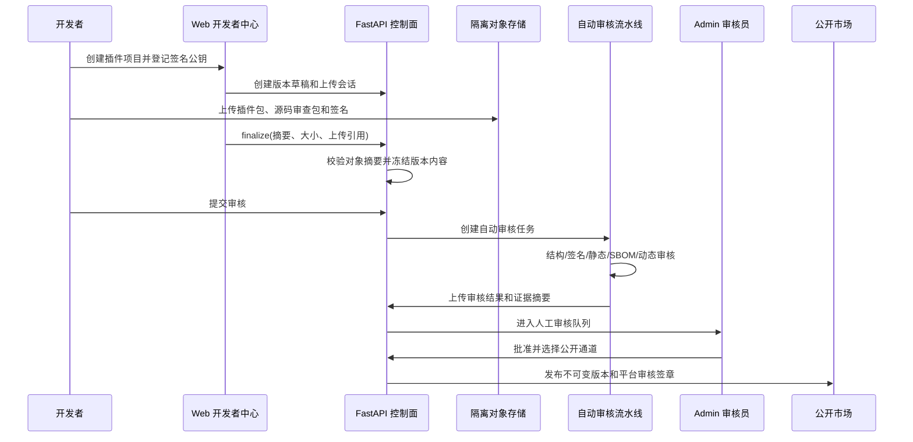
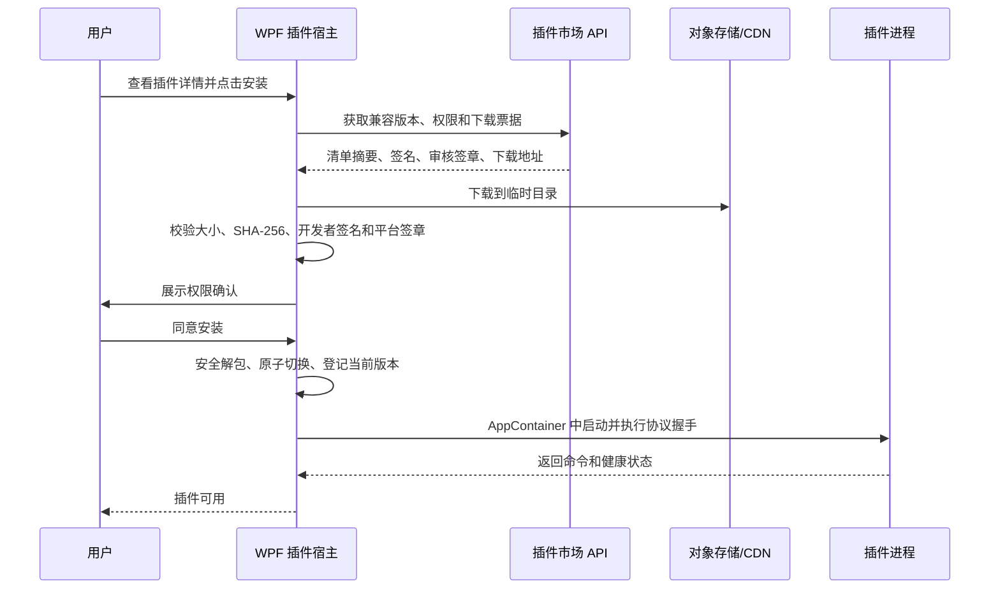
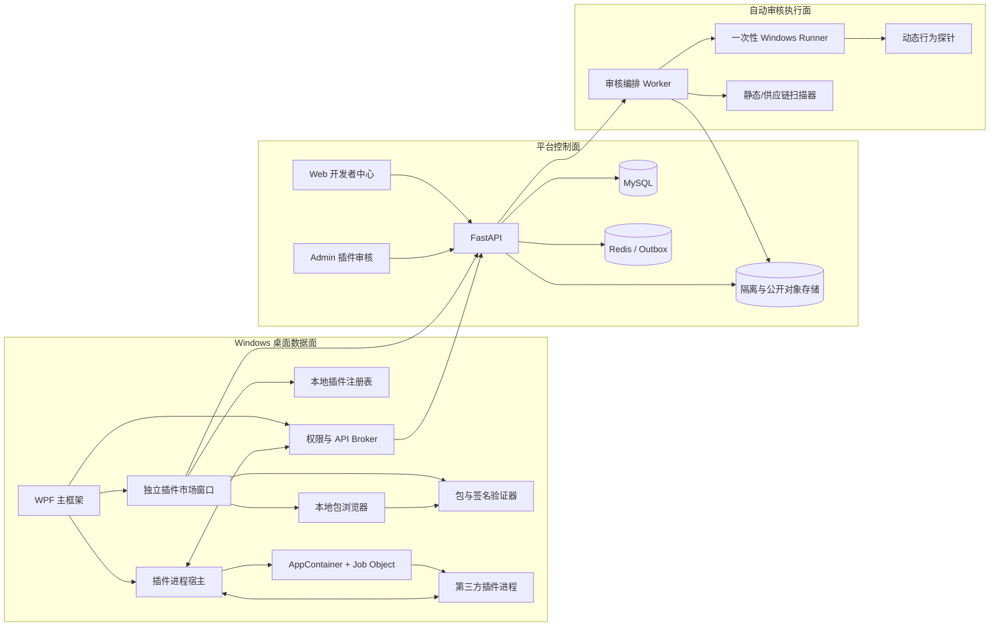
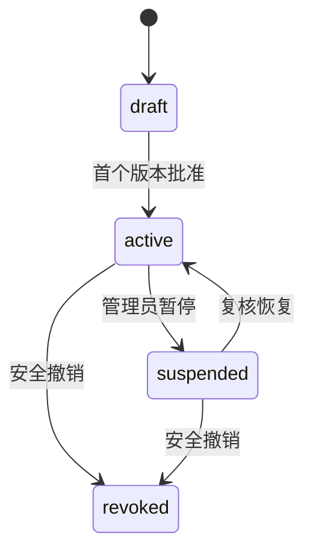
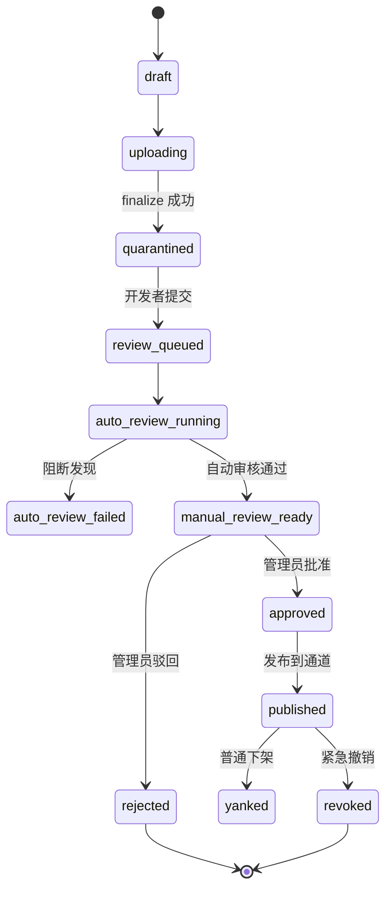

# 桌面端插件市场与自动化审核规划书

> **状态：** 已确认方向的实施规划稿，尚未声明功能已完成
> **规划日期：** 2026-08-24
> **适用项目：** 密码侦探社 Windows 桌面端、Web 开发者中心、Admin 管理端和 FastAPI 服务端
> **关联基线：** [项目规格说明书 v3.0](../密码侦探社项目规格说明书-v3.0.md)、[第三方桌面端 API v1 设计说明](../第三方桌面端API-v1设计说明-2026-08-15.md)、[第三方桌面端 API v1 开发者文档](../第三方桌面端API-v1开发者文档.md)

## 1. 规划结论

下一阶段以“官方桌面端主框架 + 语言无关插件协议 + 服务端插件市场 + Web/Admin 审核”为主要方向。

核心决策如下：

1. 官方 Windows 客户端继续采用 `.NET 10 + WPF`，作为插件发现、安装、权限确认、运行、更新和撤销的唯一可信宿主。
2. v1 插件必须在独立进程中运行，通过版本化 JSON-RPC 协议与宿主通信；不允许把第三方 DLL 直接加载到 WPF 主进程。
3. 开发语言不受限制，但发布到 v1 市场的 Windows 插件必须提供自包含可执行制品，不依赖用户预装 Python、Node.js、Java 或其他全局运行时。
4. 插件不能直接获得桌面端登录令牌。平台 API 调用由宿主权限代理完成，有效权限取“开发者申请、自动审核、管理员批准、用户授权和本机策略”的交集。
5. 每个插件版本必须上传不可变插件包、开发者签名、源码审查包或受限的二进制审查材料，并经过自动审核；v1 自动审核通过后仍需管理员人工批准，不能自动公开发布。
6. 自动动态审核必须在一次性 Windows 隔离执行器中运行，不得在生产 API、Celery Worker、Staging 业务容器或管理员电脑上执行待审核插件。
7. 插件市场 v1 只支持免费插件，不接入现金、积分购买、订阅分成、优惠券或推广佣金。
8. 现有第三方应用与 OAuth 模型继续作为平台 API 身份，不承担插件包版本审核职责；插件项目和插件版本使用独立数据模型。
9. 插件市场使用独立 WPF `PluginMarketplaceWindow`，不嵌入主窗口工作区；窗口同时提供在线市场、已安装和本地插件视图。本地 `.pdpkg` 可以浏览并加载，但来源固定为 `local_unreviewed`，全流程持续显示“未审核”。

## 2. 建设目标

### 2.1 产品目标

- 用户可在桌面端搜索、查看、安装、启用、停用、更新和卸载经过审核的插件。
- 用户可从独立插件市场窗口浏览本地 `.pdpkg` 并加载；本地插件在列表、详情、权限确认和运行状态中均明确标记为“未审核”。
- 第三方开发者可使用 C#、Rust、Go、C++、Python 打包工具或其他语言实现插件，只要最终制品遵循统一协议和打包规则。
- 开发者可在 Web 开发者中心创建插件项目、上传版本、查看自动审核结果、修复问题并重新提交。
- 管理员可在 Admin 插件审核工作台查看版本差异、权限变化、签名、SBOM、漏洞、静态扫描、动态行为和用户举报，并执行批准、驳回、下架和紧急撤销。
- 平台能够在插件发布前发现恶意文件、路径穿越、压缩炸弹、未声明网络访问、进程派生、持久化行为、敏感信息读取、依赖漏洞和资源滥用。
- 已安装插件被紧急撤销后，桌面端能在下一次启动或撤销列表刷新时阻止其运行。

### 2.2 工程目标

- 插件崩溃、死锁或内存暴涨不得导致 WPF 主进程退出。
- 插件协议、清单和市场 API 均可独立版本化，宿主升级不应无条件破坏旧插件。
- 插件安装必须原子化，失败后保留当前可用版本；升级后启动失败可回退到上一版本。
- 插件包、审核报告、发布记录和撤销记录均可追溯到固定 SHA-256、开发者签名和审核策略版本。
- 自动审核规则使用稳定规则编号，开发者看到的报告不得泄露平台检测密钥、恶意样本或生产基础设施信息。

## 3. 范围边界

### 3.1 v1 纳入范围

- Windows x64 与 arm64 插件包。
- 进程外插件运行时 `process`。
- 命令型插件、只读分析插件、本地文件处理插件和平台 API 权限代理。
- 宿主渲染的表单、进度、结构化结果和通知。
- 插件项目、版本、制品、签名密钥、审核运行、审核发现、发布、下架和撤销。
- Web 开发者提交中心、Admin 审核工作台和独立 WPF 桌面端插件市场窗口。
- 本地 `.pdpkg` 浏览、包检查、权限确认、隔离加载和 `local_unreviewed` 来源标记。
- 静态审核、依赖/SBOM 审核、恶意代码扫描和 Windows 动态行为审核。
- 已安装插件本地注册表、权限记录、运行日志、健康状态和版本回退。
- 用户举报、管理员暂停和平台紧急撤销。

### 3.2 v1 明确不纳入

- 在主进程中加载第三方 .NET Assembly、原生 DLL、COM、浏览器扩展或任意 WPF 控件。
- 允许插件注入未经宿主清洗的 HTML、JavaScript、XAML 或原生窗口句柄。
- 允许插件携带安装脚本、驱动程序、Windows 服务、计划任务或自更新器。
- macOS、Linux、移动端和浏览器插件市场。
- 插件收费、积分购买、订阅、退款、收入分成和税务结算。
- 插件之间直接调用、共享内存或共享秘密。
- 自动批准并公开发布插件；v1 保留管理员最终批准。
- 将待审核插件放入现有 Linux Celery Worker 直接执行。
- 允许公开插件批量导入口令库、执行在线明文反查、生成攻击字典或调用未授权破解服务。

### 3.3 后续候选范围

- WASI Preview 2 / WebAssembly Component Model 运行时。
- 低风险、长期稳定开发者的策略化自动发布。
- 插件评分、评论、收藏和推荐。
- 分批发布、灰度更新和组织私有插件源。
- 可复现构建证明和透明日志服务。

## 4. 现有基础与缺口

### 4.1 可直接复用的现有能力

| 现有能力 | 复用方式 |
|---|---|
| WPF 官方桌面端 | 扩展为插件宿主、市场客户端和权限代理 |
| 安装实例 ECDSA P-256 身份 | 用于宿主级下载限流、安装证明和安全事件关联，不暴露给插件 |
| 第三方应用申请与管理员审核 | 复用开发者身份、平台 API Scope 和人工审核经验 |
| OAuth 2.0 Authorization Code + PKCE | 插件需要平台 API 时，关联已审核第三方应用并由宿主代理授权 |
| 第三方 Principal 与 Scope 校验 | 扩展为插件 API Broker 的服务端授权边界 |
| 桌面公告与更新发布 | 复用版本比较、SHA-256、发布状态和不可变下载思想 |
| Admin 固定导航与审核工作台 | 新增“插件审核”和“审核策略/执行器”入口 |
| 审计日志、幂等、限流、Worker/Outbox | 用于插件提交、审核编排、发布、下架和撤销 |
| Docker 文件型秘密与安全门禁 | 用于控制面；Windows 动态执行器使用独立短期凭据 |

### 4.2 当前缺口

- 桌面端没有插件目录、协议、安装器、进程宿主、权限代理或安全模式。
- 服务端没有插件项目、版本、制品、签名、审核运行、审核发现和发布模型。
- 当前第三方应用审核只审查应用说明、回调地址和 Scope，不接收或执行代码包。
- 当前桌面更新接口只管理官方客户端版本，不能作为多插件、多架构、多版本市场使用。
- 现有 Celery Worker 运行于 Linux 容器，不能安全执行 Windows PE 插件。
- 当前制品存储以本地持久卷为主，插件市场需要隔离的待审区和公开不可变对象存储。
- 缺少开发者签名密钥管理、SBOM、漏洞扫描、恶意代码扫描和动态行为策略。

### 4.3 对已审查 WordPress 插件的取舍

`waifu-ranking-plugin` 和 `bounty-system` 可以参考分类、标签、虚拟道具、限时权益、用户组特权、背包、低库存和运营统计等产品表达，但不能直接作为桌面插件上架，也不能复制其 PHP/WordPress 执行模型。

- WordPress `$wpdb`、User Meta、AJAX nonce、主题积分函数和 WordPress Role 与 WPF 插件宿主不兼容。
- 两个插件均存在缺少统一订单状态机、幂等或跨步骤事务不完整的路径；桌面插件市场不能继承这些一致性风险。
- 明文卡密、调试日志中的兑换内容、插件内自更新和直接角色写入不进入 PDPP v1。
- 若未来把其中某项功能迁移为桌面插件，必须按 PDPP 重写、最小化权限、重新打包签名并逐版本完成自动和人工审核。

## 5. 角色与主流程

### 5.1 角色

| 角色 | 主要权限 |
|---|---|
| 普通桌面用户 | 在独立插件市场窗口浏览、安装、授权、运行、更新、停用、卸载和举报市场插件，或浏览并加载标记为“未审核”的本地插件 |
| 插件开发者 | 创建项目、登记签名密钥、上传版本、提交审核、查看报告和撤回未发布版本 |
| 插件审核员 | 查看审核队列和安全报告，批准、驳回、要求修改或下架版本 |
| 安全管理员 | 管理审核策略、执行器、签名密钥撤销和平台紧急撤销列表 |
| 自动审核执行器 | 使用短期任务凭据领取单个审核任务、上传证据摘要并销毁环境 |
| 桌面宿主 | 验证包、执行沙箱、代理权限、采集本地健康状态并执行撤销策略 |

### 5.2 开发者发布流程



### 5.3 用户安装流程



### 5.4 本地插件加载流程

1. 用户在独立 `PluginMarketplaceWindow` 的“本地插件”视图中选择 `.pdpkg` 文件。
2. 宿主先读取清单并完成包结构、路径、文件摘要和开发者签名检查，不在检查前启动插件进程。
3. 因本地包没有平台审核签章，注册来源固定为 `local_unreviewed`，并在插件列表、详情、权限确认、已安装状态和运行状态中持续显示“未审核”。
4. 用户确认权限后，宿主使用与市场插件相同的安全解包、目录隔离、AppContainer、Job Object、权限 Broker 和崩溃停用机制加载插件。
5. 本地来源不得伪装为市场审核版本；同一插件 ID 的来源变化必须由用户明确确认，宿主不得静默替换来源或移除“未审核”标记。

## 6. 总体架构



### 6.1 信任边界

1. WPF 主框架、包验证器和权限代理属于平台可信计算基。
2. 所有第三方插件、插件自带依赖和插件输出均视为不可信。
3. 插件市场元数据来自服务端，但桌面端仍必须验证平台签章和制品摘要。
4. 自动审核报告是决策输入，不等于运行时信任；运行时沙箱和最小权限始终启用。
5. 开发者上传区与公开下载区物理或逻辑隔离，未批准对象不能通过公开 CDN 获取。
6. Windows Runner 与生产网络、生产数据库、生产密钥和用户数据完全隔离。
7. 本地插件不具备平台审核签章，始终属于 `local_unreviewed`；包检查和运行时沙箱不能改变其未审核身份。

## 7. 桌面端主框架设计

### 7.1 新增组件

| 组件 | 职责 |
|---|---|
| `PluginMarketplaceWindow` | 独立 WPF 窗口，承载在线市场、已安装和本地插件三个视图，不嵌入主窗口工作区 |
| `PluginCatalogClient` | 查询市场、版本、撤销列表和下载票据 |
| `LocalPluginLoader` | 浏览本地 `.pdpkg`，完成加载前检查并登记 `local_unreviewed` 来源 |
| `PluginPackageVerifier` | 校验包结构、摘要、签名、平台签章、路径和文件类型 |
| `PluginInstaller` | 临时解包、权限确认、原子安装、升级回退和卸载 |
| `PluginRegistry` | 保存已安装版本、启用状态、用户权限、崩溃次数和回退版本 |
| `PluginProcessHost` | 创建隔离进程、协议握手、超时、取消和进程树回收 |
| `PluginPermissionBroker` | 执行文件、网络、平台 API、通知和本地存储权限 |
| `PluginCommandRouter` | 把插件命令暴露给宿主导航、命令面板和任务区 |
| `PluginHealthMonitor` | 记录启动失败、协议违规、资源超限和自动停用状态 |
| `PluginUpdateService` | 检查兼容版本、权限差异、更新和安全撤销 |
| `PluginSafeMode` | 桌面端异常退出后禁用第三方插件启动并允许逐个恢复 |

### 7.2 本地目录

```text
%LOCALAPPDATA%/PasswordDetective/
├─ plugins/
│  ├─ registry.json
│  ├─ packages/                 # 已验证的原始包缓存
│  ├─ installed/<plugin-id>/<version>/
│  ├─ data/<plugin-id>/         # 每插件独立持久数据
│  ├─ runs/<run-id>/            # 一次性运行目录
│  └─ rollback/<plugin-id>/     # 最近一个可回退版本
├─ plugin-logs/<plugin-id>/     # 限长、脱敏日志
└─ plugin-revocations.json      # 服务端签名撤销列表缓存
```

- 注册表写入使用临时文件、`Flush` 和原子替换。
- 插件 ID 必须经过规范化，不能直接拼接未经验证的路径。
- 解包拒绝绝对路径、`..`、符号链接、硬链接、重解析点、NTFS ADS 和大小写冲突文件。
- 插件数据目录不得与宿主会话、安装私钥、日志或其他插件目录重叠。

### 7.3 市场安装与升级

1. 下载到随机临时目录并限制响应大小和超时。
2. 校验市场返回的制品 SHA-256、文件大小、开发者签名和平台审核签章。
3. 安全解包并逐文件复核清单摘要。
4. 比较新旧权限；新增权限必须重新提示用户。
5. 在非活动版本目录执行 `initialize` 和 `health/check`。
6. 成功后原子更新当前版本指针，保留上一版本。
7. 新版本连续启动失败或协议违规达到阈值时自动停用并回退。
8. 插件不得自行下载、替换或执行新版本；更新只由宿主完成。

### 7.4 本地插件浏览与加载

1. “本地插件”是 `PluginMarketplaceWindow` 的固定视图，使用系统文件选择器浏览 `.pdpkg`，不要求开启隐藏的开发者模式。
2. 选中文件后只展示解析出的名称、版本、开发者、入口点和申请权限；完成校验与用户确认前不得执行入口程序。
3. 本地包执行包结构、路径、文件摘要、清单和开发者签名检查，但不要求平台审核签章；缺少平台审核签章即登记为 `local_unreviewed`。
4. “未审核”标识不可由插件清单、开发者签名或用户设置覆盖，必须显示在本地列表、插件详情、权限确认、已安装列表和运行状态中。
5. 本地插件继续受原子安装、权限 Broker、AppContainer、Job Object、资源限制、日志脱敏、崩溃停用和安全模式约束。
6. 本地插件不参与市场自动更新；如用户改装同一插件 ID 的市场审核版本，必须重新校验、确认权限和明确切换来源。

## 8. 语言无关插件协议

### 8.1 运行模型

- 协议名称：`Password Detective Plugin Protocol`，简称 `PDPP`。
- v1 传输：UTF-8、每行一个 JSON 对象的 JSON-RPC 2.0 over stdio。
- 插件启动参数只包含协议模式和清单路径，不包含令牌、密码或用户数据。
- 宿主通过标准输入发送请求，通过标准输出读取协议消息；标准错误仅作为限长诊断流。
- 单条 JSON 消息默认不超过 1 MiB；大文件使用宿主文件 Broker 的分块读取接口。
- 每次调用带唯一 `request_id`、超时、取消令牌和宿主生成的运行 ID。

### 8.2 生命周期方法

| 方法 | 方向 | 用途 |
|---|---|---|
| `initialize` | Host -> Plugin | 协议协商、宿主版本、语言区域和有效权限 |
| `plugin/describe` | Host -> Plugin | 返回命令、输入模式和结构化结果能力 |
| `command/execute` | Host -> Plugin | 执行用户明确触发的插件命令 |
| `command/cancel` | Host -> Plugin | 取消当前命令 |
| `host/file/read` | Plugin -> Host | 使用不透明 `file_ref` 分块读取已授权文件 |
| `host/api/request` | Plugin -> Host | 请求宿主代理允许的平台 API |
| `host/storage/get|set` | Plugin -> Host | 访问配额受限的插件私有存储 |
| `host/notify` | Plugin -> Host | 请求宿主显示受控通知 |
| `$/progress` | Plugin -> Host | 报告进度，不改变业务状态 |
| `health/check` | Host -> Plugin | 安装验证和运行健康探针 |
| `shutdown` | Host -> Plugin | 有序退出；超时后宿主终止进程树 |

### 8.3 宿主渲染 UI

v1 插件不能注入自定义 WPF 控件。插件在清单中声明命令及 JSON Schema 输入，宿主使用原生控件渲染：

- 文本、数字、布尔、枚举、文件选择和目录选择。
- 进度、表格、键值列表、纯文本、受限 Markdown 和文件导出结果。
- 命令图标使用宿主内置图标名，不接受插件 SVG/XAML。
- 外部链接必须由宿主校验并在系统浏览器中打开。
- 插件不能控制顶层窗口、模态框、剪贴板或通知，除非拥有对应权限。

### 8.4 文件访问

- 默认只向插件提供不透明 `file_ref`，不暴露用户原始路径。
- `host/file/read` 支持固定大小分块、顺序读取、随机偏移和总长度查询。
- 宿主在读取前再次确认该引用属于当前运行和当前插件。
- 插件不得获得未由用户选择的目录枚举能力。
- 导出文件由插件返回建议名称和内容流，最终路径由用户通过宿主保存对话框选择。
- 后续高性能版本可增加受限共享内存传输，但不得绕过相同权限检查。

## 9. 插件包规范

### 9.1 包格式

扩展名使用 `.pdpkg`，物理格式为受限 ZIP：

```text
plugin.pdpkg
├─ manifest.json
├─ signature.ed25519
├─ bin/
│  ├─ windows-x64/plugin.exe
│  └─ windows-arm64/plugin.exe
├─ schemas/
│  └─ inspect-input.schema.json
├─ assets/
│  └─ icon.png
├─ LICENSE.txt
└─ README.md
```

- 不允许安装脚本、`.msi`、驱动、服务注册文件或嵌套自解压包。
- 市场分发包不包含源码；源码审查包单独上传至隔离存储。
- 单包、文件数量、单文件和总展开大小均由服务端与桌面端双重限制。
- 所有路径和文件摘要进入开发者签名覆盖范围。

### 9.2 清单示例

```json
{
  "schema": "pd.plugin/v1",
  "plugin_id": "com.synthetic.archive-inspector",
  "version": "1.0.0",
  "display_name": "合成归档检查器",
  "description": "仅用于协议与审核示例的本地归档检查插件。",
  "publisher_key_id": "synthetic-key-v1",
  "protocol": { "min": 1, "max": 1 },
  "host": { "min_version": "0.2.0", "max_version": "0.x" },
  "runtime": {
    "kind": "process",
    "entrypoints": {
      "windows-x64": "bin/windows-x64/plugin.exe",
      "windows-arm64": "bin/windows-arm64/plugin.exe"
    }
  },
  "commands": [
    {
      "id": "inspect",
      "title": "检查归档元数据",
      "input_schema": "schemas/inspect-input.schema.json"
    }
  ],
  "capabilities": {
    "required": ["file:read:selected", "storage:private"],
    "optional": ["notification:show"]
  },
  "limits": {
    "memory_mb": 256,
    "cpu_percent": 25,
    "command_timeout_seconds": 120,
    "child_processes": 0
  }
}
```

### 9.3 多语言交付规则

- C#、Rust、Go、C++ 等语言直接发布自包含 Windows 可执行文件。
- Python、Node.js、Java 等语言必须由开发者打包为自包含制品，不能要求宿主安装全局运行时。
- 插件协议以 JSON Schema 和协议合规测试为唯一事实来源，SDK 只是辅助实现。
- 首批提供 C# SDK、Python 打包示例、Rust 示例和 Go 示例。
- 每个 SDK 必须通过同一套协议合规测试，不得产生语言专属权限旁路。

## 10. 权限模型

### 10.1 权限分级

| 权限 | 风险 | 默认策略 |
|---|---|---|
| `ui:command` | 低 | 清单声明后允许 |
| `storage:private` | 低 | 每插件配额隔离 |
| `notification:show` | 低 | 用户可关闭 |
| `clipboard:write` | 中 | 每次明确操作，禁止读取 |
| `file:read:selected` | 中 | 仅用户本次选择的文件引用 |
| `file:write:export` | 中 | 只写用户选择的导出位置 |
| `api:profile:read` | 中 | 宿主代理，关联现有 Scope |
| `api:hash:read` | 中 | 宿主代理，沿用 `hash:read` 安全投影 |
| `api:verification:submit` | 高 | 必须关联已审核第三方应用 |
| `network:internet` | 高 | 域名白名单、动态审核和用户确认 |
| `secret:candidate:ephemeral` | 极高 | 仅源码可审、人工批准的特定插件 |
| `process:spawn` | 禁止 | v1 不批准 |
| `system:persistence` | 禁止 | v1 不批准 |
| `credential:read` | 禁止 | 永不批准 |

### 10.2 有效权限计算

```text
有效权限 = 清单申请
         ∩ 自动审核允许
         ∩ 管理员批准
         ∩ 用户同意
         ∩ 当前宿主策略
```

- 新版本新增权限时必须重新审核、重新发布并重新获得用户授权。
- 管理员只能减少开发者申请的权限，不能在审核时静默增加权限。
- `secret:candidate:ephemeral` 与 `network:internet`、`process:spawn` 互斥。
- 插件进程不获得原始 OAuth Access Token、Refresh Token、安装私钥或候选密码数据库密钥。
- 平台 API 代理返回现有安全投影，不因插件身份扩大用户本身权限。

## 11. Windows 沙箱与运行限制

### 11.1 强制隔离

- 使用独立 AppContainer Profile 启动插件，默认无网络能力。
- 使用 Windows Job Object 限制内存、CPU、活动进程数并在宿主退出时终止进程树。
- 插件目录只读，私有数据目录和单次运行目录按插件 SID 授予最小 ACL。
- 不继承宿主文件句柄、环境变量、控制台、令牌或其他插件管道。
- 禁止访问宿主会话目录、安装身份私钥、浏览器 Cookie、系统凭据和其他用户目录。
- 动态加载库只能来自插件只读目录或允许的 Windows 系统目录。
- AppContainer 初始化失败时不得降级为普通用户权限运行；插件应被标记为不可启动。

### 11.2 资源限制默认值

| 项目 | 默认值 | 允许范围 |
|---|---:|---:|
| 单插件内存 | 256 MiB | 64～1024 MiB，审核批准 |
| CPU | 单机 25% | 5%～50% |
| 子进程 | 0 | v1 固定 0 |
| 单命令超时 | 120 秒 | 5～600 秒 |
| 协议消息 | 1 MiB | 不可由插件提高 |
| 私有存储 | 100 MiB | 10～1024 MiB，用户可清理 |
| 连续崩溃停用阈值 | 3 次 | 宿主固定策略 |

## 12. 签名与供应链

### 12.1 签名层级

1. **开发者包签名：** 开发者登记 Ed25519 公钥，签名规范化清单和所有分发文件摘要。
2. **平台审核签章：** 审核批准后，平台对插件 ID、版本、制品摘要、批准权限、策略版本和发布时间签名。
3. **Authenticode：** 原生可执行文件建议具备有效 Authenticode；申请高风险权限时强制要求。

桌面端安装必须同时验证开发者签名和平台审核签章。只有 SHA-256 匹配但缺少任一签名的包不能安装。

### 12.2 开发者密钥生命周期

- 公钥登记要求当前账号再认证；私钥永不上传平台。
- 支持 `active`、`rotating`、`revoked` 状态。
- 密钥轮换需要旧密钥签名确认或管理员人工恢复。
- 密钥撤销后禁止提交新版本；是否撤销历史版本由安全管理员明确决定。
- 每个插件版本保存签名密钥指纹快照，不能随项目当前密钥变化。

### 12.3 对象存储分区

| 分区 | 内容 | 访问规则 |
|---|---|---|
| `plugin-upload-quarantine` | 新上传包、源码包 | 仅短期上传票据和审核服务可读 |
| `plugin-review-evidence` | SBOM、扫描结果、动态证据 | 仅审核员和开发者受控摘要接口 |
| `plugin-public-artifacts` | 已批准不可变包 | CDN 只读、内容寻址、签名下载票据 |
| `plugin-revoked-artifacts` | 下架/撤销留档 | 不再公开下载，仅安全审计保留 |

## 13. 插件生命周期

### 13.1 项目状态



### 13.2 版本状态



- 版本内容在进入 `quarantined` 后不可修改；修复必须创建新版本。
- 相同插件 ID + SemVer 只允许一个不可变版本事实。
- 审核失败不能覆盖原报告，重新审核创建新的 `review_run`。
- 普通下架阻止新安装，已安装版本可按策略继续运行；紧急撤销阻止运行。

## 14. Web 开发者中心

### 14.1 页面

| 页面 | 主要功能 |
|---|---|
| 插件项目列表 | 状态、最新版本、下载量区间、待处理问题 |
| 创建/编辑项目 | 名称、插件 ID、说明、分类、官网、隐私政策、源码地址 |
| 签名密钥 | 登记、轮换、撤销和指纹确认 |
| 版本草稿 | SemVer、清单、变更说明、兼容范围和权限差异 |
| 上传中心 | 插件包、源码审查包、可复现构建说明和测试报告 |
| 自动审核报告 | 阶段、规则编号、严重级别、安全证据摘要和修复建议 |
| 提交历史 | 提交、撤回、驳回、批准、发布和下架事件 |

### 14.2 开发者约束

- 插件 ID 创建后不可修改。
- 开发者只能修改 `draft` 或 `rejected` 后新建的版本。
- 提交时必须确认权限用途、隐私政策、数据保留、开源许可证或分发授权。
- 高风险权限必须提供源码、构建步骤和针对权限的测试说明。
- 二进制闭源插件仅允许低/中风险本地能力，强制人工审核并显示“二进制审查”标记。
- 开发者看到的动态网络报告只显示域名、协议、结果类别和摘要，不暴露审核环境内部地址。

## 15. Admin 插件审核工作台

### 15.1 导航与视图

新增独立“插件审核”菜单，不与现有“第三方 API”应用审核混为同一页面。

| 视图 | 内容 |
|---|---|
| 审核队列 | 风险等级、自动审核状态、等待时长、开发者、权限变化 |
| 版本详情 | 元数据、SemVer、宿主兼容范围、制品摘要和签名 |
| 权限差异 | 上一公开版本与当前版本的权限增删 |
| 供应链 | SBOM、许可证、依赖漏洞、签名和可复现构建 |
| 静态发现 | 规则编号、严重级别、文件位置和安全摘要 |
| 动态行为 | 文件、注册表、进程、网络、资源和协议行为 |
| 审核历史 | 自动审核运行、人工决定、发布、下架和撤销事件 |
| 用户举报 | 举报类别、受影响版本、频次区间和处置状态 |

### 15.2 管理操作

- 重新触发自动审核。
- 调整批准权限，但不能超出开发者申请权限。
- 要求修改并填写受控原因码和说明。
- 批准版本并选择 `stable` 或 `beta` 通道。
- 普通下架、暂停项目或紧急撤销具体版本。
- 撤销开发者签名密钥。
- 查看执行器健康状态和审核策略版本。

所有写操作要求管理员权限、已启用 TOTP 时完成 MFA、幂等键、乐观版本和审计日志。

## 16. 自动化审核流水线

### 16.1 审核阶段

| 阶段 | 内容 | 阻断示例 |
|---|---|---|
| S0 上传隔离 | 对象大小、摘要、媒体类型、上传完整性 | 摘要不符、对象缺失 |
| S1 包结构 | ZIP 安全解包、路径、文件数、清单 Schema | 路径穿越、重解析点、压缩炸弹 |
| S2 签名与身份 | 插件 ID、版本、开发者签名、密钥状态 | 签名无效、密钥撤销、ID 不匹配 |
| S3 供应链 | SBOM、许可证、依赖漏洞、秘密扫描 | 禁止许可证、真实密钥、严重漏洞 |
| S4 静态分析 | PE 导入、源码规则、混淆、网络和持久化行为 | 凭据 API、驱动、服务、未声明网络 |
| S5 构建验证 | 源码构建、输出摘要、可复现性 | 构建脚本下载未知二进制、产物不一致 |
| S6 动态沙箱 | 协议、资源、文件、注册表、进程、网络、退出清理 | 越权文件访问、进程派生、外传探针 |
| S7 策略汇总 | 风险评分、权限匹配、阻断规则 | 高风险能力组合、未解决 blocker |

### 16.2 推荐工具链

- Microsoft Defender 与 ClamAV/YARA：恶意文件和已知规则扫描。
- Syft/CycloneDX：生成 SBOM。
- OSV-Scanner 或 Grype：依赖漏洞扫描。
- Gitleaks：源码审查包中的秘密扫描。
- Semgrep 及语言专用分析器：源码静态规则。
- PE/Authenticode 分析器：导入表、签名、节区、熵和危险 API。
- Windows ETW、Process Monitor 类采集器或自建内核可观测探针：动态行为证据。

具体工具可替换，但审核阶段、输入输出合同和稳定规则编号不可依赖单一厂商实现。

### 16.3 动态审核场景

1. 正常 `initialize -> describe -> health -> shutdown`。
2. 无效 JSON、未知方法、重复 ID、超大消息和宿主取消。
3. 命令超时、CPU 限制、内存限制和宿主强制终止。
4. 读取未授权文件、其他插件目录、宿主会话和安装私钥诱饵。
5. 注册表启动项、计划任务、服务、驱动和自启动目录写入。
6. 子进程创建、PowerShell/cmd 调用、动态代码下载和 DLL 旁加载。
7. 默认无网络环境下的连接尝试；网络插件只允许访问申报的合成域名。
8. 在合成文件和合成秘密中放置 canary，检查日志、网络和持久化泄露。
9. 安装、升级、停用、卸载后的残留文件和持久化检查。
10. 归档插件使用路径穿越、压缩炸弹、超大条目和损坏文件语料回归。

### 16.4 Windows Runner 安全要求

- 每个任务使用新建 VM 或可信快照恢复实例，任务结束后销毁。
- Runner 不加入生产域，不挂载生产共享盘，不持有生产数据库或对象存储长期凭据。
- 通过 mTLS 和短期单任务 Token 领取任务；Token 绑定任务 ID、Runner ID 和过期时间。
- 默认阻断外网，网络审核通过可控代理和 DNS sinkhole 完成。
- 上传的证据必须先在 Runner 内脱敏，再写入审核证据存储。
- Runner 心跳、策略版本、镜像摘要和探针版本写入审核运行事实。
- Runner 失联、超时或证据不完整时审核失败关闭，不能默认为通过。

### 16.5 自动决策

| 结果 | 条件 | 后续 |
|---|---|---|
| `blocked` | 任一 blocker 或证据完整性失败 | 开发者修复后提交新版本 |
| `manual_required` | 高风险权限、闭源二进制或需人工判断的发现 | 进入人工审核 |
| `passed` | 所有必需阶段通过且无 blocker | 进入人工审核，不自动发布 |
| `infrastructure_failed` | Runner/扫描器故障 | 自动重试有限次数，仍失败则运维处理 |

## 17. 数据模型

### 17.1 `desktop_plugins`

| 字段 | 用途 |
|---|---|
| `id`、`slug` | 内部 ID 与不可变公开插件 ID |
| `owner_user_id` | 开发者账号 |
| `linked_third_party_app_id` | 可空；需要平台 API 时关联现有应用 |
| `name`、`summary`、`description` | 公开元数据 |
| `category`、`tags` | 市场分类与受控标签 |
| `website_url`、`privacy_policy_url`、`source_url` | 合规链接 |
| `status` | `draft/active/suspended/revoked` |
| `version` | 项目乐观并发版本 |
| `created_at`、`updated_at` | 审计时间 |

### 17.2 `desktop_plugin_versions`

| 字段 | 用途 |
|---|---|
| `plugin_id`、`semver` | 插件和不可变 SemVer |
| `status` | 版本生命周期状态 |
| `manifest_json`、`manifest_sha256` | 清单快照与摘要 |
| `protocol_min/max` | PDPP 兼容范围 |
| `host_min/max` | 宿主兼容范围 |
| `requested_capabilities_json` | 开发者申请权限 |
| `approved_capabilities_json` | 管理员批准权限 |
| `risk_tier` | 自动策略计算风险等级 |
| `release_notes` | 纯文本变更说明 |
| `source_review_mode` | `source/reproducible/binary_only` |
| `submitted_at`、`approved_at`、`published_at` | 生命周期时间 |
| `reviewer_user_id` | 最终人工审核员 |
| `version` | 乐观并发版本 |

唯一约束：`plugin_id + semver`。

### 17.3 其他表

| 表 | 用途 |
|---|---|
| `desktop_plugin_artifacts` | 架构、运行时、隔离/公开对象键、大小、SHA-256、开发者签名 |
| `desktop_plugin_signing_keys` | 开发者 Ed25519 公钥、指纹、状态和轮换关系 |
| `desktop_plugin_review_runs` | 审核状态、策略、Runner、开始/完成时间和汇总结果 |
| `desktop_plugin_review_findings` | 规则编号、阶段、严重级别、文件位置和安全证据摘要 |
| `desktop_plugin_review_events` | 提交、运行、人工决定和重审的追加式事件 |
| `desktop_plugin_publications` | 通道、公开版本、发布时间、普通下架时间 |
| `desktop_plugin_revocations` | 撤销范围、原因码、生效时间和平台签名批次 |
| `desktop_plugin_reports` | 用户举报、受影响版本、分类和处置状态 |
| `desktop_plugin_download_events` | 隐私最小化的下载聚合事实，不保存原始 IP 或设备硬件标识 |
| `desktop_plugin_runner_agents` | Runner 身份、状态、镜像摘要、策略版本和最后心跳 |

## 18. API 规划

### 18.1 桌面市场 API

| 方法 | 路径 | 用途 |
|---|---|---|
| `GET` | `/api/v1/desktop/plugins/catalog` | 搜索、分类、分页和宿主兼容过滤 |
| `GET` | `/api/v1/desktop/plugins/{plugin_slug}` | 插件详情、权限、公开版本和审核标记 |
| `GET` | `/api/v1/desktop/plugins/{plugin_slug}/versions/{semver}` | 指定版本清单和兼容信息 |
| `POST` | `/api/v1/desktop/plugins/{plugin_slug}/download-ticket` | 签发短期下载票据 |
| `POST` | `/api/v1/desktop/plugins/{plugin_slug}/broker/authorize` | 宿主实时复核插件平台 API 能力和用户授权，不返回 Token |
| `GET` | `/api/v1/desktop/plugins/revocations` | 获取签名撤销列表，支持 ETag |
| `POST` | `/api/v1/desktop/plugins/install-events` | 可选的最小化安装/升级/卸载事件 |
| `POST` | `/api/v1/desktop/plugins/reports` | 用户举报插件或版本 |

目录和撤销列表响应需包含平台签名、签名密钥 ID、生成时间、有效期和策略版本。

### 18.2 开发者 API

| 方法 | 路径 | 用途 |
|---|---|---|
| `POST/GET` | `/api/v1/developer/plugins` | 创建和列出本人插件项目 |
| `GET/PATCH` | `/api/v1/developer/plugins/{plugin_id}` | 查看和编辑项目元数据 |
| `POST` | `/api/v1/developer/plugins/signing-keys` | 登记签名公钥 |
| `POST` | `/api/v1/developer/plugins/{plugin_id}/versions` | 创建版本草稿 |
| `POST` | `/api/v1/developer/plugin-versions/{version_id}/upload-session` | 创建隔离上传会话 |
| `POST` | `/api/v1/developer/plugin-versions/{version_id}/finalize` | 校验上传对象并冻结版本 |
| `POST` | `/api/v1/developer/plugin-versions/{version_id}/submit` | 提交自动审核 |
| `GET` | `/api/v1/developer/plugin-versions/{version_id}/review-runs` | 查看审核运行和报告 |
| `POST` | `/api/v1/developer/plugin-versions/{version_id}/withdraw` | 撤回未批准版本 |

### 18.3 Admin API

| 方法 | 路径 | 用途 |
|---|---|---|
| `GET` | `/api/v1/admin/plugin-reviews/queue` | 审核队列 |
| `GET` | `/api/v1/admin/plugin-reviews/versions/{version_id}` | 审核详情和全部证据 |
| `POST` | `/api/v1/admin/plugin-reviews/versions/{version_id}/rerun` | 重新执行自动审核 |
| `POST` | `/api/v1/admin/plugin-reviews/versions/{version_id}/approve` | 批准权限和版本 |
| `POST` | `/api/v1/admin/plugin-reviews/versions/{version_id}/reject` | 驳回并记录原因 |
| `POST` | `/api/v1/admin/plugin-reviews/versions/{version_id}/publish` | 发布到指定通道 |
| `POST` | `/api/v1/admin/plugin-reviews/versions/{version_id}/yank` | 普通下架 |
| `POST` | `/api/v1/admin/plugin-reviews/versions/{version_id}/revoke` | 紧急撤销 |
| `GET/PUT` | `/api/v1/admin/plugin-review-policy` | 查看和保存当前审核策略 |
| `GET` | `/api/v1/admin/plugin-runners` | Runner 健康与积压 |

### 18.4 Runner 内部 API

- `POST /api/v1/internal/plugin-runners/lease`
- `POST /api/v1/internal/plugin-runners/{run_id}/heartbeat`
- `POST /api/v1/internal/plugin-runners/{run_id}/findings`
- `POST /api/v1/internal/plugin-runners/{run_id}/complete`

内部接口使用独立网络、mTLS、短期任务 Token、请求签名、严格消息大小和重放保护，不进入公开 OpenAPI。

## 19. 事务、幂等与并发

- 插件版本创建、上传 finalize、提交审核、人工批准、发布、下架和撤销必须携带 `Idempotency-Key`。
- finalize 在事务内锁定版本，验证对象摘要后把状态从 `uploading` 改为 `quarantined`。
- 提交审核通过唯一活动审核约束防止同一版本重复排队。
- Runner 领取采用租约、过期恢复和完成令牌，沿用现有 Worker 租约设计。
- 自动审核发现使用 `review_run_id + rule_id + artifact_id + location_digest` 去重。
- 发布事务同时写 publication、版本状态、平台签章事实、审计和 Outbox。
- 撤销事务同时写撤销事实、更新项目/版本状态并发布高优先级撤销 Outbox。
- 已发布版本不可删除；公开对象下架后仍保留审计所需不可变摘要。

## 20. 市场目录与排序

- 目录只返回 `published` 且未撤销、兼容当前宿主/平台/架构的版本。
- 默认排序基于人工精选权重、兼容性、审核新鲜度、稳定运行区间和下载量区间，不使用可操纵的原始下载次数作为唯一排序。
- 搜索只覆盖插件名称、摘要、受控标签和开发者名称，不索引二进制或源码正文。
- 插件分类首批限定为：归档格式、文件分析、工作流、报告导出、社区辅助和开发工具。
- 极高风险权限插件不进入默认推荐，需要用户主动搜索并查看增强风险提示。
- 新插件和更新版本均显示最近审核时间、审核策略版本和权限摘要。

## 21. 更新、下架与撤销

### 21.1 更新策略

- 插件遵循 SemVer，市场拒绝比当前已发布版本更低的重复版本号。
- 宿主只升级到兼容自身版本和协议范围的版本。
- 无新增权限的补丁版本可允许自动下载，但安装重启仍由宿主管理。
- 新增权限、开发者密钥变化、风险等级升高或主版本升级必须再次确认。
- 插件不能覆盖宿主组件、其他插件或全局运行时。

### 21.2 撤销策略

- 宿主启动时、市场刷新时以及每 6 小时更新签名撤销列表。
- 具体版本撤销：立即阻止该版本启动，可自动回退到未撤销旧版本。
- 整个插件撤销：停用所有版本并提示用户卸载。
- 开发者密钥撤销：阻止该密钥签发的新安装；历史版本是否停用由撤销记录明确指定。
- 本地撤销缓存过期超过 7 天时，高风险插件停止启动，低/中风险插件显示离线风险警告。
- 紧急撤销不得删除本地用户数据，卸载由用户或管理员策略决定。

## 22. 可观测性与审计

### 22.1 指标

- `plugin_review_queue_depth`
- `plugin_review_duration_seconds{stage,result}`
- `plugin_review_findings_total{severity,rule_family}`
- `plugin_runner_ready_instances`
- `plugin_runner_lease_expired_total`
- `plugin_publish_total{channel}`
- `plugin_revocation_total{scope}`
- `plugin_download_ticket_total{result}`
- `plugin_host_start_failure_total{reason_class}`
- `plugin_host_auto_disabled_total{reason_class}`

指标标签不得包含插件包文件名、用户 ID、插件输出、文件路径、候选密码、Token 或动态审核正文。

### 22.2 审计事件

- 开发者项目创建、密钥登记/轮换/撤销、版本 finalize、提交和撤回。
- 自动审核创建、租约、重试、完成和基础设施失败。
- 管理员批准权限、驳回、发布、下架、撤销和策略修改。
- 下载票据签发只记录插件/版本和结果，不记录原始 IP。
- 桌面端本地运行日志默认不上报；只有用户主动提交诊断时上传脱敏摘要。

## 23. 测试策略

### 23.1 协议测试

- Manifest JSON Schema 正反例和向后兼容。
- 每种 SDK 的初始化、命令、进度、取消、错误和关闭合规测试。
- 消息截断、重复 ID、未知方法、无效 UTF-8、超大消息和协议降级攻击。
- 宿主与插件协议版本无交集时安全拒绝。

### 23.2 桌面端测试

- 安装、重复安装、升级、回退、停用、卸载和安全模式。
- 包摘要、签名、平台签章、路径穿越、重解析点和 ZIP 炸弹拒绝。
- AppContainer、Job Object、内存/CPU/超时和进程树回收。
- 文件 Broker 只能读取当前运行授权文件。
- API Broker 不向插件返回 Token，Scope 和用户权限实时生效。
- 权限差异提示、撤销列表、离线缓存和紧急停用。
- 插件崩溃不导致主窗口退出，连续崩溃自动停用。

### 23.3 服务端测试

- 项目/版本状态机、幂等、乐观锁和不可变版本。
- 上传会话过期、摘要不符、对象缺失和重复 finalize。
- 审核租约、超时恢复、发现去重和证据完整性。
- 管理员权限不能超出开发者申请权限。
- 发布、下架和撤销的事务与 Outbox 一致性。
- 市场目录不能返回待审、驳回、下架、撤销或不兼容版本。
- 开发者不能读取他人源码、报告或未公开制品。

### 23.4 自动审核测试语料

- 合法 C#、Rust、Go 和自包含 Python 合成插件。
- 路径穿越、压缩炸弹、超大文件和签名损坏包。
- 声明/实际权限不一致插件。
- 网络连接、进程派生、注册表持久化和文件越权合成插件。
- 包含合成秘密、已知安全测试字符串和高危依赖的源码包。
- 协议死锁、无限输出、内存增长、CPU 忙循环和异常退出插件。

## 24. 分轮实施计划

### 第 0 轮：威胁模型与协议原型

**目标：** 在新增服务端数据前证明进程外协议、AppContainer 和跨语言可行。

任务：

1. 新增插件威胁模型和 PDPP v1 JSON Schema。
2. 在桌面端实现最小 `PluginProcessHost` 原型。
3. 建立 C#、Rust、Go 和自包含 Python 合成插件。
4. 验证 AppContainer、Job Object、stdio、取消、超时和进程树回收。
5. 验证文件 Broker 的吞吐和大文件内存上限。

出口条件：四种语言完成同一合规命令；插件崩溃、死锁和超限不会终止宿主；不具备授权的插件无法读取合成私密文件或联网。

**实施状态（2026-08-25）：已完成。** 已实现嵌入式 PDPP v1 JSON Schema、严格有界 JSON-RPC over stdio、`PluginProcessHost`、AppContainer、Job Object、超时/取消、进程树回收、内存与进程数限制、受限环境变量和不透明文件授权 Broker。C#、Go、Rust 和 PyInstaller 自包含 Python 合成插件均在真实 AppContainer 中完成初始化、健康检查和回显合同；专项测试覆盖崩溃、死锁、超限、畸形/超长响应、并发销毁、未授权文件读取、无网络能力和文件分块上限。第 1 轮的插件包安装、注册表、独立市场窗口和本地插件加载尚未开始。

### 第 1 轮：桌面插件主框架与本地插件加载

**目标：** 完成独立插件市场窗口，以及本地签名测试包的浏览、加载、运行和管理，不连接公开市场。

任务：

1. 实现包验证器、插件注册表、安装器、权限代理和安全模式。
2. 实现宿主渲染命令表单、进度和结构化结果。
3. 新增独立 `PluginMarketplaceWindow`，提供在线市场、已安装和本地插件视图；本轮在线市场显示未开放状态。
4. 实现私有存储、文件 Broker、日志和崩溃自动停用。
5. 创建官方示例插件和协议合规 CLI。
6. 实现本地 `.pdpkg` 浏览与加载，并在所有相关视图持续显示不可隐藏的“未审核”标记。

出口条件：插件市场以独立窗口打开；本地包可浏览、原子安装/升级/回退/卸载；权限和目录隔离通过自动化；本地插件始终登记为 `local_unreviewed`，且与市场审核插件有明确视觉和策略区分。

**实施状态（2026-08-25）：已完成。** 桌面端新增独立 `PluginMarketplaceWindow`，固定提供在线市场、已安装和本地插件三个视图；在线市场保持未开放。本地 `.pdpkg` 使用受限 ZIP、严格清单、逐文件 SHA-256 和开发者 Ed25519 签名验证，支持原子安装、同版本不可变、当前/上一版本保留、健康检查后切换、回退、启停和卸载。注册表强制来源为 `local_unreviewed`，未审核标记覆盖横幅、列表、详情、权限确认、命令运行和状态栏。宿主提供受控命令表单、结构化结果、不透明文件 Broker、配额私有存储、限长脱敏日志、安全模式和连续三次失败自动停用；本地策略继续拒绝网络、平台 API、进程派生、凭据、秘密和目录枚举权限。官方合成包构建器可生成自包含 C# 示例 `.pdpkg`，真实 WPF/UI Automation 旅程已完成浏览、签名检查、确认安装、AppContainer 健康检查、命令执行和卸载。

### 第 2 轮：插件市场控制面与制品存储

**目标：** 建立插件项目、版本、制品、签名密钥和只读市场目录。

任务：

1. 新增 Alembic 模型与共享 API 合同。
2. 建立隔离上传会话、对象摘要校验和 finalize 事务。
3. 实现开发者项目/版本 API 和签名密钥管理。
4. 实现市场目录、详情、兼容过滤、下载票据和撤销列表。
5. 配置隔离、证据和公开对象存储分区。

出口条件：未批准制品无法公开下载；摘要或签名不符无法 finalize；市场目录只返回人工构造的已发布合成版本。

**实施状态（2026-08-25）：本地实现与专项验收完成。** 已新增迁移 `20260825_0056`、插件项目/版本/制品/签名密钥/上传会话/下载票据/撤销模型、隔离/证据/公开/撤销四分区存储、开发者本人项目 API、专用再认证密钥登记、受限上传与 finalize、桌面只读市场目录、兼容过滤、单次下载票据和 ETag 撤销列表。服务端 finalize 复用桌面端 PDPP `.pdpkg` 的受限 ZIP、逐文件 SHA-256 与 Ed25519 签名合同；读取侧同时按项目、版本和影响历史版本的密钥撤销事实失败关闭。API 专项 5 项、共享合同 8 项、Ruff、TypeScript 和 SQLite 迁移前滚/回滚/再前滚已通过；API/Worker/Scheduler 通过 `desktop-plugin-data` 共享卷使用同一插件存储根，容器入口在降权前初始化卷目录所有权，避免多副本看到不同文件系统或应用用户无权写入；统一门禁、远端推送和 Staging 部署由本轮发布步骤继续验证。

### 第 3 轮：Web 开发者中心与 Admin 人工审核

**目标：** 打通提交、人工审核、发布、下架和撤销闭环。

任务：

1. Web 新增插件项目、版本、上传和提交页面。
2. Admin 新增插件审核队列、详情、权限差异和审核历史。
3. 实现批准、驳回、发布、普通下架和紧急撤销。
4. 将需要平台 API 的插件关联现有第三方应用和 Scope。
5. 增加用户举报入口和处置工作流。

出口条件：完整人工审核状态机可追溯；管理员不能批准未申请权限；紧急撤销可进入签名撤销列表。

**实施状态（2026-08-25）：第三轮本地实现与专项验收完成。** Web 已提供插件项目、Ed25519 密钥、版本、制品上传、第三方应用关联和提交入口；Admin 已提供审核队列、版本详情、权限差异、不可变审核事件、批准、驳回、发布、普通下架、紧急撤销和举报处置。迁移 `20260825_0057` 新增审核事件、发布记录和举报记录；发布与撤销使用带公开公钥的 Ed25519 平台签章，`api:*` 能力在提交和批准时校验开发者本人已批准第三方应用及对应 Scope，管理员不能批准未申请权限，举报写入与处置均使用幂等键，紧急撤销将公开制品移出公开分区。插件 API 专项 10 项、Web 58 文件 103 项、Admin 52 文件 99 项、API Contract 8 项及相关 lint/typecheck 已通过；统一门禁 `pwsh ./scripts/check.ps1 -SkipInstall` 已通过，最终提交 `26e64c7a67fb`、远端同树、Staging 迁移 `20260825_0057 (head)` 和 API 2/Worker 3/Scheduler/Web/Admin 拓扑已复验。自动静态/供应链审核和 Windows 动态审核仍分别属于第 4、5 轮，UAT/Production 未批准。

### 第 4 轮：自动静态与供应链审核

**目标：** 所有提交先经过结构、签名、SBOM、漏洞、秘密和静态行为审核。

任务：

1. 建立审核编排、审核运行、发现和事件模型。
2. 接入包结构验证、恶意文件扫描、SBOM、漏洞和许可证扫描。
3. 接入源码秘密扫描、Semgrep 和 PE/Authenticode 分析。
4. 建立规则编号、严重级别、阻断策略和开发者报告。
5. Admin 显示各阶段证据和策略版本。

出口条件：阻断语料 100% 被预期规则拦截；工具故障不能产生通过结果；报告不泄露审核基础设施秘密。

**实施状态（2026-08-25）：第 4 轮本地实现与统一门禁完成。** 新增迁移 `20260826_0058`、自动审核运行与发现模型、策略版本、Worker 租约/重试、evidence 分区 JSON 证据、开发者本人受控报告和 Admin 完整证据视图。提交审核会创建 `review_queued` 运行，Worker 重新校验隔离制品摘要和开发者 Ed25519 签名，并执行 CycloneDX SBOM、内置高危漏洞快照、许可证、私钥/令牌特征、源码/二进制静态行为、未声明网络和 PE 入口检查；只有无阻断发现才进入 `manual_review_ready`，Admin 不能绕过自动审核批准。六类合成恶意语料均命中预期规则，缺少 SBOM 被阻断，工具异常连续三次后进入 `infrastructure_failed` 并失败关闭；报告和证据均不回显命中的秘密值。插件 API 专项 14 项通过；统一门禁最终为 API `368 passed, 1 skipped`、覆盖率 `86.23%`、Web 58 文件 103 项、Admin 52 文件 99 项、API Contract 8 项、Windows 65/65、迁移全往返和生产构建通过。Windows 动态行为和一次性执行环境仍属于第 5 轮；本轮按用户要求仅本地实现，不推送远端、不部署服务器。

### 第 5 轮：Windows 动态审核执行器

**目标：** 在一次性 Windows 环境中验证真实运行行为。

任务：

1. 实现 Runner 注册、mTLS、短期任务 Token、租约和心跳。
2. 建立 VM 快照恢复、默认断网和证据上传。
3. 接入文件/注册表/进程/网络/资源/协议动态探针。
4. 建立 canary、合成 API、合成文件和归档攻击语料。
5. 实现基础设施失败重试、执行器隔离验证和销毁证明。

出口条件：恶意行为语料全部阻断；Runner 无生产凭据且任务结束后不可恢复插件数据；租约超时可安全重试且不重复形成最终决策。

### 第 6 轮：桌面端市场与在线安装

**目标：** 用户在官方桌面端独立插件市场窗口完成市场主旅程。

任务：

1. 在 `PluginMarketplaceWindow` 中接通在线市场发现、分类、搜索、详情和权限页。
2. 在线下载、签名验证、安装、启用、停用、更新和卸载。
3. 已安装插件页、运行健康、日志、回退和安全模式。
4. API Broker、权限授权和插件命令入口。
5. 撤销列表、离线策略和紧急停用。

出口条件：桌面端不能安装篡改或未批准包；权限新增必须重新确认；撤销版本在在线和离线过期策略下均按预期停用。

**实施状态（2026-08-25）：第 5～6 轮本地实现完成。** 第 5 轮新增迁移 `20260826_0059`、Windows Runner 控制面、证书指纹和一次性 Secret、健康心跳、架构任务领取、短期 Token、租约恢复、动态证据和销毁证明；独立 `PluginReviewRunner.Windows` 复用 AppContainer、Job Object、PDPP Host 和资源限制，任务目录在结束时清理。第 6 轮接通 WPF 在线市场目录、搜索、详情、撤销列表验证、平台版本签章验证、下载票据、摘要校验、权限交集和 `market_reviewed` 安装来源，并新增迁移 `20260826_0060` 隐私最小化安装事件。桌面 67 项、Runner/桌面构建、API Runner/市场/安装事件专项、迁移往返和 Web/Admin/Contract 检查已通过；真实 VM 快照、真实 mTLS 证书链、隔离网络、多 Runner 容量、在线公网 Windows 旅程和离线更新/撤销演练仍未验证。

### 第 7 轮：生产化收口

**目标：** 完成性能、可观测性、恢复、灰度和真实 Windows 验收。

任务：

1. 审核积压、Runner 容量、对象存储、CDN 和签名密钥演练。
2. 桌面端长时运行、多插件并发、资源争抢和异常恢复。
3. 发布/下架/撤销演练和签名密钥轮换演练。
4. 第三方开发者 UAT、管理员审核 UAT 和桌面用户 UAT。
5. 更新开发者文档、协议规范、SDK 和运行手册。

出口条件：全部安全门禁、恢复演练和真实 Windows 旅程通过后，才允许公开市场入口。

**实施状态（2026-08-26，本地第 7 轮切片）：部分完成。** 已新增只读审核积压与 Runner 容量指标、阶段耗时统计、Admin 审核策略 `GET/PUT /api/v1/admin/plugin-review-policy`（乐观版本、幂等和审计）、可配置租约/Token/重试/失联窗口、双 Runner 并发合同测试、动态证据字段与销毁证明强校验、签名密钥轮换来源和签名撤销事实。WPF 市场新增签名撤销缓存完整性校验、6 小时刷新、7 天最大离线窗口、高风险离线停用、在线安装权限/密钥/主版本变化确认，以及安装/升级/回退/启停/卸载成功和失败事件。平台 API 插件新增 `host/api/profile/read`、`host/api/hash/read` 和 `host/api/verification/submit` Broker；桌面宿主每次调用前经服务端实时复核已发布版本、批准能力、关联应用 Scope 和用户授权，插件进程不接触用户令牌或安装私钥，本地未审核插件仍不能获得 `api:*` 权限。API、Admin、Contract、Windows 专项检查通过；真实 VM 快照、真实 mTLS 证书链、隔离网络、对象存储/CDN、长时压力、UAT 和 Production 仍未验证，因此公开市场入口仍未批准。

**对象存储切片（2026-08-26）：** 新增可选 S3 兼容插件存储后端，保留 filesystem 默认值；上传、审核读取、发布、下载、撤销和审核证据写入均支持 S3 对象与本地缓存一致性校验。Staging 使用 MinIO 的 Compose 覆盖配置和私有凭据入口已加入；真实服务器对象存储部署与跨副本复验待本轮发布步骤完成，CDN、真实 VM/mTLS、长时压力、UAT 和 Production 仍未验证。

## 25. 发布拓扑与运维

- FastAPI、MySQL、Redis 和现有 Worker 作为控制面。
- 插件源码和制品迁移到 S3 兼容对象存储；Staging 可使用 MinIO 验证合同。
- Linux Worker 只进行编排和跨平台静态扫描，不执行 Windows 插件。
- Windows Runner 使用独立网络和 VM 池，禁止与生产 Compose 共主机。
- 平台签名服务使用文件型 Docker Secret 起步，但签名操作必须由独立最小权限服务完成；私钥不能进入普通 API/Worker 环境。
- 公开制品通过 CDN 内容寻址 URL 分发，响应包含不可变缓存和 `nosniff`。
- 审核证据和源码包不得进入公开 CDN。

## 26. 风险与处置

| 风险 | 影响 | 处置 |
|---|---|---|
| 第三方代码在主进程执行 | 窃取令牌、崩溃宿主 | v1 强制进程外 AppContainer，禁止 DLL 注入 |
| 插件窃取候选密码 | 高敏秘密泄露 | 默认不提供；极高风险权限、无网络、源码审核、逐次确认 |
| 恶意更新绕过审核 | 供应链攻击 | 宿主唯一更新器、不可变版本、双签名和平台签章 |
| 自动审核逃逸 | 攻击审核基础设施 | 一次性 Windows VM、无生产凭据、默认断网、销毁环境 |
| 二进制与源码不一致 | 隐藏恶意逻辑 | 可复现构建；不一致则阻断或降为严格二进制审查 |
| 权限在更新中膨胀 | 静默扩大访问 | 权限差异审核和用户重新授权 |
| 插件协议输出注入 UI | 欺骗或代码执行 | 宿主渲染结构化 Schema，禁止 HTML/XAML/JS |
| 插件资源失控 | 桌面卡顿或崩溃 | Job Object、配额、超时、取消和自动停用 |
| 撤销列表长期不可达 | 已知恶意插件继续运行 | 签名缓存、有效期、高风险离线停用 |
| 审核积压 | 发布延迟 | 风险优先队列、Runner 扩容和阶段耗时告警 |
| 插件市场被用于攻击能力分发 | 合规与安全风险 | 分类限制、禁止能力、源码/动态审核、举报和紧急撤销 |

## 27. 最终验收标准

整体完成必须同时满足：

1. C#、Rust、Go 和自包含 Python 合成插件可使用同一 PDPP v1 协议运行。
2. 第三方插件始终运行在独立 AppContainer 中，崩溃或资源超限不影响 WPF 主进程。
3. 桌面端在线市场拒绝摘要不符、签名无效、未审核、已下架且禁止安装或已撤销的包；未审核包只能从“本地插件”视图显式加载。
4. 插件不能读取宿主令牌、安装私钥、未授权文件、其他插件数据或系统凭据。
5. 插件需要平台 API 时只能通过宿主 Broker，现有 OAuth 应用、用户授权和 Scope 撤销实时生效。
6. 每个插件版本均有开发者签名、不可变摘要、SBOM、自动审核报告、人工审核决定和平台签章。
7. 自动审核的结构、签名、供应链、静态和动态阶段均失败关闭，基础设施故障不能形成通过结论。
8. 管理员可以查看权限差异和审核证据，并完成批准、驳回、发布、下架和紧急撤销。
9. 开发者只能查看本人项目、源码审查包和受控审核报告，不能读取其他开发者材料。
10. 用户安装时看到开发者、版本、权限、风险标记、审核时间和更新权限差异；本地插件在列表、详情、权限确认、已安装状态和运行状态中始终显示“未审核”。
11. 插件升级失败可回退，连续崩溃可自动停用，桌面端可进入不加载第三方插件的安全模式。
12. 撤销列表可在启动和周期刷新时生效，真实 Windows 环境验证被撤销插件无法继续启动。
13. 审核 Runner 与生产网络、数据库和密钥隔离，并通过销毁、租约和凭据过期演练。
14. API、Admin、Web、WPF、协议 SDK、Windows Runner、对象存储和发布/撤销演练均通过各自质量门禁。
15. 插件市场从独立 `PluginMarketplaceWindow` 打开且不嵌入主窗口工作区；窗口能够浏览并加载本地 `.pdpkg`，本地来源不得静默切换或伪装成市场审核版本。

## 28. 实施优先级

严格按以下顺序推进：

1. 威胁模型和 PDPP 原型。
2. 桌面进程宿主、独立插件市场窗口、权限 Broker 和本地插件加载。
3. 插件项目/版本/制品控制面。
4. Web 提交和 Admin 人工审核。
5. 自动静态审核。
6. Windows 动态审核。
7. 桌面在线市场和公开发布。

在第 0～5 轮安全出口条件未满足前，不向普通用户开放在线插件市场，不以“已有审核页面”代替实际代码包审核，也不允许从本地加载的插件伪装成市场审核插件。
