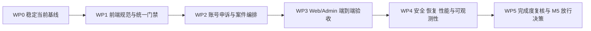

# 密码侦探社下一步开发方案（2026-08-08）

> - 文档状态：当前执行
> - 制定日期：2026-08-08
> - 计划周期：2026-08-10 至 2026-08-28（15 个工作日）
> - 规格基线：[密码侦探社项目规格说明书 v3.0](./密码侦探社项目规格说明书-v3.0.md)
> - 前序计划：[密码侦探社下一阶段开发计划（2026-08）](./密码侦探社下一阶段开发计划-2026-08.md)
> - 当前状态：[分阶段开发状态](../docs/development/phase-status.md)

## 1. 规划结论

下一阶段不再扩张新的外围业务模块，开发主线调整为“**收口现有功能 → 补齐 P0 业务闭环 → 建立浏览器和目标环境验收 → 启动 M5 工程门禁**”。

当前工程口径约为全规格功能实现度 90%、MVP 验收完成度 77%、生产上线准备度 45%。本阶段目标如下：

| 维度 | 当前基线 | 阶段目标 | 说明 |
|---|---:|---:|---|
| 全规格功能实现度 | 约 90% | **≥95%** | 关闭角色审批前端、账号申诉、案件编排和结果通知 |
| MVP 验收完成度 | 约 77% | **≥88%** | 增加前端规范门禁、Playwright、目标环境和恢复证据 |
| 生产上线准备度 | 约 45% | **≥60%** | 建立安全扫描、SBOM、备份恢复、性能和可观测性基线 |
| P0 阻塞缺陷 | 未形成正式清单 | **0** | 阶段出口前必须逐项登记、复测和关闭 |
| P1 高风险缺陷 | 未形成正式清单 | **0 或有书面风险接受** | 风险接受必须包含责任人、截止日期和补救措施 |

上述目标是阶段工程目标，不代表生产放行。正式 SMTP、Authenticode、Windows 10/11 实机矩阵、正式 KMS、法律评审、预生产和灰度发布仍需要后续目标环境验收。

## 2. 执行原则

1. **先收口、后扩展**：未关闭角色审批、案件编排和质量门禁前，不新增论坛、商城、批量贡献、跨候选图谱或新通知提供商。
2. **服务端是安全边界**：权限、MFA、再认证、对象级保护、幂等、并发和审计不能只依赖前端隐藏按钮。
3. **一次操作形成完整结果**：案件处置、用户或候选状态修改、积分/信誉补偿和通知 Outbox 必须处于同一事务或可证明一致的补偿流程中。
4. **前端遵循统一规范**：Vue 3 `<script setup lang="ts">`、Shadcn-Vue、Tailwind CSS、TypeScript 严格模式；业务页面不得新增自定义 `<style>`、行内样式、硬编码颜色或用原生表单控件替代基础组件。
5. **文档和代码同步交付**：需求、API、数据模型、计划或验收变化必须同步更新本文件、v3.0 规格、API 约定、追踪矩阵、阶段状态和文档变更记录。
6. **只使用合成测试数据**：测试、截图、日志和文档示例不得包含真实密码、令牌、密钥、邮箱或个人信息。
7. **没有目标环境证据就不标记通过**：本地模拟、静态配置检查和构建成功不能代替真实 MySQL、Redis、Worker、浏览器、Windows 和通知环境验收。

## 3. 范围边界

### 3.1 本阶段必须完成

- 当前未提交的 Admin 角色审批工作台收口、测试、文档同步和干净交付基线。
- ESLint、`pnpm lint`、前端样式与组件规范门禁。
- 账号申诉、案件主体统一、受控处置编排、结果通知和用户/Admin 时间线。
- Web/Admin Playwright 核心旅程和视觉回归基线。
- PowerShell 5.1/7 检查入口、真实 Compose 环境回归、首批安全扫描和 SBOM。
- 数据库备份恢复、Redis 丢失、Worker 重启和迁移回滚冒烟。
- 精确查询与普通写接口的首轮性能基线、关键运行指标出口。
- 新一轮完成度审计和是否进入正式 M5 系统测试的放行决策。

### 3.2 本阶段明确不包含

- CSV 批量贡献、可信贡献者申请、论坛、积分商城、悬赏、移动端和浏览器插件。
- 跨候选全局关联图谱、自动账号处罚和复杂动态信誉模型。
- 新增短信、企业微信或其他通知提供商。
- 桌面端静默安装、自动执行安装包和全量分批发布系统。
- 正式生产域名、正式 SMTP、正式 KMS、Authenticode 证书采购和法律签字本身；本阶段只准备接入与验收清单。

## 4. 总体实施路线

关键依赖：

- WP0 是所有后续工作的干净基线。
- WP1 必须先建立 lint 和组件规范，避免 WP2 新页面继续产生样式债务。
- WP2 的 API、迁移和状态机冻结后，WP3 才能编写稳定的跨页面 E2E。
- WP4 可以在 WP2 后半段并行准备脚本，但目标环境验收必须使用 WP3 已稳定的构建版本。

## 5. WP0：当前基线与角色审批收口

**计划日期：2026-08-10（已于 2026-08-08 提前完成）**
**执行状态：已完成，验证与交付证据见 [N2 第 7 次开发迭代](../docs/development/2026-08-08-n2-iteration-7.md)**
**优先级：P0**

### 5.1 工作内容

- 复核当前工作区中的 `RoleChangesPage.vue`、角色服务、路由和测试，不覆盖或丢失现有改动。
- 补充角色请求列表分页、空态、错误态、选中详情、创建、批准、拒绝和凭据清理行为验证。
- 验证申请人与复核人必须不同、批准后撤销目标账号会话、幂等重放、乐观并发和对象保护。
- 将角色变更 API 正式补入 v3.0 MVP API 表和 API 约定，统一角色名称、原因码、状态和路径。
- 更新阶段状态、需求追踪矩阵、模块地图和迭代记录。
- 形成独立、可评审、可回滚的提交，清除与本工作包相关的未提交状态。

### 5.2 出口条件

- Admin 角色审批页面的服务测试和基础渲染测试通过。
- 至少覆盖一次创建、双人批准、拒绝、幂等重放和并发冲突自动化场景。
- 密码、TOTP 和再认证令牌不写入浏览器持久化存储、日志或错误详情。
- `git diff --check`、API 测试、Admin 测试、类型检查和生产构建通过。
- 文档不再保留“角色审批工作台待实现”的过时描述。

## 6. WP1：前端规范债务与工程门禁

**计划日期：2026-08-11 至 2026-08-13（已于 2026-08-08 提前启动）**
**执行状态：第五轮与总体验收已完成；工程门禁与用户基础流程见 [N2 第 8 次开发迭代](../docs/development/2026-08-08-n2-iteration-8.md)，用户案件与信誉页面见 [N2 第 9 次开发迭代](../docs/development/2026-08-08-n2-iteration-9.md)，Admin 登录与 TOTP 页面见 [N2 第 10 次开发迭代](../docs/development/2026-08-08-n2-iteration-10.md)，Admin 信任案件与风险告警页面见 [N2 第 11 次开发迭代](../docs/development/2026-08-08-n2-iteration-11.md)，候选审核与桌面发布收口见 [N2 第 12 次开发迭代](../docs/development/2026-08-08-n2-iteration-12.md)；WP1 本地工程出口条件已满足，下一轮进入 WP2**
**优先级：P0**

### 6.1 工程门禁

- 为根工作区、Web 和 Admin 增加 ESLint 配置及 `lint` 脚本。
- 将 `pnpm lint` 纳入 `scripts/check.ps1` 和 GitHub Actions。
- 增加禁止业务 `.vue` 文件出现 `<style>`、行内样式和硬编码十六进制颜色的检查。
- 明确 `src/components/ui/` 为 Shadcn-Vue 生成组件目录，不对生成组件内部原生标签做业务层误报。
- 修复 `scripts/check.ps1` 的 PowerShell 5.1 不兼容语法，或提供明确的 5.1/7 双入口和版本检测。

### 6.2 UI 改造批次

按风险分三批迁移，避免一次大改影响全部页面：

1. **用户端基础流程**：`App.vue`、注册、首页、贡献和授权确认。
2. **用户案件与信誉页面**：举报/申诉、信誉和状态展示。
3. **Admin 复杂页面**：候选审核、桌面发布、风险告警和案件处置。

截至 2026-08-08，第五轮已完成 Admin `CandidateModerationPage.vue` 与 `DesktopReleasesPage.vue` 整改并补充 SSR 渲染测试；历史规范欠账由 60 项清零，WP1 累计从 11 个文件 164 项降至 0 项，新增违规为 0。

需要的基础组件优先通过 Shadcn-Vue CLI 增加，包括 Checkbox、Textarea、Dialog/AlertDialog、DropdownMenu、Pagination 和必要的表单组合组件。

### 6.3 出口条件

- `pnpm lint`、`pnpm typecheck`、`pnpm test`、`pnpm build` 全部通过。
- 业务页面无自定义 `<style>` 块和行内样式。
- 业务页面不再使用原生 `<button>`、`<input>`、`<select>`、`<textarea>` 替代已有 Shadcn-Vue 基础组件。
- 业务页面颜色全部使用 Tailwind 语义变量，不新增硬编码十六进制颜色。
- 每个新增或重构的复杂页面至少具有基础渲染测试；危险操作至少具有服务调用与凭据清理测试。

## 7. WP2：账号申诉、案件编排与结果通知

**计划日期：2026-08-14 至 2026-08-18**
**优先级：P0**

### 7.0 实施进度（2026-08-08）

- **第 1 轮已完成：** 已扩展统一案件主体模型，新增账号申诉创建、本人案件详情、共享契约和对象级/幂等/最小披露测试。
- **第 2 轮已完成：** 已实现独立 `assign`/`reopen`、案件版本号、`expected_version` 乐观并发、负责人前后事件快照、MFA/限流/幂等和 Admin 操作入口。
- **仍未完成：** 原子 `resolve`、关联账号/候选处置、奖励/信誉补偿、结果通知 Outbox、SLA、Web 账号申诉表单与用户详情时间线。
- 本轮不把既有通用 `/transition` 冒充最终原子处置接口；后续必须按 7.2～7.4 继续实施。

### 7.1 数据与状态模型

在现有 `trust_cases` 和 `trust_case_events` 基础上扩展，不新建平行案件系统：

- 案件主体明确为候选记录、用户账号或风险告警之一。
- 新增账号申诉所需的目标账号、期望恢复动作、受控原因和最小披露证据摘要。
- `trust_cases.version` 为非空乐观并发版本；案件事件记录前后状态、前后负责人、SLA、操作类型、原因码、`request_id` 和通知引用。
- 如现有 Outbox 无法表达案件结果通知，增加案件通知类型和幂等来源引用，不复制完整邮箱或敏感说明。
- 迁移只前进追加，不修改已经应用的历史迁移。

### 7.2 拟定 API

最终路径在契约评审后冻结，优先复用现有接口：

| 方法 | 拟定路径 | 用途 | 关键门禁 |
|---|---|---|---|
| POST | `/trust/account-appeals` | 用户提交本人账号申诉 | 登录、对象级限制、限流、幂等 |
| GET | `/trust/cases/{case_id}` | 用户查看本人案件详情和时间线 | 所有权校验、最小披露 |
| GET | `/admin/trust-cases` | 扩展账号主体和负责人筛选 | 审核员/管理员、MFA |
| POST | `/admin/trust-cases/{case_id}/assign` | 指派或转派 `open/in_review` 案件 | 已实现：MFA、限流、幂等、`expected_version`、启用审核员/管理员校验、审计 |
| POST | `/admin/trust-cases/{case_id}/resolve` | 原子完成案件及关联处置 | 待实现：MFA、再认证、原因码、幂等、单事务副作用 |
| POST | `/admin/trust-cases/{case_id}/reopen` | 受控重开 `resolved/dismissed` 案件 | 已实现：MFA、限流、幂等、`expected_version`、原因码、审计 |

`resolve` 必须根据案件类型受控执行候选恢复/隔离、用户恢复/维持停用、积分或信誉补偿以及通知 Outbox，不允许前端拼接多个无事务写接口模拟处置。

### 7.3 Web 与 Admin

- Web 增加账号申诉入口、本人案件详情、状态时间线和最小披露结果。
- Admin 案件工作台增加主体类型、负责人、SLA、处置预览、一次性再认证和通知状态。
- 高风险处置使用确认对话框，明确显示将修改的对象、预期状态和副作用。
- 页面不得展示候选密码、完整邮箱、TOTP 密钥、令牌、Webhook 地址或内部签名材料。

### 7.4 测试矩阵

- 普通用户只能为本人账号提交申诉，不能查看他人案件。
- 重复幂等请求不产生重复案件、事件、积分校正或通知。
- 指派、重开和状态转换的过期版本必须冲突；最终原子处置只有一个事务成功，失败请求不消费不应消费的再认证凭据。
- 案件处置、用户/候选状态、奖励补偿和 Outbox 在同一事务回滚。
- 已解决案件只能使用受控原因重开。
- 通知成功、失败、重试和人工重放都有审计引用，已成功通知不会被重复发送。

### 7.5 出口条件

- 用户可提交账号申诉并查看本人时间线。
- 管理员一次受控操作即可完成案件处置及关联副作用。
- 不存在部分成功、重复结算、重复通知或对象级越权。
- API、迁移、共享契约、Web/Admin 页面和文档同步通过统一门禁。

## 8. WP3：Web/Admin 端到端与视觉验收

**计划日期：2026-08-19 至 2026-08-21**
**优先级：P1，但作为阶段出口门禁**

### 8.1 测试基础设施

- 引入 Playwright，测试使用隔离数据库、固定时间和合成账号。
- 增加可重复的数据准备与清理命令，不依赖开发者本地数据库。
- 为邮件通知使用本地捕获或合成提供商，不向真实地址发送测试邮件。
- 保存失败截图、Trace、控制台错误和请求日志；制品不得包含密码和令牌。

### 8.2 核心旅程

**Web：**

1. 注册、邮箱验证、登录、刷新和退出。
2. 本地指纹计算、取消、手动指纹校验、无结果查询。
3. 已验证结果查询、揭示、复制、配额扣减和过期会话。
4. 授权声明、贡献、重复贡献和本人贡献记录。
5. 用户资料、密码、TOTP、会话、隐私导出和删除申请。
6. 举报、候选申诉、账号申诉和案件时间线。

**Admin：**

1. 管理员登录、TOTP 和访问门禁。
2. 仪表盘真实聚合、审计筛选/详情/导出。
3. 候选人工处置和举报/申诉案件处置。
4. 用户停用/恢复、会话撤销、角色申请和双人复核。
5. 配置草稿、发布和回滚。
6. 风险告警指派、解决、通知失败筛选和人工重放。

### 8.3 视觉与可访问性

- 建立 1440 px 和移动端核心页面快照。
- 遮罩动态时间、随机 ID 和合成账号标识，避免无意义快照波动。
- 检查键盘操作、表单标签、焦点状态、错误提示和“不只依赖颜色”表达。

### 8.4 出口条件

- 核心旅程无失败，不依赖无界自动重试掩盖不稳定测试。
- 页面无未处理控制台错误、敏感响应打印或跨账号数据泄露。
- 视觉差异经过人工确认；移动端不存在阻断操作的溢出或遮挡。

### 8.5 执行进度（2026-08-09）

- **第 1 轮已完成：** 引入 Playwright Chromium、隔离 SQLite、合成管理员种子、Web/Admin 独立 Vite 端口、失败报告目录和 GitHub Actions `e2e` 作业。
- Web 已覆盖游客门禁、注册、自动登录、退出和重新登录；Admin 已覆盖游客门禁、首次 TOTP 绑定和启用 MFA 后二次登录。
- **第 2 轮已完成并通过统一本地门禁：** 扩展合成普通 Web 用户和加密已验证候选种子，新增 Web 已验证查询/揭示/清除、未匹配指纹授权贡献、候选举报与本人案件时间线三条 Chromium 旅程，定向测试 3 项全部通过。
- 认证用例关闭截图与网络 Trace，并在读取后遮蔽 TOTP 密钥；本轮仍不向测试制品写入真实密码、令牌或个人信息。
- 第 2 轮远端 GitHub Actions 运行 `31292352350` 的 API、Frontend、Desktop、E2E 和 Container Images 已全部通过。
- **第 3 轮已完成定向验证：** 新增独立 MFA 工作流管理员、待验证候选和待处理举报案件合成种子；覆盖 Admin 候选人工审核，以及举报案件指派、开始处理、解决和关联候选原子隔离两条 Chromium 旅程。
- 第 3 轮修复案件管理写操作成功提示在详情刷新时被立即清空的问题；包含 9 项 Playwright Chromium 旅程的统一本地门禁已通过，远端 GitHub Actions `31294494635` 的 5 个作业全部通过。
- **第 4 轮已完成定向验证：** 新增三个隔离合成 Web 用户和两个不可登录的预置会话，覆盖其他会话撤销与密码修改、TOTP 绑定/登录门禁/停用、隐私用途确认/一次性数据导出/账号删除请求创建与撤销三条 Chromium 旅程；生产 `auth.login` 速率限制保持不变，完整 12 项 Chromium 旅程已通过。
- 下一轮优先覆盖 Admin 用户治理/角色审批/配置/风险告警浏览器闭环，再补充 Web 邮箱验证/刷新过期与复制/过期会话组合，以及视觉快照、移动端和可访问性检查。

## 9. WP4：M5 安全、恢复、性能与可观测性准入

**计划日期：2026-08-24 至 2026-08-27**
**优先级：P1**

### 9.1 安全与供应链

- CI 增加 Python 和 TypeScript 依赖审计、SAST、容器镜像扫描。
- 生成首版 SBOM，记录依赖版本、构建来源和制品摘要。
- 高危结果默认阻断；豁免必须记录风险、负责人、到期日期和替代控制。
- 增加对象级越权、CSRF/XSS、重放、批量资源消耗和敏感日志专项测试。

### 9.2 恢复演练

建立可重复脚本或运行手册并实际执行：

- MySQL 备份、清空和恢复。
- Alembic 前向修复与回滚验证。
- Redis 丢失后的限流、会话和任务降级行为。
- Worker 中断、重启和任务幂等。
- 候选密码密钥旧版本读取和轮换演练。

记录实际 RPO、RTO、失败步骤、恢复命令和证据路径。

### 9.3 性能基线

- 精确指纹查询 P95 ≤500 ms。
- 普通写接口 P95 ≤800 ms。
- 首轮至少覆盖 100 QPS 短时峰值和并发揭示配额竞争。
- Web 使用合成大文件验证流式计算、取消和 UI 响应；物理 20 GiB 验收可以分为 CI 小样本门禁和目标机器大样本报告。
- 桌面端验证 8 GiB 样本、损坏包、路径穿越、取消和资源限制。

### 9.4 可观测性

- 提供 Prometheus 或等价指标出口，至少覆盖请求量、延迟、错误率、数据库连接、Redis、Worker 队列和通知投递。
- 仪表盘区分业务审计失败率与全量 HTTP 错误率。
- 建立告警联系人、值班手册和首版故障处理清单。
- 所有指标和日志使用最小披露标签，不包含完整指纹、邮箱、密码、令牌和安装标识。

### 9.5 目标环境门禁

- 使用 Compose 实际启动 MySQL、Redis、API、Worker、Web 和 Admin。
- 运行迁移、健康检查、合成注册登录、贡献、查询、案件和通知主流程。
- 验证 Worker、Redis 和数据库发生短时故障时的恢复行为。

### 9.6 出口条件

- 安全扫描无未豁免高危结果。
- SBOM 可追溯到构建版本和制品摘要。
- 恢复演练有可重复命令和真实证据，不只存在文档步骤。
- 性能基线满足 v3.0 指标，或形成有负责人和截止日期的差距报告。
- 目标 Compose 环境完整回归通过。

## 10. WP5：完成度复核与 M5 放行决策

**计划日期：2026-08-28**
**优先级：P0 出口**

### 10.1 交付物

- 新版需求—模块—测试追踪矩阵。
- 项目完成度复核报告，分开报告功能实现、MVP 验收和生产准备度。
- P0/P1/P2 缺陷与风险登记表。
- 测试、E2E、安全、恢复、性能和目标环境证据索引。
- 是否进入正式 M5 系统测试的书面决定。

### 10.2 放行条件

只有同时满足以下条件，才能进入 M5 系统测试：

- P0 阻塞缺陷为 0。
- P1 高风险缺陷为 0，或具有已批准且未过期的风险接受记录。
- 统一门禁、Playwright、目标 Compose、安全扫描和恢复演练通过。
- 角色审批、账号申诉、案件编排和结果通知形成端到端证据。
- 所有需求、API、迁移、权限矩阵和验收文档已同步。

不满足时，继续停留在 MVP 收口阶段，不得通过提高百分比替代未完成的目标环境验收。

## 11. 日程安排

| 日期 | 工作包 | 主要交付 |
|---|---|---|
| 2026-08-10 | WP0 | 角色审批收口、干净提交、API 与文档同步 |
| 2026-08-11 至 2026-08-13 | WP1 | ESLint、`pnpm lint`、Shadcn/Tailwind 规范迁移、PowerShell 入口 |
| 2026-08-14 至 2026-08-18 | WP2 | 账号申诉、案件编排、结果通知、Web/Admin 时间线 |
| 2026-08-19 至 2026-08-21 | WP3 | Playwright 核心旅程、视觉和可访问性验收 |
| 2026-08-24 至 2026-08-27 | WP4 | 安全、SBOM、恢复、性能、指标和目标 Compose 回归 |
| 2026-08-28 | WP5 | 完成度复核、风险清单和 M5 放行决定 |

计划按单人主线估算。若有两名开发者，WP4 的扫描、恢复脚本和指标准备可在 WP2 后半段并行，但迁移、共享契约和同一页面不并行修改。

## 12. 分支与交付拆分

| 工作包 | 建议分支 | 主要写入范围 | 合并前门禁 |
|---|---|---|---|
| WP0 | `codex/role-governance-closeout` | Admin 角色审批、契约、文档 | API/Admin 测试、类型检查、构建、文档检查 |
| WP1 | `codex/frontend-quality-gates` | ESLint、Shadcn 迁移、检查脚本、CI | lint、类型检查、测试、构建、PowerShell 5.1/7 |
| WP2 | `codex/account-appeal-orchestration` | Trust Case、用户处置、Outbox、Web/Admin | API/迁移/权限/事务/页面测试 |
| WP3 | `codex/playwright-core-journeys` | Playwright、数据种子、视觉快照 | E2E、敏感数据检查、稳定性复跑 |
| WP4 | `codex/m5-entry-gates` | CI、扫描、SBOM、恢复、性能、指标 | 目标环境、安全、恢复和性能报告 |
| WP5 | `codex/m5-readiness-review` | 审计和放行文档 | 证据完整性与 P0/P1 清零复核 |

每个分支保持可独立评审和回滚。迁移只能前进追加；共享契约变化必须与 API 和使用方处于同一可运行交付链中。

## 13. 测试与证据矩阵

| 层级 | 必须覆盖 | 证据 |
|---|---|---|
| 单元测试 | 状态机、原因码、积分/信誉补偿、脱敏、配置解析 | 测试报告和覆盖率 |
| 集成测试 | 数据库约束、事务回滚、Redis、幂等、Outbox 重试 | pytest 与真实服务测试报告 |
| 契约测试 | API 路径、请求/响应、Web/Admin 共享类型 | API 契约测试与类型检查 |
| 页面测试 | 复杂组件渲染、权限状态、危险操作确认、凭据清理 | Vitest 报告 |
| E2E | Web/Admin 核心旅程和跨账号隔离 | Playwright HTML 报告、截图和 Trace |
| 桌面测试 | ZIP/7z、签名回执、更新、恶意样本、实机和大文件 | .NET 测试与实机报告 |
| 安全测试 | 越权、CSRF/XSS、重放、资源消耗、依赖和镜像 | 扫描报告与豁免清单 |
| 恢复测试 | MySQL、迁移、Redis、Worker、密钥版本 | 演练记录和 RPO/RTO |
| 性能测试 | 查询、普通写、配额并发、本地哈希 | 原始结果和汇总报告 |

## 14. 主要风险与控制

| 风险 | 影响 | 控制措施 |
|---|---|---|
| 当前未提交角色页面被后续改动覆盖 | 丢失已完成工作 | WP0 首先备份差异、复核并独立收口 |
| 前端规范迁移范围过大 | 引入视觉和交互回归 | 按用户端、案件、Admin 三批迁移，每批独立测试 |
| 案件编排跨模块事务复杂 | 部分成功或重复副作用 | 先冻结状态机和事务边界，再实现 UI |
| E2E 依赖随机数据和时间 | 测试不稳定 | 固定时钟、合成数据、隔离数据库、明确等待条件 |
| Docker 或外部服务不可用 | 目标环境验收延期 | WP4 前确认 Docker、端口和镜像；保留 CI 环境兜底，但不将 CI 模拟冒充本地实测 |
| 安全扫描首次引入产生大量历史问题 | 阶段阻塞 | 区分高危阻断与历史基线，豁免必须有期限和负责人 |
| 文档和代码继续漂移 | 验收口径失真 | 每个工作包合并前更新追踪矩阵、阶段状态和变更记录 |

## 15. 本阶段完成定义

本阶段只有在以下条件全部满足时才可标记完成：

- 角色审批、账号申诉、案件编排和结果通知形成可运行端到端闭环。
- API、数据模型、迁移、权限和共享契约一致。
- `pnpm lint`、类型检查、单元/集成/页面/E2E、生产构建和桌面测试通过。
- 前端业务页面符合 Shadcn-Vue、Tailwind 和无自定义 CSS 规范。
- 关键写操作具备幂等或明确并发控制；危险操作具备 MFA、一次性再认证和不可变审计。
- 安全扫描、SBOM、恢复演练、性能基线和目标 Compose 回归有实际证据。
- P0 为 0，P1 为 0 或具有有效风险接受记录。
- v3.0 规格、API 约定、追踪矩阵、阶段状态、README 和文档变更记录同步完成。

## 16. 阶段结束后仍需完成的生产门禁

即使本方案全部完成，生产放行前仍至少需要：

- 正式 SMTP 服务商、发件域名、SPF、DKIM、DMARC、退信和投诉处理验收。
- Windows 10/11 支持矩阵、正式 Authenticode 和桌面制品分发环境。
- 正式 KMS、密钥托管、轮换责任人和应急吊销流程。
- 生产级监控平台、告警联系人、值班与故障演练。
- 隐私政策、服务条款、数据保留、投诉删除和属地法律评审。
- 预生产、RC、灰度、回滚及最终发布签字。

## 9. 2026-08-08 四轮开发任务结果

本轮已完成 WP2 第 1～4 轮的本地开发闭环，并分别形成可追踪代码提交：

1. **第 1 轮**：案件原子 `resolve` API、幂等、版本并发、负责人校验和审计。
2. **第 2 轮**：账号恢复、候选状态变更、积分/信誉补偿和 `trust_case_effects` 账本。
3. **第 3 轮**：结果通知 Outbox、Worker 重试、失败状态、Admin 状态展示和 MFA 重放。
4. **第 4 轮**：案件 SLA 截止与自动升级、Worker Beat 调度、Web 本人账号申诉表单和用户状态展示。

本地出口已通过针对性 API 测试、Ruff、共享契约测试、Web/Admin lint、typecheck、Vitest 和 SSR 测试。仍需单独完成浏览器 E2E、真实 Redis/Worker、正式 SMTP/Webhook、目标环境迁移/恢复和生产放行；这些项目不因本地测试通过而自动标记为完成。
