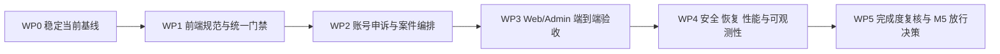

# 密码侦探社下一步开发方案（2026-08-08）

> - 文档状态：当前执行
> - 制定日期：2026-08-08
> - 计划周期：2026-08-10 至 2026-08-28（15 个工作日）
> - 规格基线：[密码侦探社项目规格说明书 v3.0](./密码侦探社项目规格说明书-v3.0.md)
> - 前序计划：[密码侦探社下一阶段开发计划（2026-08）](./密码侦探社下一阶段开发计划-2026-08.md)
> - 当前状态：[分阶段开发状态](../docs/development/phase-status.md)

> **2026-08-11 发布治理决策（当前有效）**：项目不要求任何人员签字确认，Staging/发布结论由 `automated-evidence-gate` 依据完整、脱敏且校验通过的证据包自动输出。桌面端不要求 Authenticode 或签名证书；桌面制品必须由服务端重算文件大小和 SHA-256，并附带已确认的合法分发声明。该声明用于审计追溯，不构成外部法律意见。远端同步只使用 GitHub Git Data API 的等效提交链路，不使用 HTTP/1.1 `git push`。产品内 N2 角色变更的双人审批不受本决策影响。

## 1. 规划结论

下一阶段不再扩张新的外围业务模块，开发主线调整为“**收口现有功能 → 补齐 P0 业务闭环 → 建立浏览器和目标环境验收 → 启动 M5 工程门禁**”。

当前计划初始口径约为全规格功能实现度 90%、MVP 验收完成度 77%、生产上线准备度 45%；截至 2026-08-10 WP4 第 5 轮复核，阶段状态文档的滚动估算为全规格约 95%、MVP 约 96%、生产上线准备度约 61%。本阶段目标如下：

| 维度 | 当前基线 | 阶段目标 | 说明 |
|---|---:|---:|---|
| 全规格功能实现度 | 约 90% | **≥95%** | 关闭角色审批前端、账号申诉、案件编排和结果通知 |
| MVP 验收完成度 | 约 77% | **≥88%** | 增加前端规范门禁、Playwright、目标环境和恢复证据 |
| 生产上线准备度 | 约 45% | **≥60%** | 建立安全扫描、SBOM、备份恢复、性能和可观测性基线 |
| P0 阻塞缺陷 | 未形成正式清单 | **0** | 阶段出口前必须逐项登记、复测和关闭 |
| P1 高风险缺陷 | 未形成正式清单 | **0 或有书面风险接受** | 风险接受必须包含责任人、截止日期和补救措施 |

上述目标是阶段工程目标，不代表生产放行。正式 SMTP、Windows 10/11 实机矩阵、正式 KMS、合法分发声明审计、预生产和灰度发布仍需要后续目标环境验收。

## 2. 执行原则

1. **先收口、后扩展**：未关闭角色审批、案件编排和质量门禁前，不新增论坛、商城、批量贡献、跨候选图谱或新通知提供商。
2. **服务端是安全边界**：权限、MFA、再认证、对象级保护、幂等、并发和审计不能只依赖前端隐藏按钮。
3. **一次操作形成完整结果**：案件处置、用户或候选状态修改、积分/信誉补偿和通知 Outbox 必须处于同一事务或可证明一致的补偿流程中。
4. **前端遵循统一规范**：Vue 3 `<script setup lang="ts">`、Shadcn-Vue、Tailwind CSS、TypeScript 严格模式；业务页面不得新增自定义 `<style>`、行内样式、硬编码颜色或用原生表单控件替代基础组件。
5. **文档和代码同步交付**：需求、API、数据模型、计划或验收变化必须同步更新本文件、v3.0 规格、API 约定、追踪矩阵、阶段状态和文档变更记录。
6. **只使用合成测试数据**：测试、截图、日志和文档示例不得包含真实密码、令牌、密钥、邮箱或个人信息。
7. **没有目标环境证据就不标记通过**：本地模拟、静态配置检查和构建成功不能代替真实 MySQL、Redis、Worker、浏览器、Windows 和通知环境验收。

## 3. 范围边界

### 3.1 本阶段必须完成

- 当前未提交的 Admin 角色审批工作台收口、测试、文档同步和干净交付基线。
- ESLint、`pnpm lint`、前端样式与组件规范门禁。
- 账号申诉、案件主体统一、受控处置编排、结果通知和用户/Admin 时间线。
- Web/Admin Playwright 核心旅程和视觉回归基线。
- PowerShell 5.1/7 检查入口、真实 Compose 环境回归、首批安全扫描和 SBOM。
- 数据库备份恢复、Redis 丢失、Worker 重启和迁移回滚冒烟。
- 精确查询与普通写接口的首轮性能基线、关键运行指标出口。
- 新一轮完成度审计和是否进入正式 M5 系统测试的放行决策。

### 3.2 本阶段明确不包含

- CSV 批量贡献、可信贡献者申请、论坛、积分商城、悬赏、移动端和浏览器插件。
- 跨候选全局关联图谱、自动账号处罚和复杂动态信誉模型。
- 新增短信、企业微信或其他通知提供商。
- 桌面端静默安装、自动执行安装包和全量分批发布系统。
- 正式生产域名、正式 SMTP、正式 KMS、外部法律意见和云资源审批本身；本阶段只准备接入与验收清单。

## 4. 总体实施路线

关键依赖：

- WP0 是所有后续工作的干净基线。
- WP1 必须先建立 lint 和组件规范，避免 WP2 新页面继续产生样式债务。
- WP2 的 API、迁移和状态机冻结后，WP3 才能编写稳定的跨页面 E2E。
- WP4 可以在 WP2 后半段并行准备脚本，但目标环境验收必须使用 WP3 已稳定的构建版本。

## 5. WP0：当前基线与角色审批收口

**计划日期：2026-08-10（已于 2026-08-08 提前完成）**
**执行状态：已完成，验证与交付证据见 [N2 第 7 次开发迭代](../docs/development/2026-08-08-n2-iteration-7.md)**
**优先级：P0**

### 5.1 工作内容

- 复核当前工作区中的 `RoleChangesPage.vue`、角色服务、路由和测试，不覆盖或丢失现有改动。
- 补充角色请求列表分页、空态、错误态、选中详情、创建、批准、拒绝和凭据清理行为验证。
- 验证申请人与复核人必须不同、批准后撤销目标账号会话、幂等重放、乐观并发和对象保护。
- 将角色变更 API 正式补入 v3.0 MVP API 表和 API 约定，统一角色名称、原因码、状态和路径。
- 更新阶段状态、需求追踪矩阵、模块地图和迭代记录。
- 形成独立、可评审、可回滚的提交，清除与本工作包相关的未提交状态。

### 5.2 出口条件

- Admin 角色审批页面的服务测试和基础渲染测试通过。
- 至少覆盖一次创建、双人批准、拒绝、幂等重放和并发冲突自动化场景。
- 密码、TOTP 和再认证令牌不写入浏览器持久化存储、日志或错误详情。
- `git diff --check`、API 测试、Admin 测试、类型检查和生产构建通过。
- 文档不再保留“角色审批工作台待实现”的过时描述。

## 6. WP1：前端规范债务与工程门禁

**计划日期：2026-08-11 至 2026-08-13（已于 2026-08-08 提前启动）**
**执行状态：第五轮与总体验收已完成；工程门禁与用户基础流程见 [N2 第 8 次开发迭代](../docs/development/2026-08-08-n2-iteration-8.md)，用户案件与信誉页面见 [N2 第 9 次开发迭代](../docs/development/2026-08-08-n2-iteration-9.md)，Admin 登录与 TOTP 页面见 [N2 第 10 次开发迭代](../docs/development/2026-08-08-n2-iteration-10.md)，Admin 信任案件与风险告警页面见 [N2 第 11 次开发迭代](../docs/development/2026-08-08-n2-iteration-11.md)，候选审核与桌面发布收口见 [N2 第 12 次开发迭代](../docs/development/2026-08-08-n2-iteration-12.md)；WP1 本地工程出口条件已满足，下一轮进入 WP2**
**优先级：P0**

### 6.1 工程门禁

- 为根工作区、Web 和 Admin 增加 ESLint 配置及 `lint` 脚本。
- 将 `pnpm lint` 纳入 `scripts/check.ps1` 和 GitHub Actions。
- 增加禁止业务 `.vue` 文件出现 `<style>`、行内样式和硬编码十六进制颜色的检查。
- 明确 `src/components/ui/` 为 Shadcn-Vue 生成组件目录，不对生成组件内部原生标签做业务层误报。
- 修复 `scripts/check.ps1` 的 PowerShell 5.1 不兼容语法，或提供明确的 5.1/7 双入口和版本检测。

### 6.2 UI 改造批次

按风险分三批迁移，避免一次大改影响全部页面：

1. **用户端基础流程**：`App.vue`、注册、首页、贡献和授权确认。
2. **用户案件与信誉页面**：举报/申诉、信誉和状态展示。
3. **Admin 复杂页面**：候选审核、桌面发布、风险告警和案件处置。

截至 2026-08-08，第五轮已完成 Admin `CandidateModerationPage.vue` 与 `DesktopReleasesPage.vue` 整改并补充 SSR 渲染测试；历史规范欠账由 60 项清零，WP1 累计从 11 个文件 164 项降至 0 项，新增违规为 0。

需要的基础组件优先通过 Shadcn-Vue CLI 增加，包括 Checkbox、Textarea、Dialog/AlertDialog、DropdownMenu、Pagination 和必要的表单组合组件。

### 6.3 出口条件

- `pnpm lint`、`pnpm typecheck`、`pnpm test`、`pnpm build` 全部通过。
- 业务页面无自定义 `<style>` 块和行内样式。
- 业务页面不再使用原生 `<button>`、`<input>`、`<select>`、`<textarea>` 替代已有 Shadcn-Vue 基础组件。
- 业务页面颜色全部使用 Tailwind 语义变量，不新增硬编码十六进制颜色。
- 每个新增或重构的复杂页面至少具有基础渲染测试；危险操作至少具有服务调用与凭据清理测试。

## 7. WP2：账号申诉、案件编排与结果通知

**计划日期：2026-08-14 至 2026-08-18**
**优先级：P0**

### 7.0 实施进度（2026-08-08）

- **第 1 轮已完成：** 已扩展统一案件主体模型，新增账号申诉创建、本人案件详情、共享契约和对象级/幂等/最小披露测试。
- **第 2 轮已完成：** 已实现独立 `assign`/`reopen`、案件版本号、`expected_version` 乐观并发、负责人前后事件快照、MFA/限流/幂等和 Admin 操作入口。
- **仍未完成：** 原子 `resolve`、关联账号/候选处置、奖励/信誉补偿、结果通知 Outbox、SLA、Web 账号申诉表单与用户详情时间线。
- 本轮不把既有通用 `/transition` 冒充最终原子处置接口；后续必须按 7.2～7.4 继续实施。

### 7.1 数据与状态模型

在现有 `trust_cases` 和 `trust_case_events` 基础上扩展，不新建平行案件系统：

- 案件主体明确为候选记录、用户账号或风险告警之一。
- 新增账号申诉所需的目标账号、期望恢复动作、受控原因和最小披露证据摘要。
- `trust_cases.version` 为非空乐观并发版本；案件事件记录前后状态、前后负责人、SLA、操作类型、原因码、`request_id` 和通知引用。
- 如现有 Outbox 无法表达案件结果通知，增加案件通知类型和幂等来源引用，不复制完整邮箱或敏感说明。
- 迁移只前进追加，不修改已经应用的历史迁移。

### 7.2 拟定 API

最终路径在契约评审后冻结，优先复用现有接口：

| 方法 | 拟定路径 | 用途 | 关键门禁 |
|---|---|---|---|
| POST | `/trust/account-appeals` | 用户提交本人账号申诉 | 登录、对象级限制、限流、幂等 |
| GET | `/trust/cases/{case_id}` | 用户查看本人案件详情和时间线 | 所有权校验、最小披露 |
| GET | `/admin/trust-cases` | 扩展账号主体和负责人筛选 | 审核员/管理员、MFA |
| POST | `/admin/trust-cases/{case_id}/assign` | 指派或转派 `open/in_review` 案件 | 已实现：MFA、限流、幂等、`expected_version`、启用审核员/管理员校验、审计 |
| POST | `/admin/trust-cases/{case_id}/resolve` | 原子完成案件及关联处置 | 待实现：MFA、再认证、原因码、幂等、单事务副作用 |
| POST | `/admin/trust-cases/{case_id}/reopen` | 受控重开 `resolved/dismissed` 案件 | 已实现：MFA、限流、幂等、`expected_version`、原因码、审计 |

`resolve` 必须根据案件类型受控执行候选恢复/隔离、用户恢复/维持停用、积分或信誉补偿以及通知 Outbox，不允许前端拼接多个无事务写接口模拟处置。

### 7.3 Web 与 Admin

- Web 增加账号申诉入口、本人案件详情、状态时间线和最小披露结果。
- Admin 案件工作台增加主体类型、负责人、SLA、处置预览、一次性再认证和通知状态。
- 高风险处置使用确认对话框，明确显示将修改的对象、预期状态和副作用。
- 页面不得展示候选密码、完整邮箱、TOTP 密钥、令牌、Webhook 地址或内部签名材料。

### 7.4 测试矩阵

- 普通用户只能为本人账号提交申诉，不能查看他人案件。
- 重复幂等请求不产生重复案件、事件、积分校正或通知。
- 指派、重开和状态转换的过期版本必须冲突；最终原子处置只有一个事务成功，失败请求不消费不应消费的再认证凭据。
- 案件处置、用户/候选状态、奖励补偿和 Outbox 在同一事务回滚。
- 已解决案件只能使用受控原因重开。
- 通知成功、失败、重试和人工重放都有审计引用，已成功通知不会被重复发送。

### 7.5 出口条件

- 用户可提交账号申诉并查看本人时间线。
- 管理员一次受控操作即可完成案件处置及关联副作用。
- 不存在部分成功、重复结算、重复通知或对象级越权。
- API、迁移、共享契约、Web/Admin 页面和文档同步通过统一门禁。

## 8. WP3：Web/Admin 端到端与视觉验收

**计划日期：2026-08-19 至 2026-08-21**
**优先级：P1，但作为阶段出口门禁**

### 8.1 测试基础设施

- 引入 Playwright，测试使用隔离数据库、固定时间和合成账号。
- 增加可重复的数据准备与清理命令，不依赖开发者本地数据库。
- 为邮件通知使用本地捕获或合成提供商，不向真实地址发送测试邮件。
- 保存失败截图、Trace、控制台错误和请求日志；制品不得包含密码和令牌。

### 8.2 核心旅程

**Web：**

1. 注册、邮箱验证、登录、刷新和退出。
2. 本地指纹计算、取消、手动指纹校验、无结果查询。
3. 已验证结果查询、揭示、复制、配额扣减和过期会话。
4. 授权声明、贡献、重复贡献和本人贡献记录。
5. 用户资料、密码、TOTP、会话、隐私导出和删除申请。
6. 举报、候选申诉、账号申诉和案件时间线。

**Admin：**

1. 管理员登录、TOTP 和访问门禁。
2. 仪表盘真实聚合、审计筛选/详情/导出。
3. 候选人工处置和举报/申诉案件处置。
4. 用户停用/恢复、会话撤销、角色申请和双人复核。
5. 配置草稿、发布和回滚。
6. 风险告警指派、解决、通知失败筛选和人工重放。

### 8.3 视觉与可访问性

- 建立 1440 px 和移动端核心页面快照。
- 遮罩动态时间、随机 ID 和合成账号标识，避免无意义快照波动。
- 检查键盘操作、表单标签、焦点状态、错误提示和“不只依赖颜色”表达。

### 8.4 出口条件

- 核心旅程无失败，不依赖无界自动重试掩盖不稳定测试。
- 页面无未处理控制台错误、敏感响应打印或跨账号数据泄露。
- 视觉差异经过人工确认；移动端不存在阻断操作的溢出或遮挡。

### 8.5 执行进度（2026-08-09）

- **第 1 轮已完成：** 引入 Playwright Chromium、隔离 SQLite、合成管理员种子、Web/Admin 独立 Vite 端口、失败报告目录和 GitHub Actions `e2e` 作业。
- Web 已覆盖游客门禁、注册、自动登录、退出和重新登录；Admin 已覆盖游客门禁、首次 TOTP 绑定和启用 MFA 后二次登录。
- **第 2 轮已完成并通过统一本地门禁：** 扩展合成普通 Web 用户和加密已验证候选种子，新增 Web 已验证查询/揭示/清除、未匹配指纹授权贡献、候选举报与本人案件时间线三条 Chromium 旅程，定向测试 3 项全部通过。
- 认证用例关闭截图与网络 Trace，并在读取后遮蔽 TOTP 密钥；本轮仍不向测试制品写入真实密码、令牌或个人信息。
- 第 2 轮远端 GitHub Actions 运行 `31292352350` 的 API、Frontend、Desktop、E2E 和 Container Images 已全部通过。
- **第 3 轮已完成定向验证：** 新增独立 MFA 工作流管理员、待验证候选和待处理举报案件合成种子；覆盖 Admin 候选人工审核，以及举报案件指派、开始处理、解决和关联候选原子隔离两条 Chromium 旅程。
- 第 3 轮修复案件管理写操作成功提示在详情刷新时被立即清空的问题；包含 9 项 Playwright Chromium 旅程的统一本地门禁已通过，远端 GitHub Actions `31294494635` 的 5 个作业全部通过。
- **第 4 轮已完成：** 新增三个隔离合成 Web 用户和两个不可登录的预置会话，覆盖其他会话撤销与密码修改、TOTP 绑定/登录门禁/停用、隐私用途确认/一次性数据导出/账号删除请求创建与撤销三条 Chromium 旅程；生产 `auth.login` 速率限制保持不变，包含 12 项 Chromium 旅程的统一本地门禁通过，远端 GitHub Actions `31296867172` 五个作业全部通过。
- **第 5 轮已完成：** 覆盖 Admin 普通用户停用/恢复/会话撤销，以及不同管理员创建并批准普通角色变更的双人审批闭环；完整 14 项 Chromium 旅程通过。
- **第 6 轮已完成：** 覆盖系统配置不可变草稿/发布/历史回滚与风险告警指派/核查/解决两条 Chromium 旅程，并修复成功反馈被详情刷新清空的问题；完整 16 项 Chromium 旅程通过。
- **第 7 轮已完成定向验证：** 覆盖 Web 邮箱待验证/一次性验证/重放拒绝、刷新令牌轮换/旧令牌重放/令牌族撤销，以及邮箱验证页 390 × 844 移动视口无横向溢出和键盘返回登录；保持生产登录限流不变，完整 19 项 Chromium 旅程通过。Admin 候选审核用例已支持 CI 重试复用已变更数据库状态；远端 GitHub Actions `31301934873`（功能提交）与 `31302927800`（稳定性提交）的五个作业均通过。
- **第 8 轮已完成：** 建立 Web 登录/首页、Admin 仪表盘/登录页首批结构化视觉快照、关键区域边界、移动端无溢出、登录表单焦点顺序、错误实时区和 Axe 严重/关键 WCAG 门禁；完整 25 项 Chromium 旅程与统一本地门禁通过，远端 GitHub Actions `31305403414` 五个作业全部通过。
- 刷新令牌新增缺失 Cookie、自然过期和多标签并发竞争组合；服务端使用条件更新原子认领会话，保证仅一次轮换成功，竞争请求触发重放检测和令牌族撤销。
- **第 9 轮已完成本地收口：** Web 账号安全/隐私与 Admin 用户治理/角色审批增加跳过链接、主内容焦点目标、桌面/移动视觉边界、反馈实时语义和 Select 可辨识名称；独立合成会话按 family 重建，避免定向 E2E 污染全量套件；完整 28 项 Chromium 旅程和 `check.ps1 -SkipInstall -IncludeE2E` 通过，远端 GitHub Actions `31307983187` 五个作业全部通过。
- **第 10 轮已完成：** Web 贡献/积分信誉/举报申诉/活动记录及 Admin 候选审核/案件/配置/告警已纳入桌面或移动结构化视觉、无溢出、实时反馈、控件名称和 Axe 严重/关键门禁；修复 Tailwind 根路径扫描、共享语义变量冲突、候选页超宽布局和实际对比度问题。完整 30 项 Chromium 旅程与统一门禁通过，远端 GitHub Actions `31310591798` 五个作业全部通过。
- **第 11 轮已完成并验证：** 相同 30 项 Web/Admin 旅程扩展到 Playwright Firefox 与 WebKit；`check.ps1 -IncludeCrossBrowserE2E` 一次执行 Chromium/Firefox/WebKit 共 90 项，GitHub Actions 增加三浏览器 E2E 矩阵和独立失败制品。功能提交 `8274ea4` 对应远端 GitHub Actions `31319884808` 七个作业全部通过。
- 已建立并更新 [跨平台视觉基线策略](../docs/testing/visual-baseline-strategy.md)、[屏幕阅读器检查清单](../docs/testing/screen-reader-checklist.md) 和 [浏览器与设备验收矩阵](../docs/testing/browser-matrix.md)；Playwright WebKit 仅作为 Safari 兼容预检，不等同于真实 Safari 首次 Tab、VoiceOver 或 macOS 实机证据。
- **WP4 第 1 轮已完成：** 新增 Python/Node 生产依赖审计、API Bandit SAST、API/仓库 CycloneDX SBOM、证据结构校验和提交级 SHA-256 清单；修复 `nanoid` 与 `cryptography` 首次审计风险。功能提交 `dffdffc` 对应远端 GitHub Actions `31322842317` 八个作业全部通过，远端安全制品已下载并二次校验。
- **WP4 第 2 轮已完成：** 增加 API/Web/Admin 最终镜像 HIGH/CRITICAL 扫描、仓库 Secret 扫描、限期风险接受登记、双人批准和提交级证据。首次运行 `31331415752` 阻断旧基础镜像风险后未新增豁免，而是更新 Python/Node/Nginx 基础镜像；提交 `07abd25` 对应远端 GitHub Actions `31331945963` 八个作业通过，三个镜像高危/严重漏洞、仓库 Secret 和风险接受均为 0。
- **WP4 第 3 轮已完成：** 新增 API 安全响应头、默认 1 MiB JSON 请求体上限及分块绕过阻断；隔离端口 `8011` 上执行 8 项匿名动态探针。提交 `45af0d3` 对应 GitHub Actions `31340260242` 九个作业全部通过。
- **WP4 第 4 轮已完成：** 新增已认证普通用户跨用户隐私导出读取/会话撤销边界，以及浏览器刷新 Cookie 的 HttpOnly、SameSite=Lax、路径隔离和 Origin 校验动态门禁；隔离端口共 10 项探针通过。提交 `afba67a` 对应 GitHub Actions `31349411600` 九个作业全部通过。
- **WP4 第 5 轮已完成：** 管理员 MFA/再认证、幂等精确重放/冲突、一次性授权重放拒绝和限流 `Retry-After` 动态门禁已收口；本地 DAST `13/13`、统一门禁和远端 CI `31352246919` 全部通过。
- **WP4 第 6 轮已完成：** MySQL 备份清空恢复、Redis 限流 fail-closed/恢复、Worker 中断重启与隐私导出任务幂等已形成真实 Compose 演练和机器校验证据。
- **下一轮开发入口：** 性能基线与可观测性出口，依次建立查询/写入 P95、100 QPS 短时峰值、HTTP/DB/Redis/Worker 指标、仪表盘和告警运行手册。Edge/Windows、Safari/macOS、NVDA/VoiceOver 和真实移动设备证据继续作为 WP3 外部验收独立关闭。

## 9. WP4：M5 安全、恢复、性能与可观测性准入

**计划日期：2026-08-24 至 2026-08-27**
**优先级：P1**

### 9.1 安全与供应链

- CI 增加 Python 和 TypeScript 依赖审计、SAST、容器镜像扫描。
- 生成首版 SBOM，记录依赖版本、构建来源和制品摘要。
- 高危结果默认阻断；豁免必须记录风险、负责人、到期日期和替代控制。
- 增加对象级越权、CSRF/XSS、重放、批量资源消耗和敏感日志专项测试。当前动态基线已覆盖匿名 API、普通用户跨用户隐私导出/会话撤销、浏览器 Cookie HttpOnly/SameSite/路径/Origin 校验，以及管理员 MFA/再认证、幂等精确重放/冲突、一次性授权重放拒绝和限流退避；更完整对象矩阵、批量资源消耗和人工渗透仍待关闭。

### 9.2 恢复演练

建立可重复脚本或运行手册并实际执行：

- MySQL 备份、清空和恢复。
- Alembic 前向修复与回滚验证。
- Redis 丢失后的限流、会话和任务降级行为。
- Worker 中断、重启和任务幂等。
- 候选密码密钥旧版本读取和轮换演练。

记录实际 RPO、RTO、失败步骤、恢复命令和证据路径。2026-08-10 第 6 轮已完成单节点 Compose 自动演练：MySQL RPO 0.648 秒、RTO 17.648 秒，Redis RTO 8.908 秒，Worker RTO 31.183 秒；候选秘密密钥轮换和跨区域灾备仍待后续。

### 9.2.1 2026-08-10 第 6 轮执行结果

- `scripts/recovery-drill.ps1` 使用独立 Compose 项目、端口和合成账号，真实执行 MySQL/Redis/Worker 故障与恢复。
- `verify_recovery_evidence.py` 固定证据结构、RPO/RTO 阈值、三项必选检查和敏感字段拒绝；CI 新增 `recovery` 作业和 30 天提交级证据。
- 演练发现并修复 Worker 制品目录未挂载和 Celery Beat schedule 无写权限问题。
- 本轮证据只证明单节点 Compose 恢复；不替代候选秘密密钥轮换、跨区域灾备、备份保留策略或生产演练。

### 9.3 性能基线

- 精确指纹查询 P95 ≤500 ms。
- 普通写接口 P95 ≤800 ms。
- 首轮至少覆盖 100 QPS 短时峰值和并发揭示配额竞争。
- Web 使用合成大文件验证流式计算、取消和 UI 响应；物理 20 GiB 验收可以分为 CI 小样本门禁和目标机器大样本报告。
- 桌面端验证 8 GiB 样本、损坏包、路径穿越、取消和资源限制。

### 9.4 可观测性

- 提供 Prometheus 或等价指标出口，至少覆盖请求量、延迟、错误率、数据库连接、Redis、Worker 队列和通知投递。
- 仪表盘区分业务审计失败率与全量 HTTP 错误率。
- 建立告警联系人、值班手册和首版故障处理清单。
- 所有指标和日志使用最小披露标签，不包含完整指纹、邮箱、密码、令牌和安装标识。

### 9.5 目标环境门禁

- 使用 Compose 实际启动 MySQL、Redis、API、Worker、Web 和 Admin。
- 运行迁移、健康检查、合成注册登录、贡献、查询、案件和通知主流程。
- 验证 Worker、Redis 和数据库发生短时故障时的恢复行为。

### 9.6 出口条件

- 安全扫描无未豁免高危结果。
- SBOM 可追溯到构建版本和制品摘要。
- 恢复演练有可重复命令和真实证据，不只存在文档步骤。
- 性能基线满足 v3.0 指标，或形成有负责人和截止日期的差距报告。
- 目标 Compose 环境完整回归通过。

### 9.7 2026-08-10 WP4 第 5 轮执行结果

- 已完成管理员高权限安全门禁收口：MFA 初始阻断与确认、可信 Origin 登录、错误当前密码拒绝、短时一次性再认证、幂等 replay/conflict、一次性授权重放和 `Retry-After`。
- 验证结果：定向测试 `20 passed, 1 skipped`；本地 DAST `13/13`；`./scripts/check.ps1 -SkipInstall -IncludeSecurity` 通过；远端 CI `31352246919` 九个作业全部成功。
- 证据文件：`docs/development/2026-08-10-wp4-iteration-5.md`、`.local/security-dast-wp4-iteration-5b/dast-report.json`。
- 下一轮转入恢复演练：MySQL 备份/清空/恢复、Redis 丢失降级、Worker 中断重启和任务幂等；禁止把本轮动态门禁通过误判为生产放行。

## 10. WP5：完成度复核与 M5 放行决策

**计划日期：2026-08-28**
**优先级：P0 出口**

### 10.1 交付物

- 新版需求—模块—测试追踪矩阵。
- 项目完成度复核报告，分开报告功能实现、MVP 验收和生产准备度。
- P0/P1/P2 缺陷与风险登记表。
- 测试、E2E、安全、恢复、性能和目标环境证据索引。
- 是否进入正式 M5 系统测试的书面决定。

### 10.2 放行条件

只有同时满足以下条件，才能进入 M5 系统测试：

- P0 阻塞缺陷为 0。
- P1 高风险缺陷为 0，或具有已批准且未过期的风险接受记录。
- 统一门禁、Playwright、目标 Compose、安全扫描和恢复演练通过。
- 角色审批、账号申诉、案件编排和结果通知形成端到端证据。
- 所有需求、API、迁移、权限矩阵和验收文档已同步。

不满足时，继续停留在 MVP 收口阶段，不得通过提高百分比替代未完成的目标环境验收。

## 11. 日程安排

| 日期 | 工作包 | 主要交付 |
|---|---|---|
| 2026-08-10 | WP0 | 角色审批收口、干净提交、API 与文档同步 |
| 2026-08-11 至 2026-08-13 | WP1 | ESLint、`pnpm lint`、Shadcn/Tailwind 规范迁移、PowerShell 入口 |
| 2026-08-14 至 2026-08-18 | WP2 | 账号申诉、案件编排、结果通知、Web/Admin 时间线 |
| 2026-08-19 至 2026-08-21 | WP3 | Playwright 核心旅程、视觉和可访问性验收 |
| 2026-08-24 至 2026-08-27 | WP4 | 安全、SBOM、恢复、性能、指标和目标 Compose 回归 |
| 2026-08-28 | WP5 | 完成度复核、风险清单和 M5 放行决定 |

计划按单人主线估算。若有两名开发者，WP4 的扫描、恢复脚本和指标准备可在 WP2 后半段并行，但迁移、共享契约和同一页面不并行修改。

## 12. 分支与交付拆分

| 工作包 | 建议分支 | 主要写入范围 | 合并前门禁 |
|---|---|---|---|
| WP0 | `codex/role-governance-closeout` | Admin 角色审批、契约、文档 | API/Admin 测试、类型检查、构建、文档检查 |
| WP1 | `codex/frontend-quality-gates` | ESLint、Shadcn 迁移、检查脚本、CI | lint、类型检查、测试、构建、PowerShell 5.1/7 |
| WP2 | `codex/account-appeal-orchestration` | Trust Case、用户处置、Outbox、Web/Admin | API/迁移/权限/事务/页面测试 |
| WP3 | `codex/playwright-core-journeys` | Playwright、数据种子、视觉快照 | E2E、敏感数据检查、稳定性复跑 |
| WP4 | `codex/m5-entry-gates` | CI、扫描、SBOM、恢复、性能、指标 | 目标环境、安全、恢复和性能报告 |
| WP5 | `codex/m5-readiness-review` | 审计和放行文档 | 证据完整性与 P0/P1 清零复核 |

每个分支保持可独立评审和回滚。迁移只能前进追加；共享契约变化必须与 API 和使用方处于同一可运行交付链中。

## 13. 测试与证据矩阵

| 层级 | 必须覆盖 | 证据 |
|---|---|---|
| 单元测试 | 状态机、原因码、积分/信誉补偿、脱敏、配置解析 | 测试报告和覆盖率 |
| 集成测试 | 数据库约束、事务回滚、Redis、幂等、Outbox 重试 | pytest 与真实服务测试报告 |
| 契约测试 | API 路径、请求/响应、Web/Admin 共享类型 | API 契约测试与类型检查 |
| 页面测试 | 复杂组件渲染、权限状态、危险操作确认、凭据清理 | Vitest 报告 |
| E2E | Web/Admin 核心旅程和跨账号隔离 | Playwright HTML 报告、截图和 Trace |
| 桌面测试 | ZIP/7z、签名回执、更新、恶意样本、实机和大文件 | .NET 测试与实机报告 |
| 安全测试 | 越权、CSRF/XSS、重放、资源消耗、依赖和镜像 | 扫描报告与豁免清单 |
| 恢复测试 | MySQL、迁移、Redis、Worker、密钥版本 | 演练记录和 RPO/RTO |
| 性能测试 | 查询、普通写、配额并发、本地哈希 | 原始结果和汇总报告 |

## 14. 主要风险与控制

| 风险 | 影响 | 控制措施 |
|---|---|---|
| 当前未提交角色页面被后续改动覆盖 | 丢失已完成工作 | WP0 首先备份差异、复核并独立收口 |
| 前端规范迁移范围过大 | 引入视觉和交互回归 | 按用户端、案件、Admin 三批迁移，每批独立测试 |
| 案件编排跨模块事务复杂 | 部分成功或重复副作用 | 先冻结状态机和事务边界，再实现 UI |
| E2E 依赖随机数据和时间 | 测试不稳定 | 固定时钟、合成数据、隔离数据库、明确等待条件 |
| Docker 或外部服务不可用 | 目标环境验收延期 | WP4 前确认 Docker、端口和镜像；保留 CI 环境兜底，但不将 CI 模拟冒充本地实测 |
| 安全扫描首次引入产生大量历史问题 | 阶段阻塞 | 区分高危阻断与历史基线，豁免必须有期限和负责人 |
| 文档和代码继续漂移 | 验收口径失真 | 每个工作包合并前更新追踪矩阵、阶段状态和变更记录 |

## 15. 本阶段完成定义

本阶段只有在以下条件全部满足时才可标记完成：

- 角色审批、账号申诉、案件编排和结果通知形成可运行端到端闭环。
- API、数据模型、迁移、权限和共享契约一致。
- `pnpm lint`、类型检查、单元/集成/页面/E2E、生产构建和桌面测试通过。
- 前端业务页面符合 Shadcn-Vue、Tailwind 和无自定义 CSS 规范。
- 关键写操作具备幂等或明确并发控制；危险操作具备 MFA、一次性再认证和不可变审计。
- 安全扫描、SBOM、恢复演练、性能基线和目标 Compose 回归有实际证据。
- P0 为 0，P1 为 0 或具有有效风险接受记录。
- v3.0 规格、API 约定、追踪矩阵、阶段状态、README 和文档变更记录同步完成。

## 16. 阶段结束后仍需完成的生产门禁

即使本方案全部完成，生产放行前仍至少需要：

- 正式 SMTP 服务商、发件域名、SPF、DKIM、DMARC、退信和投诉处理验收。
- Windows 10/11 支持矩阵、桌面制品分发环境和合法分发声明留档。
- 正式 KMS、密钥托管、轮换责任人和应急吊销流程。
- 生产级监控平台、告警联系人、值班与故障演练。
- 隐私政策、服务条款、数据保留、投诉删除和属地法律评审。
- 预生产、RC、灰度、回滚及自动发布证据决策。

## 9. 2026-08-08 四轮开发任务结果

本轮已完成 WP2 第 1～4 轮的本地开发闭环，并分别形成可追踪代码提交：

1. **第 1 轮**：案件原子 `resolve` API、幂等、版本并发、负责人校验和审计。
2. **第 2 轮**：账号恢复、候选状态变更、积分/信誉补偿和 `trust_case_effects` 账本。
3. **第 3 轮**：结果通知 Outbox、Worker 重试、失败状态、Admin 状态展示和 MFA 重放。
4. **第 4 轮**：案件 SLA 截止与自动升级、Worker Beat 调度、Web 本人账号申诉表单和用户状态展示。

本地出口已通过针对性 API 测试、Ruff、共享契约测试、Web/Admin lint、typecheck、Vitest 和 SSR 测试。仍需单独完成浏览器 E2E、真实 Redis/Worker、正式 SMTP/Webhook、目标环境迁移/恢复和生产放行；这些项目不因本地测试通过而自动标记为完成。

### 9.21 WP4 第 23 次迭代完成：Staging API 双副本入口与监控发现（2026-08-11）

- Staging 专用 overlay 已移除 API 的宿主机端口冲突，并通过 loopback Nginx 为两个 API 副本提供单一探针入口。
- Alembic 改为扩容前一次性执行，API/Worker/Scheduler 共用同一候选镜像；Prometheus 使用 DNS 服务发现两个 API target。
- 本地隔离 smoke 已确认 `2 API + 3 Worker + 1 Scheduler`、两个健康 API target 和连接容量预算通过。
- 78 秒校准中四类操作各 70 次、零错误，API 每副本平均 CPU 峰值 `73.335%`，Worker 恢复耗时 `0.454` 秒；仅持续时间和操作量不足，保持 `observation-only`。
- 已在目标 Staging 完成归档校验、一次性迁移、双 API 扩容和 78 秒校准：四类操作各 70 次零错误，API 每副本平均 CPU 峰值 `49.24%`，Prometheus 双 target 和容量预检通过。
- 下一轮直接执行不少于 4 小时正式会话，再完成 MySQL/Redis HA、证据封存与自动发布证据决策。

### 9.20 WP4 第 22 次迭代完成：自动发布治理与桌面制品合法性（2026-08-11）

- 项目发布不再依赖人员签字，改由完整目标证据、风险阈值、封存完整性和回滚检查驱动自动 `go/no-go`。
- 桌面制品不要求签名证书；服务器在上传和发布时重算大小与 SHA-256，并要求合法分发确认与合法性声明。
- 产品内普通角色双人审批仍属于权限治理功能，不受项目发布决策机制变化影响。

### 9.19 WP4 第 21 次迭代完成：Staging 拓扑容量预检与资源归一化（2026-08-11）

- 新增 `staging-topology-capacity-preflight-v1`，核对 Compose 实际运行的 API、Worker、Scheduler、MySQL、Redis 数量，并计算全部客户端进程的数据库连接预算。
- 资源口径固定为 CPU 按运行副本平均、内存按服务聚合；每个样本必须携带副本计数，稳定性会话与最终资源趋势证据复用同一算法。
- Staging 77 秒校准中，Worker 聚合 CPU `196.35%` 归一化为 `65.45%` 后通过；API 单副本 CPU `98.63%` 仍超过 `80%`。
- 实际拓扑为 `1 API + 3 Worker + 1 Scheduler`，数据库连接请求 `110`、允许 `136`；因 API 少一个副本、时长/操作量不足和 API CPU 超限，结果保持 `observation-only`。
- 下一轮新增 API 多副本 overlay 与 loopback 反向代理/负载均衡，消除固定宿主机端口冲突；在 `2 + 3 + 1` 拓扑短时校准通过后再进入 4 小时正式会话和 HA。

### 9.18 WP4 第 20 次迭代完成：Staging 长时稳定性会话编排与短时实测（2026-08-11）

- 四类探针升级为固定窗口统计，输出操作量、错误数、最大连续错误和 P95；新增资源、操作和 Worker 事件合并器与独立校验器。
- 会话编排器默认按 profile 扩展至 3 个 Worker，执行 `3 -> 2 -> 3` 单实例丢失/恢复，并在任意退出路径恢复原 Worker 数量。
- 资源采集器改为逐样本重新发现运行实例，Worker 丢失期间仍能连续采样；目标输出不包含容器名、ID、连接串或秘密。
- Staging 78 秒短时实测完成四类各 70 次零错误操作、100% 采样覆盖和 0.278 秒 Worker 恢复；因时长、操作量和聚合 CPU 阈值未通过，严格保持 `observation-only`。
- 下一轮先确定多副本 CPU 的聚合/归一化验收口径并做容量校准，再执行不少于 4 小时的正式 Staging 会话、MySQL/Redis HA、证据封存和自动证据决策。

### 9.17 WP4 第 19 次迭代完成：Staging 资源观测采集器与证据边界（2026-08-11）

- 新增目标主机按需资源观测采集器，聚合 API、Worker、MySQL、Redis 的 Docker CPU/内存，并采集 MySQL 连接数和 Celery 队列深度。
- 输出拒绝容器身份、连接串和秘密字段；新增独立校验、checksum、合同夹具、5 项测试和统一门禁入口。
- 远端 Staging 已完成 30 秒短时观测和校验，但状态固定为 `observation-only`，不能冒充容量基线或 `target-execution`。
- 下一轮开发长时四类业务探针窗口与单 Worker 故障编排器，再将资源、操作和事件合并为现有 `staging-resource-samples-v1`。

### 9.16 WP4 第 18 次迭代完成：Staging 监控栈预检与长时观测入口（2026-08-11）

- 新增 Staging 专用 Prometheus 配置和 Compose overlay，统一使用 `environment=staging` 标签。
- Prometheus、Grafana、Alertmanager、通知接收器默认仅绑定服务器 loopback，并通过 SSH 转发执行检查。
- 新增 `pnpm staging:monitoring-smoke` 及 `monitoring-config-v3` 静态门禁，覆盖监控健康、目标唯一性、标签、PromQL 查询、公网绑定拒绝和配置漂移。
- 远端 Staging 监控预检已通过；本轮不提升 4 小时趋势、真实 HA、target-execution 或自动证据决策状态。
- 下一轮补齐资源级指标和长时会话执行器，并在当前监控栈上开始真实资源趋势采集。

### 9.15 WP4 第 17 次迭代完成：Staging 运行冒烟与可复用验收入口（2026-08-10）

- 新增 `scripts/staging-smoke.ps1` 与 `pnpm staging:smoke`，统一验证 API liveness/readiness、数据库与限流就绪、Web/Admin 页面、两端 `/api/` 代理和合成账号认证链路。
- 已对远端 Staging `111.229.195.138` 完成直接 HTTP 冒烟，API、Web、Admin、MySQL、Redis、Worker、Scheduler 均正常。
- 本轮只关闭部署后最小运行可验证缺口，不把冒烟结果提升为真实 4 小时目标执行、Prometheus/HA 证据、target-execution 封存或自动 Go/No-Go 决策。
- 下一轮继续准备并执行可脱敏 Prometheus/HA 导出；真实平台证据不可用时保持 `pending-evidence`，不得以合同夹具替代真实执行。

### 9.14 WP4 第 16 次迭代完成：证据包封存与自动发布决策完整性门禁（2026-08-10）

- 新增 `staging-evidence-archive-manifest-v1`，在自动发布决策前重验六个主证据文件、主 checksum、来源 checksum、执行组、执行标识、profile 摘要和状态边界。
- 新增确定性 `staging-evidence-archive.zip`、封存清单 SHA-256 与 ZIP SHA-256；归档包不包含原始平台导出，只保留脱敏来源摘要。
- 目标执行封存要求候选提交 SHA，并拒绝 fixture/synthetic/test/mock 适配器；合同夹具固定为 `contract-sealed / blocked-by-contract-fixture / not-run / pending-evidence`。
- 新增 `staging-evidence-archive.ps1`、`staging:evidence-archive-contract`、10 项正负向测试、统一门禁和独立 CI 作业；本地合同封存通过。
- **下一轮开发入口：** 在已批准的生产同构 staging 上执行不少于 4 小时真实会话，导入 Prometheus/HA 导出，封存 `target-execution` 证据并由自动门禁输出结论；环境不可用时继续补充证据校验，不得伪造目标执行或 Go/No-Go。

### 9.13 WP4 第 15 次迭代完成：Prometheus 与 HA 平台导出接入（2026-08-10）

- 新增 `staging-prometheus-range-export-v1`，把 10 个规范化 Prometheus `matrix` 序列按统一整秒 UTC 时间轴、15 秒采样周期和执行边界转换为第 14 次迭代资源源合同。
- 新增 `staging-ha-platform-export-v1`，只允许脱敏 HA 生命周期、durability 和原始事件 SHA-256；原始平台事件 ID、端点、连接信息和未批准字段会被拒绝。
- 新增平台导出字段白名单、跨序列时间对齐、非负/整数指标、执行组与 evidence kind 一致性，以及目标执行 fixture 防提升门禁。
- 新增人工 `staging-platform-export-execution.ps1`、`pnpm staging:platform-export-contract`、统一门禁和独立 CI 作业；14 项正负向测试、4 小时形状合同链和 `check.ps1 -SkipInstall -IncludeStagingAdapters` 通过，最终仍固定为 `contract-fixture / not-run`。
- **下一轮开发入口：** 在已批准的生产同构 staging 上导出真实 Prometheus 区间数据和 MySQL/Redis HA 平台事件，生成首份 `target-execution` 证据包并由自动门禁决策；环境不可用时只能继续完善平台模板或发布证据，不得伪造时间线或 HA 事件。

### 9.12 WP4 第 14 次迭代完成：目标环境采集与 HA 事件适配器（2026-08-10）

- 新增 `staging-resource-samples-v1` 与 `staging-ha-events-v1` 源合同，要求统一执行组、UTC 时钟偏差、严格采样时间线、一次 Worker 故障恢复和依赖专属 HA 生命周期。
- 新增 `materialize_staging_execution_evidence.py`，从原始资源/探针/HA 事件推导持续时长、覆盖率、资源 P95/峰值、连接/队列趋势、RTO/RPO，并输出不含逐条原始采样和目标端点的脱敏报告。
- 新增源文件 SHA-256、采集器 provenance、敏感字段递归拒绝，以及 fixture/synthetic/test/mock 适配器不得标记为 `target-execution` 的防提升门禁。
- 新增人工 `staging-target-execution.ps1`、`pnpm staging:target-adapter-contract`、`check.ps1 -IncludeStagingAdapters` 和独立 CI 作业；合成适配器合同继续固定为 `contract-fixture / not-run`。
- **下一轮开发入口：** 在已批准的生产同构 staging 上启动不少于 4 小时的真实会话，接入监控导出与 HA 平台事件，生成首份 `target-execution` 证据包并进入自动 Go/No-Go；环境不可用时不得伪造时间线或切换。

### 9.11 WP4 第 13 次迭代完成：资源趋势与 HA 执行证据合同（2026-08-10）

- 新增 `verify_staging_execution_evidence.py`，把 4 小时资源趋势、采样覆盖、操作量/P95/错误率、CPU/内存、MySQL 连接预算和 Celery 队列清零纳入机器校验。
- 新增 MySQL/Redis HA 切换报告示例和依赖专属检查，要求主节点变化、应用恢复、数据/队列完整性、幂等、回滚就绪以及 profile 规定的 RTO/RPO。
- 新增 `pnpm staging:evidence-contract`、`check.ps1 -IncludeStagingEvidence` 和独立 CI 作业，生成带 profile SHA-256 与 checksum 的证据包。
- 合成夹具验证结果为 `contract-valid`、`evidence_kind=contract-fixture`、`execution_status=not-run`、`go_no_go_status=pending-evidence`；本轮没有把夹具或本地短时演练当作目标环境执行证据。
- **下一轮开发入口：** 接入可控 staging 资源采集器与 MySQL/Redis HA 适配器，形成脱敏的 `target-execution` 证据包并验证人工触发长时门禁；真实 4 小时执行、HA 切换和自动证据门禁通过前不得放行。

### 9.10 WP4 第 12 次迭代完成：Staging 长时稳定性准入合同（2026-08-10）

- 新增 `infra/staging/readiness-profile.example.json`，把至少 4 小时持续混合负载、资源采样、单 Worker 故障、四类操作量与延迟/错误阈值固化为版本化配置。
- 新增严格校验器、7 项正负向测试、`pnpm staging:readiness-plan`、统一门禁开关和 GitHub Actions 独立作业，输出 `contract-valid` 计划及 SHA-256 清单。
- Compose 显式设置 Worker 并发 `2`；默认 API `2 × 2`、Worker `3 × 2`、单 Scheduler 共 11 个数据库客户端进程，连接池请求 `110`、允许 `136`、余量 `26`，超预算直接拒绝。
- 新增 MySQL/Redis 高可用切换证据、RTO/RPO、资源趋势和技术/安全/运维/业务四方 Go/No-Go 模板；配置及证据合同递归拒绝敏感键和值。
- 本轮只关闭 staging 准入参数、容量预算和证据/自动决策合同；实际 4 小时执行、HA 切换、资源趋势仍为 `not-run` / `pending-evidence`。
- **下一轮开发入口：** 在可用 staging 环境执行 4 小时混合稳定性、采集资源趋势、完成 MySQL/Redis HA 切换并形成自动 Go/No-Go 证据；若目标环境暂不可用，则继续补齐可安全自动化的发布准入证据而不伪造目标执行。

### 9.9 WP4 第 11 次迭代完成：多实例稳定性与单 Worker 故障收口（2026-08-10）

- Worker 心跳由共享键改为实例隔离 TTL 键，并新增聚合实例数指标；单个 Worker 正常退出不会误删其他实例的存活证据。
- Compose 将 Celery Beat 拆为单独 `scheduler`，`worker` 可安全横向扩展；MySQL SQLAlchemy 连接池大小、突发量、等待与回收周期可配置。
- 新增 3 Worker 隔离稳定性演练，在并发 API、MySQL、Redis、Celery 负载中主动停止并补回一个 Worker，验证聚合可用、实例恢复、队列清零与最终 readiness。
- 新增 `pnpm stability:multi-instance`、`check.ps1 -IncludeStability`、独立证据校验器和 GitHub Actions `multi-instance-stability` 作业。
- 60 秒统一门禁演练中 API 268、MySQL 272、Redis 279、Celery 270 次，四类探测合计 1089 次且零错误；该结果只关闭单机 Compose 应用级多 Worker 回归，不等同于 MySQL/Redis 集群高可用或生产容量自动证据决策。
- **下一轮开发入口：** staging 长时稳定性参数化、连接池容量预算、MySQL/Redis 高可用切换步骤、资源趋势证据和自动 Go/No-Go 决策模板。

### 9.8 WP4 第 10 次迭代完成：候选秘密密钥轮换与回滚闭环（2026-08-10）

- 候选秘密存储新增当前密钥写入和历史版本读取 keyring；业务贡献、揭示及桌面验证统一通过配置化 vault 构造器，保留旧 `APP_SECRET_KEY + v1` 兼容路径。
- 新增独立稳定去重密钥，轮换只更新密文、nonce 和密钥版本；若库存去重标签与重算结果不一致则整批停止，避免唯一约束语义漂移。
- 新增默认 dry-run 的批量轮换命令、正向轮换/回滚合成演练、八项证据校验和 SHA-256 清单。
- `check.ps1 -IncludeKeyRotation`、`pnpm candidate-secrets:drill` 和 GitHub Actions `candidate-secret-rotation` 作业形成提交级自动化门禁。
- 本轮关闭候选秘密应用层密钥轮换与回滚缺口；下一轮进入 MySQL/Redis/Worker 多实例长时稳定性验证，生产 Secret/KMS 与目标环境审批独立关闭。

### 9.7 WP4 第 9 次迭代完成：Alertmanager 通知闭环与安全演练（2026-08-10）

- 新增 `infra/monitoring/alertmanager/alertmanager.yml`，把 Prometheus 告警转发到隔离通知网关；按 `alertname/service/severity/environment` 低基数分组，并启用 `send_resolved`。
- 新增 `scripts/alertmanager_receiver.py`，提供健康检查、通知接收和脱敏事件查询；秘密、令牌、密码、邮箱、指纹、请求号和用户标识只以 `[REDACTED]` 进入证据。
- 新增 `scripts/alertmanager-drill.ps1` 与 `scripts/verify_alertmanager_evidence.py`：重复 firing 只交付一次，resolved 交付一次，通知证据生成 SHA-256。
- 将 `amtool check-config`、通知演练、证据校验和既有 Worker 积压演练纳入 `check.ps1 -IncludeMonitoring` 与 CI `monitoring` 作业。
- 当前不宣称正式生产通知闭环：邮件/企业 Webhook/PagerDuty 的认证、TLS、回执、值班升级、静默抑制和目标环境验收仍待实施。
- **下一轮开发入口：** 候选秘密旧密钥读取与密钥轮换/回滚演练；若密钥轮换闭环完成，再进入 MySQL/Redis/Worker 多实例长时稳定性验证。

### 9.6 WP4 第 8 次迭代完成：告警、仪表盘与 Worker 队列积压演练（2026-08-10）

- 新增 `infra/monitoring/prometheus/prometheus.yml` 与告警规则文件，覆盖 API 目标、MySQL、Redis、Worker 心跳、5xx、P95 延迟和队列积压 7 类低基数告警。
- 新增 Grafana provisioning 与 `password-detective-overview` 仪表盘，固定 Prometheus datasource UID，展示请求量、P95、5xx、队列、依赖健康和运行时长 6 类面板。
- 新增监控 Compose overlay、静态配置校验器、`promtool check config` 门禁及 `check.ps1 -IncludeMonitoring` / CI `monitoring` 作业。
- 新增隔离 Worker 队列积压演练：24 个合成任务在 Worker 停止期间入队，启动 Worker 后队列从 24 降至 0；报告和 SHA-256 证据校验通过。
- 本地监控栈 smoke 已验证 Prometheus ready、API target up、Grafana health 与仪表盘自动加载。
- 当前不宣称生产告警闭环：Alertmanager 通知、值班确认/恢复、长时混合负载、多 Worker 稳定性、生产认证权限和目标环境验收仍是下一阶段任务。
- **下一轮开发入口：** Alertmanager 配置与通知静态门禁、告警触发/恢复演练、通知去重与敏感信息审计；继续保持合成数据和本地隔离环境。

### 9.5 WP4 第 7 次迭代完成：性能基线与可观测性出口（2026-08-10）

- 新增低基数 Prometheus 指标，覆盖 HTTP 总量/耗时/进行中请求、Database/Redis/Worker 可用性、Celery 队列积压和进程运行时长。
- 新增请求关联上下文与结构化 HTTP 完成日志；指标和日志禁止输出完整指纹、请求正文、凭据和对象级高基数标签。
- 隔离基线实测：liveness 300 请求达到 99.808 QPS、P95 37.308 ms；精确查询 40 请求达到 10.043 QPS、P95 96.998 ms；两项错误率均为 0%。
- 新增机器证据校验、SHA-256、显式统一门禁入口及 GitHub Actions 独立性能作业。
- 下一轮进入告警规则、Grafana 最小仪表盘和 Worker 队列积压演练；MySQL/Redis 多实例长时混合压测仍属于生产前验收。
