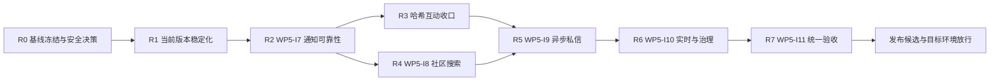

# 密码侦探社后续开发计划（2026-08-13）

> - 计划基线日期：2026-08-13
> - 建议执行窗口：2026-08-14 至 2026-09-25
> - 执行假设：单人主开发；具备后端、Web、Admin、Windows、QA 和目标环境操作权限
> - 当前权威规格：[密码侦探社项目规格说明书 v3.0](./密码侦探社项目规格说明书-v3.0.md)
> - 社区需求基线：[密码侦探社社区完整功能开发计划 v1.0](./密码侦探社社区完整功能开发计划-v1.0.md)
> - 前序计划：[密码侦探社下一阶段开发计划（2026-08）](./密码侦探社下一阶段开发计划-2026-08.md)


## 0.1 2026-08-14 范围调整：桌面端公告与参考 UI

根据用户 2026-08-14 的明确纠偏要求，本轮临时将桌面端重新纳入网页端主线之外的交付范围，优先完成两项可验收工作：Admin 桌面公告图片真实上传链路，以及 WPF 主窗口按参考图恢复经典紧凑布局。桌面端后续仍不扩展为独立 UI 设计探索，除非用户提供新的视觉稿；本轮完成后继续回到网页端功能和统一发布门禁。

验收出口：

- Admin 可上传 PNG/JPEG/WebP，公告编辑页能预览和移除已上传资源。
- WPF 窗口保持参考图的 730×591 分栏结构，能启动、选包、验证、提交、读取公告和显示首张图片。
- API、Admin、WPF 专项测试及构建通过；远端推送和目标环境部署完成后才可标记本轮交付。

## 1. 计划目的

本计划用于接替已经被实际开发进度超越的前序阶段计划，统一安排当前项目从“核心 MVP 基本完成、社区 WP5 部分完成”推进到“浏览器门禁恢复、社区完整范围交付、目标环境具备发布候选证据”的后续工作。

本轮不以继续增加页面数量为完成标准，而以以下结果为完成标准：

1. 当前已实现功能重新通过真实浏览器主旅程。
2. 已识别的后端并发、无障碍、移动端和管理端状态竞争缺陷关闭。
3. 管理员 MFA 策略与 v3.0 规格、API、页面和测试完全一致。
4. WP5-I7～I10 按依赖顺序完成，不把页面占位或接口草案标记为功能完成。
5. WP5-I11 和 M5 目标环境门禁形成可重复、可追踪、绑定候选提交的证据。
6. 当前本地提交安全同步到远端，并以同一 Git Tree 完成 CI、部署、迁移、冒烟和回滚验证。

## 2. 当前基线

### 2.1 已确认完成

- 核心 MVP 主流程基本形成：认证、浏览器本地指纹、精确查询、候选揭示、贡献、反馈、信誉、用户中心、管理端治理和 Windows 验证。
- WP5-I3～I6 的社区首页、帖子评论、点赞收藏、公开主页、关系、板块和群组已形成主要本地闭环。
- WP5-I7 已完成动态、回复/提及/关注通知、点赞摘要和群组治理通知的站内同步切片。
- 基础统一检查 `pwsh ./scripts/check.ps1 -SkipInstall` 已通过：API 189 通过、1 跳过，覆盖率 89.52%；Web、Admin、API Contract、桌面端测试与构建通过。
- 前端工程使用 pnpm，当前未发现 `package-lock.json` 或 `yarn.lock`。

### 2.2 当前验收阻断

2026-08-13 的 Chromium E2E 结果为 31 项中 16 项通过、15 项失败。失败归因包括：

- 真实缺陷：社区默认板块初始化并发冲突、三处文字颜色对比度不足、首页移动端横向溢出。
- 待定缺陷：系统设置历史版本选择可能存在异步请求覆盖。
- 测试契约过期：账号菜单、手工指纹查询标签、登录焦点顺序等测试仍使用旧界面流程。
- 安全决策已于 2026-08-14 重新确认：所有账号 TOTP 默认关闭；未启用账号允许进入管理端，主动启用后才强制动态码。

因此，当前版本不得进入正式发布或“全部完成”状态。

### 2.3 当前范围缺口

- WP5-I7：可靠事务 Outbox、失败重放、邮件摘要实际投递、通知 SSE/实时未读增强。
- WP5-I8：社区搜索。
- WP5-I9：异步私信。
- WP5-I10：实时聊天、断线补偿和私信治理。
- WP5-I11：目标环境、全浏览器、迁移、回滚、容量和最终证据门禁。
- 哈希详情页：评论分页、回复、编辑/删除、举报和通知联动。
- 核心生产验收：真实 MySQL/Redis HA、真实通知、Windows 实机、大文件、恢复和密钥轮换。

### 2.4 Git 交付基线

- 当前分支：`codex/m5-entry-gates`。
- 本地相对远端：领先 69 个提交、落后 0 个提交。
- 当前已有用户维护的 `AGENTS.md` 未提交修改；后续开发不得覆盖或擅自回退该修改。
- 在远端同步前，必须先关闭浏览器门禁并确认提交拆分、敏感文件和生成物边界。

## 3. 总体策略

### 3.1 优先级顺序



### 3.2 执行原则

1. **先恢复门禁，后扩展功能**：R1 完成前，不启动新的大型社区模块。
2. **后端事实优先**：数据库约束、权限、幂等、审计和重放先于页面。
3. **每轮最小闭环**：迁移、模型、服务、API Contract、页面、自动化和文档必须同轮关闭。
4. **测试跟随产品契约**：界面重构时同步更新 E2E，不允许长期保留明知过期的验收脚本。
5. **目标环境不由本地模拟替代**：MySQL、Redis、SMTP、SSE、多实例、Windows 实机和回滚必须保留真实证据。
6. **安全规则不隐式变更**：管理员 MFA、隐私投影、消息加密、对象级授权等变更必须先更新规格和决策记录。
7. **范围控制**：积分商城、公开 API 市场、移动 App、AI 猜密、明文反查和公共泄露库导入继续不进入本计划。

## 4. 里程碑总览

| 里程碑 | 建议窗口 | 目标 | 出口状态 |
|---|---|---|---|
| R0 基线冻结 | 08-14 | 决策、分支和验收范围确定 | 可安全开始修复 |
| R1 稳定化 | 08-14～08-19 | 修复真实缺陷并更新过期 E2E | Chromium E2E 全绿 |
| R2 通知可靠性 | 08-20～08-26 | 关闭 WP5-I7 | 站内/邮件/SSE 可追踪 |
| R3 哈希互动收口 | 08-27～08-31 | 完成详情页第二闭环 | 评论治理完整 |
| R4 社区搜索 | 09-01～09-07 | 完成 WP5-I8 | 搜索可替换、可重建 |
| R5 异步私信 | 09-08～09-16 | 完成 WP5-I9 | 私信安全闭环 |
| R6 实时与治理 | 09-17～09-22 | 完成 WP5-I10 | 实时、补偿、举报和风控闭环 |
| R7 统一验收 | 09-23～09-25 | 完成 WP5-I11/M5 候选门禁 | 形成发布候选结论 |

以上日期是单人开发的目标窗口。若 R1 或安全决策未按期关闭，后续里程碑整体顺延，不通过删减测试来维持日期。

## 5. R0：基线冻结与安全决策

**目标工期：0.5～1 个工作日。**

### 5.1 任务

- 冻结本轮候选范围，记录当前分支、提交 SHA、迁移 head、Node/pnpm/Python/.NET 版本。
- 保护 `AGENTS.md` 的既有用户修改，不将其混入无关功能提交。
- 对本地领先远端的 69 个提交执行提交主题、生成物、秘密材料和迁移连续性检查。
- 明确管理员 MFA 决策：本计划默认执行 v3.0，即特权角色必须完成 TOTP/MFA 才能进入管理端和调用管理 API。
- 若产品负责人决定管理员 MFA 可选，必须先修订 v3.0、安全模型、API 权限矩阵、E2E 和文档变更记录；不得只修改测试。
- 建立 R1 缺陷清单，将每个失败映射到代码、测试、负责人和关闭证据。

### 5.2 出口条件

- 管理员 MFA 决策无歧义。
- R1 的缺陷和过期测试清单已经冻结。
- 未提交用户文件与后续开发提交边界明确。
- 不存在迁移分叉、锁文件冲突或待提交秘密材料。

## 6. R1：当前版本稳定化与浏览器门禁恢复

**目标工期：3～4 个工作日；P0。**

### 6.1 后端修复

1. **社区默认板块初始化并发安全**
   - 将请求期“查询后插入”改为迁移期确定性种子或数据库原子 upsert。
   - 对 SQLite 测试和 MySQL 目标方言分别验证唯一约束、重复执行和并发首次访问。
   - 异常响应仍需经过统一错误处理中间件，避免 500 被浏览器误报为 CORS。

2. **管理员 MFA**
   - 未启用 TOTP 的特权账号只能进入受限登记流程，不能获得正常管理端访问。
   - 已启用 TOTP 的账号必须验证动态码。
   - `/admin/access-check` 和所有 MFA 管理 API 使用同一会话声明。
   - 补充无 TOTP、错误 TOTP、过期会话和降权账号负向测试。

### 6.2 Web/Admin 修复

- 调整语义色令普通小字号文字达到 WCAG AA 4.5:1，不在页面内硬编码颜色。
- 修复 390px 视口横向滚动；重点检查查询标签、卡片、文件输入和装饰层。
- 为系统设置详情请求增加请求序号、取消机制或“最后选择优先”保护。
- 检查设置发布、历史版本选择、回滚预览和草稿创建的状态一致性。
- 对 Web 大于 500 kB 的主 JavaScript chunk 进行路由级拆分评估；本轮至少形成可测量结果和后续阈值。

### 6.3 E2E 契约更新

- 账号菜单旅程改为通过头像菜单进入用户中心和执行退出。
- 核心查询旅程先切换“手工指纹查询”再填写摘要。
- Web/Admin 登录焦点测试包含“记住登录账号”复选框。
- 管理员首次登录测试与最终 MFA 决策一致。
- 所有更新保留业务断言，不允许简单删除失败断言。

### 6.4 验收命令

```powershell
pnpm lint
pnpm typecheck
pnpm test
pnpm e2e
pwsh ./scripts/check.ps1 -SkipInstall -IncludeE2E
```

### 6.5 出口条件

- Chromium E2E 31/31 通过，或测试数量增加后的全量套件 100% 通过。
- 已确认的 5 个真实缺陷全部关闭。
- 系统设置状态竞争得到代码修复或可重复证据证明不存在真实缺陷。
- 管理员 MFA 符合 v3.0，并通过 API 与浏览器负向测试。
- 基础统一检查继续通过，且工作区无非预期生成物。

## 7. R2：WP5-I7 通知可靠性收口

**目标工期：4～5 个工作日；P0。**

### 7.1 数据与后端

- 建立社区通知事务 Outbox，业务事实与待投递事件同事务提交。
- 使用稳定 `dedupe_key` 阻断重复事件；支持失败次数、下次重试时间和终态。
- Worker 实现指数退避、最大尝试次数、失败重放和结构化指标。
- 邮件摘要按用户偏好和聚合窗口生成，默认使用合成收件人完成测试。
- 增加通知 SSE：支持事件 ID、心跳、断线重连、游标补偿和权限过滤。
- 保证屏蔽、静音、群组私密性和内容删除状态在投递时再次校验。

### 7.2 Web/Admin

- 通知中心支持实时未读、连接状态、重连提示和分页补偿。
- Admin 提供最小化 Outbox 失败查询与受控重放入口；操作要求 MFA、原因、幂等和审计。
- 不在前端或日志显示邮件正文、消息秘密或私密群组成员信息。

### 7.3 出口条件

- 同一业务事件不会生成重复有效通知。
- Worker 重启、重复消费和短时 Redis 中断不会丢失数据库事实。
- SSE 断开后可以从最后事件 ID 恢复，无跨用户泄露。
- 邮件摘要至少在测试 SMTP/目标通知服务完成一次真实送达证明。
- 后端、Web、Admin、E2E、Worker 重放和故障路径测试通过。

## 8. R3：哈希详情页互动收口

**目标工期：2～3 个工作日；P1。**

### 8.1 功能

- 评论稳定游标分页。
- 一层或受控层级回复，并明确最大层级。
- 作者在允许窗口内编辑、删除评论，保留必要审计事实。
- 评论举报进入现有治理队列。
- 回复、评论点赞和处置结果接入 R2 通知链路。
- 已删除、隔离或无权限的哈希档案不泄露候选密码和私密互动资料。

### 8.2 出口条件

- 详情、点赞、投票、评论、回复、举报、治理和通知形成浏览器闭环。
- 分页无重复、无跳项；并发修改有版本或状态保护。
- 未匹配合法摘要仍可打开空档案，但浏览不自动创建事实记录。

## 9. R4：WP5-I8 社区搜索

**目标工期：5 个工作日；P1。**

### 9.1 架构

- 定义 `CommunitySearchProvider`，业务层不绑定单一数据库实现。
- 首版使用 MySQL FULLTEXT/ngram；SQLite 仅用于确定性测试替身，不作为生产能力证明。
- 搜索索引由 Outbox 增量更新，提供全量重建、断点续跑和差异核对工具。
- 明确主题、评论、用户和群组的可检索字段与排序规则版本。

### 9.2 安全与产品

- 搜索结果复用屏蔽、静音、私密群组、内容状态和账号状态过滤。
- 查询日志不得记录密码、令牌、邮件全文或其他敏感资料。
- Web 提供搜索入口、类型筛选、空状态、无权限状态和稳定分页。
- 管理端只展示聚合健康指标，不提供绕过权限的全量搜索。

### 9.3 出口条件

- 目标 MySQL 完成 ngram 能力预检。
- 增量索引和全量重建结果一致。
- 被删除、屏蔽、私密或停用内容不会出现在无权用户结果中。
- 搜索延迟和容量达到社区计划中的既定阈值。

## 10. R5：WP5-I9 异步私信

**目标工期：7 个工作日；P1。**

### 10.1 数据与安全

- 增加一对一会话、参与者、消息、已读游标、归档和静音模型。
- 服务端使用 AES-GCM 保护消息正文，密钥通过版本化密钥环管理；数据库不存储可直接读取的明文消息。
- 发送授权复用用户私信策略、屏蔽关系、账号状态和限流边界。
- 消息列表使用稳定游标；重试发送使用客户端消息 ID 和幂等键防重复。
- 定义数据导出、账号删除、保留期和治理最小披露规则。

### 10.2 Web

- 会话列表、消息历史、发送、已读、归档和静音。
- 明确加载、发送中、失败重试、被屏蔽、被停用和无权限状态。
- 不依赖实时连接也能完成异步收发闭环。

### 10.3 出口条件

- 两个合成账号可以完成创建会话、发送、接收、已读、归档和静音。
- 自己不能给自己发私信；屏蔽、策略禁止和停用账号均被服务端拒绝。
- 并发重试不产生重复消息。
- 数据库快照和普通日志不出现消息明文或密钥。

## 11. R6：WP5-I10 实时聊天与私信治理

**目标工期：4～5 个工作日；P1。**

### 11.1 实时能力

- 在 R2 SSE 基础上增加私信事件类型，不新建不兼容的第二套实时协议。
- Redis Pub/Sub 用于多实例分发，数据库事实和游标用于断线补偿。
- 心跳、连接上限、重连退避、最后事件 ID 和慢客户端处理均可配置、可观测。

### 11.2 治理

- 消息举报只提交必要消息引用和结构化原因，不向举报人暴露对方更多资料。
- 治理员读取消息内容必须具备明确权限、MFA、原因和不可变审计。
- 增加批量私信、短时爆发、重复内容和新账号滥用风控。
- 处置支持保留、限制发送、封禁和最小化证据链，不实现自动永久处罚。

### 11.3 出口条件

- 两个 API 实例间实时消息可达。
- Redis 短时中断后，客户端通过数据库游标补齐事件。
- 未授权用户不能订阅、枚举或读取其他会话。
- 举报、审核、处置和审计形成完整负向测试。

## 12. R7：WP5-I11 与 M5 统一验收

**目标工期：3～5 个工作日；P0。**

### 12.1 本地候选门禁

```powershell
pwsh ./scripts/check.ps1 `
  -SkipInstall `
  -IncludeE2E `
  -IncludeCrossBrowserE2E `
  -IncludeSecurity `
  -IncludeRecovery `
  -IncludePerformance `
  -IncludeMonitoring `
  -IncludeKeyRotation `
  -IncludeStability
```

按目标环境可用性继续执行 Staging、HA、Observation、Archive 和 Production Secrets 门禁。基础检查通过不得替代这些外部门禁。

### 12.2 目标环境验收

- 同一候选提交部署到目标 MySQL、Redis、Worker、Web、Admin 和 API。
- 从当前生产/预生产版本执行升级迁移、冒烟、回滚和再次升级。
- 验证搜索索引、Outbox、SSE 多实例、邮件摘要和私信密钥环。
- 执行 Windows 10/11 实机压缩包验证，覆盖大文件、取消、断网和升级检查。
- 验证备份恢复、密钥轮换、通知失败、Redis 中断和单实例退出。
- 形成绑定 Git SHA、配置摘要、迁移版本、制品 SHA-256 和检查和的证据包。

### 12.3 发布出口条件

- P0、P1 已知缺陷清零；豁免必须有明确期限、负责人和风险接受记录。
- Chromium、Firefox、WebKit 的 Web/Admin 主旅程通过。
- 目标 MySQL/Redis/SMTP/SSE/Windows 验证通过，不能用 SQLite 或合同夹具替代。
- 回滚不会破坏数据事实、密钥版本、消息游标或通知去重。
- 当前候选提交已推送远端，远端 CI 与本地候选为同一 Git Tree。
- 发布、观察和回滚命令已经写入运行手册并经过实际演练。

## 13. 横向工程任务

以下工作贯穿所有里程碑：

- API 新增或变更同步更新 `packages/api-contract`。
- 每个迁移执行 upgrade、downgrade、再次 upgrade，并验证 MySQL 方言。
- 所有复杂 Vue 组件至少有渲染测试；关键旅程有 Playwright。
- 前端继续使用 Vue 3、`<script setup lang="ts">`、Shadcn-Vue、Tailwind CSS 3 和严格 TypeScript。
- 不引入 Element Plus、Ant Design Vue，不在 `.vue` 中新增 `<style>` 或行内样式。
- 依赖管理只使用 pnpm，并维护 `pnpm-lock.yaml`。
- 新接口必须有对象级权限、限流、幂等、审计、错误码和敏感字段检查。
- 日志、截图、Trace、测试数据和文档示例只使用合成数据。
- 每个迭代同步更新阶段状态、需求追踪、模块映射和文档变更记录。

## 14. 建议提交与分支拆分

| 变更组 | 建议提交主题 | 说明 |
|---|---|---|
| R1 后端 | `fix(community): make board seeding concurrency-safe` | 独立迁移/服务/测试 |
| R1 Web | `fix(web): restore mobile and accessibility gates` | 语义色和移动端 |
| R1 Admin | `fix(admin): serialize settings detail selection` | 状态竞争 |
| R1 E2E | `test(e2e): align journeys with current navigation` | 不与产品缺陷混提交 |
| MFA | `fix(auth): enforce privileged mfa enrollment` | 规格、安全、API、UI、测试同组 |
| R2 | `feat(community): add reliable notification delivery` | Outbox、邮件、SSE |
| R3 | `feat(hashes): complete comment governance` | 哈希互动第二闭环 |
| R4 | `feat(community): add searchable community index` | Provider、索引、页面 |
| R5 | `feat(messages): add encrypted asynchronous messaging` | 私信基础 |
| R6 | `feat(messages): add realtime delivery and governance` | SSE、Pub/Sub、举报 |
| R7 | `chore(release): seal wp5 acceptance evidence` | 只包含证据与发布文档 |

若继续使用当前 `codex/m5-entry-gates` 分支，建议按以上变更组保持可审查提交；若需要创建新分支，使用 `codex/` 前缀。

## 15. 风险与缓解

| 风险 | 等级 | 缓解措施 |
|---|---|---|
| 69 个本地提交尚未同步远端 | 高 | 先完成审查和门禁，再分批推送；禁止直接以未验证 HEAD 发布 |
| 管理员 MFA 实现与规格冲突 | 高 | R0 冻结决策，R1 同步规格、代码和测试 |
| 请求期种子初始化并发写入 | 高 | 改为迁移或原子 upsert，增加并发测试 |
| Outbox、SSE、私信同时开发造成一致性复杂度 | 高 | 严格按 R2→R5→R6 依赖执行 |
| MySQL 搜索行为与 SQLite 测试替身不一致 | 高 | 将目标 MySQL 预检和重建核对设为出口条件 |
| 消息明文或密钥泄露 | 高 | AES-GCM、版本化密钥环、日志扫描、最小披露和恢复演练 |
| E2E 频繁因 UI 重构过期 | 中 | 使用稳定角色/标签契约，页面改动同提交更新旅程 |
| 前端主包继续增长 | 中 | 路由级懒加载、构建阈值和产物对比 |
| 文档状态互相矛盾 | 中 | 新计划作为当前执行入口，每轮同步四类事实文档 |

## 16. 每周检查点

### 每日

- 当前变更的定向测试通过。
- `git diff --check` 通过。
- 无非预期锁文件、秘密材料、浏览器 Trace 或测试数据库进入提交。

### 每个里程碑

- 运行对应的 lint、typecheck、test、build、迁移和 E2E。
- 更新需求状态为“已实现、部分实现、仅接口/页面、未实现或未验证”。
- 记录已关闭风险、新增风险和剩余目标环境证据。

### 每周末

- 运行基础统一检查。
- 核对本地与远端 ahead/behind。
- 复核迁移 head、API Contract 和文档链接。
- 更新下一周关键路径，不通过虚增完成度掩盖未通过门禁。

## 17. 最终完成定义

当前后续开发计划只有同时满足以下条件才视为完成：

1. R1～R7 的全部出口条件满足。
2. COMMUNITY-14～93 有逐项代码、测试和验收证据；未实施项必须被正式移出范围，而不是留作隐含缺口。
3. 基础统一检查、全浏览器 E2E、安全、恢复、性能、监控和目标环境门禁通过。
4. MySQL、Redis、SMTP、SSE、多实例和 Windows 实机证据完整。
5. 迁移、回滚、Outbox、索引重建和密钥轮换可重复执行。
6. 发布候选提交与远端 CI、部署制品、证据包绑定为同一 Git Tree。
7. 规格、阶段状态、需求追踪、模块映射、运行手册和文档变更记录已经同步。
8. 不存在未说明的 P0/P1 缺陷、未提交秘密或非预期工作区修改。

完成本计划代表项目具备发布候选资格，不自动等同于生产上线；最终上线仍取决于目标环境证据和发布门禁结论。


## 18. R1 第 1 轮执行记录：社区默认板块并发初始化

- 状态：代码实现、专项测试、统一本地门禁、远端推送和 Staging 部署验证完成；全量 E2E 仍被后续 R1 缺陷阻断。
- 已关闭：请求期先查后插导致的 `community_boards.code` 唯一约束竞态；自动建表启动期初始化窗口；同一 SQLite 数据库的双实例并发初始化。
- Staging 证据：提交 `d5d3800ff825` 已部署到 `/opt/password-detective-staging`；API/Web/Admin 镜像版本一致，MySQL 迁移为 `20260813_0034 (head)`；ready、Web、Admin 和社区板块 HTTP 冒烟通过，默认板块数量为 4。
- 变更证据：`apps/api/src/password_detective/modules/community/boards.py`、`apps/api/src/password_detective/main.py`、`apps/api/tests/test_community_board_seeding.py`、`docs/development/2026-08-13-r1-community-board-seeding.md`。
- 下一轮关键路径：处理 Chromium E2E 的 MFA 门禁、Web/Admin 导航契约和移动/无障碍视觉失败；每轮仍需通过本地门禁、远端推送和 Staging 部署验证。

## 19. R1 第 2 轮执行记录：Web 认证、视觉与移动端门禁收口

- 状态：代码实现、专项回归、统一本地门禁、远端推送和 Staging 部署验证完成；部署后的文档证据已回填。
- 已关闭：认证旅程仍依赖旧顶栏链接和直接退出按钮、固定注册账号导致重复运行冲突、手工指纹查询未显式切换标签、登录键盘顺序遗漏“记住登录账号”、移动首页查询区横向溢出，以及账户页和导航语义色对比度不足。
- 测试隔离：Web/Admin 登录生产默认限流保持每 IP 每 60 秒 10 次；Playwright 集成环境通过受控配置提高到 100，避免同一隔离进程内的多旅程互相污染。
- 验证证据：Web Chromium 19/19 通过；`pwsh ./scripts/check.ps1 -SkipInstall` 通过，包含 API 192 项（191 通过、1 跳过，覆盖率 89.40%）、Web 48 项、Admin 68 项、桌面端 11 项、迁移往返、lint、typecheck 和生产构建。
- 代码发布：提交 `e3458b0a465b` 已推送至 `codex/m5-entry-gates`，制品 SHA-256 为 `ea27366bc454ed017e4f23e6f308fc17a3be7624f82a0f8cd367f943d4f83005`。
- Staging 证据：制品已部署至 `/opt/password-detective-staging`，备份目录为 `/opt/password-detective-backups/20260813T182600Z-e3458b0a465b`；API、Web、Admin 镜像均为 `e3458b0a465b`，API 2 实例、Worker 3 实例运行健康，MySQL 迁移为 `20260813_0034 (head)`。
- 冒烟证据：`GET /api/v1/health/ready`、Web 根页面、Admin 根页面和 `GET /api/v1/community/boards` 均返回 HTTP 200；运行时 Web/Admin 登录限流均核验为 10。
- 后续关键路径：继续处理发布候选的真实浏览器回归、目标环境 UAT 和生产发布审批；本轮 Staging 通过不等同于生产上线批准。

## 20. R1 第 3 轮执行记录：Admin MFA、配置竞态与无障碍门禁收口（同日后续策略已取代）

- 本轮当时将管理端准入对齐为强制 TOTP；该决策已由第 23 节“默认关闭与主动启用”取代。当时规则为：管理员和审核员必须绑定并完成 TOTP 验证；未绑定账号登录后仅保存受限登记会话，只能进入 `/totp-setup`，`/admin/access-check`、再认证与其他管理 API 返回 `auth.totp_setup_required`。
- 本轮当时将 Admin 登录文案改为强制 MFA，并兼容旧会话；该实现已由第 23 节删除：路由同时检查 `enrollmentOnly` 与用户 `totp_enabled` 状态，避免旧版会话绕过绑定页。
- 系统配置版本列表和详情加载引入单调请求序列门禁；刷新会使旧详情请求失效，快速切换历史版本时只允许最后一次选择写入表单，避免 21/22 配额被迟到响应覆盖。
- 举报/申诉与风险告警列表统一使用高对比度次级按钮状态，选中态以语义化边框和焦点环表达，关闭移动端 WCAG AA 颜色对比度缺陷。
- 管理端登录键盘旅程补充“记住登录账号”复选框，首次 TOTP 闭环使用精确“仪表盘”导航定位，避免同名入口导致严格定位冲突。
- 最终统一门禁 `pwsh ./scripts/check.ps1 -SkipInstall -IncludeE2E` 通过：API 192 项（191 通过、1 跳过，覆盖率 89.42%）、API Contract 2 项、Web 48 项、Admin 70 项、Web/Admin Chromium 31 项和 Windows 桌面端 11 项全部通过。
- 本地候选提交为 `ed76f87c675fd55dfa888a819d7543ac405fdfed`。常规 Git HTTPS 推送连续遭遇连接重置/超时后，使用 GitHub Git Data API 将同一 Git Tree `d0782d10dcf127bbe3c1a9b09fa7157f13ed29c7` 同步为远端提交 `a2ebd5cd5950681df28da5439ce80842f80e6342`；`equivalent_tree=true`。
- Git 归档制品 `password-detective-ed76f87c675f.tar.gz` 的 SHA-256 为 `5d21faf85d2c3401a06e5aebdef942f9ad9490aa46dfc4d515770657135b4348`。首次服务器前端构建因 Corepack 访问 npm registry 超时，在服务滚动前中止；随后改用已经通过统一门禁的本地 Web/Admin `dist` 制品离线派生镜像，两个静态制品 SHA-256 分别为 `d9ba08141903fa1e79be14eff11d8899494fb49c3b2b4555099ee83efe4f839c` 和 `ea82fefb48123289b407e8dd5278b1396c01dabdbf022df1e748b655ade640bf`。
- Staging `/opt/password-detective-staging` 已部署版本 `ed76f87c675f`，备份位于 `/opt/password-detective-backups/20260814T005240Z-ed76f87c675f`。API 2 实例、Worker 3 实例、Scheduler、Web 和 Admin 均运行本轮镜像，数据库迁移保持 `20260813_0034 (head)`。
- 服务器本机 ready、社区板块、Web、Admin 均返回 HTTP 200；公网 Web/Admin 入口及其 `/api` 代理返回 HTTP 200。公网直接访问宿主 `:8000` 返回 502，该端口不作为当前对外发布入口，后续若开放独立 API 域名需另行配置和验收入口层。API 源码与 Admin 静态包均包含本轮 MFA 门禁标记。

### 7.4 2026-08-14 本轮执行状态：网页端通知可靠性第一轮

本轮聚焦网页端，桌面端因 UI 设计尚未冻结暂不纳入新增开发范围。已完成以下最小闭环：

- `community_notification_outbox` 事务 Outbox、稳定 `dedupe_key`、投递状态、尝试次数、退避时间和终态错误码。
- Celery Worker/Beat 每 2 秒扫描待投递事件，并在投递前重新校验通知偏好、屏蔽关系、主题可见性和已下架状态。
- `GET /api/v1/community/notifications/stream` SSE：认证、`Last-Event-ID`、初始 ready 事件、心跳、游标补偿、跨用户隔离和可见性过滤。
- Web 全局账户菜单实时未读数、连接状态、断线重连和用户会话级游标；通知中心原有分页接口继续作为初始快照来源。

本轮不是 WP5-I7 全部完成。邮件摘要真实投递、Admin Outbox 失败查询/受控重放、通知中心列表的实时插入与分页合并、Redis Pub/Sub 多实例优化和目标环境真实 SMTP 送达仍待后续轮次。

本轮出口证据必须包含：API 社区测试、Web Vitest/typecheck、Ruff、迁移前滚/回滚、统一门禁、远端提交、Staging 迁移至 `20260814_0035`、Worker/Scheduler 运行状态、SSE 公网连接和至少一条真实浏览器通知未读旅程。


### 7.5 2026-08-14 本轮执行状态：网页端通知中心实时合并

本轮继续限定为网页端开发，桌面端保持冻结。通知状态已收口到共享 Pinia Store，全局账户菜单与通知中心共用未读数和 SSE 连接状态；通知中心可按当前筛选实时插入、按通知 ID 去重并稳定倒序，同时保护列表请求期间到达的实时事件不被旧快照覆盖。单条/全部已读会同步更新全局未读状态，页面新增连接状态和“实时收到”标识。

本轮完成后，WP5-I7 的网页站内通知已具备 Outbox、Worker、SSE、断线补偿、全局未读和通知中心实时合并闭环。尚未完成的关键项为邮件摘要真实投递、Redis Pub/Sub 多实例优化、多标签页同步和目标环境容量验证；Admin Outbox 失败查询/受控重放由下一小节记录的第三轮完成。执行证据见 `../docs/development/2026-08-14-r2-community-notification-inbox.md`。


### 7.6 2026-08-14 本轮执行状态：Admin 社区通知 Outbox 运维闭环

本轮继续限定为网页端开发，Windows 桌面端不新增功能。Admin 新增 `/community/notifications` 通知运维入口，展示待投递、失败、24 小时失败、到期待处理和最老积压指标，并支持按状态、通知类型和错误码查询最小化投递元数据。

单条重放只接受 `failed` 事件，要求管理员已完成登录 MFA，并再次使用当前密码和 TOTP 申请用途为 `admin_community_notification_ops` 的短时一次性凭据。服务端在行锁内验证状态、消费凭据、清空失败状态、增加重放次数并写入审计；事件随后由 Worker 重新检查通知偏好、屏蔽关系和内容可见性，管理接口不直接绕过安全规则完成投递。请求同时受限流与 `Idempotency-Key` 保护。

本轮完成后，WP5-I7 的网页站内通知运维具备“业务同事务入队 → Worker 投递 → SSE/通知中心消费 → Admin 失败查询 → 受控重放 → 审计”的闭环。后续优先级转为邮件摘要真实投递与目标 SMTP 验收，其次是 Redis Pub/Sub 多实例优化、多标签页同步和长连接容量验证。执行证据见 `../docs/development/2026-08-14-r2-community-notification-outbox-ops.md`。


## 23. R3 第 1 轮执行记录：Admin TOTP 改为默认关闭与主动启用

- 按最新产品决策修订 v3.0 `AUTH-04`：管理员、审核员与普通用户的 TOTP 均默认关闭；管理端登录不再强制首次绑定。
- API 管理准入改为条件 MFA：未启用 TOTP 的特权账号可使用密码登录并访问管理端；主动启用后，登录、刷新会话和管理 API 继续要求当前会话完成动态码验证。
- Admin 删除 `enrollmentOnly` 受限登记会话与 `/totp-setup` 强制跳转；TOTP 设置页保留为可选安全增强入口，旧会话中的冗余登记字段会被兼容忽略。
- 高风险操作仍要求当前密码和一次性再认证凭据；仅当账号已启用 TOTP 时附加动态码要求。现有已启用 TOTP 的账号不会被自动停用，也不迁移或清除密钥。
- 回归覆盖未启用 TOTP 的管理员准入/再认证、主动启用后的动态码门禁，以及 Admin 登录与可选设置页文案。

## 24. R3 第 2 轮执行记录：总哈希池、用户审批与公告体验

- 状态：代码实现、专项测试、统一门禁、远端推送、Staging 部署和公网 HTTP 冒烟完成；真实浏览器与 Release 实机验收待收口。
- 已完成：`GET /api/v1/admin/hash-pool` 及 Admin 总哈希池；用户审批手动创建用户；用户等级与权益迁移；Web 右下角公告弹窗；Windows 公告基址补全和无缓存刷新。
- 关键约束：总哈希池仅读取 `verified` 候选；Web/桌面公告不展示秘密；HTML 仅纯文本化；图片和操作链接限制为 HTTP(S)；手动创建不允许管理员或服务账号角色。
- 专项证据：API 哈希池/用户创建测试，Admin lint/typecheck/80 tests，Web lint/typecheck/54 tests，Windows 29 tests，`pwsh ./scripts/check.ps1 -SkipInstall` 全量通过；Staging 功能树 `98ff447813a9`，备份 `/opt/password-detective-backups/20260814T205107Z-98ff447813a9`。
- 下一轮顺序：真实浏览器公告和已登录 Admin 旅程 → Release 实机与多格式回归 → 正式回滚演练 → 邮件摘要、Redis Pub/Sub 多实例与 SSE 容量验证。


## 25. R3 第 3 轮执行记录：桌面公告与 Web 公告独立化

- 桌面端公告继续使用 `desktop_announcements`、`/desktop/announcements` 和“桌面公告”管理工作区；Web 公告新增独立表、`/web/announcements` 和“Web 公告”工作区，历史桌面公告不迁移到 Web。
- Web 公告新增自动关闭秒数：后台输入 `0` 表示关闭自动计时，API 持久化为 `null`；有效计时范围为 1～86400 秒，默认 10 秒。
- Web 弹窗只消费 Web 公告。手动关闭继续持久化到浏览器，自动关闭只影响当前页面生命周期，下一次访问仍可重新显示。
- 本轮验收范围：API 隔离/CRUD/图片/秒数测试，Admin 与 Web lint/typecheck/Vitest，统一门禁，远端同树推送，Staging 迁移与两个公开公告接口独立冒烟。
- 下一步优先级：真实浏览器计时与手动关闭旅程、Web 公告已登录后台 CRUD E2E、桌面 Release 实机回归、正式回滚演练。

## 26. R3 第 4 轮执行记录：Web 公告真实浏览器验收

- 本轮目标：补齐 Web 公告自动关闭、手动关闭及已登录 Admin 创建/发布旅程，避免仅依赖组件测试和接口测试。
- 已完成：
  - Admin Chromium E2E：登录管理端，创建 Web 公告草稿，保存 `2` 秒自动关闭配置，验证草稿反馈，再发布并验证已发布状态。
  - Web Chromium E2E：验证 `1` 秒自动关闭弹窗真实隐藏、公开接口返回 `auto_close_seconds`，以及无自动关闭公告的手动关闭和 `localStorage` 持久化。
  - 修复 Admin Web 公告保存、发布、归档后重新加载记录会清空成功提示的页面状态问题。
- 验收结果：新增浏览器旅程 3/3 通过；E2E TypeScript、ESLint、Admin typecheck 通过。
- 后续优先级：Firefox/WebKit 浏览器兼容性旅程、桌面 Release 实机回归、多格式压缩包验收和正式回滚演练。

## 27. R3 第 5 轮执行记录：Web 公告图片上传与外链真实验收

- 本轮目标：把 Web 公告图片与外链从接口/组件层验证推进到 Admin、Web 浏览器真实闭环，并消除跨浏览器 E2E 的状态污染。
- 已完成：
  - Admin 浏览器旅程真实上传合成 PNG，校验上传响应的类型、大小和 SHA-256，保存图片 URL 与点击外链，重新加载后验证预览、表单值和发布结果。
  - Web 浏览器旅程真实加载公告图片，校验 `naturalWidth > 0`，点击图片打开后台配置的 HTTP(S) 外链，并覆盖自动关闭、手动关闭与按 revision 的 `localStorage` 持久化。
  - 修复 Shadcn `Input` 文件类型错误绑定 `v-model` 导致的 `InvalidStateError`；文件输入改为保留原生文件值，文本输入继续使用受控模型。
  - Vite 开发代理支持 `VITE_API_PROXY_TARGET`，Playwright 按 `web-*`/`admin-*` 规范隔离项目，避免管理端用例误进入 Web 项目。
  - 修复 Admin 真实浏览器门禁中的工作台标题、不可变草稿按钮等陈旧选择器；增加公告弹窗等待/清理，避免异步弹窗遮挡后续 Web 旅程。
- 验收结果：
  - Admin Web 公告上传/发布与 Web 图片点击外链 Chromium、Firefox、WebKit 真实浏览器旅程均通过。
  - 按浏览器分别执行 37 项 E2E：Chromium 37/37、Firefox 37/37、WebKit 重跑 37/37；WebKit 首次整组仅出现一次公告弹窗时序抖动，单项复跑及整组重跑通过。
  - 目标代码检查、TypeScript、Vitest 与统一质量门禁作为本轮提交前置门禁继续执行。
- 下一步优先级：桌面 Release 实机回归（含 RAR/TAR/GZ/TGZ/BZ 等格式）、公告图片资源 Staging/公网缓存验证、正式回滚演练和生产发布证据归档。

## 28. R3 第 5 轮发布收口记录

- 远端分支 `codex/m5-entry-gates` 已指向提交 `7531c634188a`；Staging `/opt/password-detective-staging` 已部署同版本，备份为 `/opt/password-detective-backups/20260815T062828Z-7531c634188a`。
- Staging 运行态：API 2、Worker 3、Scheduler、Web、Admin 及监控服务正常，迁移 `20260814_0039 (head)`；服务器本机 ready、桌面公告、Web 公告接口 HTTP 200。
- 公网验收：`http://111.229.195.138:5173` Web、`http://111.229.195.138:5174` Admin 及两者 `/api/v1` 代理的 ready、桌面公告、Web 公告接口均 HTTP 200。
- 风险记录：公网 `:8000` 直连 HTTP 502，当前对外入口为 Web/Admin 的 `/api` 代理；下一轮单独处理 API 直连入口配置与真实 Windows Release 实机回归。
- 本轮状态：网页端公告图片上传、弹窗展示、外链点击、自动关闭与跨浏览器真实旅程已完成并部署；下一轮优先处理桌面 Release 实机和压缩格式验收、图片公网缓存以及回滚演练。

## 29. R3 第 6 轮执行记录：Web 公告图片公网缓存条件请求

- 本轮目标：落实上一轮计划中的公告图片资源 Staging/公网缓存验证，避免内容寻址图片在重复访问时被反复传输。
- 已完成：
  - 公开 Web 公告图片响应显式携带内容寻址 ETag、长期不可变缓存策略和 `Content-Disposition: inline`。
  - 支持 `If-None-Match` 精确 ETag、弱 ETag 与 `*` 条件请求，命中时返回 HTTP 304 且不返回图片正文。
  - API 回归测试覆盖首次 200、缓存头、ETag、304 状态、304 缓存头和空响应体。
- 本轮边界：仅增强 Web 公告图片 HTTP 缓存协商，不变更公告数据模型、Admin 上传流程、Web 弹窗逻辑或桌面端。
- 下一步优先级：Staging/公网真实 200→304 验收、API 直连入口配置、正式回滚演练和 Windows Release 多格式压缩包实机回归。

## 30. R3 第 7 轮执行记录：哈希详情评论稳定分页

- 本轮继续网页端主线，完成哈希详情评论的稳定游标分页首个切片；桌面端不在本轮范围内。
- API 新增 `GET /api/v1/hashes/{algorithm}/{digest}/comments`，支持 `cursor` 与 `limit`（1～50），响应包含 `items`、`next_cursor` 和 `has_more`。
- 评论按“最新优先、创建时间与评论 ID 双键稳定排序”返回；下一页使用不透明 URL-safe 游标，非法游标返回 `hash.invalid_cursor`，避免页码分页在新增评论时出现重复或跳项。
- 哈希详情响应新增 `comment_count` 与 `comments_next_cursor`，首屏最多返回 20 条评论；Web 端显示总评论数并提供“加载更多评论”，追加时按评论 ID 去重。
- 评论发布后重新显示最新首屏；对已加载旧评论点赞时保留当前分页列表和游标，仅更新目标评论状态，避免交互后列表回退到首屏。
- 公告图片缓存上一轮已补充真实 Staging/公网证据：Web 与 Admin `/api` 入口首次请求 HTTP 200，携带内容寻址 ETag 和长期不可变缓存头；同 ETag 条件请求返回 HTTP 304。测试使用合成 1×1 PNG，验收后已删除服务器临时文件。
- 公网 `:8000` 不可达的根因是 Staging HA 代理明确绑定 `127.0.0.1`；当前对外 API 入口继续使用 Web/Admin 的 `/api` 反向代理。本轮不在无 TLS 和独立入口治理的情况下开放裸 API 端口。

## 31. R3 第 8 轮执行记录：第三方桌面端授权与管理员治理工作台

- 本轮继续网页端主线，完成第三方桌面端 API v1 的用户授权闭环和管理员治理入口；桌面端 UI、压缩格式和公告数据模型不在本轮范围内。
- Web 端新增 OAuth 授权确认页与已授权应用页，支持 Scope 审阅、同意/拒绝、已授权应用查看与撤销。
- API 增加 OAuth consent 详情/决策、已授权应用列表和用户撤销接口；撤销授权会同步吊销对应 Token 会话。
- Admin 端新增第三方应用治理页面，支持管理员手动创建、审核、可信验证直入总哈希池授权、暂停、恢复和撤销；后续可在现有 `application_source=developer_self_service` 基础上扩展开发者自助申请并由管理员审核。
- 本轮专项验证：Web 58/58、Admin 84/84；Web/Admin typecheck 与 lint 通过；第三方 OAuth API pytest 7/7（含授权确认、已授权应用列表与撤销授权），Ruff 通过。
- 交付状态：统一门禁、远端分支等价树校验和 Staging 部署已通过；新 OAuth consent、已授权应用和 Admin 第三方应用治理入口在 Staging 均可访问，未登录保护请求返回 401。
- 下一步优先级：完成登录态真实浏览器 OAuth/PKCE 合成数据验收，编写面向其他开发者的 API v1 接入文档，并继续开发开发者自助申请、管理员审核和密钥轮换入口。

## 32. R3 第 9 轮执行记录：第三方 API 页面运行态与开发者合同

- 修复第三方授权确认、已授权应用和 Admin 第三方应用工作区在真实 RouterView 下的空白页，管理端主导航补齐“第三方 API”。
- 新增三条页面运行态源码回归和 Web/Admin Chromium 路由旅程；页面必须渲染标题与核心工作区，且浏览器控制台无非预期错误。
- 发布第三方 API v1 的 TypeScript 稳定合同和开发者文档，固定 OAuth/桌面端点、Scope、Grant Type、Token 轮换、canonical payload 字段顺序和错误处理。
- 本轮本地验证：统一门禁通过；Web 60/60、Admin 85/85、API contract 3/3、桌面端 29/29；Chromium、Firefox、WebKit 的 Web/Admin 第三方页面旅程共 6/6 通过。
- 本轮交付出口：精确提交推送、Staging 使用同一 Git Tree 部署，并复验三个页面入口及 OpenAPI 路由。
- 下一开发切片：实现 `hash:read` 对应的哈希详情/评论只读适配；随后实现第三方桌面公告与更新检查，分别补充最小权限 Scope、限流、隐私投影和跨应用隔离测试。

## 33. R3 第 10 轮执行记录：第三方 `hash:read` 哈希详情与评论只读适配

本轮目标是把已进入 OAuth Scope 合同的 `hash:read` 落成可供第三方桌面端稳定调用的最小只读能力，并继续复用站点现有总哈希池安全投影和评论稳定分页。

已实现：

1. 新增 `GET /api/v1/third-party/hashes/{algorithm}/{digest}`，返回命中状态、安全哈希详情、评论汇总和当前授权用户的互动状态。
2. 新增 `GET /api/v1/third-party/hashes/{algorithm}/{digest}/comments`，支持 1～50 条稳定游标分页。
3. 两个端点统一要求 `hash:read`，复用第三方应用、用户授权与 Token family 校验；响应禁用共享缓存并配置独立限流。
4. 复用既有哈希详情安全投影，候选密码仅返回掩码，不公开明文、密文、nonce 或密钥材料。
5. 新增第三方应用/授权用户维度审计，审计只记录算法、命中状态和返回数量，不记录摘要或秘密内容。
6. `packages/api-contract` 增加稳定路径和响应类型别名，API 集成测试覆盖命中、未命中、用户态投影、评论游标、缺少 Scope 和缺少 Token。

本轮交付出口：

- 目标测试、契约测试、Ruff、统一质量门均通过。
- 仅提交本轮 API、契约、测试和 Markdown 文档；保留用户已有的 `AGENTS.md`、`SKILL.md` 与 `易语言桌面ui.e` 未提交修改。
- 推送远端后部署至 Staging，复验健康检查、OpenAPI 路由与未授权访问保护。

下一轮优先开发：

1. 第三方桌面公告只读适配与独立 Scope。
2. 第三方桌面版本/升级检查只读适配与独立 Scope。
3. 使用合成应用和合成用户补齐 Staging 登录态 OAuth/PKCE、普通/可信回执、应用暂停与授权撤销联动验收。

### 第 10 轮交付结果（2026-08-15）

- 统一质量门输出 `All checks passed!`；定向第三方哈希 API 3/3、共享 API 合同 3/3、Ruff 与 `git diff --check` 通过。
- 功能提交 `5301e35a7e3cd8382bdcaf9f9438c9588de67ba7` 已按等价 tree 推送至远端 `codex/m5-entry-gates`，远端提交为 `6fe31eca72b5fb05a0caa92ff3d7b0576a170b35`。
- Staging 部署修订 `5301e35a7e3c`：迁移为 `20260815_0041 (head)`，API 2 个、Worker 3 个，Scheduler/Web/Admin 与 API 均切换到本轮镜像。
- Staging OpenAPI 已加载两个第三方哈希路径；详情和评论在无 Token 时均返回 401，OAuth consent、已授权应用与管理员第三方应用接口也继续保持 401 防护。


## 34. R3 第 11 轮执行记录：第三方桌面公告与更新检查只读适配

- 本轮目标：在既有 PKCE Principal 与 `hash:read` 只读适配基础上，增加第三方桌面端公告和版本检查能力；桌面端 UI 和压缩格式解析仍不在本轮范围内。
- API 新增 `GET /api/v1/third-party/announcements`，使用独立 `announcements:read` Scope，复用已发布且处于有效时间窗的桌面公告数据，并只返回桌面客户端所需的安全字段。
- API 新增 `GET /api/v1/third-party/updates/check`，使用独立 `updates:read` Scope，复用桌面版本发布筛选和制品完整性规则，返回版本、强制升级、下载地址和 SHA-256 完整性信息，不返回内部分发授权字段。
- 两个第三方端点均使用 `private, no-store`，保留独立限流键和第三方应用调用审计；未登录返回 401，缺少对应 Scope 返回 403，公告 Scope 与更新 Scope 不能互相调用。
- `packages/api-contract` 已固定新增 Scope、路径和响应接口；Admin 第三方应用创建的 Scope 白名单同步扩展，后续仍由管理员手动创建和审核。
- 当前状态：代码、定向测试与静态质量检查已完成，待统一质量门禁、远端同步、Staging 部署和目标环境复验。
- 下一轮优先级：合成数据 OAuth/PKCE 真实浏览器验收、应用暂停/撤销与令牌失效旅程、第三方开发者自助申请的管理员审核扩展。
