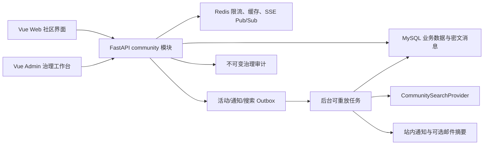

# 密码侦探社社区完整功能开发计划 v1.0

| 元数据 | 内容 |
|---|---|
| 文档状态 | 当前有效 |
| 基线日期 | 2026-08-12 |
| 负责人 | 项目开发代理 |
| 替代关系 | 扩展 `WP5` 社区论坛第 1～2 次迭代，不替代项目总规格与总实施计划 |

## 1. 目标与范围

本计划将当前已经完成的“固定分区、主题、回复、举报、MFA 治理”扩展为完整但边界清晰的社区系统，覆盖：

1. 论坛首页。
2. 帖子发布。
3. 帖子详情。
4. 评论和回复。
5. 点赞、收藏。
6. 用户关注与粉丝关系。
7. 私信或站内聊天。
8. 社区群组与可配置板块。
9. 社区动态信息流。
10. 用户公开主页。
11. 社区搜索。
12. 社区通知中心。
13. 用户之间的直接互动，包括回复、提及、关注、私信、屏蔽和举报。

本计划坚持以下边界：

- 社区不得展示、搜索、发送或索引候选密码、解压密码、访问令牌、密钥、邮箱、IP、设备标识和压缩包原文。
- 用户生成内容首版继续采用纯文本；链接自动识别必须使用安全白名单，不执行用户 HTML、Markdown 内嵌 HTML 或脚本。
- 私信采用服务端加密存储和访问控制，不宣称端到端加密；首版禁止文件、图片和压缩包附件。
- 当前四个固定板块平滑迁移为可配置板块，不能破坏现有主题、链接和 API 客户端。
- 先交付可审计、可治理的异步站内消息，再增加基于 Redis 的实时推送，不以实时能力阻塞基础私信可用性。
- 不复制 Zibll 的 PHP、CSS、JavaScript 或专有资源，仅参考通用论坛信息架构并使用项目现有 FastAPI、Vue 3、Shadcn-Vue、Tailwind CSS、MySQL、Redis 技术栈重新实现。

## 2. 当前基线

截至 2026-08-12，社区已经具备：

| 能力 | 当前状态 | 现有依据 |
|---|---|---|
| 论坛入口 | 已实现 | Web `/community` |
| 固定板块 | 已实现 | `general`、`recovery_guides`、`verification`、`security` |
| 主题发布和详情 | 已实现首版 | 已验证账号、规则确认、纯文本、限流、幂等 |
| 评论和父回复 | 已实现首版 | `community_comments.parent_id` |
| 举报和治理 | 已实现 | 用户举报、MFA 队列、移除、锁定、置顶、恢复、审计 |
| 点赞、收藏 | COMMUNITY-32～35 首版已实现；点赞摘要通知未实现 | WP5-I4 / WP5-I7 |
| 关注、粉丝、公开主页 | COMMUNITY-37～44 本地已实现 | WP5-I5；目标 MySQL 与浏览器回归待部署复核 |
| 可配置板块、群组 | 未实现 | 本计划 WP5-I6 |
| 动态信息流、通知 | 未实现 | 本计划 WP5-I7 |
| 社区搜索 | 未实现 | 本计划 WP5-I8 |
| 私信、站内聊天 | 未实现 | 本计划 WP5-I9～I10 |

## 3. 产品信息架构

### 3.1 Web 路由规划

| 路由 | 页面 | 访问边界 |
|---|---|---|
| `/community` | 社区首页与综合信息流 | 公开读取；个性化内容需登录 |
| `/community/boards/:boardCode` | 板块首页 | 按板块可见性控制 |
| `/community/posts/new` | 发布帖子 | 登录、邮箱验证、规则确认 |
| `/community/posts/:postId` | 帖子详情 | 按帖子、板块、群组可见性控制 |
| `/community/groups` | 群组发现 | 公开群组可匿名浏览 |
| `/community/groups/:groupSlug` | 群组主页 | 私密群组仅成员可见 |
| `/community/feed` | 关注动态 | 登录 |
| `/community/search` | 社区搜索 | 公开内容可匿名搜索；私密范围需授权 |
| `/community/notifications` | 通知中心 | 登录，仅本人 |
| `/community/messages` | 私信会话列表 | 登录、邮箱验证，仅本人 |
| `/community/messages/:conversationId` | 私信会话 | 会话成员，仅本人 |
| `/community/users/:username` | 用户公开主页 | 公开，但遵循用户隐私设置和屏蔽关系 |
| `/community/users/:username/followers` | 粉丝列表 | 公开或资料所有者本人；屏蔽关系不可旁路 |
| `/community/users/:username/following` | 关注列表 | 公开或资料所有者本人；屏蔽关系不可旁路 |
| `/community/settings` | 社区资料与隐私设置 | 登录，仅本人 |

### 3.2 首页组成

社区首页采用移动端优先布局，按以下顺序渐进增强：

1. 板块导航和社区规则入口。
2. 置顶/公告主题。
3. 最新、热门、关注三个信息流标签。
4. 推荐群组和活跃用户，只使用公开统计。
5. 登录用户的未读通知、私信摘要。
6. 发布入口；未验证用户显示邮箱验证引导。

“热门”必须由可解释的时间衰减公式生成，不允许只按累计点赞长期霸榜。建议初版：

```text
hot_score = reply_count * 3 + like_count * 2 + unique_recent_view_count - age_hours * 0.35
```

浏览量只保存按小时、匿名化后的聚合计数；不得保存公开可查询的用户浏览轨迹。

## 4. 功能需求与验收标准

### 4.1 论坛首页（COMMUNITY-14～18）

- **COMMUNITY-14** 首页展示可见板块、公告、置顶主题、最新主题和热门主题，并提供稳定分页或游标。
- **COMMUNITY-15** 匿名用户只能看到公开板块和公开主题；登录用户可看到自己有权访问的群组内容。
- **COMMUNITY-16** 首页列表响应使用主题摘要，不返回完整正文、邮箱或其他隐私字段。
- **COMMUNITY-17** 热门排序规则必须版本化并可测试；管理员调整规则必须进入系统设置版本和审计。
- **COMMUNITY-18** 首页在移动端 360px 宽度下不得横向溢出，首屏核心内容具备加载骨架、空状态和失败重试。

### 4.2 帖子发布与帖子详情（COMMUNITY-19～25）

- **COMMUNITY-19** 已验证用户可选择有发帖权限的板块或群组发布主题；标题 4～120 字，正文 20～10000 字。
- **COMMUNITY-20** 发布使用 `Idempotency-Key`、服务端规则确认、频率限制和内容规范校验。
- **COMMUNITY-21** 支持草稿、发布、作者编辑和作者主动删除；编辑保留版本号、更新时间和最小审计，不公开历史正文。
- **COMMUNITY-22** 主题详情返回作者公开卡片、板块/群组、发布时间、编辑状态、点赞数、收藏状态、回复数和治理状态。
- **COMMUNITY-23** 主题永久链接使用不可变 ID；标题修改不得改变既有链接。
- **COMMUNITY-24** 锁定主题禁止普通用户继续回复，但允许作者收藏、用户取消互动和治理人员执行审核。
- **COMMUNITY-25** 被下架、私密或无权限的主题不得通过详情、列表、搜索、动态流、通知摘要旁路泄露正文。

### 4.3 评论和回复（COMMUNITY-26～31）

- **COMMUNITY-26** 评论采用两级展示：根评论和对根评论的回复；数据库保存 `root_id`、`parent_id`、`reply_to_user_id`，禁止无限嵌套 UI。
- **COMMUNITY-27** 评论独立游标分页，帖子详情不得一次返回无上限评论集合。
- **COMMUNITY-28** 用户可编辑和删除自己的评论；删除后保留结构占位，避免子回复上下文断裂，正文不再公开。
- **COMMUNITY-29** 回复和 `@用户名` 提及生成站内通知；同一动作对同一接收者只生成一条业务通知。
- **COMMUNITY-30** 评论、回复、编辑、删除均需权限检查、端点限流；创建和危险写操作使用幂等键。
- **COMMUNITY-31** 主题公开回复数只统计公开评论；逻辑删除、治理移除和恢复必须一致修正投影。

### 4.4 点赞和收藏（COMMUNITY-32～36）

- **COMMUNITY-32** 用户可点赞/取消点赞主题和评论；唯一约束保证同一用户对同一目标只有一个有效点赞。
- **COMMUNITY-33** 用户可收藏/取消收藏主题；收藏列表仅本人可见，不向作者披露收藏者清单。
- **COMMUNITY-34** 点赞数使用服务端投影并可从关系表重建；重复请求不得重复计数。
- **COMMUNITY-35** 被移除或无权访问的内容不能新增点赞/收藏；用户仍可从自己的收藏列表移除失效引用。
- **COMMUNITY-36** 点赞可产生合并通知，例如同一主题短时间内的多个点赞合并为摘要，避免通知轰炸。

### 4.5 用户关注、粉丝与公开主页（COMMUNITY-37～44）

- **COMMUNITY-37** 用户可关注/取消关注其他有效用户，禁止关注自己，唯一约束防止重复关系。
- **COMMUNITY-38** 公开主页仅展示用户名、公开显示名、合成头像、角色、等级、公开简介、注册月份、公开统计和允许公开的主题/评论。
- **COMMUNITY-39** 邮箱、登录状态、最后活动时间、IP、设备、精确注册时间、积分明细和私密群组不得进入公开主页。
- **COMMUNITY-40** 用户可配置“是否公开关注列表”“是否公开粉丝列表”“谁可以私信我”“谁可以提及我”。
- **COMMUNITY-41** 屏蔽是强约束：双方不能关注、私信或提及；既有关注关系自动失效，动态流默认互相隐藏。
- **COMMUNITY-42** 静音是本人视图过滤，不通知对方，不改变对方访问公开内容的权限。
- **COMMUNITY-43** 粉丝数、关注数使用可重建投影；锁定或禁用账号不进入推荐用户列表。
- **COMMUNITY-44** 用户名变更策略必须在公开主页开发前固定；初版保持用户名不可变，显示名可修改并经过规范校验。

### 4.6 社区群组和可配置板块（COMMUNITY-45～54）

- **COMMUNITY-45** 将四个固定板块迁移到 `community_boards`，保留原 `code` 和现有帖子归属。
- **COMMUNITY-46** 板块支持名称、描述、排序、是否只读、发帖最低角色、状态；只有 MFA 管理员可以创建、停用和调整全局板块。
- **COMMUNITY-47** 群组与板块分离：板块是全站分类，群组是成员关系和独立治理范围。
- **COMMUNITY-48** 群组支持公开、申请加入、私密三种可见性；初版不支持秘密群组链接外分享。
- **COMMUNITY-49** 群组角色固定为 owner、moderator、member；owner 转移和最后一个 owner 退出必须使用受控流程。
- **COMMUNITY-50** 群组可以发布群组主题；私密群组的主题、成员、动态、搜索文档和通知摘要只对成员可见。
- **COMMUNITY-51** 群组加入、退出、申请、批准、拒绝和移除成员必须幂等并记录治理事件；高风险管理动作写审计。
- **COMMUNITY-52** 全站 moderator/admin 可以处理违法或高风险内容，但不能无审计地读取普通用户私信。
- **COMMUNITY-53** 群组停用采用逻辑状态，不级联物理删除帖子；恢复后权限和内容可重建。
- **COMMUNITY-54** 板块和群组管理页必须显示权限说明、成员角色和操作影响，禁止只依赖隐藏按钮实现授权。

### 4.7 社区动态信息流（COMMUNITY-55～61）

- **COMMUNITY-55** 提供最新、关注、群组三类动态流；匿名用户只有公开最新流。
- **COMMUNITY-56** 动态事件至少覆盖发布主题、公开回复、加入公开群组；点赞不默认进入公共动态，避免噪声。
- **COMMUNITY-57** 初版采用 append-only `community_activity_events` 加读时聚合，达到容量阈值后再引入收件箱物化，不提前增加复杂度。
- **COMMUNITY-58** 动态流必须按屏蔽、静音、群组成员资格、内容状态和账号状态进行读取时过滤。
- **COMMUNITY-59** 动态流使用游标分页，游标包含稳定排序键，不使用深页码扫描。
- **COMMUNITY-60** 用户可以选择关闭“我的关注/入组动作进入公开动态”，关闭后只影响未来事件。
- **COMMUNITY-61** 动态事件只保存目标引用和安全摘要；源内容被移除后摘要必须失效或显示统一占位。

### 4.8 社区搜索（COMMUNITY-62～68）

- **COMMUNITY-62** 搜索覆盖公开主题标题/正文、公开用户、公开板块和公开群组；评论全文搜索后置到容量和隐私验证通过后。
- **COMMUNITY-63** 查询长度 2～64 字，统一去除控制字符，限制通配符和高频请求。
- **COMMUNITY-64** 搜索结果必须复用内容可见性策略，私密群组和被移除内容不得出现在索引、摘要和数量中。
- **COMMUNITY-65** 首版使用可替换的 `CommunitySearchProvider`；生产 MySQL 优先使用 FULLTEXT `ngram`，部署预检必须验证支持情况。
- **COMMUNITY-66** 若目标 MySQL 不支持 `ngram`，只能启用有数据量上限的降级标题/用户名前缀搜索，并在管理端显示降级状态，不静默执行无界 `%keyword%` 扫描。
- **COMMUNITY-67** 搜索结果记录匿名聚合指标，不记录可由普通管理员查询的个人搜索历史。
- **COMMUNITY-68** 索引更新通过事务 Outbox 或可重放任务驱动；失败可监控、可重建，不阻塞主题主事务提交。

### 4.9 社区通知中心（COMMUNITY-69～76）

- **COMMUNITY-69** 通知类型覆盖回复、提及、点赞摘要、关注、群组申请/处理、群组角色变化、私信和治理结果。
- **COMMUNITY-70** 每条通知保存业务唯一键，防止重试或并发导致重复通知。
- **COMMUNITY-71** 支持列表、未读数、单条已读、批量已读和按类型过滤；仅本人可访问。
- **COMMUNITY-72** 通知摘要不得包含私密内容全文；私信通知只显示发送者和“收到新消息”。
- **COMMUNITY-73** 用户可按通知类型配置站内通知和邮件摘要；安全与治理通知不可完全关闭。
- **COMMUNITY-74** 站内通知先落库再异步推送；实时推送失败不丢通知，刷新后仍可读取。
- **COMMUNITY-75** 邮件只作为可选摘要，复用现有 SMTP 网关和投递治理，不为每个点赞发送即时邮件。
- **COMMUNITY-76** 被屏蔽用户的普通互动不生成通知；举报处理和管理员治理通知不受社交屏蔽影响。

### 4.10 私信和站内聊天（COMMUNITY-77～87）

- **COMMUNITY-77** 首版支持一对一会话，不支持群聊、附件、语音、视频、红包或候选密码传输。
- **COMMUNITY-78** 只有邮箱已验证用户可以发起私信；接收方“谁可以私信我”设置和双方屏蔽关系必须在服务端校验。
- **COMMUNITY-79** 会话由规范化用户对唯一确定，重复发起返回已有会话；发送消息使用 `Idempotency-Key`。
- **COMMUNITY-80** 消息为 1～2000 字纯文本，去除控制字符；禁止提交文件、Base64 载荷、HTML 和可执行链接协议。
- **COMMUNITY-81** 消息正文使用独立生产 AES-GCM 密钥环加密，密钥通过 Docker Secrets 文件注入；数据库只保存密文、nonce/版本和最小元数据。
- **COMMUNITY-82** 本方案不是端到端加密；只有会话成员可读取正文，普通管理列表和审计日志不得返回正文。
- **COMMUNITY-83** 用户可以归档、静音会话，标记已读和删除自己的视图；删除本人视图不立即物理删除对方合法保留的数据。
- **COMMUNITY-84** 消息举报允许举报人提交特定消息引用；MFA 高权限治理人员只能在明确案件、审计和最小披露界面中读取被举报消息。
- **COMMUNITY-85** 初版采用 REST 发送/拉取；后续以 Redis Pub/Sub + SSE 提供新消息、已读和未读数推送，断线后以数据库游标补偿。
- **COMMUNITY-86** 默认私信保留期、用户删除请求和案件保全例外必须可配置；上线前由隐私文档固定，不在代码中散落魔法数字。
- **COMMUNITY-87** 消息发送、会话创建、举报和实时连接均具备独立限流；异常批量私信触发风险告警或临时发送冷却。

### 4.11 用户之间的直接互动（COMMUNITY-88～93）

- **COMMUNITY-88** 直接互动统一包括关注、点赞、收藏、回复、提及、私信、屏蔽、静音和举报，不新增无业务价值的“戳一戳”。
- **COMMUNITY-89** 所有互动在服务端统一执行账号状态、邮箱验证、目标可见性、屏蔽关系、频率和幂等检查。
- **COMMUNITY-90** 互动产生的计数、动态和通知通过同一事务内事件/Outbox 保证最终一致，不允许客户端直接提交计数。
- **COMMUNITY-91** 用户可以查看自己发起的关注、收藏和举报状态；不能查看他人的私密收藏或举报记录。
- **COMMUNITY-92** 账号锁定或禁用后禁止新增互动，公开内容是否继续显示由账号治理状态决定。
- **COMMUNITY-93** 所有直接互动均需具备撤销路径；撤销后相关投影、推荐和通知状态按业务规则更新。

## 5. 数据模型规划

### 5.1 新增或扩展表

| 表 | 关键字段 | 说明 |
|---|---|---|
| `community_boards` | id, code, name, description, sort_order, visibility, minimum_role, status, is_read_only | 可配置全局板块，种子迁移保留四个现有 code |
| `community_post_revisions` | id, post_id, editor_id, version, content_cipher_or_snapshot, reason, created_at | 受限保存编辑历史；不进入公开 API |
| `community_reactions` | id, user_id, target_type, target_id, reaction_type, created_at | 主题/评论点赞；唯一 `(user,target,reaction)` |
| `community_bookmarks` | id, user_id, post_id, created_at | 私有收藏，唯一 `(user_id,post_id)` |
| `community_user_follows` | follower_id, followed_id, created_at | 用户关注图，禁止自关注 |
| `community_user_blocks` | blocker_id, blocked_id, created_at | 强屏蔽关系 |
| `community_user_mutes` | user_id, muted_user_id, expires_at, created_at | 本人动态过滤 |
| `community_public_profiles` | user_id, display_name, bio, avatar_seed, follower_visibility, following_visibility, message_policy, mention_policy | 公开资料和社交隐私设置 |
| `community_groups` | id, slug, name, description, visibility, owner_id, status, created_at | 用户群组 |
| `community_group_memberships` | group_id, user_id, role, status, created_at, decided_at | 群组成员与申请状态 |
| `community_activity_events` | id, actor_id, event_type, post_id, comment_id, group_id, visibility, created_at | append-only 动态源事件 |
| `community_notifications` | id, user_id, type, actor_id, target refs, dedupe_key, summary, read_at, created_at | 站内通知，不保存秘密正文 |
| `community_notification_preferences` | user_id, type, in_app_enabled, email_digest_enabled | 通知偏好 |
| `community_search_outbox` | id, entity_type, entity_id, operation, attempts, available_at, processed_at | 可重放索引更新 |
| `community_conversations` | id, pair_key, last_message_at, created_at | 一对一会话，pair_key 唯一 |
| `community_conversation_members` | conversation_id, user_id, last_read_message_id, archived_at, muted_until, deleted_before_id | 每用户会话视图 |
| `community_messages` | id, conversation_id, sender_id, body_ciphertext, body_nonce, key_version, status, created_at | AES-GCM 加密消息正文 |
| `community_message_reports` | id, reporter_id, message_id, reason, details, status, resolved_by_id | 受控消息举报，不进入普通社区举报队列正文视图 |

### 5.2 现有表演进

- `community_posts`：增加 `board_id`、可选 `group_id`、`version`、`like_count`、`bookmark_count`、`view_count`、`edited_at`、`deleted_by_author_at`；迁移期保留 `board_code` 兼容读。
- `community_comments`：增加 `root_id`、`reply_to_user_id`、`version`、`like_count`、`edited_at`、`deleted_by_author_at`。
- `community_reports`：后续增加举报目标类型或保持帖子/评论专表；私信举报使用独立表，避免普通队列误暴露密文。
- `users`：不直接堆叠社交资料字段，使用一对一 `community_public_profiles`，保持认证实体最小化。

### 5.3 约束和索引

- 所有关系表使用数据库唯一约束，而不是只靠前端禁用。
- 内容列表统一索引 `(status, visibility, last_activity_at/id)` 或等价游标组合。
- 私密内容索引不得包含明文消息正文。
- 计数字段均为投影，可通过关系表或事件表重建；提供离线一致性检查脚本。
- 外键删除策略优先 `RESTRICT`、`SET NULL` 或逻辑删除，避免账号删除触发社区大范围物理级联。

## 6. API 草案

所有新写接口遵循现有错误包络、Bearer/浏览器会话、`Idempotency-Key`、限流、审计和 `request_id` 约定。

### 6.1 首页、帖子和评论

```text
GET    /api/v1/community/home
GET    /api/v1/community/boards/{board_code}/posts
POST   /api/v1/community/posts
GET    /api/v1/community/posts/{post_id}
PATCH  /api/v1/community/posts/{post_id}
DELETE /api/v1/community/posts/{post_id}
GET    /api/v1/community/posts/{post_id}/comments?cursor=...
POST   /api/v1/community/posts/{post_id}/comments
PATCH  /api/v1/community/comments/{comment_id}
DELETE /api/v1/community/comments/{comment_id}
```

### 6.2 互动、主页和关系

```text
PUT    /api/v1/community/posts/{post_id}/like
DELETE /api/v1/community/posts/{post_id}/like
PUT    /api/v1/community/comments/{comment_id}/like
DELETE /api/v1/community/comments/{comment_id}/like
PUT    /api/v1/community/posts/{post_id}/bookmark
DELETE /api/v1/community/posts/{post_id}/bookmark
GET    /api/v1/community/me/bookmarks
GET    /api/v1/community/users/{username}
PUT    /api/v1/community/users/{username}/follow
DELETE /api/v1/community/users/{username}/follow
PUT    /api/v1/community/users/{username}/block
DELETE /api/v1/community/users/{username}/block
PUT    /api/v1/community/users/{username}/mute
DELETE /api/v1/community/users/{username}/mute
PATCH  /api/v1/community/me/profile
PATCH  /api/v1/community/me/privacy
```

### 6.3 板块、群组和动态

```text
GET    /api/v1/community/boards
GET    /api/v1/community/groups
POST   /api/v1/community/groups
GET    /api/v1/community/groups/{group_slug}
PATCH  /api/v1/community/groups/{group_slug}
POST   /api/v1/community/groups/{group_slug}/join
DELETE /api/v1/community/groups/{group_slug}/membership
POST   /api/v1/community/groups/{group_slug}/members/{user_id}/decision
PATCH  /api/v1/community/groups/{group_slug}/members/{user_id}/role
GET    /api/v1/community/feed?scope=latest|following|groups&cursor=...
```

### 6.4 搜索、通知和私信

```text
GET    /api/v1/community/search?q=...&type=all|post|user|group|board&cursor=...
GET    /api/v1/community/notifications?cursor=...
GET    /api/v1/community/notifications/unread-count
POST   /api/v1/community/notifications/{notification_id}/read
POST   /api/v1/community/notifications/read-all
GET    /api/v1/community/notification-preferences
PATCH  /api/v1/community/notification-preferences
GET    /api/v1/community/conversations?cursor=...
POST   /api/v1/community/conversations
GET    /api/v1/community/conversations/{conversation_id}/messages?cursor=...
POST   /api/v1/community/conversations/{conversation_id}/messages
POST   /api/v1/community/conversations/{conversation_id}/read
PATCH  /api/v1/community/conversations/{conversation_id}/preferences
POST   /api/v1/community/messages/{message_id}/reports
GET    /api/v1/community/events/stream
```

### 6.5 管理端

```text
GET    /api/v1/admin/community/boards
POST   /api/v1/admin/community/boards
PATCH  /api/v1/admin/community/boards/{board_id}
GET    /api/v1/admin/community/groups
POST   /api/v1/admin/community/groups/{group_id}/moderate
GET    /api/v1/admin/community/message-reports
POST   /api/v1/admin/community/message-reports/{report_id}/resolve
GET    /api/v1/admin/community/search-health
POST   /api/v1/admin/community/search/rebuild
GET    /api/v1/admin/community/projection-health
POST   /api/v1/admin/community/projections/rebuild
```

## 7. 权限矩阵

| 动作 | 匿名 | 未验证用户 | 已验证用户 | 群组版主 | 全站 moderator/admin |
|---|---:|---:|---:|---:|---:|
| 浏览公开首页/主题/主页 | 是 | 是 | 是 | 是 | 是 |
| 发布主题、评论、互动 | 否 | 否 | 是 | 是 | 是 |
| 查看私密群组 | 否 | 仅已批准成员 | 仅已批准成员 | 所辖群组 | 按治理需要且审计 |
| 创建群组 | 否 | 否 | 按等级/信誉门槛 | 是 | 是 |
| 管理群组成员 | 否 | 否 | owner | 所辖群组 | 是 |
| 发起私信 | 否 | 否 | 按接收策略 | 是 | 是 |
| 读取私信正文 | 否 | 否 | 仅会话成员 | 不可 | 仅举报案件最小披露 |
| 配置全局板块 | 否 | 否 | 否 | 否 | MFA admin |
| 全站内容治理 | 否 | 否 | 否 | 仅所辖群组 | MFA moderator/admin |

权限不得仅由前端路由守卫实现；服务层必须基于目标资源重新判断。

## 8. 技术架构



### 8.1 模块拆分

```text
modules/community/
  boards.py
  posts.py
  comments.py
  interactions.py
  profiles.py
  relationships.py
  groups.py
  feeds.py
  notifications.py
  search.py
  messaging.py
  moderation.py
  visibility.py
  events.py
```

- `visibility.py` 是唯一可见性策略入口，列表、详情、搜索、动态、通知和私信举报复用。
- `events.py` 负责业务事件和 Outbox，不将计数、通知、动态生成逻辑散落到路由。
- 继续保持模块化单体；本阶段不拆独立社区微服务。

### 8.2 实时策略

1. 写入以数据库事务成功为准。
2. 事务同时写业务记录和 Outbox。
3. Worker 生成通知、搜索索引和动态摘要。
4. Redis Pub/Sub 只负责唤醒 SSE 客户端，不作为消息事实来源。
5. 客户端断线重连后使用最后游标从数据库补偿。

## 9. 分阶段开发顺序

### 9.1 优先级与里程碑

| 优先级 | 里程碑 | 包含迭代 | 发布含义 |
|---|---|---|---|
| P0 | M-CS1 内容体验完整 | WP5-I3～I4 | 首页、帖子、评论、点赞和收藏可独立上线 |
| P0 | M-CS2 社交关系与治理 | WP5-I5～I7 | 公开主页、关注/屏蔽、群组、动态和通知形成闭环 |
| P1 | M-CS3 发现与沟通 | WP5-I8～I10 | 搜索、一对一私信和实时增强可受控启用 |
| P0 | M-CS4 统一验收 | WP5-I11 | 所有已启用能力通过目标环境和浏览器验收 |

里程碑可以独立发布，但后续里程碑不得绕过前置权限和可见性能力。例如私信必须依赖 WP5-I5 的屏蔽和消息策略，群组搜索必须依赖 WP5-I6 的成员可见性。

### 9.2 迭代排期

每轮完成后均执行统一门禁、提交代码，并通过 GitHub Git Data API 同步远端。数据库迭代必须支持 Alembic 前滚、降级和重新前滚。

| 迭代 | 目标 | 主要交付 | 前置依赖 | 预计工作量 |
|---|---|---|---|---:|
| WP5-I3 | 页面与数据读取重构 | 独立首页、帖子详情、发布页、评论游标分页、详情治理、回复数投影修复、移动端 Playwright 主旅程、提及通知、兼容当前路由 | 已完成：本地编码和自动化收口，目标环境部署回归作为发布动作跟踪 | 4～5 开发日 |
| WP5-I4 | 内容互动 | 帖子/评论点赞、收藏、计数投影、我的收藏 | I3 | 4～5 开发日 |
| WP5-I5 | 用户社交关系 | 公开主页、关注/粉丝、隐私设置、屏蔽、静音 | I4 | 5～6 开发日 |
| WP5-I6 | 可配置板块和群组 | 板块迁移、群组、成员/角色、群组治理 | I5 | 7～9 开发日 |
| WP5-I7 | 动态与通知 | append-only 动态、关注/群组流、通知中心、偏好、未读数 | I4～I6 | 6～8 开发日 |
| WP5-I8 | 社区搜索 | Provider、MySQL ngram 预检、Outbox、重建、Web 搜索页 | I3、I6 | 5～7 开发日 |
| WP5-I9 | 私信基础 | 一对一会话、AES-GCM 消息、收件箱、已读、归档/静音、屏蔽 | I5、秘密管理基线 | 7～9 开发日 |
| WP5-I10 | 实时与治理收口 | SSE、Redis Pub/Sub、消息举报、滥用风控、管理健康页 | I7、I9 | 6～8 开发日 |
| WP5-I11 | 统一验收 | 浏览器 E2E、性能、可访问性、投影/索引重建、目标环境迁移与回滚 | I3～I10 | 5～7 开发日 |

总计划约 **49～64 个有效开发日**。实际排期按单人顺序执行；不以文档估算替代每轮真实门禁结果。

### 9.3 每轮交付切片

#### WP5-I3：首页、帖子和评论基础重构

> 2026-08-12 首个开发切片：已完成主题/评论版本字段、作者编辑与逻辑删除占位、主题修订快照、两级回复元数据、评论独立游标接口、`GET /community/home` 聚合接口，以及现有 `/community` 页面的编辑/删除/定向回复/加载更多交互。独立首页、详情和发布路由拆分仍在本迭代后续切片中，不计为已完成。

> 2026-08-12 第二个开发切片：已新增独立 CommunityHomePage、CommunityPostPage、CommunityPostComposerPage，并接入 /community、/community/posts/:postId、/community/new；原综合页保留为 /community/legacy 兼容入口。详情页已接入评论游标、两级回复和验证后回复。

> 2026-08-12 第三个开发切片：独立详情页已收口主题作者编辑/删除、评论作者编辑/删除及主题/回复举报；继续使用 `expected_version`、幂等键、邮箱验证和删除占位。移动端 Playwright、真实目标环境回归、提及通知和回复数投影重建仍待后续。

> 2026-08-12 第四个开发切片：已修复作者逻辑删除回复后公开回复数未扣减，以及作者删除占位进入治理流程时重复扣减的问题；新增默认 dry-run、显式 `--apply` 的离线审计/重建工具和统一门禁测试。移动端 Playwright、真实目标环境回归和提及通知仍待后续。

> 2026-08-12 第五个开发切片：新增 `tests/e2e/web-community-mobile-journeys.spec.ts`，在 Chromium 的 390×844 触控移动视口完成“登录 → 社区首页 → 发布主题 → 主题详情 → 发布回复 → 返回首页”真实 API 主旅程，并校验回复数投影和浏览器控制台错误。真实目标环境回归和提及通知仍待后续。

> 2026-08-12 第六个开发切片：修复 Alembic `20260812_0028` 在目标 MySQL 8.4 的同表更新错误，并支持非事务 DDL 半执行后的安全重入；目标迁移和服务健康已完成回归。

> 2026-08-12 第七个开发切片：新增 `community_notifications`、主题/回复 `@用户名` 提及解析、业务唯一键去重、最小化摘要、本人通知游标列表、未读数、单条/全部已读，以及 Web `/community/notifications` 通知中心。WP5-I3 业务编码与本地自动化至此收口。

- 拆分当前单页社区为 `CommunityHomePage`、`CommunityPostPage`、`CommunityPostComposerPage`。
- 评论改为游标分页和两级结构，补编辑/作者删除。
- 保持现有 `/api/v1/community/posts` 客户端兼容，新增字段只做向后兼容扩展。
- 验收：匿名阅读、验证后发布、锁定拒绝回复、编辑冲突、删除占位，以及 Chromium 390×844 移动视口的首页→发帖→详情→回复→返回首页 Playwright 主旅程。

#### WP5-I4：点赞和收藏

- 已新增主题/回复点赞与主题收藏事实表、唯一约束、API 服务和写后投影计数。
- 已提供可撤销点赞/收藏按钮、本人收藏页和失效引用清理；失败时以服务端响应恢复当前显示状态。
- 本地验收已覆盖重复点赞只计一次、移除内容禁止新增互动、收藏列表仅本人可见。
- COMMUNITY-36 点赞摘要通知留待 WP5-I7 与 Outbox、通知偏好和聚合去重统一实现。

#### WP5-I5：公开主页和关系图（本地代码与自动化完成）

- 已新增公开资料、隐私偏好、关注、屏蔽、静音，以及关注/粉丝的可重建计数投影。
- 已提供公开主页、粉丝/关注列表、本人资料与隐私设置页面；公开投影只包含用户名、显示名、合成头像、角色、等级、公开简介、注册月份、公开统计和允许公开的内容。
- 屏蔽会双向解除关注、阻断后续关注并从主题、回复、收藏和提及路径隐藏双方；静音仅过滤操作者的读取视图。
- 用户名保持注册后不可变；显示名可修改并在服务端去除 NUL、首尾空白后执行非空与长度校验。
- 本地验收已覆盖私有关注列表、重复/自关注、屏蔽解除关系、静音不解除关注、禁用用户排除和内容过滤；私信交付及消息策略执行留待 WP5-I9，目标 MySQL 与真实浏览器回归仍待部署复核。

#### WP5-I6：板块和群组

- 将固定枚举迁移为种子表，双写/回填后再移除旧字段依赖。
- 完成群组发现、主页、加入流程、成员角色和群组级治理。
- 验收：私密群组在列表、详情、搜索、动态和通知中均不可旁路。

#### WP5-I7：动态和通知

- 统一业务事件、Outbox、动态读模型、通知去重与偏好。
- 页面提供未读角标、通知筛选和批量已读。
- 验收：重试不重复通知，屏蔽关系生效，源内容移除后摘要失效。

#### WP5-I8：搜索

- 建立 Provider 接口、MySQL 能力预检、索引 Outbox、全量重建命令。
- 搜索页支持帖子、用户、群组和板块筛选。
- 验收：中文双字查询、权限过滤、索引失败重放、重建前后结果一致。

#### WP5-I9：异步私信

- 建立会话、成员视图和加密消息；先完成 REST 收发、已读、归档、静音。
- 私信正文使用独立密钥环；日志、审计、通知只写最小摘要。
- 验收：非成员无法读取，密文不含明文片段，重复发送不产生重复消息，屏蔽立即阻断。

#### WP5-I10：实时聊天与私信治理

- 新增 SSE 事件流、Redis 通知、断线游标补偿。
- 新增消息举报、案件最小披露、批量私信风控和发送冷却。
- 验收：多实例消息通知、断线重连不丢消息、普通管理员无法浏览消息正文。

#### WP5-I11：统一验收

- 完成 Web/Admin 浏览器 E2E、键盘操作、移动端断点和空/错/加载状态。
- 执行 MySQL/Redis 目标环境迁移、索引能力、SSE、多实例和回滚验证。
- 输出容量基线、数据保留策略、故障降级说明和最终完成度审计。

## 10. 测试计划

### 10.1 后端

- 模型约束：唯一关系、自关注拒绝、会话用户对唯一、群组 owner 约束。
- 权限矩阵：匿名、未验证、已验证、群组成员/版主、全站 moderator/admin。
- 可见性属性测试：同一资源在列表、详情、搜索、动态、通知中结果一致。
- 并发和幂等：点赞、收藏、关注、加入群组、发送消息、标记已读。
- 加密：消息密文、错误密钥版本、轮换兼容、日志和错误响应无明文。
- 投影和重建：计数、未读数、搜索索引、动态事件可重放。
- Alembic：每次迁移执行 `upgrade -> downgrade -> upgrade`。

### 10.2 Web 和 Admin

- 每个复杂页面至少一个基础渲染测试。
- Service 测试验证路径编码、请求体、幂等头和敏感字段不入请求。
- TypeScript 严格模式、ESLint、Shadcn-Vue 和 Tailwind 策略门禁。
- Playwright 覆盖注册/验证后发帖、回复、点赞、关注、群组、通知、私信和屏蔽旅程。
- 360px、768px、1280px 三档视觉和横向溢出检查。

### 10.3 性能与容量

| 场景 | 初版目标 |
|---|---:|
| 社区首页 P95 | 缓存命中 ≤ 500ms，数据库回源 ≤ 1000ms |
| 帖子详情 P95 | ≤ 800ms，不含客户端网络 |
| 点赞/关注写入 P95 | ≤ 500ms |
| 私信发送确认 P95 | ≤ 700ms，以数据库落库为准 |
| 搜索 P95 | 10 万公开主题基线下 ≤ 1200ms |
| 通知未读数 | 索引查询，不扫描全表 |
| SSE 重连补偿 | 断线恢复后不重复、不丢失已持久化事件 |

以上是首版验收目标；测试报告必须记录数据规模、硬件和数据库配置。

## 11. 安全、隐私与滥用防护

- 对发帖、评论、关注、私信、群组申请分别设置用户级和网络前缀级限流。
- 增加相似内容短时间重复检测、批量私信冷却和举报入口。
- URL 仅允许 `https`/`http`，渲染增加 `rel="nofollow noopener noreferrer"`；不自动抓取外站预览。
- 公开资料使用合成头像种子，首版不接收头像文件上传。
- 私信密钥独立于候选密码密钥，支持版本轮换和旧版本解密窗口。
- 管理员不能使用普通后台列表浏览私信；只有被举报消息可在案件上下文中最小披露。
- 用户导出和删除请求必须包含社区资料、关注、收藏、通知和会话本人视图；法律/安全保全例外需要记录依据。
- 搜索、推荐和热门算法不得使用密码恢复查询、候选密码或私人消息内容。

## 12. 可观测性与运维

新增或扩展指标：

```text
community_posts_created_total
community_comments_created_total
community_interactions_total{type}
community_reports_open_total{target_type}
community_feed_query_duration_seconds{scope}
community_notifications_pending_total
community_search_outbox_pending_total
community_search_rebuild_status
community_messages_sent_total
community_message_send_rejected_total{reason}
community_sse_connections_current
community_projection_drift_total{projection}
```

运维工具必须支持：

1. 重建点赞、收藏、关注和未读计数投影。
2. 重放搜索 Outbox 和全量重建索引。
3. 检查孤立评论、失效群组成员和会话成员一致性。
4. 轮换私信 AES-GCM 活跃密钥版本，并验证旧消息仍可读取。
5. 在 Redis 不可用时降级为 REST 轮询，不能丢失数据库消息和通知。

## 13. 风险登记

| 风险 | 影响 | 预防/缓解措施 | 阻断条件 |
|---|---|---|---|
| 可见性规则分散导致私密内容旁路 | 严重隐私事件 | 单一 `visibility` 策略、跨列表/详情/搜索/动态属性测试 | 任一旁路测试失败即禁止发布 |
| 点赞、关注、未读计数漂移 | 页面错误、推荐失真 | 事实表唯一约束、事务事件、投影重建和漂移指标 | 无法重建或漂移持续超阈值 |
| 私信明文泄露或密钥不可用 | 严重安全事件 | 独立 AES-GCM 密钥环、Docker Secrets、日志扫描、轮换演练 | 密文检查或旧版本解密失败 |
| 批量私信、关注和提及滥用 | 骚扰、资源消耗 | 分动作限流、冷却、屏蔽、举报和风险告警 | 滥用压测可绕过限制 |
| 中文搜索能力与目标 MySQL 不兼容 | 搜索不可用或慢查询 | 上线前能力预检、Provider 接口、有界降级和可重建索引 | 无受控搜索方案或出现无界扫描 |
| Redis/SSE 多实例不一致 | 实时延迟、重复提示 | 数据库作为事实源、游标补偿、Pub/Sub 只唤醒 | 断线恢复发生持久化消息丢失 |
| 固定板块迁移破坏既有帖子 | 数据丢失、链接失效 | 种子回填、双读/双写、校验脚本和分阶段移除旧字段 | 迁移前后归属或数量不一致 |
| 社区范围扩张影响核心恢复业务 | 发布节奏失控 | 功能开关、独立里程碑、容量预算、保持模块化单体边界 | 社区负载使核心 API 超出 SLO |

## 14. 发布和回滚策略

- 使用功能开关逐项启用：`community_reactions`、`community_profiles`、`community_groups`、`community_feed`、`community_search`、`community_messaging`、`community_realtime`。
- 数据库先增加兼容字段和表，再部署双读/双写，最后删除旧依赖；禁止单次破坏性迁移替换 `board_code`。
- SSE 或 Redis 故障时关闭实时推送，保留 REST 消息和通知读取。
- 搜索异常时关闭全文搜索并展示明确降级状态，不影响发帖和详情。
- 私信加密或密钥配置异常时禁止发送新消息，不能降级为明文保存。
- 每轮发布前执行：

```powershell
pwsh ./scripts/check.ps1 -SkipInstall
```

## 15. 完成定义

单项功能只有同时满足以下条件才可标记完成：

1. 数据模型、迁移、服务、API 契约和前端页面均已实现。
2. 权限、隐私、屏蔽和内容状态在所有读取通道一致生效。
3. 关键写入具有限流、幂等、审计或业务事件。
4. TypeScript、ESLint、Vitest、Pytest、覆盖率、构建和迁移门禁通过。
5. 至少具备一个真实浏览器主旅程测试和一个失败路径测试。
6. 文档、追踪矩阵、阶段状态和变更记录同步更新。
7. 目标环境完成 MySQL 迁移；涉及 Redis/SSE/搜索/密钥的迭代完成对应环境验证。
8. 本轮代码已提交，并通过 GitHub Git Data API 与远端分支形成相同 Git Tree。

## 16. 非范围与后续候选

以下能力不进入本计划：

- 端到端加密私信。
- 群聊、语音、视频、直播、红包和支付。
- 用户上传头像、图片、视频或压缩包附件。
- 广告、商城、悬赏破解和商业化推荐。
- 自动抓取外站链接预览。
- 基于候选密码、恢复查询或私信正文的搜索和推荐。
- 独立社区微服务拆分；只有容量证据证明模块化单体无法满足目标后才重新评估。


## 17. 2026-08-12 WP5-I3 第 6 个开发切片状态

- 真实目标 MySQL 8.4 回归发现并修复 `20260812_0028` 同表更新错误 1093。
- 迁移已具备非事务 DDL 半执行后的安全重入能力，避免重复创建字段、修订表、索引和外键。
- 目标库修复候选已推进至 Alembic head；最终提交部署后将复核 API、Web、Admin、迁移版本和容器健康。
- WP5-I3 剩余业务编码保持为提及通知；真实移动设备覆盖仍属于环境验收项。

## 18. 2026-08-12 WP5-I3 第 7 个开发切片状态

- 新增 Alembic `20260812_0029` 和 `community_notifications`，使用业务唯一键防止重复投递。
- 主题标题/正文、回复正文发布或编辑时支持 `@用户名` 提及；按用户名不区分大小写去重，忽略作者本人、不存在和非活动用户。
- 新增本人通知游标列表、未读总数、单条已读和全部已读；通知只保存 180 字以内最小化纯文本摘要。
- 新增 Web `/community/notifications` 和导航入口；页面支持刷新、加载更多、单条/全部已读及主题回链。
- COMMUNITY-30 已完成；COMMUNITY-69～72 完成提及通知子集，其他通知类型、偏好、屏蔽过滤、邮件摘要和实时推送仍属于 WP5-I7。
- WP5-I3 业务编码与本地自动化已收口，下一开发迭代进入 WP5-I4 点赞和收藏。


## 19. 2026-08-12 WP5-I4 第 1 个开发切片状态

- 新增 `community_post_likes`、`community_comment_likes`、`community_post_bookmarks` 和 `20260812_0030` 迁移；关系表唯一约束是重复互动的最终一致性边界。
- 主题/回复新增 `like_count` 可重建投影；详情和回复列表在可选登录态下返回本人互动状态。
- 新增主题/回复点赞与取消、主题收藏与取消、本人收藏游标列表，以及 Web 主题互动入口和 `/community/bookmarks`。
- 已移除或不可见内容不能新增互动，但允许取消已有关系；失效收藏不返回内容资料，只允许本人清理。
- COMMUNITY-32～35 的本地编码和自动化已收口。COMMUNITY-36 点赞摘要通知留待 WP5-I7。

## 20. 2026-08-12 WP5-I5 第 1 个开发切片状态

- 新增 `community_public_profiles`、`community_user_follows`、`community_user_blocks`、`community_user_mutes` 和 Alembic `20260812_0031`；公开统计从关注事实关系重建。
- 提供公开主页、粉丝/关注列表、本人资料/隐私设置，以及关注、屏蔽、静音的可撤销 API；所有关系写入均要求登录、端点限流、`Idempotency-Key` 和审计。
- 公开资料严格最小化；关注或粉丝列表遵循隐私设置，屏蔽关系不会从主页、列表、主题、回复、收藏或提及通道旁路泄露。
- Web 已接入 `/community/users/:username`、关系列表和 `/community/settings`；用户名注册后不可变，显示名可安全维护。
- COMMUNITY-37～44 的本地编码与自动化已收口。私信及其 `message_policy` 的实际发送授权留待 WP5-I9；关注通知、目标 MySQL 和真实浏览器回归留待后续对应迭代/部署验证。
