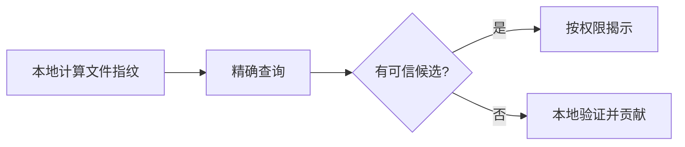

# 文档维护规范

## 1. 目的

本规范用于保证密码侦探社项目文档可追踪、可审查、可由 Git 管理。自 2026-08-01 起，Markdown 是项目文档的唯一事实来源。

## 2. 文件格式

- 所有可维护文档使用 UTF-8 编码的 `.md` 文件。
- 不直接维护 `.docx`、`.pdf`、在线富文本文档或图片中的需求文字。
- Word/PDF 只作为临时交付物，由 Markdown 导出并标明导出日期和来源版本。
- 图表优先使用 Mermaid；复杂设计图可以使用 SVG/PNG，但必须同时保留可编辑源文件。
- API 示例使用 JSON、HTTP 或代码围栏，不使用截图代替接口定义。

## 3. 文件命名

推荐格式：

```text
主题名称-v主版本.次版本.md
```

示例：

```text
密码侦探社项目规格说明书-v3.0.md
密码侦探社开发实施计划-v1.0.md
```

持续更新且无需独立发布版本的文件可不带版本号，例如 `README.md`、`文档变更记录.md`。

## 4. 文档状态

重要文档顶部应包含以下信息：

```markdown
**文档状态：** 草稿 / 评审中 / 当前有效 / 已废弃  
**基线日期：** YYYY-MM-DD  
**负责人：** 姓名或角色  
**替代关系：** 无，或被哪个版本替代
```

状态含义：

- **草稿**：内容未完成，不能作为开发承诺。
- **评审中**：允许评论，不应直接作为发布验收标准。
- **当前有效**：已通过评审，是开发和验收基线。
- **已废弃**：只保留用于追溯，必须指向替代文档。

## 5. 标题层级

- 每个文件只能有一个一级标题 `#`。
- 主要章节使用 `##`，子章节使用 `###`，一般不超过四级标题。
- 标题使用稳定编号；章节调整后同步修复目录和内部链接。
- 不使用加粗文本代替标题。

## 6. 需求与规则编号

可测试需求必须使用稳定编号：

```text
AUTH-01
SEARCH-03
DESK-05
VERIFY-02
```

编号一旦被实现或进入测试，不得复用。删除需求时保留变更记录并标记废弃，避免旧任务和测试引用到错误内容。

## 7. 链接与引用

- 项目内链接使用相对路径，例如 `[开发计划](./密码侦探社开发实施计划-v1.0.md)`。
- 文件改名或移动后必须更新所有引用。
- 外部技术结论优先引用官方文档、标准或原始资料。
- 不复制大段外部文字；记录结论、适用版本和链接即可。

## 8. 表格与代码块

- 表格用于字段清单、状态矩阵、接口目录和计划，不用于承载大段说明文字。
- 每个代码围栏注明语言，如 `json`、`python`、`sql`、`text`。
- JSON 示例必须是合法 JSON，不使用注释。
- SQL、API 和配置示例需要与当前实现保持同步；尚未实现时明确标记“设计草案”。

## 9. Mermaid 图表

推荐使用 Mermaid 保存可审查的流程和架构：



节点名称发生变化时同步更新相关需求、API 和数据模型描述。

## 10. 变更流程

1. 在文档中修改需求或设计。
2. 在《文档变更记录》中写明日期、文档、章节、原因和影响。
3. 对涉及架构、安全、数据结构或范围的修改创建 ADR。
4. 评审者检查实现、测试、迁移和发布计划是否同步更新。
5. 评审通过后更新文档状态或版本号。
6. 被替代版本移动到历史目录，不直接删除。

## 11. 版本规则

- 主版本变化：产品定位、核心数据语义、系统边界或主要架构发生不兼容变化。
- 次版本变化：新增完整功能模块、重要业务规则或新的交付阶段。
- 修订变化：措辞、示例、参数、错别字或不改变行为的澄清。

若采用三段版本，可使用 `v3.0.1`；当前项目也可以继续使用两段版本并在变更记录中描述修订。

## 12. 评审检查表

- 术语是否与当前规格一致。
- 是否存在相互冲突的状态、字段、接口路径或数值规则。
- 每项需求是否可测试、有明确输入和结果。
- 是否说明权限、失败路径、幂等和审计要求。
- 是否泄露真实密码、令牌、密钥、个人信息或生产数据。
- API、数据库、前端、桌面端、测试和计划是否同步。
- 文档链接、代码围栏、表格和 Mermaid 是否能够正常解析。

## 13. 安全与隐私

- 文档示例只能使用合成数据。
- 禁止记录真实解压密码、账号密码、API Key、访问令牌和私钥。
- 文件名、路径、IP、邮箱和用户标识必须脱敏。
- 安全漏洞细节放在访问受控的位置，普通项目文档只记录风险编号和修复状态。

## 14. 归档规则

- 历史文档移动到 `历史文档/`，顶部标明“历史参考，不作为当前基线”。
- DOCX 归档只用于核对原始来源，不再编辑。
- 禁止同时维护内容相同的 Markdown 和 Word 两个版本。
- 删除历史文档前必须确认 Git 历史或其他归档系统可以完整恢复。
