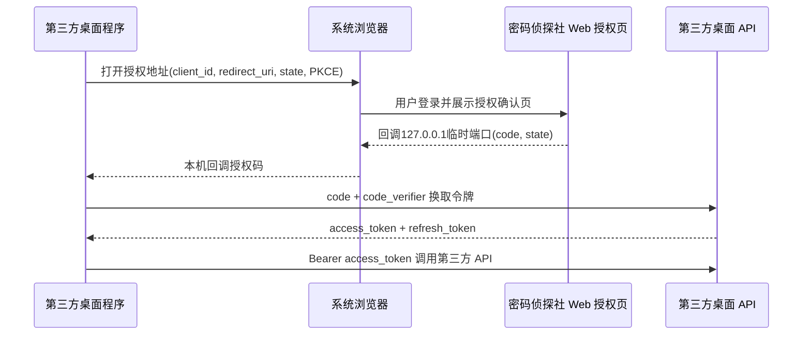

# 第三方桌面端 API v1 设计说明

> 状态：已获确认，作为后续实施的唯一设计基线
> 日期：2026-08-15
> 范围：密码侦探社 v3.0，第三方桌面端调用能力

## 1. 目标与边界

本设计为其他开发者开发第三方 Windows 桌面端提供受控 API。第三方程序可以代表已经授权的密码侦探社用户读取必要信息、注册安装实例、申请一次性挑战并提交本地验证回执，但不能绕过用户授权、服务端签名校验或后台治理规则。

首版采用管理员后台手动创建和审核第三方应用，并为后续“开发者自助申请、管理员审核”预留数据字段和状态流转。首版开放可信验证核心与通用只读能力，不开放管理端、社区写入、总哈希池管理或未经本地验证的密码提交。

桌面端是不可完全信任的执行环境。第三方应用身份、用户授权、安装实例公钥、一次性挑战、签名回执、时间窗口、客户端版本和防重放校验必须由服务端共同完成。应用身份本身不能替代回执签名，也不能单独获得总哈希池直入资格。

## 2. 授权架构

原生桌面端使用系统浏览器授权，不在第三方程序中保存用户密码，不把长期 `client_secret` 嵌入桌面制品。



原生应用的 `client_id` 为可公开标识；后台可以生成管理密钥供未来机密服务端集成使用，但桌面程序不得依赖该密钥完成用户授权。首版只实现原生应用 PKCE 流程，设备码流程作为后续兼容扩展。

## 3. 第三方应用生命周期

应用状态：

```text
draft -> pending -> approved -> suspended -> approved
                         |
                         v
                      revoked
```

首版管理员可以创建草稿、显式审核通过、暂停、恢复和撤销。未来开发者自助申请使用 `pending` 状态进入同一审核流程。

第三方应用至少保存以下信息：

- 应用 ID、`client_id`、应用名称、开发者名称和说明。
- 管理密钥哈希；原文仅在生成或轮换成功时展示一次。
- 应用状态和来源：`admin_created` 或 `developer_submitted`。
- 提交者、审核者、审核时间和审核备注。
- 是否允许 `desktop:verification:trusted`。
- 最后调用时间、调用计数和最近错误时间。
- 创建时间、更新时间和撤销时间。

未来自助申请预留 `submitted_by_user_id`、`reviewer_user_id`、`reviewed_at`、`review_note` 和 `pending` 状态，不在本轮开放公开申请页面。

回调地址使用独立关联表保存。只有管理员审核过的回调地址才能使用；本机回调只允许 `127.0.0.1` 约束下的已登记地址，不接受任意外部跳转地址。

## 4. PKCE 授权流程

### 4.1 授权请求

```text
GET /api/v1/third-party/oauth/authorize
```

必要参数：

- `client_id`
- `redirect_uri`
- `response_type=code`
- `scope`
- `state`
- `code_challenge`
- `code_challenge_method=S256`

约束：

- `state` 必填，至少 16 个字符。
- 只支持 `S256`，拒绝明文 PKCE。
- `redirect_uri` 必须和应用白名单精确匹配。
- 应用必须处于 `approved` 状态。
- 授权页必须由密码侦探社官方 Web 展示。
- 用户必须先登录官方 Web，再确认授权范围。
- 拒绝授权时回调标准化错误，不泄露用户信息。

### 4.2 授权码换令牌

```text
POST /api/v1/third-party/oauth/token
```

授权码请求包含：

```json
{
  "grant_type": "authorization_code",
  "client_id": "client_synthetic",
  "code": "one_time_code",
  "redirect_uri": "http://127.0.0.1:49152/callback",
  "code_verifier": "pkce_verifier"
}
```

策略：

- 授权码只保存哈希，5 分钟过期且只能使用一次。
- 服务端校验 `client_id`、回调地址、PKCE、应用状态和授权 Scope。
- Access Token 有效期 15 分钟。
- Refresh Token 有效期 30 天。
- Refresh Token 每次刷新后轮换。
- 检测到 Refresh Token 重放时撤销整个 Token family。
- 应用暂停、撤销或用户撤销授权后，相关令牌立即失效。

返回字段：

```json
{
  "access_token": "access_token",
  "token_type": "Bearer",
  "expires_in": 900,
  "refresh_token": "refresh_token",
  "refresh_token_expires_in": 2592000,
  "scope": "profile:read hash:read desktop:installations desktop:verification"
}
```

### 4.3 撤销授权

```text
POST /api/v1/third-party/oauth/revoke
```

用户可以在 Web 账号设置中查看和撤销第三方应用授权。撤销操作同时失效 Access Token、Refresh Token 和该授权下的第三方 API 会话。

## 5. v1 Scope

| Scope | 能力 |
| --- | --- |
| `profile:read` | 读取当前用户公开基础资料 |
| `hash:read` | 查询哈希详情、匹配状态、评论只读分页 |
| `desktop:installations` | 管理当前用户的第三方安装实例 |
| `desktop:verification` | 申请挑战并提交回执，成功结果进入待验证池 |
| `desktop:verification:trusted` | 经管理员明确授予后，成功回执可按 verification-v3 进入总哈希池 |
| `announcements:read` | 规划中的桌面端公告只读扩展；当前尚未启用 |
| `updates:read` | 规划中的桌面更新检查扩展；当前尚未启用 |

以下能力不属于 v1：管理端接口、用户审批、总哈希池管理、社区写入、评论写入、直接修改候选状态、上传候选密码和绕过签名挑战。

## 6. 第三方桌面 API

统一前缀：

```text
/api/v1/third-party
```

### 6.1 当前用户

```text
GET /api/v1/third-party/oauth/me
```

只返回用户 ID、用户名、产品角色、等级和公开积分等允许公开字段，不返回邮箱、密码、令牌、IP、精确设备信息或私密审计数据。

### 6.2 安装实例

```text
POST /api/v1/third-party/installations
GET  /api/v1/third-party/installations
POST /api/v1/third-party/installations/{installation_id}/revoke
```

安装实例绑定用户、第三方应用、安装 ID、公钥、客户端版本、操作系统和架构。不同第三方应用之间不能复用安装实例身份。

### 6.3 挑战和回执

```text
POST /api/v1/third-party/challenges
POST /api/v1/third-party/verification-receipts
```

挑战绑定用户、应用、安装实例、nonce、指纹、版本、Scope 和过期时间。第三方回执使用独立协议版本 `desktop-receipt-v1`，签名覆盖应用、用户、安装实例、挑战、nonce、档案指纹、候选摘要、结果、压缩格式、版本和验证时间。

服务端必须校验：Access Token、Scope、应用状态、用户关系、公钥、挑战有效期、防重放、客户端版本、时钟窗口、字段绑定和 ECDSA P-256 签名。

普通第三方应用：

```text
成功回执 -> 待验证池
```

获得可信 Scope 且处于审核通过状态的应用：

```text
成功回执 -> verification-v3 -> 总哈希池
```

失败、过期、重复或异常回执不得直入总哈希池。可信 Scope 被撤销后立即恢复为待验证池行为。

### 6.4 哈希只读（后续兼容扩展）

当前已登记 `hash:read` Scope，但以下公开路由尚未启用；开发者不得将获得 Scope 等同于端点已经上线。

```text
GET /api/v1/third-party/hashes/{algorithm}/{digest}
GET /api/v1/third-party/hashes/{algorithm}/{digest}/comments
```

复用现有哈希详情和评论稳定游标分页能力，只返回只读字段，不返回候选密码和其他用户隐私。

### 6.5 桌面公告和更新（后续兼容扩展）

以下路由属于已批准设计，但当前稳定合同尚未开放；上线前需要补齐独立 Scope、API 合同、限流与目标环境验收。

```text
GET /api/v1/third-party/announcements
GET /api/v1/third-party/updates/check
GET /api/v1/third-party/updates/{release_id}/download
```

第三方桌面端只读取桌面端公告，不读取 Web 公告。更新接口继续使用已审核发布版本、制品摘要和不可变下载资源。

## 7. 数据模型

计划新增：

### `third_party_apps`

保存应用身份、生命周期、审核信息、可信直入资格和调用摘要。

### `third_party_app_redirect_uris`

保存应用的回调地址白名单、启用状态和地址类型。

### `third_party_authorizations`

保存用户与应用的授权关系、Scope、状态和最近使用时间。

### `third_party_authorization_codes`

保存一次性授权码哈希、PKCE challenge、回调地址、Scope、过期和使用信息。

### `third_party_token_sessions`

保存 Refresh Token 哈希、Token family、授权关系、过期、轮换和重放状态。

现有桌面安装实例扩展：

- `third_party_app_id`
- `receipt_protocol`
- `trust_channel`

官方桌面端继续使用原有协议和路由；第三方桌面端使用独立路由和协议版本，避免破坏现有客户端兼容性。

## 8. Admin 管理端

新增管理工作区：

```text
/third-party-apps
```

支持：

- 创建应用草稿。
- 查看应用详情和状态。
- 管理回调地址。
- 管理普通 Scope。
- 授予或撤销可信直入 Scope。
- 审核通过、暂停、恢复和撤销。
- 轮换管理密钥。
- 查看授权用户数量、活跃令牌数量、调用次数和最近调用时间。
- 查看应用操作审计记录。

管理 API 使用：

```text
/admin/third-party-apps
```

管理操作沿用管理员 RBAC、当前密码再认证和条件 MFA 规则。管理密钥只展示一次，数据库只保存哈希。

## 9. Web 授权与用户治理页面

新增官方 Web 授权确认页面，展示应用名称、开发者名称、说明、权限清单、回调提示、授权和拒绝操作。

新增账号页面：

```text
/account/authorized-applications
```

用户可以查看已授权应用、Scope、最近使用时间并撤销授权。

## 10. 开发者文档和示例

新增 Markdown 文档：

```text
项目文档/第三方桌面端 API v1 开发者文档.md
```

文档包括：API Base URL、PKCE 流程、Scope、回调配置、令牌刷新、安装注册、挑战与回执签名、错误码、限流、安全要求，以及 Python、C#、TypeScript 调用示例。

代码示例只使用合成的 `client_id`、URL、指纹、令牌和用户数据，不记录真实密钥、密码或个人信息。

## 11. 实施阶段

1. 数据库迁移、第三方应用模型、Scope 和审计基础。
2. Admin 应用创建、审核、暂停、恢复、撤销和密钥轮换。
3. PKCE 授权码、Token 刷新、Token 撤销和用户授权治理。
4. 第三方 `me`、安装实例、挑战和回执路由。
5. 普通待验证池与可信直入总哈希池规则。
6. 哈希只读、评论分页、桌面公告和更新检查。
7. Web 授权页、已授权应用页和 API 合约。
8. 开发者文档、Python/C#/TypeScript 示例、统一质量门禁、Staging 和公网验收。

## 12. 验收标准

- 未审核应用不能创建授权码。
- 暂停或撤销应用的授权和令牌立即失效。
- 未登记回调地址不能完成授权。
- PKCE 缺失或错误不能换取令牌。
- 授权码只能使用一次。
- Refresh Token 重放会撤销整个 Token family。
- 普通第三方成功回执只能进入待验证池。
- 只有获得可信 Scope 的审核通过应用才能按 verification-v3 进入总哈希池。
- 第三方应用不能访问管理端 API 或其他用户隐私。
- 官方桌面端现有路由和协议保持兼容。
- API、Web、Admin、桌面端测试与统一质量门禁通过。
- Staging 运行态、迁移、回滚备份、公网授权和回执链路完成实际验收。
- 远端分支和 Staging 使用同一份代码树。


## 12. PKCE OAuth 已实现接口（2026-08-15）

本节记录当前已落地的第三方 OAuth 服务端接口，后续 Web 授权确认页在此基础上补充交互，不改变安全边界。

| 方法 | 路径 | 用途 | 关键约束 |
|---|---|---|---|
| `GET` | `/api/v1/third-party/oauth/authorize` | 登录用户签发授权码并重定向回桌面端 | 应用必须已审核；回调地址精确匹配；仅 `S256`；`state` 至少 16 字符；授权码 5 分钟、一次性 |
| `POST` | `/api/v1/third-party/oauth/token` | 授权码换 Token 或 Refresh Token 轮换 | Access Token 15 分钟；Refresh Token 30 天；重放时撤销整个 Token family |
| `POST` | `/api/v1/third-party/oauth/revoke` | 客户端主动撤销 Refresh Token 对应会话族 | 使用 `client_id` 与 Refresh Token；接口保持幂等 |
| `GET` | `/api/v1/third-party/oauth/me` | 第三方 Principal 与 `profile:read` Scope 探针 | 校验专用 audience、应用/用户/授权/会话状态及 Scope |

Token 请求当前采用 JSON 请求体；原生桌面端不得使用或保存管理密钥。第三方 Access Token 的 audience 固定为 `third-party-desktop`，不能作为官方 Web/Admin Access Token 使用。


## 13. 公告与版本检查只读适配

第三方桌面端读取公告和检查升级使用独立 Scope，不复用桌面端官方公开接口的缓存语义：

| 方法 | 路径 | Scope | 说明 |
|---|---|---|---|
| `GET` | `/api/v1/third-party/announcements` | `announcements:read` | 读取当前有效的已发布桌面公告；仅返回展示字段和经校验的图片/动作地址 |
| `GET` | `/api/v1/third-party/updates/check` | `updates:read` | 检查 Windows 稳定/测试通道的可用版本；返回下载 URL、文件名、大小和 SHA-256 校验摘要 |

第三方适配层复用现有桌面公告有效时间窗、桌面 Release 制品已上传、分发授权和法律声明筛选，不复制查询逻辑。第三方响应使用 `private, no-store`，每次成功调用写入应用级审计；公告和更新 Scope 不能互相替代。
