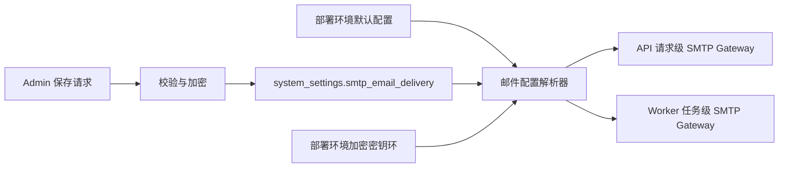

# SMTP 邮件投递工作台优化设计

- 日期：2026-08-17
- 状态：已确认，实施中
- 范围：Admin 管理端“系统配置工作台”的“SMTP 邮件投递”区域，以及 API、Worker 的邮件配置读取、保存和投递链路。
- 参考：WordPress Zibll 主题 Email 邮件设置的交互结构；图片仅作为界面参考，不复制其中的账号、授权码或链接。

## 1. 背景与目标

当前项目的 SMTP 参数主要由部署环境变量提供，管理端只能查看状态并发送测试邮件。Zibll 的 Email 设置提供了完整的邮件品牌、正文底部内容、SMTP 传输参数、启停开关和测试邮件入口，管理员可在同一工作台完成配置。

本轮目标是将项目的“SMTP 邮件投递”升级为可直接保存、立即生效的完整配置工作台，同时保留项目已有的权限控制、限流、审计和敏感信息保护边界。

## 2. 选定方案

采用“后台完整管理 SMTP 参数，敏感凭据加密保存”的方案：

1. 管理端可编辑并保存 SMTP 启用状态、发件人昵称、发件邮箱、标题前缀、底部说明一、底部附加内容二、服务器地址、端口、安全模式、SMTPAuth、用户名和超时。
2. SMTP 授权码提交后使用 AES-GCM 加密，数据库只保存密文、随机 nonce 和密钥版本。加密主密钥仍来自部署环境中的现有密钥环，不进入数据库、Git、接口响应或审计日志。
3. 读取接口仅返回 `smtp_password_configured` 和脱敏状态。编辑界面中的授权码为空时保持原值；显式清除动作才会删除已保存授权码。
4. 数据库中的当前配置优先于部署环境默认值；尚无数据库配置时回退到部署环境，保证已有部署平滑升级。保存成功后 API 请求和 Worker 下一次任务均读取最新配置并立即生效。
5. 邮件正文使用 `text/plain` 与 `text/html` 双格式。底部说明一作为纯文本内容，底部附加内容二允许有限的基础 HTML，并在发送前执行白名单净化；禁止脚本、事件属性、危险 URL 和外部任意资源注入。
6. 保存、启停、测试成功和测试失败均写入审计摘要，只记录配置键、结果、加密模式和失败类型，不记录授权码或完整配置快照。

## 3. 数据与配置边界

配置来源优先级：

1. `system_settings` 中存在且通过校验的 `smtp_email_delivery` 配置；
2. 当前 `Settings` 中的 `NOTIFICATION_*` 环境变量；
3. 开发环境的安全默认值（仅用于未启用 SMTP 的状态，不构造可用生产凭据）。

数据库 JSON 仅用于非结构化配置存储，建议字段如下：

| 字段 | 类型 | 敏感性 | 说明 |
| --- | --- | --- | --- |
| `enabled` | boolean | 普通 | 是否启用 SMTP 投递 |
| `sender_name` | string | 普通 | 发件人显示名称 |
| `sender_email` | string | 普通 | 发件邮箱 |
| `subject_prefix` | string | 普通 | 邮件标题前缀 |
| `footer_text` | string | 普通 | 底部说明一，纯文本 |
| `footer_html` | string | 受控内容 | 底部附加内容二，保存前校验、发送前净化 |
| `smtp_host` | string | 普通 | SMTP 服务器 |
| `smtp_port` | integer | 普通 | 1 至 65535 |
| `smtp_security` | enum | 普通 | `starttls`、`ssl` 或 `none` |
| `smtp_username` | string | 中等 | SMTP 用户名 |
| `smtp_auth_enabled` | boolean | 普通 | 是否使用 SMTPAuth |
| `smtp_timeout_seconds` | number | 普通 | 1 至 30 秒 |
| `smtp_password_ciphertext` | string | 高敏感 | AES-GCM 密文，不出现在响应 |
| `smtp_password_nonce` | string | 高敏感 | AES-GCM nonce，不单独构成可读密码 |
| `smtp_password_key_version` | string | 高敏感 | 密钥版本 |

不新增明文密码字段，不把 SMTP 授权码放入 `EmailDeliverySettingsResponse`，不把完整 `value_json` 写入审计详情。

## 4. API 设计

保留现有读取和测试入口，新增当前配置直接保存入口：

- `GET /api/v1/admin/settings/email-delivery`
- `PUT /api/v1/admin/settings/email-delivery`
- `POST /api/v1/admin/settings/email-delivery/test`

三个接口均要求现有 `require_user_governance_admin` 权限。保存请求使用显式的 `clear_smtp_password`，避免空输入误清除已配置授权码。保存响应只返回可展示字段和 `smtp_password_configured`。

保存校验包括：

- 启用 SMTP 时必须有合法发件邮箱和服务器地址；
- 端口必须在 1 至 65535；
- `starttls`、`ssl`、`none` 与 SMTP 服务组合必须合法；生产环境启用认证时用户名和授权码必须同时存在；
- 发件人昵称、标题前缀和 HTML 底部内容禁止换行注入；
- 底部 HTML 只允许基础文本、链接和排版标签，链接协议仅允许 `http`、`https` 和站内相对路径；
- 发送测试邮件继续执行邮箱格式检查、管理员权限检查、每小时 5 次限流和审计。

## 5. 管理端交互

“SMTP 邮件投递”区域按以下顺序排列：

1. **邮件基础信息**：发件人昵称、发件邮箱、标题前缀。
2. **邮件底部额外内容**：底部说明一、底部附加内容二，并分别显示长度、纯文本/基础 HTML 提示。
3. **SMTP 传输配置**：启用 SMTP、服务器、端口、SMTPAuth、用户名、授权码、加密方式、连接超时。
4. **配置状态提示**：显示当前来源（后台已保存或部署环境默认）、认证状态、授权码已配置状态和最后保存结果；不显示敏感值。
5. **测试邮件**：收件人、发送按钮、发送中状态、成功反馈和脱敏失败提示。
6. 页面底部保留“重置当前编辑”和“保存设置”按钮。保存成功立即刷新当前配置；重置恢复最近一次加载或保存的基线。

## 6. 邮件渲染

邮件主题统一使用可配置的标题前缀。所有通知保留现有通知类型 Header、幂等键和最小披露规则；只替换主题和底部品牌内容。

- 纯文本部分：业务正文、空行、底部说明一和底部附加内容二的纯文本降级内容；
- HTML 部分：对业务正文进行 HTML 转义并按换行生成段落，对底部附加内容二执行净化后拼接；
- 禁止把 SMTP 主机、用户名或授权码写入邮件正文、日志、错误消息和 Provider Message ID 之外的审计详情。

## 7. 验收标准

- Admin 可读取、编辑、保存全部 SMTP 参数，保存后刷新仍保持配置。
- 授权码在数据库、API 响应、前端 SSR、日志、审计和测试邮件 MIME 中均不可出现明文。
- 空授权码编辑保持原值，显式清除后状态变为未配置。
- API 请求和 Worker 任务均使用保存后的最新配置，不需要重启服务。
- 发送邮件同时包含纯文本和 HTML 部分；危险 HTML 被拒绝或净化，安全基础链接可保留。
- SMTP 启停、传输模式、认证组合和测试失败均有明确错误提示与审计摘要。
- Admin 定向测试、API SMTP 测试、Worker 测试、类型检查、Lint、构建和统一门禁通过。
- 使用 Git SSH 推送到发布分支，并在 Staging 完成数据库迁移、服务重建、HTTP 健康和配置脱敏复核。

## 8. 非目标

- 不读取、复制或使用参考图片中的真实账号、授权码或链接。
- 不新增版本历史、差异预览、发布门禁、回滚快照或回滚流程。
- 不放宽管理员 RBAC、测试限流、审计要求和生产密钥管理规则。
- 不引入 Element Plus、Ant Design Vue 或自定义 Vue CSS。
