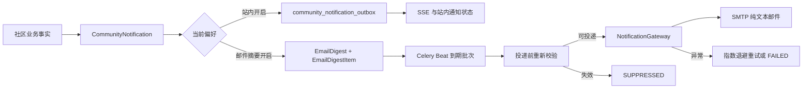

# WP5-I7 社区通知邮件摘要设计

- 设计日期：2026-08-17
- 状态：已确认，待实施
- 所属范围：WP5-I7 通知可靠性收口
- 权威规格：[密码侦探社项目规格说明书 v3.0](../密码侦探社项目规格说明书-v3.0.md)
- 追踪矩阵：[需求追踪矩阵](../../docs/testing/requirements-traceability.md)

## 1. 问题与目标

现有 `community_notification_outbox` 仅承载站内通知的可靠投递与 SSE 触发：Worker 在权限、屏蔽和内容可见性复核完成后将事件标记为 `delivered`，但不会进入 SMTP 或其他通知网关。用户已经可以为每类社区通知设置 `email_digest_enabled`，该偏好目前没有实际效果。

本切片实现**按用户、UTC 固定窗口聚合的纯文本邮件摘要**。每一个待投递摘要均有持久化批次、逐通知关联项、稳定去重键、重试状态与提供方消息 ID；投递前再次校验用户偏好、屏蔽关系、内容状态和群组可见性。邮件中不得包含候选密码、访问令牌、密钥、邮箱地址、私信正文、密文、nonce 或管理端自由文本。

不在本切片实现：邮件 HTML 模板、用户自定义频率、外部营销邮件、跨标签页同步、通知 SSE 的 Redis Pub/Sub 优化、桌面端通知 UI、批量私信治理。

## 2. 方案 B 架构

### 2.1 数据模型

新增以下模型和迁移，均使用 UUID 字符串主键与 UTC 时间：

| 模型 | 关键字段 | 约束和职责 |
|---|---|---|
| `CommunityNotificationEmailDigest` | `recipient_id`、`window_started_at`、`window_ends_at`、`dedupe_key`、`status`、`attempts`、`available_at`、`provider`、`provider_message_id` | `recipient_id + window_started_at` 与 `dedupe_key` 均唯一；一个用户一个窗口只有一个摘要批次。 |
| `CommunityNotificationEmailDigestItem` | `digest_id`、`notification_id`、`notification_delivery_version`、`suppressed_at`、`suppression_reason` | `digest_id + notification_id + notification_delivery_version` 唯一；只保存关联、版本与最小状态，不复制通知正文。 |

`CommunityNotificationEmailDigestStatus` 固定为 `pending`、`sent`、`failed`、`suppressed`。摘要项因偏好关闭、屏蔽、源内容删除/下架、无权访问或被新版摘要覆盖而抑制；批次没有可发送项时进入 `suppressed`，不调用网关。

窗口长度通过 `COMMUNITY_NOTIFICATION_DIGEST_WINDOW_MINUTES` 配置，默认 60 分钟，取值范围 15～1440。窗口按 UTC 整点计算；`window_ends_at` 到达前 Worker 不发送。

### 2.2 偏好与事务边界

`CommunityNotificationPreference` 的两条通道独立：

- `in_app_enabled`：决定是否写入既有 `community_notification_outbox`，并因此影响站内未读和 SSE。
- `email_digest_enabled`：决定是否在同一数据库事务内创建或更新邮件摘要批次及关联项。

由于 CommunityNotification 是可被任一通道复用的业务事实，站内通知列表、未读计数、单条/全部已读操作与 SSE 就绪计数必须额外按当前 in_app_enabled 过滤。仅启用邮件摘要的通知只能由摘要 Worker 读取，不得借由该事实出现在站内界面。

创建或刷新通知时，只要任一通道开启就保留 `CommunityNotification` 事实。点赞摘要刷新 `delivery_version` 后，邮件摘要关联项携带新版本；同一窗口中旧版本关联项在发送前通过 `delivery_version` 比对排除，不会重复出现在邮件里。两通道都关闭时保持现有“不创建通知”的语义，`create_when_disabled` 不会绕过邮件发送偏好。

### 2.3 投递和幂等

Celery Beat 每两分钟执行 `community.dispatch_email_digests`。Worker 用 `FOR UPDATE SKIP LOCKED` 领取已到期的 `pending` 批次，先加载关联通知，再以与站内 Outbox 相同的规则复核：当前邮件偏好、双向屏蔽、主题发布状态、群组成员资格和可见性。私信摘要只使用既有最小预览，绝不读取或发送私信正文。

SMTP 调用使用一个由摘要 `dedupe_key` 派生的稳定消息键；重试沿用相同键，从而使同一批次有稳定的 `Message-ID`。发送成功后批次与所有已纳入项转为 `sent`；异常采用 2、4、8、16、32 分钟退避，五次后转为 `failed`。提供方名称、消息 ID、错误类型和时间写入数据库，但不得写入收件地址或邮件正文。

### 2.4 通知网关与邮件内容

扩展 `NotificationGateway`、`MemoryNotificationGateway`、`LoggingNotificationGateway`、`WebhookNotificationGateway` 和 `SMTPNotificationGateway`，新增统一的 `send_community_notification_digest(...)` 方法。SMTP 发送 UTF-8 纯文本邮件，主题为“[密码侦探社] 社区通知摘要”，正文只有窗口、项目数量、按通知类型归类的既有最小预览、通知中心入口提示和统一页脚。

网关内存实现仅保存合成测试字段；日志实现只记录摘要 ID、项目数和类型计数；Webhook payload 使用 `community_notification_digest` 类型且不包含邮件正文。所有测试使用 `synthetic.example.com` 合成地址。

### 2.5 运维与兼容性

现有管理端 `GET /admin/community/notification-outbox/metrics` 扩展摘要批次的 `pending/sent/failed/suppressed` 计数与最近发送时间；`CommunityNotificationOutboxPage` 增加只读指标卡，不显示收件人、预览或正文。本轮不新增人工重放端点，避免将原有高风险再认证流程扩展到未经验证的邮件重放操作。

账号删除流程同时删除以该用户为收件人的未发送或历史摘要批次及关联项，防止删除请求完成后继续发送邮件。迁移降级只删除新表和索引；对已发送邮件没有撤回语义。

## 3. 验收标准

1. 邮件偏好开启且站内偏好关闭时，通知事实和摘要项在同一事务中产生，但不写站内 Outbox。
2. 同一用户、同一 UTC 窗口的多条通知只产生一封摘要；同一通知版本不会重复出现。
3. 最新点赞摘要覆盖同窗口中的旧版本；偏好关闭、屏蔽、下架或失去群组权限的项不会发送。
4. Memory 与 SMTP 网关均可接收摘要投递；SMTP 测试确认 Subject、Message-ID、UTF-8 纯文本、最小披露和收件人字段。
5. 临时失败按退避重试，五次后失败；同一摘要重试维持稳定消息键和不重复批次。
6. Worker 定时任务、迁移往返、Admin 指标、API/Web/Admin 质量门禁与目标 Staging 真实 SMTP 接受证明均通过；若 Staging 未配置合规 SMTP，则部署仍完成，但交付报告必须将真实送达证明明确列为环境阻断项。
