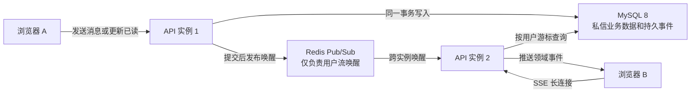
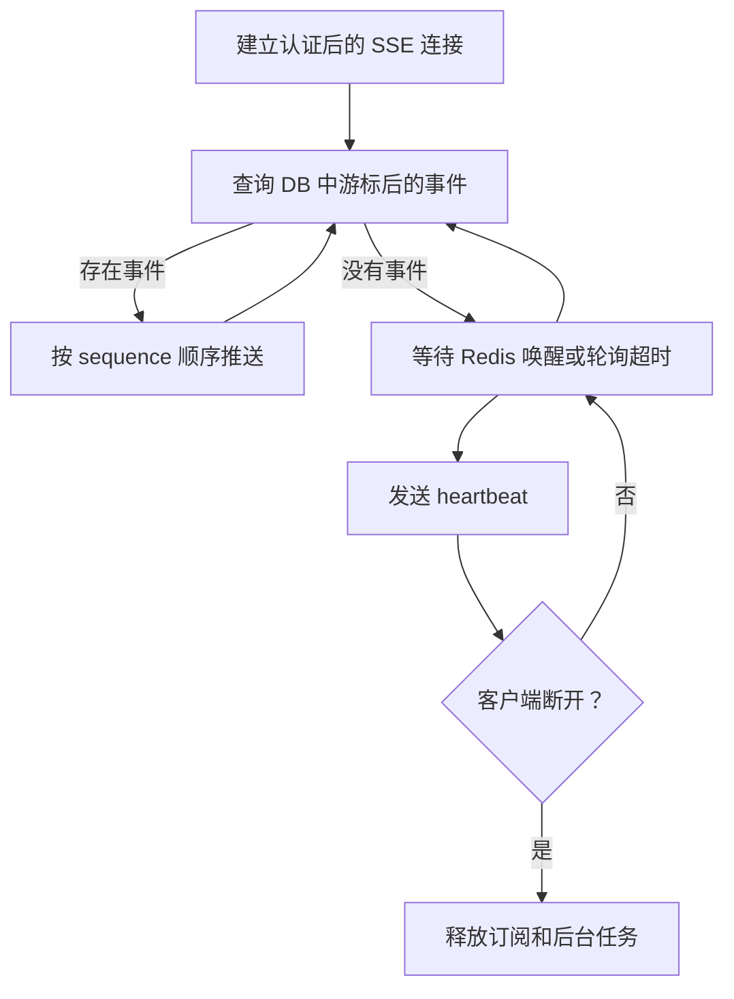

# WP5-I10 私信实时事件设计

- 状态：设计与规格已确认，进入实施
- 日期：2026-08-16
- 基线：WP5-I9 一对一异步私信已发布至 Staging
- 适用范围：Web 社区一对一私信实时事件第一阶段

## 1. 背景与目标

WP5-I9 已提供一对一私信会话、加密消息、稳定消息序号、成员读取状态、未读数、归档与静音能力。当前 Web 客户端仍主要依赖页面加载和主动请求同步状态，不能在多标签页、多浏览器或多 API 实例下实时感知新消息、对方已读和未读数变化。

本轮采用独立私信实时事件通道：MySQL 8 保存可补偿事件，Redis Pub/Sub 仅负责跨实例唤醒，SSE 按当前用户游标读取持久事件。实现必须保证 Redis 故障不破坏消息事务，断线重连可从数据库补偿，事件内容不泄露私信正文。

## 2. 实施范围

本轮同时实现三类领域事件：

| 事件 | 触发条件 | 事件流接收对象 |
| --- | --- | --- |
| `message.created` | 新私信事务提交成功 | 会话双方 |
| `conversation.read` | `last_read_sequence` 实际向前推进 | 会话双方 |
| `unread.changed` | 新消息或已读操作导致未读数变化 | 未读数发生变化的用户 |

SSE 另包含 `ready` 和注释形式的 `heartbeat` 控制消息。控制消息不属于上述三类领域事件。

### 2.1 本轮不包含

- 群聊、在线状态、输入中状态、消息撤回或编辑。
- 私信举报、管理员最小披露工作台和批量发送风控；这些继续属于 WP5-I10 后续切片。
- 将 Redis Pub/Sub 作为消息事实来源或可靠队列。
- 在 SSE 事件或服务日志中保存私信正文、密文、nonce、密钥版本或访问令牌。
- Production/UAT 发布；本轮完成后只执行既定远端同步与 Staging 部署验证。

## 3. 总体架构



设计原则：

1. MySQL 8 是持久事件事实来源。
2. Redis 只携带无敏感内容的唤醒信号；重复唤醒允许存在。
3. SSE 实例收到唤醒后仍以数据库查询结果为准。
4. Redis 发布或订阅失败时，SSE 自动退化为数据库短轮询。
5. 客户端通过 `Last-Event-ID` 续传，不能通过请求参数指定其他用户。
6. 初次连接不回放全部历史事件，而是从当前快照开始监听。

## 4. 数据模型

### 4.1 用户流序号

新增表 `community_direct_stream_positions`：

| 字段 | 类型 | 约束与说明 |
| --- | --- | --- |
| `user_id` | String(36) | 主键，外键到 `users.id` |
| `last_sequence` | BigInteger | 已分配的最后一个用户流事件序号，默认 0 |
| `created_at` | DateTime(timezone=True) | 创建时间 |
| `updated_at` | DateTime(timezone=True) | 最后更新时间 |

每个用户拥有独立、连续递增的事件序号。事件分配前使用 MySQL `INSERT ... ON DUPLICATE KEY UPDATE` 确保位置行存在，SQLite 测试环境使用等价 `ON CONFLICT DO NOTHING`；随后以 `SELECT ... FOR UPDATE` 锁定该用户的序号行。涉及多个用户时按用户 ID 排序后依次锁定，以避免死锁。

独立用户序号用于避免全局数据库序列在并发事务中出现“较大序号先提交、较小序号后提交”而导致客户端游标越过尚未提交事件的问题。

### 4.2 持久事件

新增表 `community_direct_events`：

| 字段 | 类型 | 约束与说明 |
| --- | --- | --- |
| `id` | String(36) | 内部事件主键 |
| `recipient_id` | String(36) | 事件所属用户，外键到 `users.id` |
| `sequence` | BigInteger | 当前用户事件流的单调序号 |
| `event_type` | Enum/Varchar | `message.created`、`conversation.read` 或 `unread.changed` |
| `conversation_id` | String(36) | 外键到私信会话 |
| `actor_id` | String(36) | 引起事件的用户 |
| `message_id` | String(36)，可空 | 新消息事件对应的消息 |
| `payload` | JSON | 不含正文的最小事件负载 |
| `created_at` | DateTime(timezone=True) | 事件发生时间 |

约束和索引：

```text
UNIQUE(recipient_id, sequence)
INDEX(recipient_id, sequence)
INDEX(conversation_id, created_at)
```

删除用户或会话时，相关用户流位置和持久事件按外键策略清理。迁移回滚不得影响既有会话、消息和成员读取状态。

## 5. SSE API

新增接口：

```http
GET /api/v1/community/direct-messages/stream
Accept: text/event-stream
Authorization: Bearer <access-token>
Last-Event-ID: 18
```

`Last-Event-ID` 表示当前登录用户私信事件流的数字序号，不是会话消息 `sequence`。

### 5.1 初次连接

未携带 `Last-Event-ID` 时，服务端查询当前最新用户流序号和私信总未读数，发送：

```text
id: 18
event: ready
data: {"event_id":"18","total_unread_count":3,"reset_required":false}
```

随后从该序号开始监听，不回放此前全部历史事件。

### 5.2 断线补偿

携带合法游标时，服务端按 `recipient_id` 和 `sequence > Last-Event-ID` 升序分批读取。每批默认不超过 50 条；积压事件发送完毕后再等待 Redis 唤醒或数据库轮询超时。

每轮数据库查询使用独立短生命周期 Session，等待 Redis 或心跳期间不得持有数据库事务。

### 5.3 游标重置

以下情况返回 `reset_required=true` 的 `ready` 快照：

- 游标不是正整数；
- 游标大于当前用户最大事件序号；
- 后续启用事件保留清理后，游标早于最早可用事件。

客户端收到重置要求后替换本地游标，重新加载私信收件箱；若当前位于会话页，还要重新加载当前会话消息。

## 6. 事件契约

所有事件均包含 SSE `id` 和 JSON `event_id`。事件不包含消息正文、密文、nonce 或密钥版本。

### 6.1 `message.created`

发送给会话双方，用于接收方实时拉取新消息、发送方其他标签页同步和会话排序更新。

```json
{
  "event_id": "19",
  "conversation_id": "synthetic-conversation-id",
  "message_id": "synthetic-message-id",
  "message_sequence": 12,
  "sender_id": "synthetic-user-a",
  "created_at": "2026-08-16T08:00:00Z"
}
```

客户端必须通过既有会话成员鉴权接口读取正文。

### 6.2 `conversation.read`

发送给会话双方，用于显示对方已读和同步阅读者其他标签页的已读进度。

```json
{
  "event_id": "20",
  "conversation_id": "synthetic-conversation-id",
  "reader_id": "synthetic-user-b",
  "last_read_sequence": 12,
  "read_at": "2026-08-16T08:01:00Z"
}
```

`last_read_sequence` 只允许向前推进。请求未造成实际变化时不生成领域事件。

### 6.3 `unread.changed`

只发送给未读数发生变化的用户，同时提供会话未读数和私信总未读数。

```json
{
  "event_id": "21",
  "conversation_id": "synthetic-conversation-id",
  "conversation_unread_count": 0,
  "total_unread_count": 2,
  "changed_at": "2026-08-16T08:01:00Z"
}
```

客户端按事件序号覆盖未读快照，不通过本地加减推算最终值。

## 7. 事务与事件顺序

### 7.1 发送消息

在同一数据库事务中：

1. 锁定会话并分配消息 `sequence`；
2. 加密并写入消息；
3. 更新会话时间及接收方归档状态；
4. 为发送方写入 `message.created`；
5. 为接收方写入 `message.created`；
6. 为接收方写入 `unread.changed`；
7. 写入既有最小化普通通知；
8. 完成幂等记录并提交。

消息、通知或持久事件任一写入失败时，整个业务事务回滚。相同 `Idempotency-Key` 或相同 `client_message_id` 重试不得产生重复消息或持久事件。

### 7.2 更新已读状态

在同一数据库事务中：

1. 锁定会话和当前成员状态；
2. 将 `last_read_sequence` 单调推进到合法范围；
3. 重新计算会话未读数和用户总未读数；
4. 为会话双方写入 `conversation.read`；
5. 为阅读者写入 `unread.changed`；
6. 完成幂等记录并提交。

已读序号没有实际变化时，只返回当前状态，不写入新的持久事件。

### 7.3 提交后唤醒

现有 `_mutate_with_idempotency` 在完成幂等记录时提交事务。路由在事务提交后为会话双方发布 Redis 唤醒；幂等缓存命中或已读无变化时允许产生重复唤醒，因为 SSE 仍按数据库游标读取，不会重复产生领域事件。

## 8. Redis Pub/Sub

用户频道格式：

```text
community:direct-stream:user:{user_id}
```

Redis 消息仅包含：

```json
{
  "max_sequence": 21
}
```

Redis 故障策略：

- 发布失败只记录结构化告警，不回滚已提交业务数据；
- 订阅断开时 SSE 使用约 1 秒数据库轮询并尝试恢复订阅；
- 恢复后重新订阅用户频道；
- Redis 消息不直接转换为浏览器事件，数据库始终是最终依据。

## 9. SSE 服务循环与资源边界



- 默认每 15 秒发送一次心跳。
- 每批事件发送后更新连接内存游标。
- 客户端断开时关闭 Pub/Sub、等待任务和数据库资源。
- SSE 认证继续使用 function-scope Session，不能让认证事务伴随流式连接长期存在。

## 10. 权限与最小披露

1. SSE 接口必须登录，查询条件固定为 `recipient_id == current_user.id`。
2. 不提供用户 ID查询参数，不允许读取其他用户事件流。
3. 普通管理员和社区管理员不能通过该接口浏览其他用户消息或事件。
4. 事件表及 Redis 消息不保存正文。
5. 消息正文继续由既有会话成员权限、账户状态和拉黑策略保护。
6. 令牌失效、用户被禁用或删除后，连接必须终止。
7. 服务日志只记录事件类型、内部标识和事件序号，不记录正文或密钥材料。

## 11. 前端设计

新增独立模块，不与普通社区通知 Store 混合：

```text
apps/web/src/services/communityDirectMessageStream.ts
apps/web/src/composables/useCommunityDirectMessageStream.ts
apps/web/src/stores/communityDirectMessages.ts
```

Store 至少维护：

- `status`：`idle`、`connecting`、`connected`、`reconnecting`、`offline`；
- 私信总未读数；
- 会话未读数映射；
- 会话对方 `lastReadSequence`；
- 最新事件序号；
- 会话级刷新版本号。

浏览器游标保存为：

```text
community-direct-message-last-event:{userId}
```

并存储在 `sessionStorage`。切换用户或退出登录时必须停止旧连接并重置运行状态。

### 11.1 页面联动

私信收件箱：

- `message.created`：合并刷新对应会话并更新排序；
- `unread.changed`：直接更新会话与总未读徽标；
- `conversation.read`：同步会话已读状态。

当前会话页：

- `message.created`：按消息 ID和消息序号去重后刷新；
- `conversation.read`：更新本人发送消息的“对方已读”状态；
- `unread.changed`：同步未读状态。

同一会话短时间内的多个事件必须合并刷新，避免请求风暴。

### 11.2 去重与乱序保护

- 只应用大于本地已确认序号的事件；
- `message.created` 额外按 `message_id` 去重；
- 已读序号只取更大值；
- 未读数使用服务端快照覆盖；
- 只有事件成功解析并应用后才持久化新游标。

## 12. 错误处理

- Redis 不可用：继续发送或读取私信，SSE 使用数据库轮询。
- 数据库持久事件写入失败：业务事务失败并回滚，避免已提交消息没有可补偿事件。
- SSE JSON 解析失败：停止推进游标并重新连接；重复失败后清除本地游标并执行完整同步。
- 消息拉取因关系或账户状态变化被拒绝：不展示正文，沿用现有错误和权限边界。
- 网络离线：标记 `offline`，恢复在线后使用保存的游标重连。

## 13. 测试与验收

### 13.1 后端

- 发送消息产生双方 `message.created` 和接收方 `unread.changed`。
- 推进已读产生双方 `conversation.read` 和阅读者 `unread.changed`。
- 无变化已读请求不重复生成事件。
- 幂等重试不重复生成消息或事件。
- 用户只能读取自己的事件流。
- 用户流序号在并发事务下严格递增且不跳过未提交事件。
- 合法游标完整补偿，异常游标触发快照重置。
- Redis 发布失败不影响业务提交。
- Redis 不可用时数据库轮询仍能送达。
- API 实例 A 上的 SSE 能被实例 B 的业务提交通过 Redis 唤醒。

### 13.2 前端

- 解析 `ready` 和三类领域事件。
- 请求正确携带 `Last-Event-ID`。
- 重复或乱序事件不会回退消息、已读和未读状态。
- 收件箱、当前会话和全局未读状态实时同步。
- 当前会话接收消息后自动刷新，对方阅读后显示已读。
- 离线、上线、令牌切换和组件卸载正确关闭旧连接。
- `reset_required` 触发完整同步。
- 新增复杂组件具有基础渲染测试且继续遵守 Shadcn-Vue、Tailwind CSS 和严格 TypeScript 规范。

### 13.3 浏览器与 Staging

使用发送者、接收者两个合成用户完成：

1. 无刷新接收新消息；
2. 会话与总未读数实时增加；
3. 阅读后发送者实时看到已读；
4. 人为断开 SSE 后连续发送多条消息；
5. 使用旧游标重连并完整补偿；
6. 验证浏览器控制台、页面错误和网络错误；
7. 在 Staging 多 API 实例拓扑下验证跨实例唤醒；
8. 验证迁移 head、服务拓扑、关键 HTTP、SSE 认证、Redis 降级和长事务为 0。

## 14. 完成交付标准

- 数据迁移、API、Redis 唤醒、SSE、共享 TypeScript 合同、Web Store 和页面联动全部完成。
- Python、TypeScript、ESLint 和新增测试通过。
- 完整统一门禁 `pwsh ./scripts/check.ps1 -SkipInstall` 通过，所有跳过项单独记录。
- Markdown 规格、社区开发计划、需求追踪、阶段状态和文档变更记录同步更新。
- 本地提交、远端 ref/tree/commit 和 Staging 部署分别提供证据。
- Staging 验收不得表述为 Production 或 UAT 已通过。
