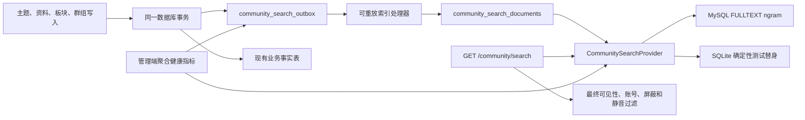

# WP5-I8 社区搜索设计

> 状态：**方案 B 已确认；本地实现与验证完成（2026-08-16）**。本文同时记录已交付的设计边界；目标 MySQL、Staging、远端同步与发布验收仍须独立取证。
>
> 适用范围：WP5-I8、`COMMUNITY-62`～`COMMUNITY-68`。
>
> 设计日期：2026-08-16。

## 1. 目标与范围

本切片为社区建立可替换、安全、可重放的搜索能力，覆盖：

- 公开主题的标题和正文；
- 公开用户的用户名和公开显示名；
- 活跃公开板块的名称和说明；
- 活跃公开群组的名称和说明。

首版不搜索评论全文。评论搜索须在容量和隐私验证通过后独立评审；私密群组、被移除内容、停用账号和敏感资料不得进入索引、摘要、结果或结果总数。

## 2. 决策记录

| 方案 | 决策 | 原因 |
|---|---|---|
| 业务表即时查询 | 不采用 | 不能满足 Provider、异步索引、重建、差异核对和 MySQL `ngram` 预检要求。 |
| Provider + 搜索投影 + 事务 Outbox | 采用 | 将搜索实现与业务表解耦，允许可靠重放和后续替换 Provider。 |
| Elasticsearch/OpenSearch | 不采用 | 当前 MVP 已明确不以外部搜索集群为必选能力。 |

## 3. 架构

### 3.1 Provider 边界

新增 `CommunitySearchProvider`，由服务层依赖抽象而非具体数据库实现。抽象至少包含：

- `search(query, types, page, page_size)`：只返回候选对象标识、对象类型、排序依据和最小摘要字段；
- `upsert_document(document)` 与 `delete_document(source_type, source_id)`：供索引处理器调用；
- `preflight()`：报告 FULLTEXT、`ngram`、降级能力和配置错误；
- `health()`：报告 Provider 名称、模式、最近成功处理时间和受限错误摘要。

生产 Provider 优先使用 MySQL FULLTEXT `ngram`。SQLite 实现仅供自动化测试使用，必须在运行配置中显式标识为测试替身，不得作为目标环境能力证明。

### 3.2 事务 Outbox 与投影

新增三类持久化事实：

| 表/记录 | 最小字段 | 用途 |
|---|---|---|
| `community_search_documents` | `source_type`、`source_id`、`document_version`、允许检索的标题/正文、板块/群组/作者引用、可见性投影、排序时间 | 可重建的搜索文档事实。 |
| `community_search_outbox` | 事件类型、来源类型/ID、目标文档版本、去重键、状态、尝试次数、下一次尝试时间、最小错误摘要 | 保证提交成功后的异步索引可重放，不阻塞主题等主事务。 |
| `community_search_rebuild_runs` | 运行 ID、范围、游标、计数、状态、开始/结束时间、差异摘要 | 支持断点续跑、全量重建和差异核对。 |

业务写入与索引事件在同一数据库事务中提交。处理器按去重键幂等地执行新增、更新和删除；失败事件可重试，超过策略上限后保留为可观测失败。源对象变为私密、移除、停用或不再允许检索时，处理器删除对应搜索文档。

搜索文档只使用白名单字段。候选密码、解压密码、访问令牌、密钥、邮箱、IP、设备标识和压缩包原文不进入建模、摘要、日志或索引；发现疑似不允许检索的内容时，宁可跳过该文档并生成匿名失败计数，也不进行猜测性脱敏后索引。

### 3.3 能力预检与降级

- 部署预检检查 MySQL FULLTEXT 和 `ngram` 可用性，并把结果提供给健康指标。
- `ngram` 可用时，执行有界 FULLTEXT 检索。
- `ngram` 不可用时，仅启用有数据量上限的主题标题和用户名**前缀**匹配；该状态必须在管理端和 API 响应中可见。
- 禁止对正文、说明或全量表执行无界 `%keyword%` 扫描。

## 4. 可见性与查询规则

### 4.1 查询规范化和防滥用

- `q` 去除控制字符、折叠空白后长度必须为 2～64 字；违规返回 422。
- 限制通配符和搜索类型数量；按匿名调用方/IP 或认证用户实施限流。
- 不持久化查询原文，不提供管理员查看个人搜索历史的能力。
- 仅写入匿名聚合指标：Provider 模式、结果数量区间、耗时区间、请求结果和失败分类。

### 4.2 双层可见性保护

1. **索引前过滤**：私密群组、移除内容、停用账号或不允许公开的信息不写入搜索投影。
2. **读取时复核**：搜索服务在返回候选对象前复用现有 `post_visibility_condition`、群组活跃成员资格、内容状态、账号状态、屏蔽和静音策略。

结果数量、摘要和分页均以复核后的可见对象为准；无权限对象以“不存在”的方式排除，不泄露名称、计数或排序位置。

## 5. API 与管理端契约

### 5.1 Web API

新增 `GET /community/search`：

| 参数 | 规则 |
|---|---|
| `q` | 必填，规范化后 2～64 字。 |
| `types` | 可选，多值：`post`、`user`、`board`、`group`。未传时检索全部首版类型。 |
| `page` / `page_size` | 有界分页；排序在同分情况下以对象类型、排序时间和对象 ID 作为稳定次级键。 |

响应包含强类型结果项、分页信息、可用类型、Provider 模式与是否处于降级状态。结果摘要只包含已允许公开的最小字段；主题结果链接至既有详情页，用户、板块和群组结果链接至既有对应页面。

### 5.2 管理端

新增只读聚合健康接口和页面，显示：

- Provider、`ngram` 预检和降级状态；
- 待处理、重试中、失败和最近成功处理的事件数量；
- 最近一次重建的状态、处理数量和差异摘要；
- 匿名化延迟/结果分布。

管理端不提供绕过权限的全库搜索、文档内容浏览、查询原文或个人查询历史。

### 5.3 运行工具

新增搜索索引重建和核对命令，支持范围、批次、断点续跑和干跑汇总。命令只输出聚合计数、来源类型和运行状态，不输出用户查询或敏感正文。

## 6. Web 体验

- 新增路由 `/community/search`，公开内容可匿名检索；认证后仍只扩展到调用者有权可见的范围。
- 社区首页增加搜索入口。
- 页面使用现有 Shadcn-Vue 基础组件和 Tailwind 工具类，提供查询输入、类型筛选、加载态、空结果、权限提示、降级提示和分页。
- 服务层在 `apps/web/src/services/community.ts` 增加严格类型的请求与响应包装；共享 API 契约同步扩展。

## 7. 测试与验收计划

按测试先行顺序执行：

1. 编写失败的 Provider 契约、查询规范化、敏感字段排除、权限与屏蔽/静音负向测试。
2. 编写 Outbox 幂等、失败重放、删除净化、全量重建与差异核对测试。
3. 编写 API 合同、管理端聚合指标、降级状态和禁止管理员绕过权限的测试。
4. 编写 Web service、页面基础渲染和浏览器搜索主旅程测试。
5. 对迁移执行 `upgrade -> downgrade -> upgrade`，并运行后端测试、`pnpm lint`、`pnpm typecheck`、Vitest、构建和相关 Playwright。

本地 SQLite 测试、静态检查和浏览器测试只构成本地证据。目标 MySQL 的 `ngram` 预检、索引重建、容量阈值和降级策略必须在目标环境独立验证，不能以 SQLite 替代。

## 8. 非范围

- 评论全文搜索；
- 外部 Elasticsearch/OpenSearch 集群；
- 搜索候选密码、恢复查询、令牌、密钥、邮箱、IP、设备标识、压缩包原文或私信；
- 管理员绕过权限的全文查询和个人搜索历史；
- 把搜索能力表述为已通过目标 MySQL 性能验收。

## 9. 审阅结论

方案 B 已由用户确认，并已在隔离工作树中按测试先行完成：搜索投影/Outbox/可续跑重建、公共权限复核 API、仅聚合健康接口、Web/Admin 页面及跨浏览器定向旅程。`scripts/check.ps1 -SkipInstall` 已通过本地统一门禁。目标 MySQL `ngram`、容量/降级演练、Staging、远端同步和发布验收不因本地通过而视为完成。
